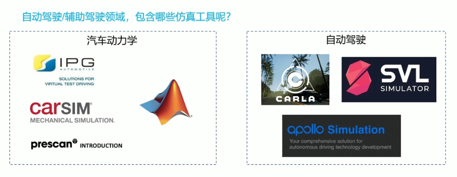
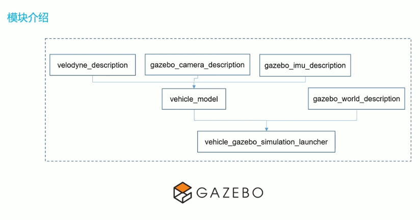
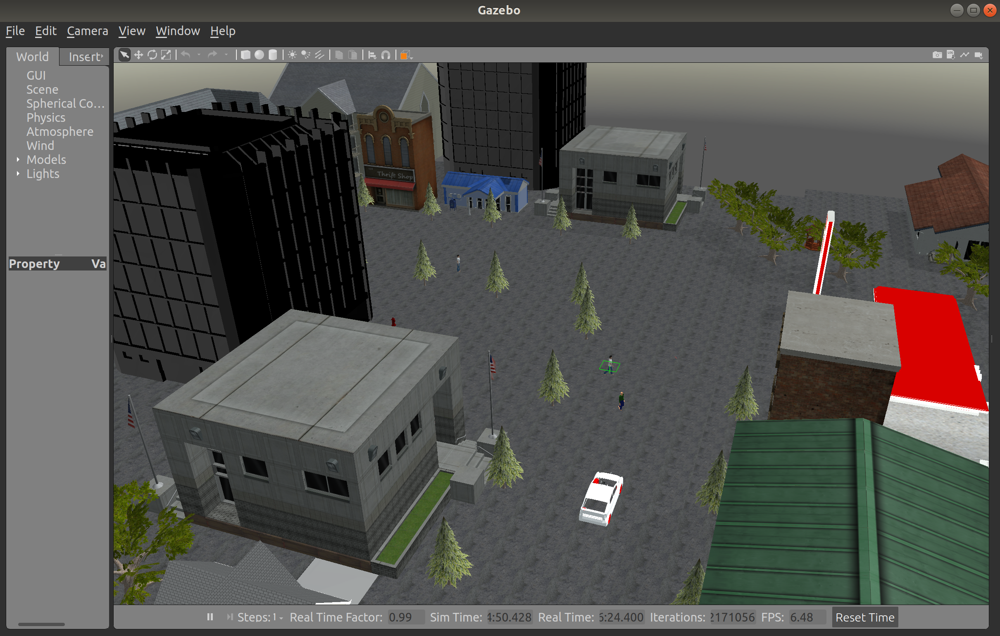
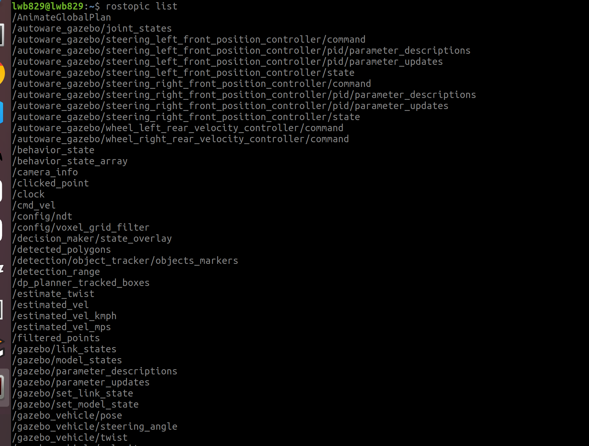
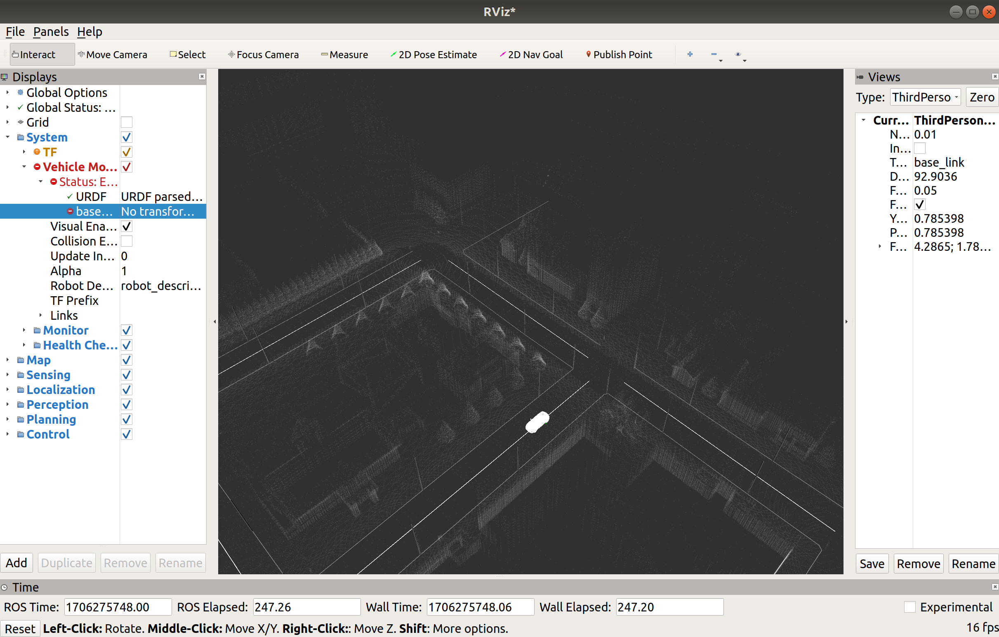
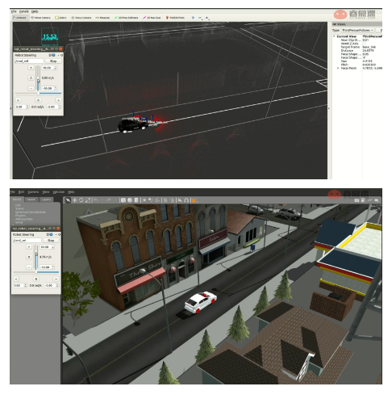
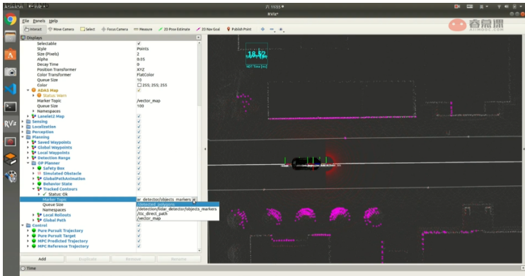

# Autoware仿真环境搭建

## 仿真的必要性及常见仿真工具介绍

1. 自动驾驶系统运行数据流可视化（例如点云去地面的效果）
2. 节约硬件成本（**使用**），快速验证软件算法功能
3. 针对实车测试出现的异常，快速复现问题分析（**replay**）
4. 快速构建corner case，验证软件可靠性和稳定性
5. 大规模的场景库，有助于自动驾驶系统的评估

**本课程所使用的gazebo+rviz仿真，能够初步实现123条，但如果实现4、5则需要更加专业的商用仿真软件！**



仿真软件是工具，工具是为了提高开发效率，根据需求目的，选择能够最快速辅助你开始学习的那种工具才是最重要的，不是越炫酷的仿真工具约合适


## 仿真模块介绍及源码解析

### 模块解析



autoware源码种有一个simulation的文件夹，但是内部并不完整，因为跳转到其他package跨度比较大

**上面这张框图包含了所有涉及到的package，每个单位（方框）都是一个package**

每个package都会跟gazebo软件通信

- `vehicle_gazebo_simulation_launcher`是仿真环境的启动文件；
- 仿真环境包含两大部分：车辆（vehicle）和世界环境（world）
- `vehicle_model`负责车辆建模，其中最重要的是：搭载的各式各样传感器：
- - 所以又包含了几种传感器插件的package：`velodyne_decription`、`gazebo_camera_description`、`gazebo_imu_description`；
- `gazebo_world_description`负责世界环境的搭建。


### 实践仿真

仿真模块定位到`autoware.ai/src/autoware/simulation`路径：

在终端启动仿真环境：（和上一章感知模块的操作类似）

```
roslaunch autoware_quickstart_examples mini_sil_env.launch
```



除了打开gazebo中的世界仿真环境，还额外打开了一个控制板（可以控制小车的前进和后退的速度、方向）

**从启动仿真环境这一步开始，分析simulation的层次：**

- 打开我们之前启动的launch文件 - `mini_sil_env.launch`，其中只是简单的include了另外一个启动文件：`<include file="$(find vehicle_gazebo_simulation_launcher)/launch/world_test.launch">`

- 根据find xxx，对应打开`vehicle_gazebo_simulation_launcher`这个package（就在simulation文件夹下）

- `vehicle_gazebo_simulation_launcher`下的launch文件夹：

  有`gazebo_launcher.launch`、`world_test.launch`、`world_test_citysim_a.launch`等等几个文件，**其实就是对应几个不同的世界环境，及不同的仿真场景**

**以仿真演示中include的`world_test.launch`为例，解析源码：**

```
<!-- world_test.launch -->
<?xml version="1.0" encoding="UTF-8"?>
<launch>
  
  <!-- 车体模型相关，包括车辆选择、车辆的几何特征、传感器配置（默认搭载激光雷达、惯导、imu），传感器内外参 -->
  <arg name="model" default="$(find vehicle_model)/urdf/2lidars_vehicle.xacro"/>
  <arg name="ns" default="/autoware_gazebo"/>
  <arg name="gpu" default="false"/>
  <param name="robot_description" command="$(find xacro)/xacro.py --inorder $(arg model) gpu:=$(arg gpu)" />

  <!-- world世界场景相关 -->
  <include file="$(find gazebo_ros)/launch/empty_world.launch">
    <!-- 这里读取了actor_collisions.world，其实还有很多选择 -->
    <arg name="world_name" default="$(find gazebo_world_description)/worlds/actor_collisions.world"/> /
    <arg name="paused" value="false"/>
    <arg name="use_sim_time" value="true"/>
    <arg name="gui" value="true"/>
    <arg name="headless" value="false"/>
    <arg name="debug" value="false"/>
  </include>

  <!-- spwan_urdf负责读取urdf文件进gazebo中 -->
  <node name="spawn_urdf" pkg="gazebo_ros" type="spawn_model" args="-param robot_description -urdf -model autoware_gazebo" />
  
  <!-- rqt控制速度的控制面板 -->
  <node name="rqt_robot_steering" pkg="rqt_robot_steering" type="rqt_robot_steering" />
    
  <!---------------------------------------------------------------------------------------> 
  
  <!-- 控制参数通过yaml文件读取，包括控制算法（位置、速度控制等） -->
  <group ns="$(arg ns)">
    <!-- Load joint controller configurations from YAML file to parameter server -->
    <rosparam file="$(find vehicle_model)/config/controller.yaml" command="load"/>
    <!-- 通过controller_spawner，可以通过发出的速度控制指令，来控制底盘运动 -->
    <!-- load the controllers -->
    <node name="controller_spawner" pkg="controller_manager" type="spawner" respawn="false"
          output="screen" 
          args="wheel_left_rear_velocity_controller wheel_right_rear_velocity_controller steering_left_front_position_controller steering_right_front_position_controller joint_state_controller"/>
    
    <!-- tf publisher，速度发生变化时，因为都相对车辆坐标系，所以需要一些tf坐标的发布 -->
    <node name="robot_state_publisher" pkg="robot_state_publisher" type="robot_state_publisher" />

    <!-- 车辆的基本信息通过yaml文件读进来 -->
    <rosparam file="$(find vehicle_model)/config/vehicle_info.yaml" command="load"/>
    
    <!-- 订阅subscriber和发布publisher的节点，负责rqt控制面板和gazebo的通信 -->
    <node name="vehicle_gazebo_input_subscriber" pkg="vehicle_gazebo_simulation_interface" type="vehicle_gazebo_input_subscriber" respawn="false"
          output="screen">
      <param name="twist_sub" value="true" />
      <param name="twiststamped_sub" value="true" />
      <param name="ctrl_cmd" value="true" />
    </node>
    <node name="vehicle_gazebo_info_publisher" pkg="vehicle_gazebo_simulation_interface" type="vehicle_gazebo_info_publisher" respawn="false"
          output="screen">
    </node>
  </group>

</launch>
```

下半部分的控制相关内容，更多的是在后面规划和控制模块中使用到（规划模块会给出路径，控制模块按照规划的路径去做控制，后续介绍这两个模块）

**上面launch文件中的上半部分是这一章解读的重点，即与车体模型相关（.xacro）和与世界环境world相关的。**

接下来重点解析`2lidars_vehicle.xacro`、`actor_collisions.world`两个文件

- 想**换一辆车，或者修改车搭载的传感器**等等，就知道对**.xacro文件**做出相应替换或修改
- 想**换仿真环境**，就只要对**.world文件**做出修改或者替换


### 源码解析

- **`actor_collisions.world`**文件

根据`<arg name="world_name" default="$(find gazebo_world_description)/worlds/actor_collisions.world"/>`，

找到所有的世界环境.world都在`src/autoware/visualization/gazebo_world_description/worlds`路径下.

.world`文件是由Gazebo创建生成的，也属于xml格式，是一种描述型文件。

**xml文件最鲜明的特色就是：以一组组标签构成的，即``<xxx>...</xxx>``**

更详细的.world文件和Gazebo的操作，可以直接在CSDN上查找，有非常多的参考资料。或者直接阅读《ROS机器人开发实践》这本书，里面都是ROS的基础知识，包括了Gazebo、Rviz、rqt等常用软件的使用方法，以及launch文件、urdf文件、xacro文件的编写方法

- **实践：修改world世界环境**

1. 在world文件中修改（**这个方式比较繁琐，每次修改完.world文件，要重新打开Gazebo来验证**）

   要调整世界环境中某个元素的姿态或者其他的信息，可以在.world文件中找到对应描述这个元素的标签，对这组标签括起来的代码部分做修改即可：

   - 具体操作：在Gazebo中选中你要修改的元素，这样在Gazebo左侧栏中会显示你选中的元素信息，包括其名字、位置、link等等。**复制元素名字，在打开的.world文本文件中，直接搜索这个名字，就可以找到这个元素对应的标签组在何处！**

   - 例如，讲师在这个环境中添加了一个会动的行人，并且通过添加一个动态插件（.so文件），来实现行人的走动：（行人元素的名称，在Gazebo页面中选中行人来查看，得知是actor）

     ```
     <actor name="actor">
      ...
      <plugin name="actor_collisions_plugin" filename="libActorCollisionsPlugin.so">
      ...
     </actor>
     ```

   - `libActorCollisionsPlugin.so`动态插件的生成由课程讲师提供，其压缩文件`actor_collisions.zip`共有文件如下：

     ```
     ActorCollisionsPlugin.cc
     ActorCollisionsPlugin.hh
     actor_collisions.world
     actor_collisions.world.erb
     CMakeLists.txt
     README.md
     ```

     可运行如下命令生成.so插件，即动态行人

     ```
     cd actor_collisions
     mkdir build
     cd build
     cmake ..
     make 
     ```

     编译后在`build/`路径下找到生成的库文件`libActorCollisionsPlugin.so`，并将其放入`/usr/lib/*-linux-gnu/gazebo-9/plugins/`路径下

     [Gazebo添加模型并控制模型运动作为动态障碍物(Ubuntu16.04, Gazebo7.16)，附录动态链接库和静态链接库区别_原来的1024的博客-CSDN博客_gazebo添加障碍物](https://blog.csdn.net/yldmkx/article/details/108894093)

2. 如果想在Gazebo中直接修改各个元素（**推荐用这个方式，因为可以在Gazebo中实时操作，不用一遍遍重新加载**）

   首先要保证Gazebo打开的世界环境，不包含小车模型，否则最后保存的时候会将小车和世界模型保存为一个整体，小车的位置会固定死，这样显然不可以

   即对launch启动文件做修改：（只保留world部分）

   （可以在autoware.ai/install路径下去对应修改，这样不用编译）

   ```
   <?xml version="1.0" encoding="UTF-8?>
   <launch>
     <!-- world世界场景相关 -->
     <include file="$(find gazebo_ros)/launch/empty_world.launch">
       <!-- 这里读取了actor_collisions.world，其实还有很多选择 -->
       <arg name="world_name" default="$(find gazebo_world_description)/worlds/actor_collisions.world"/> /
       <arg name="paused" value="false"/>
       <arg name="use_sim_time" value="true"/>
       <arg name="gui" value="true"/>
       <arg name="headless" value="false"/>
       <arg name="debug" value="false"/>
     </include>
   </launch>
   ```

   重新启动Gazebo的世界环境，发现已经没有小车了。

   这时，我们选中一棵树，将其删掉（键盘上的删除键即可实现），再点击Gazebo左上角：`File->Save World As`，选中你要替换的world文件，或者新建一个world文件，**这样就将现在Gazebo展示的世界环境和world文件关联住了**

   后续在Gazebo中进行一些增删，移动等操作，只要点击`File->Save World`即可

3. 在2中，即在Gazebo中直接修改世界环境，左侧栏中有一项`Insert`可以选中，里面是各种模型，可以添加到世界环境中；

**注意：在保存world时候，若出现页面卡死的情况，可以最小化Gazebo窗口，再打开，就可以发现恢复正常。**


- **`2lidars_vehicle.xacro`**

根据`<arg name="model" default="$(find vehicle_model)/urdf/2lidars_vehicle.xacro"/>`，

找到机器人描述文件所在的路径：`src/autoware/visualization/vehicle_model/urdf`

官方提供的原本是`vehicle.xacro`，在上一章感知模块的演示中，讲师提到给小车多增加了一个激光雷达在车顶，所以新建了一个`2lidars_vehicle_xacro`

1. `2lidars_vehicle_xacro`开头先include了一些其他.xacro文件

   ```
     <xacro:include filename="$(find vehicle_model)/urdf/body.xacro" />
     <xacro:include filename="$(find vehicle_model)/urdf/wheel.xacro" />
     <xacro:include filename="$(find vehicle_model)/urdf/steering.xacro" />
     <!-- 传感器 -->
     <xacro:include filename="$(find velodyne_description)/urdf/HDL-32E.urdf.xacro"/>
     <xacro:include filename="$(find velodyne_description)/urdf/VLP-16.urdf.xacro"/>
     <xacro:include filename="$(find gazebo_camera_description)/urdf/monocular_camera.xacro"/>
     <xacro:include filename="$(find gazebo_imu_description)/urdf/imu.xacro"/>
   ```

   包括我们在之前模块简介提到的三种传感器插件package中的描述文件：（`velodyne_description`激光雷达、`gazebo_camera_description`相机、`gazebo_imu_description`imu）

   **所以如果后续要添加其他传感器，首先要include了对应传感器插件package中的传感器描述文件**

2. 将保存在yaml文件中的车辆基本参数（包括车轮半径、车辆最小转角等）读取进来

   ```
     <!-- load parameter -->
     <xacro:property name="vehicle_info" value="${load_yaml('$(find vehicle_model)/config/vehicle_info.yaml')}"/>
     <!-- set parameter -->
     <xacro:property name="wheel_radius" value="${vehicle_info['wheel_radius']}"/>
     <xacro:property name="wheel_width" value="${vehicle_info['wheel_width']}"/>
     ...
   ```

   `vehicle_info.yaml`文件中，是车辆的基本信息：`wheel_radius`、`wheel_width`、`vehicle_length`等等

   - vehicle_info.yaml（在`src/autoware/visualization/vehicle_model/config`路径下：）

     ```
     # vehicle_info.yaml
     wheel_radius: 0.341
     wheel_width: 0.225
     wheel_base: 2.950
     wheel_tread: 1.55
     vehicle_mass: 5000.0
     vehicle_length: 4.82
     vehicle_width: 1.81
     vehicle_height: 1.5
     minimum_turning_radius: 2.950
     maximum_steering_angle: 97.3 #deg
     ```

3. 将各种传感器与车体`base_link`去连接起来，即实现了各种link的关联（同时将上一步传进来的参数，为对应的link的参数做设置，**即根据车体参数，如车长等，去具体设置link之间的位置关系**）

   对`body`、`steering`、`wheel`等link，设置它们的`parent`参数，即通过子母配对的方式，将车体的各个元件组装起来（**base_link是底盘，相当于顶层的parent，其他的link都是它的子link，或子子link**）

   ```
     <!-- steering操纵杆 -->
     <xacro:steering_link_macro suffix="steering_front" parent="base_body_link" x="${wheel_base}" y="0"/>
     <xacro:steering_macro suffix="steering_right_front" parent="steering_front_link" x="0" y="${-1*wheel_tread/2}" yaw="0" length="${wheel_width}"/>
     <xacro:steering_macro suffix="steering_left_front" parent="steering_front_link" x="0" y="${wheel_tread/2}" yaw="0" length="${wheel_width}"/>
   ```

4. 传感器部分（重点）

- 首先是两个32线雷达

  ```
  <!-- ================ sensor ================ -->
   <!-- 保存外参的文件 -->
    <xacro:property name="calibration" value="${load_yaml('$(find vehicle_model)/config/calibration.yaml')}"/>  
    
   <!-- 激光雷达 -->     
    <HDL-32E parent="base_link" name="velodyne" topic="/points_raw_up" hz="10" samples="220" gpu="$(arg gpu)">
      <origin xyz="${calibration['base_link2velodyne']['x']} ${calibration['base_link2velodyne']['y']} ${calibration['base_link2velodyne']['z']}" 
              rpy="${calibration['base_link2velodyne']['roll']} ${calibration['base_link2velodyne']['pitch']} ${calibration['base_link2velodyne']['yaw']}" />
    </HDL-32E>
   
    <HDL-32E parent="base_link" name="velodyne_front" topic="/points_raw_front" hz="10" samples="220" gpu="$(arg gpu)">
      <origin xyz="${calibration['base_link2velodyne_front']['x']} ${calibration['base_link2velodyne_front']['y']} ${calibration['base_link2velodyne_front']['z']}" 
              rpy="${calibration['base_link2velodyne_front']['roll']} ${calibration['base_link2velodyne_front']['pitch']} ${calibration['base_link2velodyne_front']['yaw']}" />
    </HDL-32E>
  ```

  `parent`参数设置了他们与车体的连接关系，

  `name`参数设置了每个link的frame id，

  `topic`参数表示发布出去传感器话题名（后续在源码中，将这两个32线雷达的topic进行了合并，即最后订阅的点云是两个雷达捕获的点云拼接后的结果）

  - 两个32线雷达发布出去的topic：`/points_raw_up`、`/points_raw_front`

    - `sample`参数是采样率，设置大一些，可以让点云变得更稠密，

    - `<origin ... >`标签，`...`是一些雷达的外参设置

- 接下来是camera和imu的外参设置：

  ```
    <xacro:monocular_camera_macro suffix="camera" parent="base_link" namespace="" 
                                  x="${calibration['base_link2camera']['x']}"
                                  y="${calibration['base_link2camera']['y']}"
                                  z="${calibration['base_link2camera']['z']}"
                                  roll="${calibration['base_link2camera']['roll']}"
                                  pitch="${calibration['base_link2camera']['pitch']}"
                                  yaw="${calibration['base_link2camera']['yaw']}"
                                  fps="30" width="800" height="400" fov="1.3"/>
    <xacro:imu_macro suffix="imu" parent="base_link" namespace=""
                     x="${calibration['base_link2imu']['x']}"
                     y="${calibration['base_link2imu']['y']}"
                     z="${calibration['base_link2imu']['z']}"
                     roll="${calibration['base_link2imu']['roll']}"
                     pitch="${calibration['base_link2imu']['pitch']}"
                     yaw="${calibration['base_link2imu']['yaw']}"
                     fps="100" />
  ```

  **所有传感器的外参保存在`calibration.yaml`文件中**

  **这个yaml文件在设置传感器部分的开头读取进来**

  `<xacro:property name="calibration" value="${load_yaml('$(find vehicle_model)/config/calibration.yaml')}"/>`  

  `calibration.yaml`在`src/autoware/visualization/vehicle_model/config`路径下：

  如果要改动哪个传感器的外参，可以直接修改这个文件中的内容

  ```
  # calibration.yaml
  base_link2camera:
    x: 2.0
    y: 0.0
    z: 1.35
    roll: 0.0
    pitch: 0.0
    yaw: 0.0
  base_link2velodyne:
    x: 1.2
    y: 0.0
    z: 2.0
    roll: 0.0
    pitch: 0.0
    yaw: 0.0
  base_link2imu:
    x: 1.2
    y: 0.0
    z: 1.8
    roll: 0.0
    pitch: 0.0
    yaw: 0.0
  base_link2velodyne_front:
    x: 3.9
    y: 0.0
    z: 0.6
    roll: 0.0
    pitch: 0.0
    yaw: 0.0
  ```


## 给车辆添加一个传感器

在autoware_quickstart_examples这个官方演示包的路径下，有三个演示demo：

`rosbag_demo`是autoware最初学习时，演示的官方demo；

`mini_env_demo`是多增加了Gazebo软件，但是world场景比较轻量化

`sil_env_demo`相较于`mini_env_demo`，就是world更大了，加入Gazebo后，仿真的功能也更多

```
lwb829@lwb829:~/autoware.ai/src/autoware/documentation/autoware_quickstart_examples/launch$ tree -a
.
├── mini_env_demo
│   ├── mini_detection.launch
│   ├── mini_localization.launch
│   ├── mini_map.launch
│   └── mini_sil_env.launch
├── rosbag_demo
│   ├── default.rviz
│   ├── my_detection.launch
│   ├── my_localization.launch
│   ├── my_map.launch
│   ├── my_mapping.launch
│   ├── my_mission_planning.launch
│   ├── my_motion_planning.launch
│   ├── my_sensing.launch
│   └── README.md
├── sil_env_demo
│   ├── new_avoid_motion_planning.launch
│   ├── new_detection.launch
│   ├── new_localization.launch
│   ├── new_manual_astar_planner.launch
│   ├── new_map.launch
│   ├── new_mission_planning.launch
│   ├── new_motion_planning.launch
│   ├── new_mpc_planning.launch
│   └── new_op_planner.launch
└── tf_local.launch

```

**这一章的仿真模块的演示，使用的是`mini_env_demo`**

- 其路径下有`mini_detection.launch`、`mini_localization.launch`、`mini_map.launch`、`mini_sil_env.launch`四个文件


在上一节对仿真模块的解析中，`2lidars_vehicle.xacro`描述文件的传感器部分，有两个32线雷达，两个雷达分布发布话题：`/points_raw_up、/points_raw_front`

```
<!-- 激光雷达 -->     
  <HDL-32E parent="base_link" name="velodyne" topic="/points_raw_up" hz="10" samples="220" gpu="$(arg gpu)">
    <origin xyz="${calibration['base_link2velodyne']['x']} ${calibration['base_link2velodyne']['y']} ${calibration['base_link2velodyne']['z']}" 
            rpy="${calibration['base_link2velodyne']['roll']} ${calibration['base_link2velodyne']['pitch']} ${calibration['base_link2velodyne']['yaw']}" />
  </HDL-32E>
 
  <HDL-32E parent="base_link" name="velodyne_front" topic="/points_raw_front" hz="10" samples="220" gpu="$(arg gpu)">
    <origin xyz="${calibration['base_link2velodyne_front']['x']} ${calibration['base_link2velodyne_front']['y']} ${calibration['base_link2velodyne_front']['z']}" 
            rpy="${calibration['base_link2velodyne_front']['roll']} ${calibration['base_link2velodyne_front']['pitch']} ${calibration['base_link2velodyne_front']['yaw']}" />
  </HDL-32E>
```


启动`mini_sil_env.launch`，在终端通过`rostopic list`可以查看有哪些话题：



讲师在额外添加一个32线雷达后（官方的只有1个），这样就存在两个点云topic，

但讲师通过一些操作将这两个topic进行了合并，即将`/points_raw_up`、`/points_raw_front`合并成单独的一个`/points_raw`（在后续Rviz订阅）


##### 具体如何实现`/points_raw_up`、`/points_raw_front`两个话题合并的

思路很简单，已知两个雷达的外参（即各自与base_link的坐标变换关系），就可以将新添加的雷达`velodyne_front`发布的点云坐标系，变换到原有的`velodyne`雷达的点云坐标系，这样就可以直接对两片点云相加，实现merge合并

- 首先，在`sil_tf.launch`中，设置好外参：base_link_to_velodyne_front（base_link_to_velodyne是官方设置好的，front是讲师额外添加的）

  ```
  <node pkg="tf2_ros"  type="static_transform_publisher" name="base_link_to_velodyne" args="1.2 0 2 0 0 0 /base_link /velodyne" />
  <node pkg="tf2_ros"  type="static_transform_publisher" name="base_link_to_velodyne_front" args="3.9 0 0.6 0 0 0 /base_link /velodyne_front" /> 
  ```

  `base_link_to_velodyne_front`这个外参值，实际是在Gazebo中调试过的，意思是在上一节中提到的`calibration.yaml`中，对照Gazebo中的可视化场景，不断去调整修改

  - ` 2lidars_vehicle.xacro`中，在最后设置传感器外参前，先读取了`calibration.yaml`文件中的外参值。即先不管其他的，至少先保证`velodyne_front`的物理位置比较合适，即摆在车前，可以更好的检测行人

**即sil_tf.launch中的velodyne_front的外参值，是参考`calibration.yaml`中的值，来设置的**


- 建图模块`mini_map.launch`不会使用到点云数据`/points_raw`,但定位模块`mini_map_localization`会用到点云数据在`mini_map_localization`中：

```
  <!-- points meger note-tianyu up和front的雷达点云数据融合 -->
  <include file="$(find points_preprocessor)/launch/cloud_transformer.launch" />
```


- `cloud_transformer.launch`：（前提是已经配置好`sil_tf.launch`）

  ```
  <!-- Launch file for Cloud Transformer -->
  <launch>
  
       <arg name="input_point_topic" default="/points_raw_front" /> <!-- input_point_topic, the coordinates of each point in this topic will be transformed to the new frame. -->
       <arg name="target_point_topic" default="/points_raw_up" /> 
       <arg name="output_point_topic" default="/points_raw" /> <!-- output_point_topic, output topic name -->
       <arg name="target_frame" default="velodyne" /> <!-- target_frame, coordinate frame system target -->
  
       <!-- rosrun points_preprocessor ray_ground_filter -->
       <node pkg="points_preprocessor" type="cloud_transformer" name="cloud_transformer" output="screen">
               <param name="input_point_topic" value="$(arg input_point_topic)" />
               <param name="output_point_topic" value="$(arg output_point_topic)" />
               <param name="target_point_topic" value="$(arg target_point_topic)" />
               <param name="target_frame" value="$(arg target_frame)" />
       </node>
  </launch>
  ```

  这个launch文件在`src/autoware/core_perception/points_preprocessor/launch`下

  **通过前面几个arg参数的设置，可以看出进行了何种操作：**

  - 可以看出，就是将`/points_raw_front`坐标变换到`/points_raw_up`的坐标下，最后统一成一个frame id，即target_frame设置成`velodyne`，输出topic为：`/points_raw`

  **阅读cloud_transformer这个包的源码，解析如何实现点云的merge：**


### 源码解析

1. 该cpp在`src/autoware/core_perception/points_preprocessor/nodes/cloud_transformer`路径下


- 输入

  ```
  //note-tianyu 同步两个激光雷达传感器信号
    input_point_subscriber_ = new message_filters::Subscriber<sensor_msgs::PointCloud2>(node_handle_, input_point_topic_, 10); // 话题订阅
    target_point_subscriber_ = new message_filters::Subscriber<sensor_msgs::PointCloud2>(node_handle_, target_point_topic_, 10); // 话题订阅
  
    cloud_synchronizer_ = new message_filters::Synchronizer<SyncPolicyT>(SyncPolicyT(100),
  *input_point_subscriber_, *target_point_subscriber_); // 时间同步
  
    cloud_synchronizer_->registerCallback(boost::bind(&CloudTransformerNode::CloudCallback, this, _1, _2)); // 回调
  ```

  这里是利用了**ROS中同步的api**（上一章也提到了这个api），因为我们有两个传感器数据要输入，所以在这里做一个时间同步。

  这个api（`message_filters`）的调用方法是固定的，基本就是上面代码段的形式

  **`ROS`提供了`message_filters`功能包**，用于接收消息，它可以对消息进行时间同步：接收不同种类的消息，将时间戳相同或者相近的消息打包输出。

  普通的回调函数是只有一个传感器的message进来，就会调用，但使用了这个同步api后，实现了：**只有两个topic都进来，且时间经过同步后，才会调用回调函数`CloudCallback`**

- 输出

  ```
  transformed_points_pub_ = node_handle_.advertise<sensor_msgs::PointCloud2>(output_point_topic_, 2);
  ```


2. 回调函数 - `CloudCallback()`

   **新建一些pcl格式的智能指针，方便调用pcl库来对点云进行处理**

   ```
     void CloudCallback(const sensor_msgs::PointCloud2::ConstPtr &in_sensor_cloud, const sensor_msgs::PointCloud2::ConstPtr &target_sensor_cloud)
     {
       pcl::PointCloud<velodyne_pointcloud::PointXYZIR>::Ptr input_cloud_ptr (new pcl::PointCloud<velodyne_pointcloud::PointXYZIR>);
       pcl::PointCloud<velodyne_pointcloud::PointXYZIR>::Ptr transformed_cloud_ptr (new pcl::PointCloud<velodyne_pointcloud::PointXYZIR>);
       pcl::PointCloud<velodyne_pointcloud::PointXYZIR>::Ptr target_cloud_ptr (new pcl::PointCloud<velodyne_pointcloud::PointXYZIR>);
       pcl::PointCloud<velodyne_pointcloud::PointXYZIR>::Ptr merge_cloud_ptr (new pcl::PointCloud<velodyne_pointcloud::PointXYZIR>);
       pcl::PointCloud<velodyne_pointcloud::PointXYZIR>::Ptr filter_merge_cloud_ptr (new pcl::PointCloud<velodyne_pointcloud::PointXYZIR>);
       ...
   ```

   `input_cloud_ptr`是需要坐标变换的输入点云，`transformed_cloud_ptr`是已经坐标变换后的输入点云，

   `target_cloud_ptr`是坐标变换的目标点云，`merge_cloud_ptr`是将输入和目标合并后的点云，

   `filter_merge_cloud_ptr`是对合并后的点云还做了一些过滤处理

   **通过对tf的监控，来求得input到target之间的坐标变化**

   ```
       pcl::fromROSMsg(*in_sensor_cloud, *input_cloud_ptr);
       pcl::fromROSMsg(*target_sensor_cloud, *target_cloud_ptr);
   
       // tf监控    
       bool do_transform = false;
       tf::StampedTransform transform;
       if (target_frame_ != in_sensor_cloud->header.frame_id)
       {
         try {
           tf_listener_ptr_->lookupTransform(target_frame_, input_cloud_ptr->header.frame_id, ros::Time(0), transform); //  transform 即是我们需要的 front雷达到up雷达的坐标变换
           do_transform = true;
         }
         catch (tf::TransformException ex) {
           ROS_ERROR("cloud_transformer: %s NOT Transforming.", ex.what());
           do_transform = false;
           transform_ok_ = false;
         }
       }
   ```

   我们之前在`sil_tf.launch`中设置好了激光雷达的外参，即`base_link_to_velodyne`和`base_link_to_velodyne_front`，

   - ```
     <node pkg="tf2_ros"  type="static_transform_publisher" name="base_link_to_velodyne" args="1.2 0 2 0 0 0 /base_link /velodyne" />
     <node pkg="tf2_ros"  type="static_transform_publisher" name="base_link_to_velodyne_front" args="3.9 0 0.6 0 0 0 /base_link /velodyne_front" /> 
     ```

   过tf监控，利用这两条坐标变换（**两个激光雷达的坐标都是相对`base_link`的**），可以得到`/velodyne_front`到`/velodyne`的坐标变换

   `/velodyne_front`是`input_cloud_ptr`，

   ```
   target_frame_`是`target_cloud_ptr
   ```

   最后得到两者之间的坐标变换：`transform`

   **利用transform，将input_cloud坐标变换到target_frame下**

   ```
   if (do_transform)
       {
         transformXYZIRCloud(*input_cloud_ptr, *transformed_cloud_ptr, transform);
         transformed_cloud_ptr->header.frame_id = target_frame_;
         if (!transform_ok_)
           {ROS_INFO("cloud_transformer: Correctly Transformed"); transform_ok_=true;}
       }
   else // 如果上一步没有监控到，这里就直接进行复制操作，不做坐标变换
       { pcl::copyPointCloud(*input_cloud_ptr, *transformed_cloud_ptr);}
   ```

   `do_transform`是tf监控中设置的一个变量，只有监控到了两个雷达的tf，才有这一步变换的操作：

   就是利用一个变换函数：`transformXYZIRCloud(*input_cloud_ptr, *transformed_cloud_ptr, transform)`

   - 将`input_cloud_ptr`，根据上一步监控得来的坐标变换`transform`，变换到target坐标系下的点云：`transformed_cloud_ptr`

   接着，**由于变换后的点云还没有frame_id（即所属的传感器名），就把target点云的frame_if赋给它**：` transformed_cloud_ptr->header.frame_id = target_frame_`

   **将target点云和transformed点云进行合并**

   ```
   *merge_cloud_ptr = *target_cloud_ptr + *transformed_cloud_ptr;
   ```

   因为两块点云现在是在同一个坐标系下，所以进行简单的相加即可

   **merge后，还对合并后的点云进行了：filter掉半径内的点云**

   ```
   RemoveCloseCloud(merge_cloud_ptr, filter_merge_cloud_ptr);
   filter_merge_cloud_ptr->header.frame_id = target_frame_;
   ```

   其实就是将打在车上的点云去除掉

   - 虽然up激光雷达发布的target点云已经做过这步操作，但是与front的点云合并后，还是需要再做一次filter。因为front激光雷达探测的点云，还是会有很多打在车体上的

   可以跳转阅读`RemoveCloseCloud()`函数，其实就是把与车身邻近的点云都去除了

   - `RemoveCloseCloud()`函数中，以合并后的坐标系，即`velodyne`为原点，算了一个半径，将半径内的点云filter掉了

   **发布过滤后的合并点云**

   ```
   publish_cloud(transformed_points_pub_, filter_merge_cloud_ptr);
   ```


### mini仿真环境下实践仿真 - 演示合并效果（mini_env_demo）

**按照感知模块中的实践演示步骤一样**

在Rviz中，利用`2D Pose Estimate`，手动给小车一个初始位姿（**第五章的作业，通过添加GPS传感器，实现自动定位，即无需这一步手动了**）

**无论是手动给初始位姿，或者利用GPS，都是为了实现小车在map中的定位，**

- **定位成功后，在Rviz中，小车周围会多出红色点云显示**（如果无GPS，又不手动给pose，那么rviz中只会有map和一辆小车，没有其他任何元素）

- **这里纠正一个认知错误，之前认为只有继续启动感知模块，才能在小车周围显示红色点云，但演示下来，并非这样。**

  **因为感知模块实现的是：对这些 定位时就识别/捕获到的点云，做一个聚类显示，包括每团点云的外接多边形等信息。**

  也就是说，在定位模块启动ndt_matching线程后，就实现了点云配准和小车的定位。后续的感知模块（欧式聚类模块）只是对这些点云分类（或者预测一下动态点云簇的轨迹等等）

  

#### 在Rviz中，看点云合并的效果

先在右侧工具栏中，视角选择`ThirdPersonFollower`

可以看到小车模型上有很多种TF，我们需要关掉大部分，在这里我们只关注两个激光雷达

选中左侧栏中的`System->TF->Frames`，只勾选上`velodyne`和`velodyne_front`

选中左侧栏中的`Sensing->Points Raw`，订阅`/points_raw`话题

可以看出车身邻近都没有点云，因为被过滤掉了

- `RemoveCloseCloud()`函数中，以合并后的坐标系，即`velodyne`为原点，算了一个半径，将半径内的点云filter掉了

**如果没有前侧雷达`velodyne_front`，`/points_raw`可能就没有小车前方探测到的凹进去一块半圆的点云团（即行人），这也是讲师添加车前的激光雷达的目的**（车顶的雷达大概率对车前的行人，达不到这样的探测效果）

Topic可以选择不同话题，可视化比较。其中，`points_raw_up`可视化效果：没有前侧的红色点云团

`points_raw_front`可视化效果：有前侧的红色点云团


## 仿真环境下实现定位和感知

之前的仿真环境演示，都是在mini_env_demo中，mini环境比较轻量化，

在本次实践中，介绍正式的仿真环境，即**sil_env_demo**：地图会大很多，能实现的功能也更丰富。

```
sil_env_demo
│   ├── new_detection.launch
│   ├── new_localization.launch
│   ├── new_map.launch
│   ├── new_mission_planning.launch
│   └── new_motion_planning.launch
```

之前的mini环境，只需启动`world_test.launch`一个文件，比较快，

这次的仿真环境，需要有顺序的启动两个文件`world_test_citysim_a.launch`、`world_test_citysim_b.launch`，会比较慢（吃电脑配置）

- 但其实，就是将`world_test.launch`中的上下部分（5_1 note中讲解了这个launch文件的两部分），分成了两个文件

  **这样做也是有原因的：**

  - 首先，`world_test_citysim_a.launch`负责机器人模型和世界环境的启动，但是这次的.world相比mini_env_demo中的会复杂很多，启动的很慢
  - 其次，`world_test_citysim_b.launch`负责一些规划控制节点的启动，会比较快

  **由于launch文件的启动，不会按照其内容的顺序依次启动每个线程，而是随机多线程启动**

  所以将加载世界环境的线程 和 规划控制线程 分成两个launch文件，这样能保证先成功启动世界环境后，再启动规划控制线程

  否则如果放在一个launch文件中，极大可能发生：world还没启动成功，控制线程已经启动完了，但是由于长时间没有环境，导致控制线程自动关掉了，后续等world加载成功了，再想用控制功能，已经没有反应

### 实践演示：

（如果没有在.bashrc中，source这个环境的bash，那么就要在**每个**终端打开后，先通过`source install/setup.bash`来激活环境）

- 地图模块

  ```
  roslaunch autoware_quickstart_examples new_map.launch
  ```

- 定位模块

  ```
  roslaunch autoware_quickstart_examples new_localization.launch
  ```

- 启动rviz

  ```
  rviz
  ```

  利用`2D Pose Estimate`给小车一个初始位姿

  - 在Rviz中可以看到，加载的这副地图就是：我们在第二章，根据讲师提供的bag（simcity_lidar_imu.bag），利用`ndt_mapping`模块建立的点云地图，并且已经通过Autoware Tools标注了语义信息
  - 有些矢量（语义）信息是显示不出来的，例如车道线，因为map_file模块没有把车道线当作一个可视化信息，但是在后续规划控制模块，可以以其他方式表示出来

  

**接下来，就可以正式启动Gazebo仿真线程：**

启动Gazebo相关的（**两个文件先后启动**）

```
roslaunch vehicle_gazebo_simulation_launcher world_test_citysim_a.launch
```

`world_test_citysim_a.launch`负责的是：spawn_urdf节点加载机器人模型，Gazebo启动world世界场景作为仿真环境，以及一个rqt的速度控制面板。

**其中world世界场景非常大，模型比较复杂，所以这个文件完全启动成功，要非常久**

但必须等这个文件先启动成功，再启动下一个launch文件

**虽然此时已经弹出了rqt速度控制面板了，但是我们还没有启动负责控制通信部分的launch文件，所以控制面板的速度信息无法与Gazebo通信，即没有实际效果**

```
roslaunch vehicle_gazebo_simulation_launcher world_test_citysim_b.launch
```

`world_test_citysim_b.launch`负责规划控制部分，即速度信号等控制指令、控制算法的线程启动

此时rqt控制面板的速度指令发出后，小车可以移动，且rviz和gazebo中会同步移动（不过由于笔记本+虚拟机的原因，非常卡顿，但是暂不影响后续功能展示）



- **有了这个仿真环境后，**结合之前添加的语义信息，如上图十字路口处，当时有添加过信号灯、斑马线等。通过感知模块，和后续将要学习的规划控制模块，可以实现对小车的速度进行一些控制！

**此时的仿真环境中，地图和定位功能都已经成功启动**

- 启动感知模块

  ```
  roslaunch autoware_quickstart_examples new_detection.launch
  ```

  感知线程启动后，在Rviz中，已经能看到有聚类结果输出了：

  


