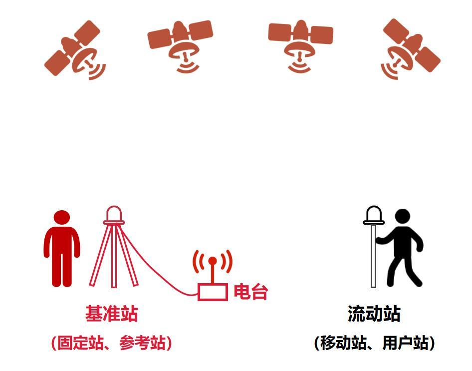
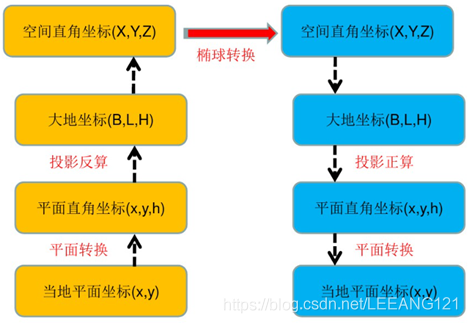
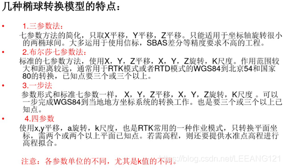

# RTK

## 基本概念

**RTK，英文全名叫做Real-time kinematic，也就是实时动态**。这是一个简称，全称其实应该是RTK（Real-time kinematic，实时动态）载波相位差分技术。

**它是一个对GNSS进行辅助的技术，这是因为GNSS自身存在不足。**GNSS定位依靠的是三维坐标系，找至少4颗卫星，分别计算各个卫星与终端之间的距离△L（这个距离也被称为“伪距”），就可以列出4个方程组。计算之后，就能得出终端的四个参数，分别是经度、纬度，高程（海拔高度）和时间。但是，**卫星定位是存在误差的**，有些可以完全消除，有些无法消除或只能部分消除，它们影响了系统的准确性和可靠性。

- 基准站（参考站）：顾名思义就是固定在地面上为流动站提供参考基准的基站，在使用过程中不可移动，固定基站、云基站和移动基站都是基准站
- 流动站（用户站）：进行作业的设备，**它使用基准站发送来的差分数据进行 RTK 精准定位**，无人机和测绘器都是流动站

## RTK测量原理

首先，基准站作为测量基准，一般会固定放在开阔且视野良好的地方。基准站的三维坐标信息，一般是已知的。有以下测量步骤：

1. 观测和接收卫星数据
2. 通过旁边的无线电台（数据链），将观测数据实时发送给流动站（距离一般不超过20公里）
3. 流动站收到基准站数据的同时，也观测和接收了卫星数据
4. 流动站在基准站数据和自身数据的基础上，根据相对定位原理，进行实时差分运算，从而解算出流动站的三维坐标及其精度，其定位精度可达1cm~2cm

### 差分原理

首先在地面已知位置安装一个基准站，该基准站在接收到卫星信号后就会开始进行自我解算，将卫星传递的位置信号与自己的实际位置信息进行比较，**找到传递过程的定位误差**，然后通过技术手段将误差告之流动站，然后流动站在根据实时接收到的卫星信号，对误差进行修正，由此得到自身的**精确位置**。

### 坐标变换

GPS定位系统采用的是WGS-84坐标系（其他定位系统采用的坐标系各有不同），但是在实际应用中，不同的用户基于定位精度、坐标保密、控制变形等各种原因往往会建立其他坐标系，这就涉及到了坐标转换的概念。不同的坐标系的转换流程如下：

常用坐标变换方法：

## 所需设备

### 硬件

- **GNSS 接收器：** 具有 RTK 功能的接收器，可以处理卫星信号和校正数据。它应该支持多个GNSS（全球导航卫星系统）星座（GPS、GLONASS、Galileo、BeiDou），并且可以是单频、双频或多频，后者提供更好的性能。
- **天线：**高质量天线，可以以最小的干扰和多径误差接收卫星信号。应与接收机支持的频段和应用需求相匹配。
- **基站：**固定参考站或参考站网络的接入。它应该具有已知的位置，并配备具有RTK功能的接收器和天线来传输实时校正数据。
- **数据通信：**一种将校正数据从基站实时传输到流动站（移动）接收器的方法。它可以是无线电调制解调器、蜂窝调制解调器或基于互联网的解决方案，例如 NTRIP（通过互联网协议进行 RTCM 的网络传输）。

### 软件

- RTK 处理： 可处理 GNSS 测量和校正数据的软件。它应该与硬件兼容。它可以由接收器制造商提供或从第三方供应商处采购。
- 数据记录和分析：可以记录、后处理或分析数据的软件。它可以包括 GIS（地理信息系统）软件、测量软件或其他根据特定需求定制的专用工具，例如几何仪 SCOUT、SurPad、SurvX等