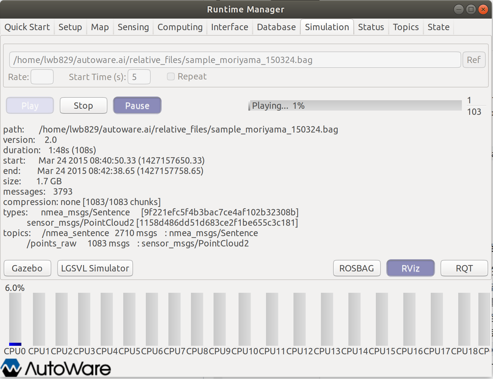
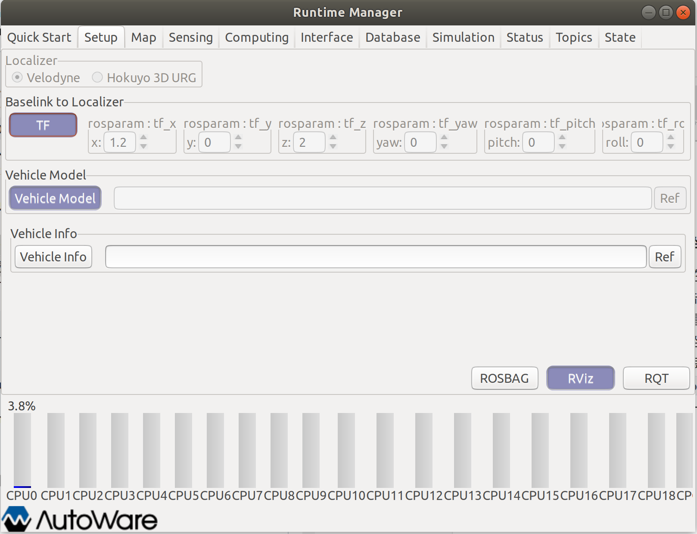
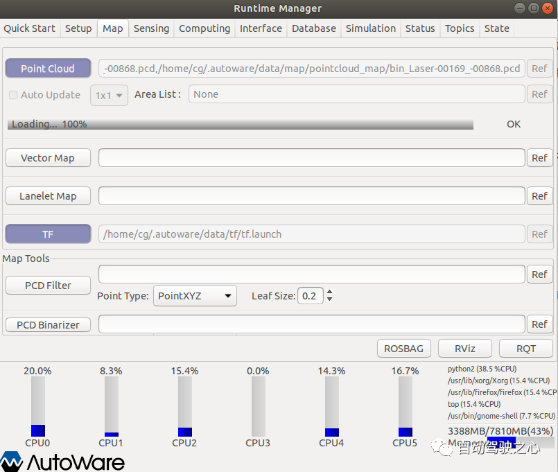
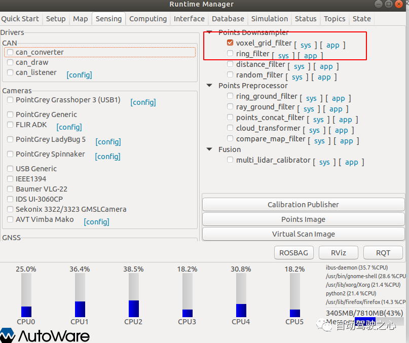
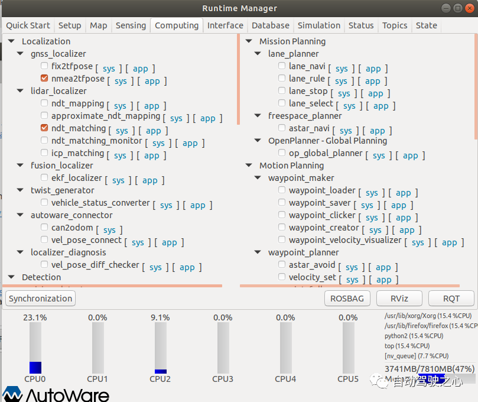

# Autoware的UI界面使用：Runtime Manager（以官方demo为例）

## 界面启动

在autoware目录下，打开终端，输入命令如下：

```
source install/setup.bash
roslaunch runtime_manager runtime_manager.launch
```


## 配置Demo

### 1.Simulation窗口

在文件选择框中选择对应bag文件，设置start time，然后点击`Play`即可开始播放Demo中所录制的自动驾驶过程。

但是，这里需要我们在1-2s后点击`Pause`，因为我们还需要设置其它数据和参数。




### 2.Setup窗口

- **设置从`base_link`到`velodyne`坐标系的TF**转换

确保`Localizer`下选项为`Velodyne`，在`Baselink to Localizer`中设置好各个参数之后点击`TF`按钮，其中`x、y、z、yaw、pitch、roll`表示真车雷达中心点与车身后轴中心点的相对位置关系（右手坐标系，真车后车轴为原点）(保持默认值`1.2 0 2 0 0 0`即可)，此时可以点击`Vehicle Model`，如果`Vehicle Model`为空，那么会加载一个默认模型（在rviz中会显示一辆白色的车）。




### 3.Map窗口

- **选择地图文件**

点击`Point Cloud`的`ref`载入点云地图文件，存储在`.autoware`目录下的`pointcloud_map`文件夹中，将全部的pcd文件放进去

- **设置从`world`到`map`的TF转换**

点击`TF`的`ref`选择`tf_local.launch`文件，这是加载默认`world`到`map`的坐标转换，然后点击`TF`使其生效




### 4.Sensing窗口

勾选`voxel_grid_filter`




### 5.Computing窗口

勾选`nmea2tfpose`和`ndt_matching`




### 6.Rviz可视化

- 回到`Simulation`窗口，点击右下的`Rviz`，出现可视化界面

- 配置Rviz文件，选择`default.rviz`文件

- 回到`Simulation`窗口，再次点击`Pause`，绩溪播放rosbag文件.稍等片刻，就可以在Rviz中看到点云地图和机器人行驶的画面了。


