# 定位模块

## 常见定位方法概述


常见定位方法有：

1. 基于高精地图的空间信息定位（激光雷达借助ndt/loam等算法在点云地图中定位）
2. 基于高精地图的语义信息定位（根据路况中的路标和环境，大多基于视觉融合定位）
3. 组合惯导、RTK实现定位

**实际使用时，上述方法会根据不同场景混用，也可以叫多传感器融合定位。（上述所有方法都需要基于高精地图来实现）**

定位流程如下：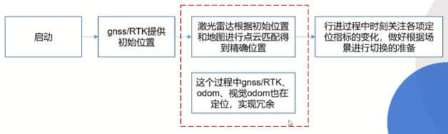

场景切换：例如在场景空旷时RTK好用，激光雷达不太好用，那么由不空旷到空旷的时候，要做一个传感器参数切换的处理，**所以叫传感器融合定位**


## ndt_matching模块介绍及源码解析

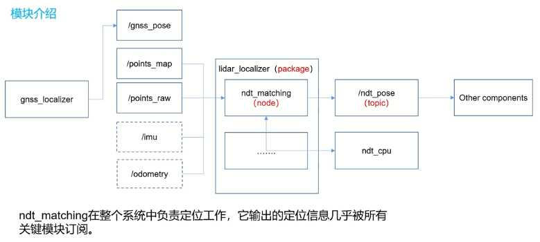

- `/gnss_pose`的定位提供一个初始值**（没有的话也行，但是你就得手动给一个的初值)**，这个功能实际调用了`gnss_localizer`模块

- **输入：**初始位姿、原始点云以及之前建好的地图（也会有imu等输入作为计算先验位姿的数据）
- **输出：**`ndt_pose`，即我们得到的定位位姿，然后传递给其他模块

- **ndt_matching在整个系统中负责定位工作，它输出的定位信息几乎被所有关键模块订阅**

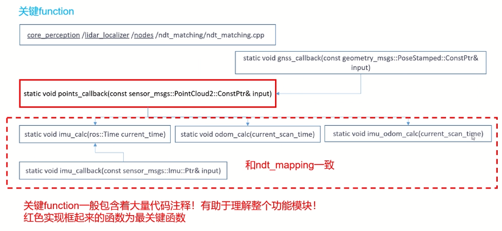


### 源码解读

1.  **先看一下`my_localization.launch`文件中的部分内容：**

```xml
  <!-- points downsampler -->
  <include file="$(find points_downsampler)/launch/points_downsample.launch" />

  <!-- nmea2tfpose -->
  <include file="$(find gnss_localizer)/launch/nmea2tfpose.launch"/>

  <!-- ndt_matching -->
  <include file="$(find lidar_localizer)/launch/ndt_matching.launch">
    <arg name="get_height" value="$(arg get_height)" />
```

-  最核心的还是`ndt_matching`模块
- `nmea2tfpose`也会解析，这个部分主要是把来自gps的信号，由经纬高转换成xyz的形式，它输出的结果也会传入到`ndt_matching`
- `points_downsampler`是滤波采样的过程，我们对输入的点云也会做一个预处理


2. 阅读ndt_matching.cpp文件

路径：`core_perception/lidar_localizer/nodes/ndt_matching/ndt_matching.cpp`

- 查看1673行开始的**输入接口**

```c++
  ros::Subscriber gnss_sub = nh.subscribe("gnss_pose", 10, gnss_callback);
  //  ros::Subscriber map_sub = nh.subscribe("points_map", 1, map_callback);
  ros::Subscriber initialpose_sub = nh.subscribe("initialpose", 10, initialpose_callback);
  ros::Subscriber points_sub = nh.subscribe("filtered_points", _queue_size, points_callback); // points_callback是这个模块的主回调 ！！
  ros::Subscriber odom_sub = nh.subscribe("/vehicle/odom", _queue_size * 10, odom_callback);
  ros::Subscriber imu_sub = nh.subscribe(_imu_topic.c_str(), _queue_size * 10, imu_callback);
```

`filtered_points`代表输入的scan，只不过通过话题名可以知道已经进行了过滤处理（**从`points_raw`，到`filtered_points`，用过滤后的点进行匹配**；将原始点云中比较近的，打在地面上的或者比较远的都过滤掉，不让这些杂点去影响我们的定位运算）

`initial_pose`代表先验信息或初始值（**有两种方式发布这种初始值，一种通过rviz工具手动发布一个初始位置，还有一种利用gnss提供一个初始值，就像官方demo中的`my_localization.launch`演示的并没有手动给一个初始值，因为官方demo就是利用gnss**）


- 查看1657行开始的**输出接口**

```c++
...
ndt_pose_pub = nh.advertise<geometry_msgs::PoseStamped>("/ndt_pose", 10);
localizer_pose_pub = nh.advertise<geometry_msgs::PoseStamped>("/localizer_pose", 10);
...
```

输出有非常多，但是最重要的就是这个`/ndt_pose`（相当于base_link在map的位姿），其余的都是一些中间解（如`/localizer_pose`就是雷达坐标系在map的位姿）


- 地图输入在源码中另起了一个线程，专门引入地图

```c++
  pthread_t thread;
  //note-tianyu 在thread_func中来加载map
  pthread_create(&thread, NULL, thread_func, NULL);
```

跳转到`thread_func()`的定义（1511行）

```c++
void* thread_func(void* args)
{
  ...
  ros::Subscriber map_sub = nh_map.subscribe("points_map", 10, map_callback);//读取地图
  ...
}
```

我们可以从`map_callback`开始看起


- `map_callback()`回调函数（427行）

```c++
static void map_callback(const sensor_msgs::PointCloud2::ConstPtr& input)
{...}
```

实际上，这个**回调中一开始的操作，是对tf tree的一个监控**

在Autoware中，我们需要指定map坐标系和world坐标系的一个位置变换关系。在这里我们要用gnss的数据，所以也必须利用到map和world的变换关系，才能实现将gps信息投到map坐标系

在tf tree监控代码之后的code，和上一章的ndt_mapping中基本一致，也需要先选择一个途径：我们这里还是直接选择第一种 - 调用PCL的库（PCL_GENERIC）

在该分支中，已经做好了一些初始化，代码如下：

```c++
    if (_method_type == MethodType::PCL_GENERIC)
    {
      pcl::NormalDistributionsTransform<pcl::PointXYZ, pcl::PointXYZ> new_ndt;
      pcl::PointCloud<pcl::PointXYZ>::Ptr output_cloud(new pcl::PointCloud<pcl::PointXYZ>);
      new_ndt.setResolution(ndt_res);
      new_ndt.setInputTarget(map_ptr); // 将map设置成target
      new_ndt.setMaximumIterations(max_iter); // 迭代次数
      new_ndt.setStepSize(step_size); // 步长
      new_ndt.setTransformationEpsilon(trans_eps);

      new_ndt.align(*output_cloud, Eigen::Matrix4f::Identity()); // 正式ndt
      ...
      ndt = new_ndt; // 将new_ndt传入到ndt
```

`ndt`是一个全局变量，我们之后点云输入的scan的优化处理，还会用到这个`ndt`，因为它都是在一个ndt对象中进行优化的

在map的回调最后，会触发一个**标志位**`map_loaded = 1`。它默认是0，因为必须先有一个地图，才能进行定位


3. 主回调函数points_callback()

**是订阅`filtered_points`时，进行相应操作的回调函数**

```c++
static void points_callback(const sensor_msgs::PointCloud2::ConstPtr& input) // 927行
{
    //note-tianyu map成功load，并且init_pos被设定后才会执行此分支（可以通过gnss或者手动两种方式来设定init_pos）
   if (map_loaded == 1 && init_pos_set == 1) // 两个条件
   {
    ...
   }
   ...
}
```

只有加载进了地图`map_loaded`并且有初始位姿`init_pos_set`设定了，才会进行后续操作，而后续操作和`ndt_mapping`中讲过的几乎一样

除了`map_loaded`是在`map_callback`的最后触发的标志位，另一个标志位`init_pos_set`可通过ctrl+h搜索得到

首先定位到`gnss_callback`中，可以触发`init_pos_set`标志位为1，就如我们之前所说**定位模块可以利用gnss的数据提供一个初值** ；还有一处地方，定位到`initialpose_callback`中，这里触发标志位，也是刚刚讲过的，**通过rviz中手动设置初始位姿**

**注意：**在`initialpose_callback`中，有一处根据`_use_local_transform`参数的值，去进行一些操作。`_use_local_transform`参数在ndt_matching.launch中**默认是false**，此时在rviz中的**初始位姿为world坐标系下**；**改为True**时，则**转到map坐标系下**（还是用到上一章讲过的map和world之间的变换矩阵`getOrigin()`）。**如果是在仿真状态下，world坐标系和map坐标系重合，那这步操作就无所谓了。**

**通过map的回调 和 gnss或rviz输入的回调，我们已经有初值了，所以可以继续阅读主回调后续的操作**

1. 首先将当前输入的一帧scan插入到map里`ndt.setInputSource(filtered_scan_ptr)`map是Target，那么当前输入帧的点云就是Source

2. 相比于ndt_mapping中的处理，多了几种补偿方式，可以通过线性`linear`或者平方`quadratic `等方式，对`offset`进行一个补偿处理
2. 我们核心要做的是：建立在上一帧的精确位姿结果上，预测下一帧的初始值（通过利用imu或者odom的数据，做一个估计，得到`predict_pose_for_ndt`）
2. 在得到估计的初始位姿后，在代码段1020行开始正式进行ndt的求解（**属于`ndt_cpu`模块内容**）

```
ndt.align(*output_cloud, init_guess) // init_guess来源于之前得到的predict_pose_for_ndt
```


- 回调的最后，会有一步比较：**说明在这里还是某种程度上更相信imu的瞬时值**

  ```
  // 这里也会计算ndt优化得出的pose和之前predict的pose之间的差值，如果差值很小，也会考虑使用predict的pose
     predict_pose_error = sqrt((ndt_pose.x - predict_pose_for_ndt.x) * (ndt_pose.x - predict_pose_for_ndt.x) + (ndt_pose.y - predict_pose_for_ndt.y) * (ndt_pose.y - predict_pose_for_ndt.y) + (ndt_pose.z - predict_pose_for_ndt.z) * (ndt_pose.z - predict_pose_for_ndt.z));
    
     if (predict_pose_error <= PREDICT_POSE_THRESHOLD)
  {...}
  ```

  - 如果ndt优化得到的结果和之前得到的predict_pose差值很小，也愿意用predict的pose当作`current_pose`输出出去

    **`current_pose`就是ndt求解这部分处理的最终解**

  - 之后求一下当前帧`current_pose`和上一帧`previous_pose`的差值，用这个变化值去当作预测下一帧的先验信息

  - 最后，将一些预测值信息发布出去，例如：

    1. `localizer_pose_pub.publish(localizer_pose_msg)`，将`localizer_pose`发布出去，当作雷达在地图坐标系的位姿
    2. `current_pose`通过TF的方式来发布出去

    ```
    transform.setOrigin(tf::Vector3(current_pose.x, current_pose.y, current_pose.z));
    transform.setRotation(current_q);
    ```


4. 回顾两个地方

- `initialpose_callback()`的定义处，这个与rviz手动设置初值相关的回调函数 的 input是怎么作用于实际的ndt定位：

  input即回调函数的输入参数，

  回调函数中，如果是针对第一帧求解的处理：将input同时赋给`current_pose`和`previous_pose`，然后加上补偿`offset`得到`predict_pose`，**意思是针对第一帧的求解，会将输入的初值直接当成预测的位姿，然后当作ndt计算的初值，进行一个优化求解**

- `gnss_callback()`，gnss一样的道理，针对第一帧的操作：将input进行同样的处理，计算预测pose，作为ndt计算的初值

  但是gnss多了一些东西，即进入gnss处理的一个判断条件，这也决定了，**正常行驶的情况下，在后续ndt过程中，gnss不会起太大作用：**

  ```
  // 当这两种情况发生时，我们认为需要用gnss的pose来代替ndt优化计算出的current_pose
    if ((_use_gnss == 1 && init_pos_set == 0) || fitness_score >= _gnss_reinit_fitness)
    {previous_pose=...
     current_pose=...}
  ```

  

  **直到触发第二个条件：`fitness_score >= _gnss_reinit_fitness`，即位姿丢失的时候**

  一旦进入到这个循环，对`previous_pose`和`current_pose`进行一个赋值改变，那么马上就会作用于ndt定位过程的位姿

  - `_gnss_reinit_fitness`是一个阈值，来判断位姿是否丢失

    我们首先看一下`fitness_score`在哪里出现的：回到主回调`points_callback()`中，`fitness_score = ndt.getFitnessScore()`，即在ndt优化完成后，输出`fitness_score`这个值，**通过这个值，我们可以大概判断这次ndt计算准不准，有没有丢掉**（可能不是很准，但是如果出现大范围漂移，那么肯定能判断出来位姿丢失）

    - 后续可以针对这里做优化，即不单单通过`fitness_score`的值来判断位姿是否丢失，可以通过更多的操作达到更准确的判断

  - 在`initialpose_callback()`中，我们可以手动设置初值。**如果我们故意手动设置一个跟实际漂移很大的错误位姿，如果存在`gnss_callback()`的第二个阈值判断条件`fitness_score >= _gnss_reinit_fitness`，那么也可以很快地纠正回来，不影响后续定位！！**

  其实除了这个阈值判断，还有很多措施来保证定位的安全性，**定位还是以安全准确为第一**

  - 还有很多更保守的策略，比如发现gnss位姿发生漂移后，先让车子急停，再做一些操作


- **==补充说明—rviz如何手动设置初值==**

  通过使用rviz上方工具栏中的`2D Pose Estimate`工具，可以通过鼠标在图里点击来设置位姿初值


## gnss_localizer模块介绍及源码解析

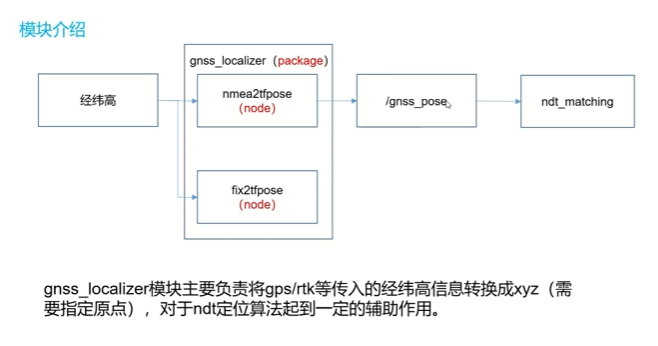

`gnss_localizer`这个package包含两个节点：`nmea2tfpose`和`fix2tfpose`。**gnss_localizer模块主要负责将gps/rtk等传入的经纬高信息转换成xyz（需要指定原点），对于ndt定位算法起到一定的辅助作用。**

- nmea是一个gps协议（类似于传输数据时规定用某种字符串，来显著区分其他的数据）

  **所以`nmea2tfpose`节点的首要工作是解析nmea协议，即从nmea中提取出例如经纬高、欧拉角等信息**

- `nmea2tfpose`节点将gnss协议的gps数据解析出来，并转成`/gnss_pose`，最终发给`ndt_matching`

- 官方demo提供的也是nmea这种协议，但是也可能存在其他情况：用的gps不是这种协议，而是直接发出经纬高，那么可以直接用`fix2tfpose`节点（后续不会特意讲这个节点，**但是第五章作业，添加GPS传感器时，用到了这个fix2tfpose这个节点**）

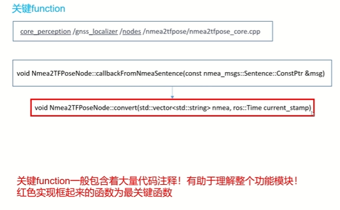

- 其实就是一个回调函数 - `callbackFromNmeaSentence()`
- 回调函数中真正调用的解析函数 - `convert()`


### 源码解读

1. 先看`my_localization.launch`文件，其中有如下

   ```
   <!-- nmea2tfpose -->
   <include file="$(find gnss_localizer)/launch/nmea2tfpose.launch"/>
   ```

`nmea2tfpose.launch`这个launch的作用：按照nmea这个协议去解析gps数据，最后将gps数据转换到世界坐标系下。即所谓的将经纬高转换成xyz格式

2. 重点阅读`nmea2tfpose_core.cpp`源文件

- 输入

  ```
    // setup subscriber
    sub1_ = nh_.subscribe("nmea_sentence", 100, &Nmea2TFPoseNode::callbackFromNmeaSentence, this);
  ```

- 输出

  ```
    // setup publisher
    pub1_ = nh_.advertise<geometry_msgs::PoseStamped>("gnss_pose", 10);
  ```

可以看到和之前分析的一样，输入是`nmea_sentence`格式的gps数据，输出的是`gnss_pose`（**是以标准的几何位姿格式的消息格式`geometry_msgs`发布的**）

3. 回调函数`callbackFromNmeaSentence`

```
void Nmea2TFPoseNode::callbackFromNmeaSentence(const nmea_msgs::Sentence::ConstPtr &msg)
{ 
  current_time_ = msg->header.stamp;
  //note-tianyu 根据当前帧输入的msg，从中解析出经纬高度信息，将其转换为xyz
  convert(split(msg->sentence), msg->header.stamp);
  ...
}
```

4. **重点关注convert()函数**

convert()函数主要对nmea协议规定的特殊字符串形式的gps数据做一个解析

```
void Nmea2TFPoseNode::convert(std::vector<std::string> nmea, ros::Time current_stamp)
{
  try
  {
    // 前两种字符串累计主要解析方向信息
    if (nmea.at(0).compare(0, 2, "QQ") == 0)
    { // 欧拉角无需额外转换
      orientation_time_ = stod(nmea.at(3));
      roll_ = stod(nmea.at(4)) * M_PI / 180.;
      pitch_ = -1 * stod(nmea.at(5)) * M_PI / 180.;
      yaw_ = -1 * stod(nmea.at(6)) * M_PI / 180. + M_PI / 2;
      orientation_stamp_ = current_stamp;
      orientation_ready_ = true;
      ROS_INFO("QQ is subscribed.");
    }
    else if (nmea.at(0) == "$PASHR")
    { ... }
    //后两种解析位置信息
    else if (nmea.at(0).compare(3, 3, "GGA") == 0)
    { ... 
      geo_.set_llh_nmea_degrees(lat, lon, h); // 将经纬高转换成xyz
      ...
    }
    ...
  }
```

可能对`QQ`、`$PASHR`等看着有点不明所以，

但是播放一下官方的bag，再`rostopic echo /nmea_sentence`打印一下话题输出，就能看懂：

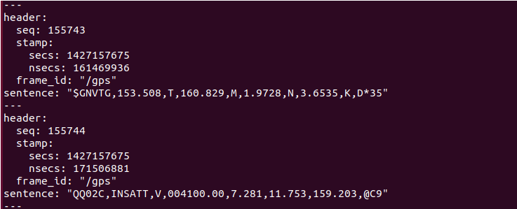

其实，这些**字符串**就是遗传数据的表头或者表尾，这只是协议定义的内容，不需要我们太关注。

5. **对于解析出来的欧拉角，我们不用额外转换，可以直接输出，但是对于解析出来的经纬高，我们需要转换成xyz格式，具体怎么转换，调用的是 `set_llh_nmea_degrees()`**

开了`autoware/common/`路径下，gnss包中的`geo_pos_conv.cpp`源文件，

在 `set_llh_nmea_degrees()`定义中，实际发挥关键作用的又是调用了另一个函数`conv_llh2xyz()`，跳转到其定义：

```
//note-tianyu 经纬高转xyz
void geo_pos_conv::conv_llh2xyz(void)
{...}
```

**只要了解这个函数的主要内容都是与导航定位等相关的很多专业转换操作，并且知道是由经纬高转换成xyz即可**

- 除了上述的转换，我们还需关注一个参数，是在nmea2tfpose.launch中定义的：

  `<arg name="plane" default="7"/> `

  `plane 7`这个参数是在哪里用到的：在nmea2tfpose_core.cpp源文件中，实例化 解析经纬高的 对象时，就把这个 plane 参数传入进来：

  `geo_.set_plane(plane_number_);`

  **plane参数的作用：根据设定的数字确定经纬高转换的原点**。因为xyz坐标（GNSS设备相对于GPS原点）必须有一个原点作为基准，即相对于哪的xyz。`plane`参数就是为了给每次的转换设置一个原点（跳转到`set_plane()`可以看到，根据plane设置不同的数字，就有不同的原点位置。官方demo相当于选择了序号7这个原点）

- `convert()`的相关操作结束后，即主回调中开头解析的操作结束后，继续阅读后续代码：

  在`convert()`后，出现了一个`if()`判断，判断**当从gps中无法获取方向信息/出现了较长时间段内没有获得方向信息**（即无法从gps数据中解析得到**欧拉角**，即方向信息），就会提供一种方法：用经纬高去推测现在的方向信息。

  具体来说，利用`convert()`解析出来的xyz坐标，去计算一个变化量，

  设置一个阈值，当刚刚计算的变化量大于这个阈值，就会进入到后续计算：

  计算得到欧拉角中的`yaw`值，具体实现通过`createOrientation() `

  - ```
    void Nmea2TFPoseNode::createOrientation()
    {
      yaw_ = atan2(geo_.x() - last_geo_.x(), geo_.y() - last_geo_.y());
      roll_ = 0;
      pitch_ = 0;
    }
    ```

    因为是在一个平面中行驶，所以roll和pitch直接取零，只需要一个yaw值

- 在主回调的最后，**要做一个时间戳的同步**。因为在`convert()`函数中对方向信息和位置信息是分开解析发布的，它们并不是在同一时间戳下。但是我们知道位置和方向只有在时间同步情况下的信息才有意义，所以**要保证方向信息和位置信息的同步**

  然后，调用两个Publish函数（`publishPoseStamped()`、`publishTF()`），将`/gnss_pose`和tf发布出去


### `gnss_localizer`模块其实最主要的两块工作：

- 对数据做一个解析（就像之前`map_file`模块对vector map的读取也是做数据解析）
- 将经纬高转成xyz（**具体原理不需要掌握，但是如果以后有相关项目也涉及到经纬高转xyz，并且也是nmea协议，那么就可以直接把那一段代码拿过来用**）

**总结来说：**`gnss_localizer`模块从参数服务器获取`plane`参数，作为GPS坐标的参考原点，然后订阅话题`\nmea_sentence`，接收到报文消息后进行解析， 解析出`lat, lon, h, row, pitch, yaw`, 其中`lat, lon, h`作为参数传递给`geo_.set_llh_nmea_degrees(lat, lon, h)`，与参考点比较后转换为`x, y, z`， 即转换成GNSS设备相对于GPS原点的位姿，发布到话题上`"gnss_pose"`，

gnss的经纬高可以转换为world上面的XYZ，同时发布从map到gps的TF，进而就可以和map建立联系。

注意GPS坐标架是固定在GNSS接收机上并跟随车体一起移动的.

（在运行官方demo时，可以看到gps坐标架是跟着汽车不断移动的，说明GPS坐标表示的实际上就是汽车的gps定位）


## ndt_cpu模块介绍及代码解析

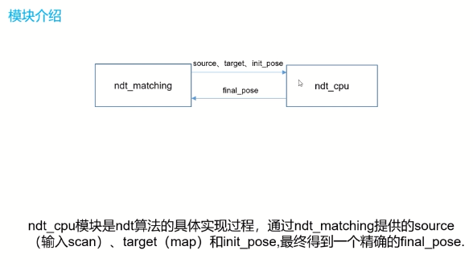

- 在`ndt_matching`模块中，讲到了和`ndt_cpu`的关联，即如何调用`ndt_cpu`来实际优化运算
- **ndt_cpu模块是ndt算法的具体实现过程，通过ndt_matching提供的source（当前输入scan）、target（建好的map）和init_pose（用imu预测的/ndt_pose），最终得到一个精准的final_pose**


### ndt算法流程


- 该流程2D和3D是通用的，本项目中使用3D

- 将ndt算法当成一个黑箱，算法步骤如下：
  1. **输入是map（地图）**
  2. 将map的所有点都遍历一遍，即将map分成很多格子cell（就像之前说的，也可以直接调用pcl点云库，将点云地图分成一个个方格）；（cell分的越多，算法计算量越大，但更精准）
  3. 遍历每个方格，将每个方格中包含的点的均值和方差计算出来
  4. 接下来和其他优化问题类似，构造残差函数（一般是一个概率密度函数），用高斯牛顿法求解优化问题
     1. 列出Hessian矩阵H和梯度矩阵g的计算公式 **（复杂点）**
     2. 遍历输入点云中的所有点，去对矩阵g和H更新
     3. **最终优化的结果是Δp**，满足`HΔp=-g`，算法最后收敛，即满足`p <- p+Δp`


### ndt论文学习

论文链接：[ndt论文](https://docs-download.oss-cn-shanghai.aliyuncs.com/%E7%9D%BF%E6%85%95%E8%AF%BE%E5%AD%A6%E9%99%A2/Autoware%201%E6%9C%9F/%E3%80%90%E7%AC%AC3%E7%AB%A0%E3%80%91ndt%E6%B3%A8%E9%87%8A%E8%AE%BA%E6%96%87.pdf)

1. 将点云地图分到多个cell中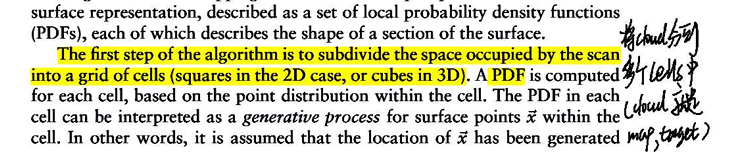

2. **设计优化函数的想法来源：**通过正态分布概率密度函数的公式（正态分布概率是均值和方差的函数，呼应上了之前算法流程图的内容）。假设得到了一个pose，由这个位姿将输入点云投影到某cell中，通过该cell的均值和方差，用正态分布计算一个概率去当作：点云投影后确实属于该cell的概率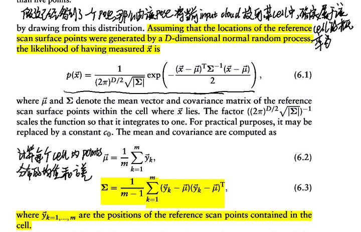

3. 前面提到的正态分布概率密度只是一个模板，并不是之后优化过程中实际用到的概率密度函数，**而接下来最重要的工作就是建立一个概率密度函数**

   构建概率密度函数的优化思路：像上面正态分布概率当作匹配的概率一样，如果对于一个pose，将所有点都代入概率密度函数，计算得到一个结果，这个结果最大，就代表pose最优，匹配这个cell最好：

   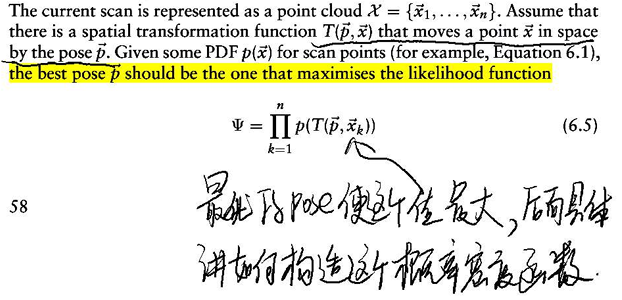

4. 又考率增加一个均匀分布，防止纯的高斯分布中，某一个点离均值太远，即框定了一个范围。

   根据上面的多重考虑（正态分布、均匀分布等等），**提出了最终的混合概率密度函数：**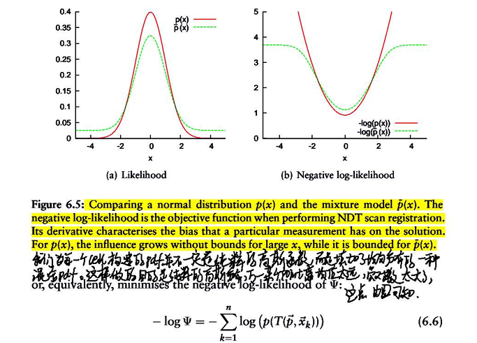

5. (6.9)公式是针对一个点的运算，但我们要对scan里所有点运算，所以**最终是(6.10)公式**，将输入所有的雷达点云，经过pose转到map下后，通过这个公式能够计算当前pose的权重score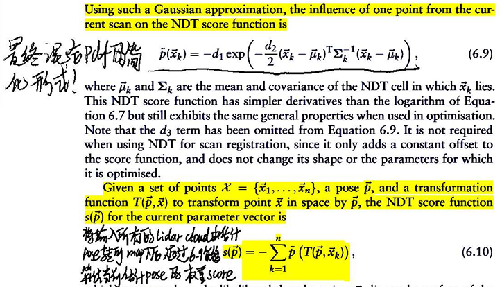

6. 高斯牛顿法：简单来说就是每次求一个增量，即每次迭代得到一个Δp，当增量满足足够小的条件时，就代表收敛。过程中会不断更新Hessian矩阵H和梯度矩阵g，并且满足`HΔp = -g`

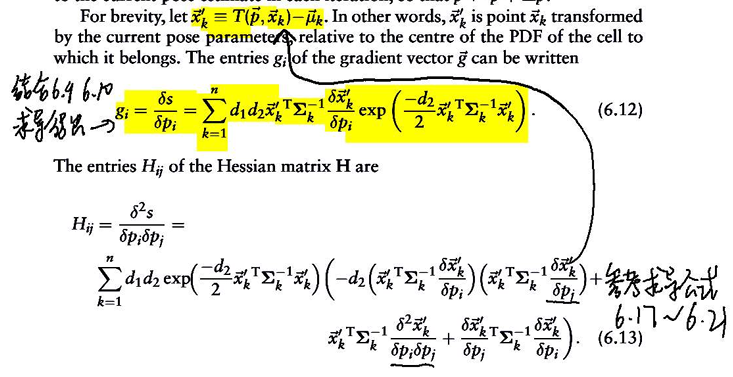

- 根据之前的(6.9)和(6.10)公式去得到 Hij 和 gi 的计算公式：

  **gi就相当于概率密度函数s(p)对pi的一阶求导**，（g最后是6*1的矩阵，由六个gi组成，i来源于对不同的pi求导，因为位姿pose是六自由度，由px、py等等，变换后的点分别对六个位姿求导）

  **Hij就是s(p)对pi pj求二阶导**，（H最后是6*6的矩阵，由36个模块Hij组成）

  可以得到Δp是6*1（从位姿p也能直接看出，位姿就是六维的）

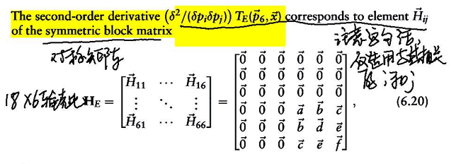


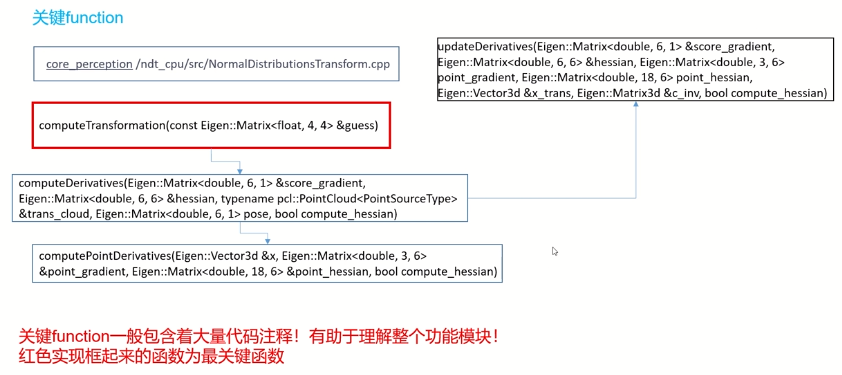

### 源码解读

通过`ndt_matching.cpp`文件464行的`setInputTarget`跳转到ndt_cpu功能包中的`NormalDistributionsTransform.cpp`中第97行

**对照论文中的算法流程图，去阅读关键函数：**

- 在ndt_matching.cpp中，地图的回调函数中：有一步直接选择PCL库，然后进行ndt计算。首先对点云地图处理，将其分成多个cell。并计算每个cell的均值和方差（**地图代入ndt后的准备工作**）

```c++
// map_callback()
if (_method_type == MethodType::PCL_GENERIC)
{
  pcl::NormalDistributionsTransform<pcl::PointXYZ, pcl::PointXYZ> new_ndt;
  pcl::PointCloud<pcl::PointXYZ>::Ptr output_cloud(new pcl::PointCloud<pcl::PointXYZ>);
  new_ndt.setResolution(ndt_res);
  new_ndt.setInputTarget(map_ptr); // 将map分成多个cell
  new_ndt.setMaximumIterations(max_iter);
  new_ndt.setStepSize(step_size);
  new_ndt.setTransformationEpsilon(trans_eps); 

  new_ndt.align(*output_cloud, Eigen::Matrix4f::Identity()); // 正式调用ndt

}
```

- 跳转到`setInputTarget(map_ptr)`函数，在函数定义中，要对分成的格子cell的大小作设置，即分辨率`resolution_`（如果算力足够，可以设置分辨率大一些，也就是这个值小一些）

```c++
void NormalDistributionsTransform<PointSourceType, PointTargetType>::setInputTarget(typename pcl::PointCloud<PointTargetType>::Ptr input)
{
  Registration<PointSourceType, PointTargetType>::setInputTarget(input);

  // Build the voxel grid
  //note-tianyu 将map分割成为多个cell
  if (input->points.size() > 0) {
    voxel_grid_.setLeafSize(resolution_, resolution_, resolution_);
    voxel_grid_.setInput(input);
  }
}
```

- 跳转到`SetInput()`函数的定义（在VoxelGrid.cpp中）：
  - 实现了把每一个点point分到cell里（把所有点过滤一遍，把每个点根据边界的位置，插入到分割好的cell中）；
  - 以及调用另外两个函数`scatterPointsToVoxelGrid()`、`computeCentroidAndCovariance()`去计算每个cell的均值和方差

- **正式调用ndt优化运算，是通过`align()`函数**，跳转到其定义（在Registration.cpp中84行）

在定义中，先传入需要的参数。再根据，调用`align(guess)`函数时，传入的估计值guess，去调用`computeTransformation(guess) `函数去进行真正的运算

（**`computeTransformation()`函数是`ndt_cpu`部分的最核心函数，所有的关键function都是源于它的层层调用！**）

- `computeTransformation()`函数的定义，回到`NormalDistributionTransform.cpp`中（108行）

  **这个函数的内容，完全可以和论文中的算法流程图对应起来**

  `computeTransformation(const Eigen::Matrix<float, 4, 4> &guess)`

  - 计算一些系数，为了得到最终混合的概率密度函数（论文中(6.8)公式，即针对单个点计算的混合概率密度函数）

    ```
    //note—tianyun 这里的计算公式参考NDT那篇博士论文中的公式6.8，最终主要是为了求取d1和d2，也就是为之后建立优化函数计算系数
      gauss_d3 = - log(gauss_c2);
      gauss_d1_ = -log(gauss_c1 + gauss_c2) - gauss_d3;
      gauss_d2_ = -2 * log((-log(gauss_c1 * exp(-0.5) + gauss_c2) - gauss_d3) / gauss_d1_);
    ```

    

- 把输入的点云`source_cloud`根据初始值`guess`，做一个坐标变换（因为换算到一个坐标系下，才好计算每帧输入scan中的点在地图cell中的权重，也是检验初值guess给的准不准）

  ```
    if (guess != Eigen::Matrix4f::Identity()) {
      final_transformation_ = guess;
  
      pcl::transformPointCloud(*source_cloud_, trans_cloud_, guess);
    }
  ```

  

- 把初值guess中的`transformation`，由矩阵形式 传换成 六自由度的形式，因为之后计算雅各比矩阵时，也是将位姿当成六自由度，再对其求导

  ```
  p << init_translation(0), init_translation(1), init_translation(2), init_rotation(0), init_rotation(1), init_rotation(2);
  ```

  

- 定义一个更新函数`computeDerivatives()`，供下一步迭代运算调用：

  把输入scan中的每一个点都过滤一遍，即用所有点对Hessian矩阵和梯度矩阵score_gradient做一遍更新：

  ```
    //note-tianyu 由此进入hession矩阵和score_gradient梯度矩阵的计算
    score = computeDerivatives(score_gradient, hessian, trans_cloud_, p);
  ```

  - **跳转到`computeDerivatives()`的定义**（NormalDistributionsTransform.cpp的187行）：

    1. 根据输入6Dpose来计算一阶和二阶雅克比中的**关键项** ：

       即通过`computeAngleDerivatives(pose) `函数，计算得到了两个雅各比矩阵中的某些值

       （**即参考论文中公式6.19和6.21的计算**）

    2. 遍历输入cloud中的每一个point,寻找它在指定距离内的邻近voxels（即论文中的cell）的id ，

       得到近邻内的cell后，计算得到方差`c_inv`和均值`x_trans `

    3. 根据当前遍历point，通过调用`computePointDerivatives()`函数，生成一阶和二阶雅克比矩阵

       （`computePointDerivatives()`函数定义就在`computeDerivatives()`下方）

    4. 最后，通过调用`updateDerivatives()`函数，**正式更新H 和 g：**

       参考公式(6.12),结合一阶雅各比来计算梯度向量g

       结合二阶雅各比来计算hession矩阵

       （**与论文中的公式6.12和6.13完全对应起来，因为之前的三步已经把这两个公式内的雅各比矩阵和均值方差准备好了**）

    在源代码中，调用`computeDerivatives()`来更新score_gradient和hessian时，

    还有一步通过`computeStepLengthMT()`函数，来给出非线性优化相关的步长的操作，通过`computeStepLengthMT()`函数实现（可以在源码中跳转阅读）

- 更新完H和g后，开始进行迭代运算，根据`H*delta_p=-g`，使Δp收敛（这一步的具体代码，直接在NormalDistributionsTransform.cpp中去阅读）

  ```
    //进行迭代运算
    while (!converged_) {
      ...
      //note-tianyu 计算增量 H*delta_p=-g
      ...
          
      //note—tianyu 给每次优化后的步长乘了一个步长系数,并且通过调用computeDerivatives()来更新score_gradient和hessian
      ...
      p = p + delta_p // 完成了一次迭代的优化
          
      //note-tianyu 收敛或达到最大迭代次数，停止迭代运算
      if (nr_iterations_ > max_iterations_ || (nr_iterations_ && (std::fabs(delta_p_norm) < transformation_epsilon_))) {
        converged_ = true;
      }
     
      nr_iterations_++;
    }
  ```

  简要概括：**每次迭代先更新H和g，根据`H\*delta_p=-g`公式，计算出增量delta_p，根据`p = p + delta_p`对位姿做一次更新，即完成一次迭代优化；**

  直到p满足设置的收敛判断条件，则停止迭代！（p就是我们需要的精确解）

### 写在最后：

上面步骤中涉及到的关键function，尽量都去源码中完整阅读几遍，边参考论文中的算法流程图，可以非常清晰地梳理好整个优化逻辑；

**特别是ndt计算中的关键两步：更新H和g，以及为了收敛做的迭代运算 这两步 涉及到了众多函数**

- 其中更新H和g的这一步，通过调用`computeDerivatives()`函数来实现，在这个函数的定义中又调用了众多函数：`computeAngleDerivatives(pose) `、`computePointDerivatives()`、`updateDerivatives()`
- 在优化迭代这一步中，通过调用`computeDerivatives()`函数，对每次迭代的H和g做更新，并且通过`computeStepLengthMT()`函数给出步长，最后完成一次迭代运算


## 实践部分

利用官方demo的定位部分，调一些参数来展示定位的效果。（定位在演示中看着一下子就定好了，但其实背后的计算量和逻辑都比较大）


### debug方法

解决启动launch文件容易崩掉的问题

- 我们可以通过终端的报错log，定位到哪个模块出错。例如终端log打印出`[ndt_matching].....`，那么我们就知道，可以定位到ndt_matching这个模块

- 进一步操作，打开ndt_matching.launch，修改一下`ndt_matching`这个模块启动的节点，即将`output="log"`修改成`output="screen"`

  **注意：该launch文件为在install文件夹下而非src文件夹下，这样可以省去编译操作**

  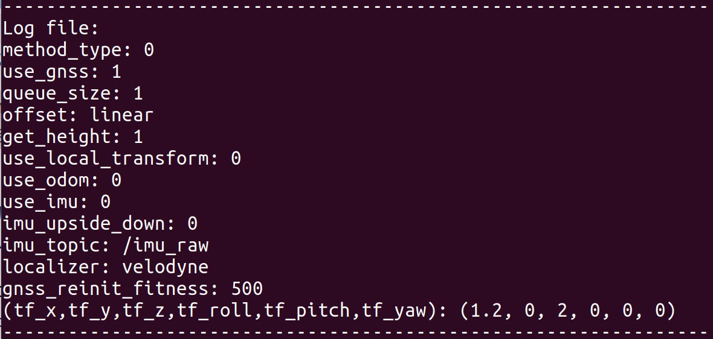

  - 因为我此处没有报错，故修改成`output="screen"`后新增内容由上图可见
  
  - 若有报错，
  
  - 除了刚刚的标红报错段，还会在终端输出一行信息，如`tf_z is not set`；
  
    那么复制这句输出，在ndt_matching.cpp源文件中去`ctrl H`搜索，因为这句输出明显是一个log；然后可以定位到源文件中，为什么何时会输出这句log；
  
    对于这个tf_z，明显就是这个参数没有读取进来。这个参数具体是在my_map.launch文件的**开头会读一个参数文件`.yaml`**，其中这个tf_z被注释掉了，所以导致后续崩掉
  
    通过上述这种层层分析的debug方式，可以较快的定位错误
  
- **对于某一部分崩掉，可能只是因为某一两行代码的问题，但其实常常出错的地方对整体影响不大，所以直接注释掉，忽略也可以**


### 官方demo定位部分

- 流程

1. 首先将gnss信息通过`gnss_localizer`模块，将gps信息转换成了xyz
2. 在rviz中就发布此时xyz的gps坐标系，并当成ndt的初值，然后进行一个优化匹配的过程
3. 经过优化运算之后，我们能得到一个精确解，可以和地图很好的匹配起来

- **gnss的纠正功能**

如之前所讲的，在`ndt_matching`模块中，会利用gnss模块去纠正漂移的位姿（如果位姿出现超过阈值的丢失）

在rviz中具体演示，等bag播放起来，小车也定位成功开始正常走直线。

此时使用上方工具栏的`2D Pose Estimate`，用鼠标在离小车行驶的原定道路偏离比较大的地方点击一下，可以发现rviz页面闪动一下。**其实这就是一个纠正过程，只不过纠正得非常快，实际上的过程是小车已经被你手动设置到偏离正常位姿的地方，并且超过阈值，所以gnss的纠正功能起作用，立即纠正小车位姿**

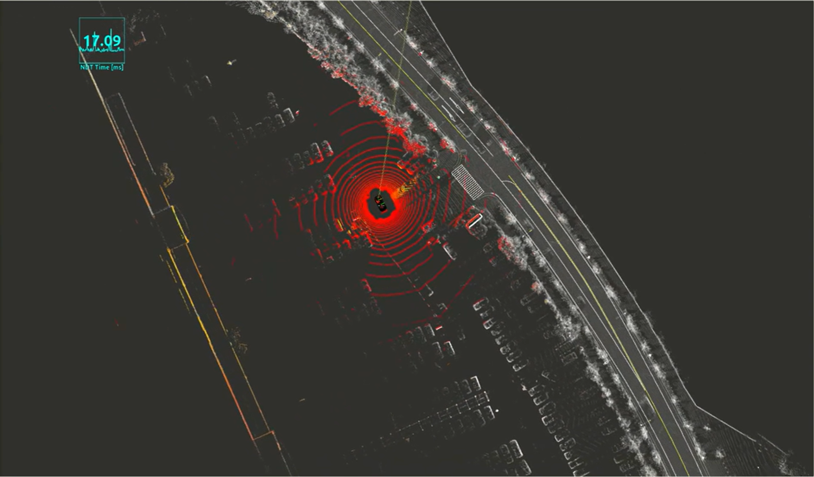

代码触发位置为：

```
  // 当这两种情况发生时，我们认为需要用gnss的pose来代替ndt优化计算出的current_pose
  // 比如当pose突然丢掉时，会通过gnss来进行一个纠正
  if ((_use_gnss == 1 && init_pos_set == 0) || fitness_score >= _gnss_reinit_fitness)
  {...}
```

`_gnss_reinit_fitness`阈值的设置，直接影响到纠正的效果（这个参数是在`ndt_matching.launch`中设置的）。我们可以尝试修改一下这个阈值（初值为500）：

- 先改成1，即阈值非常小

  重新启动所以节点，rviz中显示：在定位成功后，小车便一直**疯狂抖动着前进**。

  这就是因为阈值太小，gnss开始频繁介入。但我们不需要gnss这样频繁纠正

- 改成5000，即阈值较大

  重新启动后，依旧手动给一个错误位姿。其实小车就直接跑到你给的错误位姿处，而不回到正常轨迹上，说明并没有触发gnss的纠正。


##### 自己跑官方demo的时候，定位部分的演示中，小车会先旋转、漂移一段时间后，才能成功定位

即在启动my_map.launch 和 my_localization.launch后，开始播放官方bag，小车不能像讲师慕课中一样迅速正确地定位，然后开始行驶。我自己的演示中，小车会先经历一些旋转、漂移后，才能回到正确轨迹开始行驶

**这是因为讲师多建了一个图，针对一个大地图，如果想定位的更准，可以这么做**

这作为一个大作业，让我们自己解决。思路就是，先建图，然后将我们建的图和原大地图融合起来。

这里涉及到精定位和粗定位：

- 不管是我们建的地图还是原大地图，其实都是一样的，只不过需要将他们关联起来。那么就可以利用gnss去实现两者的关联，因为gnss都可以转成世界坐标系，这是一个粗定位
- 之后可以利用ndt匹配算法，去做一个精定位，然两个地图很好的融合
