# 建图模块

##   高精地图与经典建图算法概述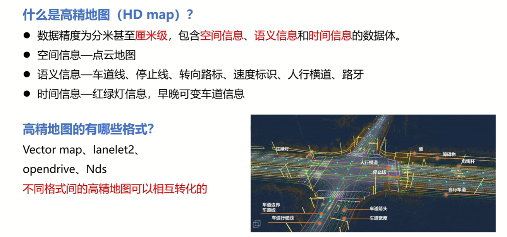

**其中，Vector map是autoware框架的主要选择**


### **点云地图创建原理**

**激光雷达**输出点云数据。输入点云数据一般基于激光雷达坐标系，激光雷达坐标系和车身坐标系为刚性连接。如果将车辆起始位置当成地图坐标系的原点，那么在之后的运动过程中的某些间隔均匀的时刻，如果能够**准确的获取车辆的位姿变化**，就能将原本基于激光雷达坐标系的点云信息转换到地图坐标系下，进而就构成了点云地图的一部分。

某些激光SLAM算法中的做法：如果是关键帧，则把关键帧的原始点云数据直接插入到地图中，**核心还是坐标变化**


### 车辆定位方法

1. RTK差分定位（成本较高，需要搭建基站，不能够有遮挡例如隧道也不行）
2. **激光slam匹配算法**（存在累计误差，长时间使用会造成漂移）
3. 轮速计定位（存在累计误差，长时间使用会造成漂移）

**实际使用时，根据不同场景混用**


### 语义信息标注工具

**Autoware tools**（为主），Unity插件版


### 高精地图的生产流程

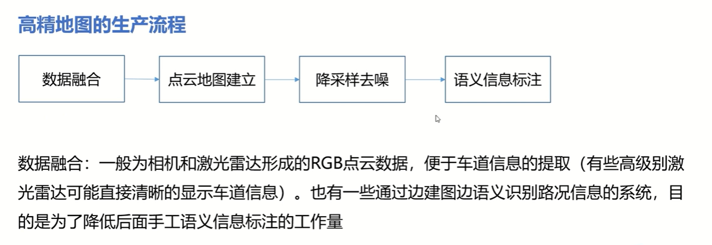

 

### 激光slam算法概述

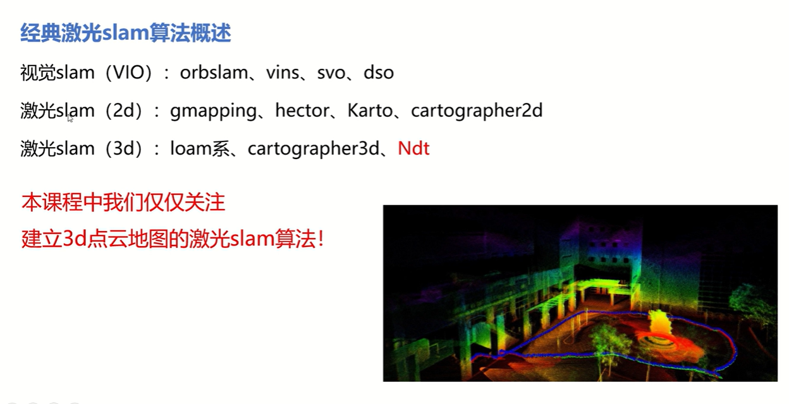

建图的关键在于**位姿变化**的准确估计，对于slam算法而言，位姿变化的计算是通过**点云特征匹配优化**后得到的

### 根据特征匹配形式的分类

- **Scan to Scan**：loam系（当前帧与上一帧去匹配）

  Loam会将输入scan中的点云根据**曲率**大小分为**平面点**和**边缘点**，之后的匹配优化过程也是针对当前输入scan和上一scan的平面点和边缘点来研究进行的。根据**边缘点的距离优化公式**和**平面点的距离优化公式**来构造优化方程求解位姿变化量

  - **曲率大的边缘点，曲率小的是平面的**

  - 点云数据都是一组组（x,y,z），可以通过计算每个点和它附近点的关系，来判断每个点是属于平面点和边缘点，然后给它标识上

  

- **Scan to Map**：cartographer、Ndt（当前帧和已经建好的地图进行匹配）

  两者都是通过**当前scan同已经建好的map（或者submap）来进行特征匹配的**，和loam提取有曲率特征的点云不同，cartographer将当前scan通过hit（是否打在墙上）的方式来和上一次建好的submap来进行匹配优化；而**Ndt则是将map网格化后计算每个网格的均值方差，并通过当前scan中的每个点落在map网格中的正态分布概率来进行匹配优化的**（Ndt算法的具体原理在后续讲，这里先当作一个库去调用）


## map_file模块介绍及源码解析

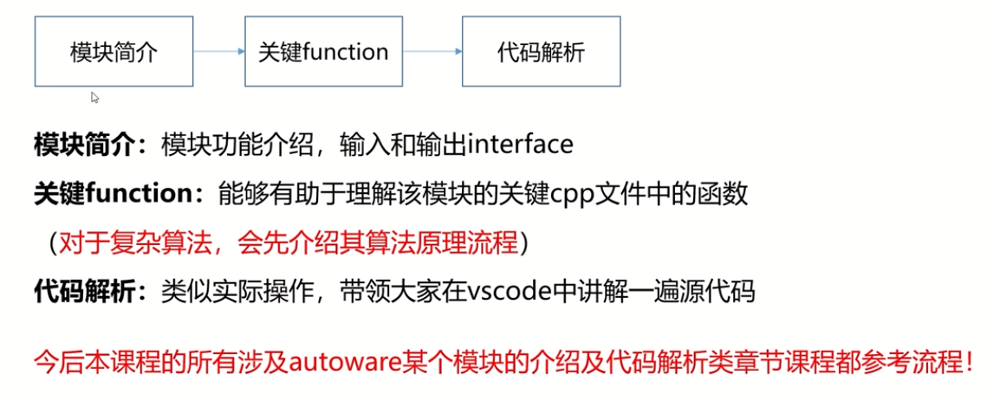

各类模块其实就相当于一个ROS package

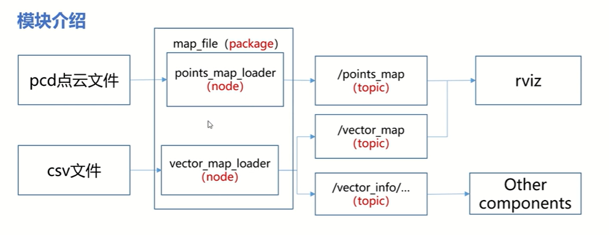

map_file模块主要负责**读取pcd点云文件和csv语义地图文件**，解析并将其**转换成描述地图信息的topic**发送给rviz和其他功能模块

- map_file这个ROS package包含了两个节点，也相当于两个可执行文件。（对应则有两个.cpp源码文件可以解读）
- 这个模块的输入是pcd或者csv，输出是point_map和vector_map等话题，供rviz可视化的订阅以及其他模块如定位、感知等模块，可以订阅地图的话题
- 关键function：`pointx-map_loader.cpp`和`vector_map_loader.cpp`

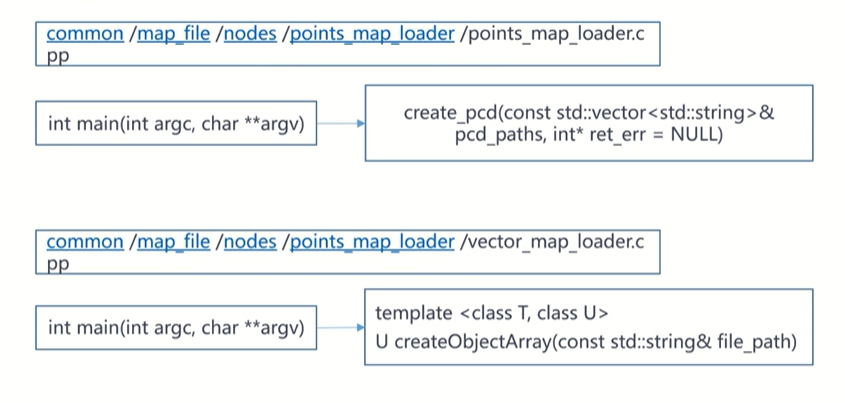

### 源码解读

首先启动地图的launch文件，路径为`autoware/documentation/autoware_quickstart_examples/launch/sil_env_demo/my_map.launch`

```xml
  <!-- Point Cloud -->
  <node pkg="map_file" type="points_map_loader" name="points_map_loader" args="noupdate $(env HOME)/.autoware/data/map/sil_pointcloud_map/simcity9.pcd"/>

  <!-- Vector Map -->
  <node pkg="map_file" type="vector_map_loader" name="vector_map_loader" args="$(env HOME)/.autoware/data/map/sil_vector_map/lane.csv ....
```

在这个建图的启动文件中，分别启动了`points_map_loader`和`vector_map_lodaer`，在终端运行这个launch，并打开rviz可视化，呈现出的是一副建好的地图。

- 通过左侧插件中的map文件夹可知，这幅地图包含了分别由`points_map_loader`加载的点云地图（Points Map），和`vector_map_lodaer`加载的矢量地图（ADAS Map）

- 找寻数据源头：通过launch文件中的`args="noupdate $(env HOME)/.autoware/data/map/sil_pointcloud_map/simcity9.pcd"`即可知道
- 在rviz中左侧栏的插件，可以知道`Points Map`和`ADAS Map`分别订阅的是`/points_map`和`/vector_map`两个话题


#### 1. points_map_loader.cpp

路径：`autoware/common/map_file/nodes/points_map_loader/points_map_loader.cpp`

由于上面已知话题为/points_map，我们直接在cpp文件中搜索`points_map`关键词，来迅速捕捉到：这个模块的重点流程，包括话题在何处发布的，何处订阅的，节点的句柄在哪里等等。

**技巧：阅读源码不需要逐行读，我们更多的关注主体功能通过怎样一个流程来实现的，例如`points_map`这个话题的具体走向，调用了哪个函数**

我们搜索到`points_map`话题是通过`pcd_pub`这个句柄发布的，在搜索`pcd_pub`时，以发现具体是`void publish_pcd(...)`函数发布的，继续搜索这个函数，可以最终发现：在主函数中的某处，调用了`publish_pcd`这个函数，真正实现了`points_map`话题的发布：

- 具体代码段：

  ```c++
  int main(int argc, char **argv)
  {
  ...
      std::string area(argv[1]);
  	if (area == "noupdate")
  		margin = -1;
  ...
      if (margin < 0) {
  	    int err = 0;
  	    publish_pcd(create_pcd(pcd_paths, &err), &err);
  ```

  虽然主函数中有多个if分支，但是对于我们这个仿真项目，只需要关注`margin<0`这个分支，因为在主函数中定义了`area`参数，这个参数用来解析launch文件中的第一个参数：在`new_map.launch`文件中，在`points_map_loader`节点启动时，通过args传入了`noupdate`参数。

  

#### 2. vector_map_loader.cpp

路径：`autoware/common/map_file/nodes/vector_map_loader/vector_map_loader.cpp`

- 在936行开始，注册了一系列的publisher的句柄，每个句柄负责发布的话题都关联一个csv文件（对应某一类语义信息，如车道线、路灯等等），**这些句柄为其他模块或者rviz 来对这些不同话题的订阅服务！**

- 例如：

```c++
ros::Publisher cross_walk_pub = nh.advertise<CrossWalkArray>("vector_map_info/cross_walk", 1, true);
```

后续则可以通过订阅`/cross_walk`话题，来获取cross walk的相关元素信息

- 以`crosswalk.csv`数据的解析为例：同样可以通过在.cpp文件中搜索发布者`cross_walk_pub`，来知晓如何从原始的csv信息转换成我们自定义的`CrossWalk.msg`，再合成一个话题，发布出去！

  - 从1073行开始，通过调用之前定义的模板函数（`createObjectArray()`），来实现了每一份`.csv`文件的解析（即**从csv数据转换成 CrossWalk.msg**）。即**读取"crosswalk.csv"文件中数据，创建一个`ObjectArray`，并且通过cross_walk_pub发布 **

  - 从1235行开始，**是利用`MarkerArray`这个数组**（专门用来提供可视化的数组）**将之前通过`cross_walk_pub`等pub发布过的语义信息，集合到一起，形成一个`vector_map`话题，发布出去**（相当于将语义信息二次发布了，只不过这次发布是为了rviz可视化，而打包形成了一个`vector_map`话题），这样才能供rviz等去订阅，真正实现可视化（之前`createObjectArray()`解析出来的信息并不能真正使用）

    ```c++
    //vector_map话题的发布
      ros::Publisher marker_array_pub = nh.advertise<visualization_msgs::MarkerArray>("vector_map", 1, true);
      
      ...
          
    //note-tianyu 定义一个"VectorMap"类型的vmap,通过subscribe来填充vmap中的各种矢量元素
      VectorMap vmap;
      vmap.subscribe(nh, category);
    //note-tianyu 定义好一个marker_array后，依次将vmap中的各种矢量元素插入到marker_array里面去，用于rviz中的vector map显示
      visualization_msgs::MarkerArray marker_array;
      insertMarkerArray(marker_array, createRoadEdgeMarkerArray(vmap, Color::GRAY));
      ...
      insertMarkerArray(marker_array, createCrossWalkMarkerArray(vmap, Color::WHITE));
      ...
    // 注释位置—把插入完各种vector_map的marker_array发布出去
      marker_array_pub.publish(marker_array);
    ```

    

    - 其中，`VectorMap vmap;`和`vmap.subscribe(nh, category);`，是通过`subscribe()`函数来对`vmap`进行填充，跳转阅读`subscribe()`的定义，又可以追溯到`registerSubscriber(nh, category)`函数，它实现的即是： **将.cpp的936行开始发布的一系列语义信息，又重新订阅回来，用来填充vmap集合**


## ndt_mapping模块介绍及源码解析

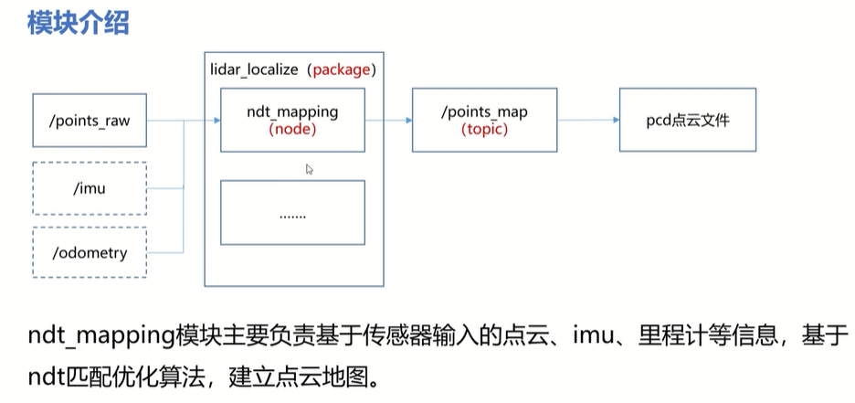

**图中的虚线框代表可选输入topic，意思是除了原始点云数据必须作为该模块的输入，还可以选择加入imu或者里程计作为输入**。

本项目重点介绍除了输入原始点云，额外加入imu的建图功能流程。

- `lidar_localize`这个ROS package非常重要，包括下一章要讲解的Ndt_matching、Ndt_CPU等功能都在其中。它的的输入是点云等信息，输出是点云地图

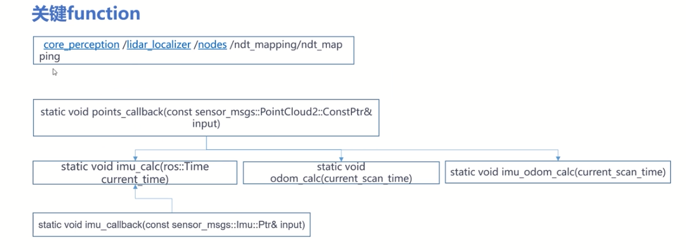

**重点关注接收点云topic和imu topic回调函数，以及回调函数中设计的几个重点calc函数**


### 源码解读

#### ndt_mapping.cpp

路径：`autoware/core_perception/lidar_localizer/nodes/ndt_mapping/ndt_mapping.cpp`

通过1046、1049行的**订阅**话题的代码，可得到该模块的**输入：原始点云、imu**

```
  ros::Subscriber points_sub = nh.subscribe("points_raw", 100000, points_callback);
  ros::Subscriber imu_sub = nh.subscribe(_imu_topic, 100000, imu_callback);
```

通过1041、1042行开始**发布**话题的代码，可以得到该模块的**输出：点云地图(ndt_map)、定位信息pose**

订阅话题时，除了传入订阅的话题，还有就是订阅话题后要执行的一系列操作即**回调函数**。如上面代码段中的标识，本小节的重点就是**解读两个回调函数**：`points_callback`和`imu_callback`


##### 回调函数points_callback()

右键跳转到454行

- 首先定义了一帧点云的`input`（初始为msg格式），然后通过 `pcl::fromROSMsg(*input, tmp)`转换到pcl格式，这样有助于调用pcl的一些库进行一些点云的专业操作
- 进行点云过滤：包括x、y、z坐标和intensity反射率，只挑选一定范围内的点云，将过滤后的点云插入到`scan`容器。接着生成一个智能指针：`pcl::PointCloud<pcl::PointXYZI>::Ptr scan_ptr(new pcl::PointCloud<pcl::PointXYZI>(scan))` 

- 如果传入的是第一帧点云，那就直接插入到点云地图中，即**第一帧scan输入，会将其当成直接插入到map中，作为组成map的第一帧子图 **

  ```c++
    if (initial_scan_loaded == 0)
    {
      pcl::transformPointCloud(*scan_ptr, *transformed_scan_ptr, tf_btol);
      map += *transformed_scan_ptr;
      initial_scan_loaded = 1;
    }
  ```

- 初始的时候，车子基本相对于地图没有什么变化，即map坐标系此时就相当于车身坐标系`base_link`，所以第一帧点云插入地图的操作：只需要完成一个base_link（车身坐标系） 到雷达坐标系的坐标变换
- tf_btol是base_link到雷达坐标系的一个tf tree，即变换矩阵。tf_btol的代码在1036行，已经预设好了，这个矩阵的信息是通过yaml文件读取出来的。**这个矩阵以及它的逆矩阵（雷达->base link）非常重要，会多次使用到**

完成坐标变换后，通过`map += *transformed_scan_ptr;`进行点云的简单叠加，即相当于点云插入地图的操作，生成点云地图`map`

- 对这帧点云进行体素滤波。之后，将刚刚生成的点云地图 生成一个地图智能指针，根据对ndt优化的相关参数进行配置。**根据ndt算法进行配置有四种方式：直接调用pcl库，单独用CPU，用GPU（如果装了CUDA），用pcl_OPENMP **

```c++
if (_method_type == MethodType::PCL_GENERIC) //调用pcl库
  {
    ndt.setTransformationEpsilon(trans_eps);
    ndt.setStepSize(step_size);
    ndt.setResolution(ndt_res);
    ndt.setMaximumIterations(max_iter);
    ndt.setInputSource(filtered_scan_ptr);
  }
  else if (_method_type == MethodType::PCL_ANH) //cpu ndt
  {...}
#ifdef CUDA_FOUND
  else if (_method_type == MethodType::PCL_ANH_GPU) //gpu ndt
  {...}
#endif
#ifdef USE_PCL_OPENMP
  else if (_method_type == MethodType::PCL_OPENMP) //pcl_OPENMP
  {...}
```

大部分情况直接调用pcl库，但直接阅读pcl库不是这个项目的重点，所以后续会解析autoware项目中的`cpu ndt`和`gpu ndt`的源码，尤其是CPU的ndt算法流程

- **对于第一帧点云来说**，后续几乎没什么操作

- **如果不是第一帧点云**，之前的几步操作中，就不会有直接插入地图去生成地图，因为地图已经存在，然后调用pcl库或者直接CPU等几种方式下根据对ndt优化的相关参数进行配置，都差不多

  直接跳转到560行的`guess_pose`（先验位姿的计算部分）

- 调用`imu_odom_calc()`、`imu_calc()`、`odom_calc()`几个函数，对imu或者里程计的信息进行一个计算，将计算结果经过一些处理，然后当成**下一次ndt计算的先验信息**，ndt算法也需要一些先验的初值。（567行开始）

演示的demo中只使用到了imu，所以我们重点解读一下`imu_clac()`，跳转到297行

- 先说明一下imu的使用特性：使用的周期越长，imu的累计误差会越大，越会漂移。但如果时间很短，imu的精度比较高。**在位姿更新的时候，短时间内更相信imu的变化信息，来作为下一帧进行ndt算法时更可靠的先验**

- `imu_clac()`函数的作用，概括来说：**在上一帧精确ndt定位位姿的基础上，再加上一个Δt内imu的精准变化，来作为下一帧ndt计算的初始值**

通过角速度*时间，计算imu位姿变化的roll、pitch、yaw，来更新全局地图坐标系的位姿`current_pose_imu `

计算imu在的线加速度在地图坐标系下xyz方向的线加速度分量：accX 、accY 、accZ （由于要更新的是地图坐标系的pose，所以这里的线加速度分量作了变换处理：通过左乘 “imu坐标系->地图坐标系” 的坐标变换）

然后，利用上一步得到的加速度，通过高中公式`s = v0*t + (a*t^2)/2 `，计算得到xyz三个坐标轴的位置坐标（`offset_imu_x`、`offset_imu_y` 、`offset_imu_z`），同理也可以得到三个方向的速度

**同理，利用`offset`变量去进行更新：例如，imu的变化位姿`offset_imu_x `加上 上一帧的位姿`previous_pose.x `，得到`guess_pose_imu.x `，为更新下一帧点云的ndt计算的先验做准备**

- 更新的位姿信息包括了x、y、z、roll、pitch、yaw

- 根据`imu_clac()`等几个函数的计算结果，例如`guess_pose_imu`，来更新ndt的先验位姿：

  ```
    //根据imu和odo等传感器的配置情况来定义guess_pose_for_ndt
    pose guess_pose_for_ndt;
    if (_use_imu == true && _use_odom == true)
      guess_pose_for_ndt = guess_pose_imu_odom;
    else if (_use_imu == true && _use_odom == false)
      guess_pose_for_ndt = guess_pose_imu; // guess_pose_imu -> guess_pose_for_ndt
    else if (_use_imu == false && _use_odom == true)
      guess_pose_for_ndt = guess_pose_odom;
    else
      guess_pose_for_ndt = guess_pose;
  ```

- 再经过一点变换，得到`init_guess`，作为ndt优化的初始值预测

- 将`init_guess`和之前得到的scan转换成地图坐标系下，两者共同带入，正式进入到ndt算法运算（后续细讲）

  ```
   if (_method_type == MethodType::PCL_GENERIC) // 由此进入正式的ndt算法运算
    {...}
    else if (_method_type == MethodType::PCL_ANH)
    {...}
  ```

- 由于定位计算的车身base link 在map坐标系下的坐标，所以要将雷达坐标系下的scan转换到map坐标系下

  - 涉及到的`t_localizer`，是雷达坐标系在map坐标系下的坐标变换

  建图的核心步骤：**根据ndt匹配优化结果将scan的坐标由lidar坐标系换算到map坐标系下 **（一直往地图坐标系投影，然后将投影的点云作为子图插入到map中）

- 对`current_pose_imu`等current变量进行一个更新，防止出现很大的偏移

- 计算两frame之间的距离间隔，当大于一定阈值时，才像向地图中插入新的点云（子地图）

  **即将关键帧插入到map中**

- 最后将map信息转换成ROSMsg格式，并发布出去：`pcl::toROSMsg(*map_ptr, *map_msg_ptr);`


## 实践部分

###Ndt建图

利用chapter2_2中讲师提供的simcity.bag的数据集，使用`ndt_mapping`建图模块（`my_mapping.launch`）建图，并保存了simcity9.pcd格式的点云地图

- 启动这个建图线程：

```
roslaunch autoware_quickstart_examples my_mapping.launch
```

- 另起一个终端，启动rviz：

```
rviz
```

- 还需要Add一个插件：**PointCloud2**（Add后，选择by topic），话题订阅`/ndt_map`。**把颗粒放大，即设置Size参数为0.1，即看上去地图更加密集**

另开一个终端，播放之前准备好的simcity_lidar_imu.bag：

```
cd relative_files
rosbag play simcity_lidar_imu.bag
```

**bag播放后，rviz中会开始建图，其实就是一个SLAM过程，和cartographer等slam的过程相似**


### 点云地图保存

基于刚刚的建图bag，刚刚的bag其实是跑一个数据集，然后有`/ndt_map`这个话题输出，但我们真正需要的应该是pcd格式的地图。


#### 步骤一

**在跑bag文件播放的终端中，看到快播放完了，即地图基本建好了，就另起一个终端，在bag文件目录下执行如下命令（将/ndt_map这个话题录下来）**

```
rosbag record -o map.bag /ndt_map
```

**一定要在rosbag play快结束的时候开始录制，录制个两三秒就足矣**，因为`/ndt_map`这个话题一直在发，record太早的话，最后保存的点云地图会非常大

- **注意：此时我生成的文件后缀为`.bag.active`**

等rosbag play结束后，在rosbag record界面中终止录制，可利用如下命令查看录制好的新bag

```
rosbag info map.bag
```

**此时我的命令为`rosbag info map.bag.active`，然后报错为`ERROR bag unindexed: map.bag.  Run rosbag reindex.`**

- **解决办法**

**执行命令**

```
rosbag reindex map.bag.active
```

**等待读条完毕后，就可以正常读入了，效果如下：**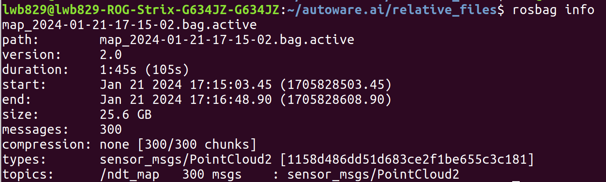

- **按照网上资料：**终端输入如下命令，即可将.bag.active转换成.bag文件

```
rosbag fix map.bag.active result.bag
```

其中rosbag fix map.bag.active为修复的文件，result.bag为要输出的文件。

- **实际上：**在终端输入上述命令，会报错为`IOError: [Errno 2] No such file or directory: '/opt/ros/melodic/share/automotive_navigation_msgs/migration/PointOfInterestRequest.bmr'`。

**但是**，将上述map.bag.active文件按照如下命令转换，依然是**成功的**，且在Autoware Tools下可以显示。


#### 步骤二（包括pcl_viewer的使用）

**将ROS bag转换成pcd**

- 在bag目录下输入命令：


```
rosrun pcl_ros bag _to_pcd map.bag /ndt_map pcd 
```

其中`map.bag`是刚刚生成的新bag，`/ndt_map`是包含的话题信息，`pcd`表示在这个路径下生成一pcd文件夹，其中保存了pcd格式的点云地图

**结果可看到只生成一个`0.000000000.pcd`文件（可重命名），这是因为它把前面的全部覆盖了。**


- 可以通过**pcl_viewer**进行可视化

pcl-viewer是常用得pcl可视化工具。可以在Ubuntu系统下，在终端用sudo命令安装：

```
sudo apt-get install  pcl-tools
```

默认安装路径 `usr/bin`

**该路径下有很多有用的可执行程序：`pcl_png2pcd`、`pcl_ply2obj`、`pcl_pcd2png`、`pcl_pcd2ply`等等**

在pcd文件目录下可视化点云地图，输入命令为

```
pcl_viewer simcity9.pcd

// 设置点的大小(点体积)
pcl_viewer 1.pcd -ps 2
```

- 快捷键：

  - r键：重现视角。如果读入文件没有在主窗口显示，不妨按下键盘的r键一试。

  - j键：截图功能，生成的cam和png文件与pcd文件在同一目录下。其中png为截图图片，cam则可再次打开，**不过初始视角为截图时视角**

    - 打开cam文件 

      ```
       pcl_viewer xxx.pcd -cam  xxx.cam
      ```

  - g键：显示/隐藏坐标轴。

  - 放大缩小： 除了滚动滑轮外，还可以有 Alt +/- (每次更小单位的变大变小)

- 一次性打开两个视图

```
pcl_viewer my1.pcd my2.pcd
```

- pcd文件转为ply文件

```
pcd2ply input.pcd output.ply
```

- 将对齐的点云png和RGB图像合成点云pcd
  - 输入：rgb1.png 和 depth.png
  - 输出：points1.pcd

```
pcl_png2pcd --intensity_type UINT_8 rgb1.png depth1.png points1.pcd
```


如图所示：

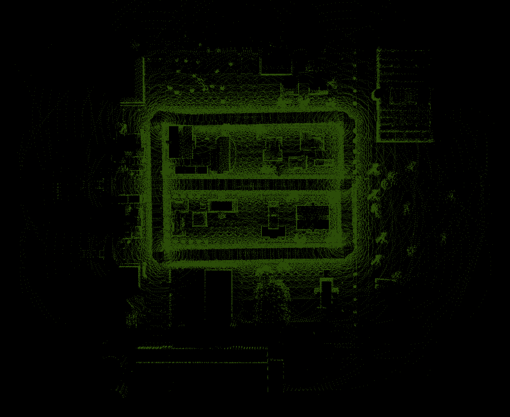


#### Autoware Tools读取pcd文件的bug

如果直接IMPORT我们刚刚这样保存的pcd点云地图，在autoware tools的可视化页面中，点云地图会显示不完整，并且点云也稀疏，无法用来语义标注。就像下图这样：

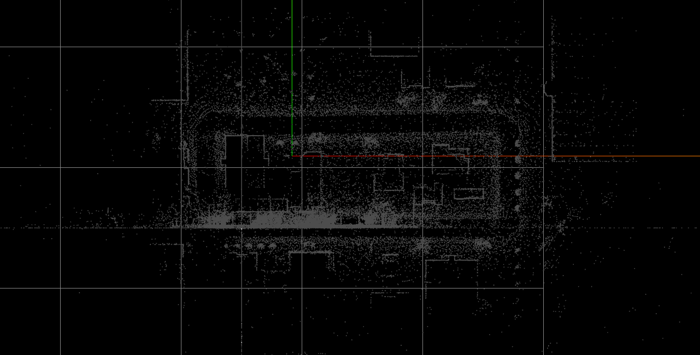

**这是autoware tools的bug，对于刚刚bag_to_pcd保存的pcd点云地图，直接IMPORT，可能出现只显示一半并且不清晰**

- **解决办法：**转一下pcd点云地图的格式，把点云地图转换成ASCII编码的pcd文件

- **具体步骤：**

  - 将讲师提供的`PointCloud_convert`文件夹直接放在主目录下

  - **进入到build目录下，将需要转换格式的pcd文件也放在这个目录下，**接着运行下面指令：（以本项目的simcity9.pcd为例）

    ```
    lwb829@lwb829-ROG-Strix-G634JZ-G634JZ:~/PointCloud_convert/build$ ./TypeConvert simcity9.pcd simcity9_.pcd 0
    ```

    则在build目录中，生成了ASCII格式的pcd文件：simcity9_.pcd

    用上述的pcl_viewer进行查验，发现两个pcd文件可视化效果一样，说明点云没有变化，只是pcd保存的格式变了。

- **验证：**在Autowars Tools下将格式转换后的pcd文件IMPORT，再将语义信息放入，得到图像为如下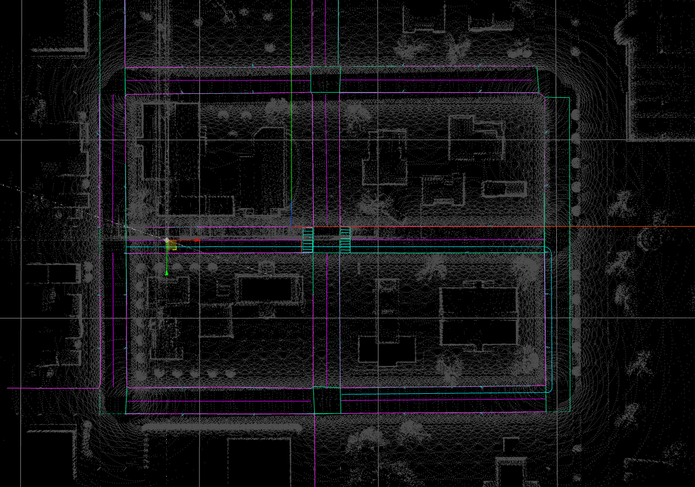

- **补充说明：**

  - PCD文件格式有ASCII和binary两种数据存储类型

    - ASCII形式，每一点占据一个新行

      ```
      p_1
      p_2
      ...
      p_n
      ```


    **注意： 从PCL 1.0.1版本开始，用字符串“nan”表示NaN，此字符表示该点的值不存在或非法等。**
    
    -  二进制binary形式：数据是pcl::PointCloud::points数组或者vector的完整内存复制。在存储上有更大的优势，占据内存小，读取快

  - PointCloud_convert工具用于将ndt_mapping建立好的pcd点云文件数据存储类型进行转换

  将pcd文件放入build目录下，指令为

  ```
   ./TypeConvert file_in.pcd file_out.pcd 0/1/2 
  ```

  说明：0/1/2 分别对应ASCII/binary/binary_compressed，所以前面的命令中最后为0

- ==**总结：**建议养成习惯，将按照bag_to_pcd方式直接保存的pcd地图，统一先换成ASCII格式的pcd文件，以防在少数情况下无法读取的情况==


### 语义信息标注

推荐利用Autoware Tools官网标注https://tools.tier4.jp/

网页版的Autoware Tools使用，需要网络质量比较好，因为要在线加载 体积不算小的 pcd地图，还要增添语义信息。（**如果是非常大的pcd地图，建议在windows下使用网页版去标注，linux没有windows效果好**）

- 在网页版页面中，拉到最下，有两个入口选择：

  - **For Autoware -v1.12（针对vector map的语义标注）**

  - For Autoware -v1.13（针对lanelet2格式的地图）

我们要学习的是生成vector map，所以**选择第一个**

接着在下一个页面点击`Try it`，则正式进入到标注页面**（在Try it页面也能看到针对vector map的语义标注后，生成的结果都是.csv格式的，就像第一章的官方demo演示的，同时在第二章也解析了的my_map.launch中，`vector_map_loader`节点通过加载一系列`.csv`文件来生成高精度地图，原理就是把以csv格式保存的各种语义信息加载出`/vector_map`话题发布出来，显示为高精地图）**

- 两种方式：
  - 对于一个先前完全没有标注过任何语义信息的底层地图，必须利用create新建，然后在右侧project中添加标注的所有语义信息
  - 可以利用File下的import加载已有的地图(pcd文件)和语义信息(csv文件)
    - `ADAS MAP`：就是已经画好的语义信息，即各种.csv文件
    - `Waypoint`：就是路径点，就像官方demo演示中，就是有提前存好一系列路径点（在`data/path/moriyama_path.txt`），然后读取循迹
    - `PCD`：就是pcd点云格式，即我们对一张事先没有标注过的点云地图，要进行语义标注时，就应该选择IMPORT PCD，把我们在chapter2_2中保存好的pcd点云地图，加载进来


**注意：添加语义信息的时候，必须先切换为==3D视角==，然后选中右侧栏中的某一种语义信息，才能在图中进行标注，否则直接在图中操作会没有反应**


#### 实际添加语义信息步骤

1. IMPORT底层pcd点云地图
2. 点击上栏的`Create` -> `Create ADASMap`，根据默认直接Create
3. 选中右栏Project中的各种语义信息，便可以在点云地图中添加各种语义信息
4. 最后保存，EXPORT ADASMap出一系列CSV格式保存的文件，点击Download即可自动保存在“下载”文件夹中
