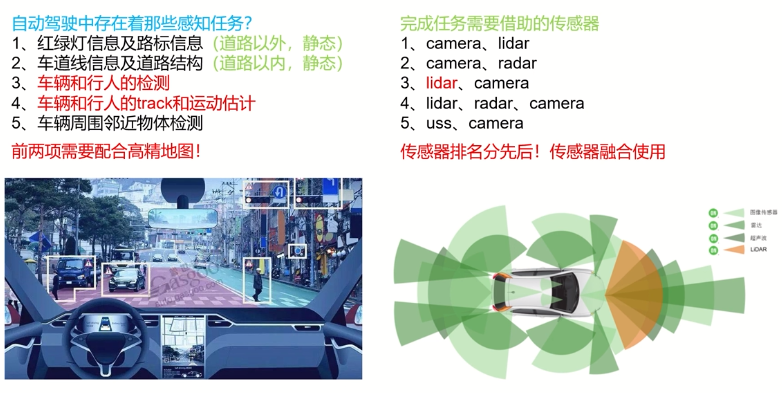
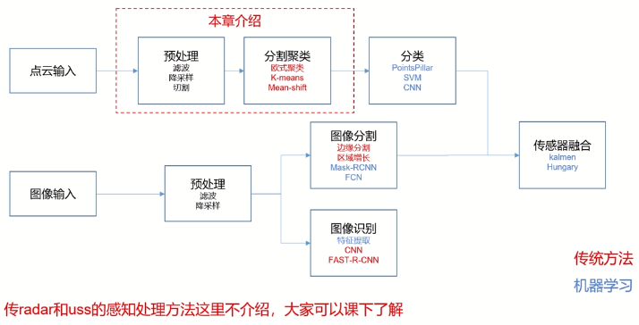

# 感知模块

## 常见感知方法概述

- lidar：激光雷达
- radar：毫米波雷达（对速度比较敏感，所以对动态物体的track、速度感知的时候，都要参考radar，且在此情况下的radar效果好于lidar和相机）
- uss：超声波雷达（倒车雷达）

（本章慕课不涉及机器学习的知识）

传感器融合，指对不同传感器的数据，采取不同权重去综合考虑，在不同情况更相信某种传感器的数据（**一般以安全为主的原则**） 