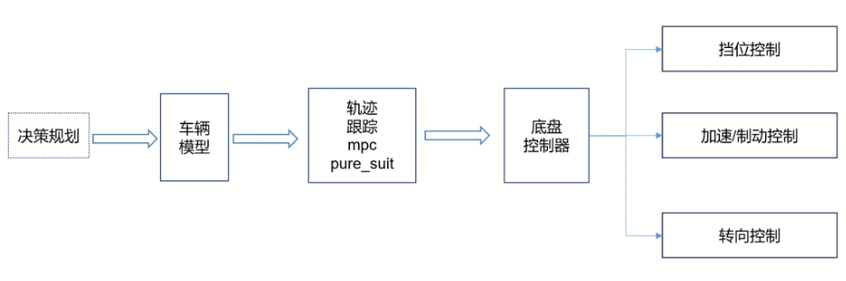
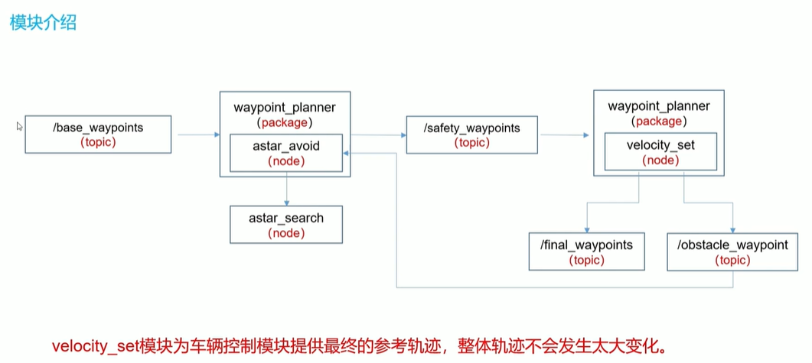
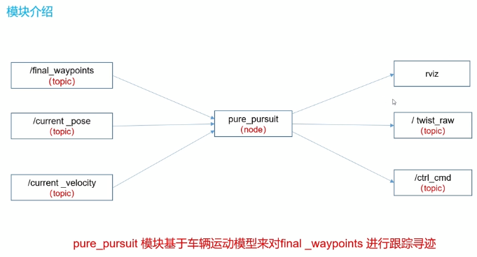
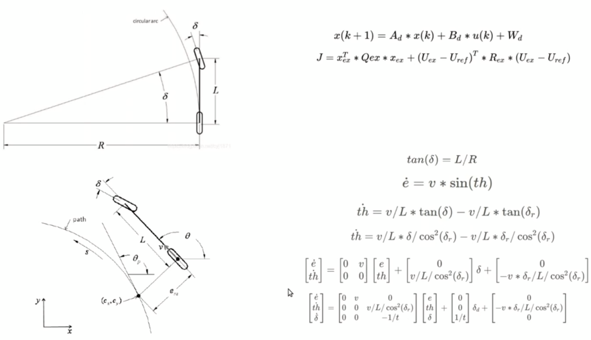
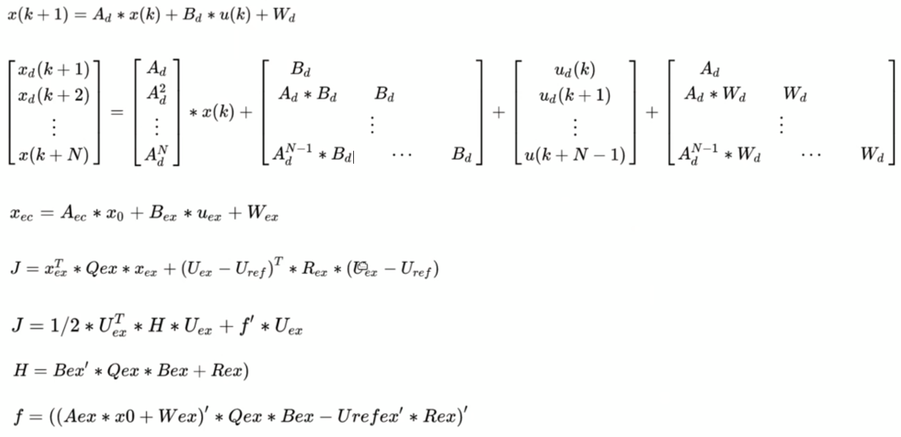
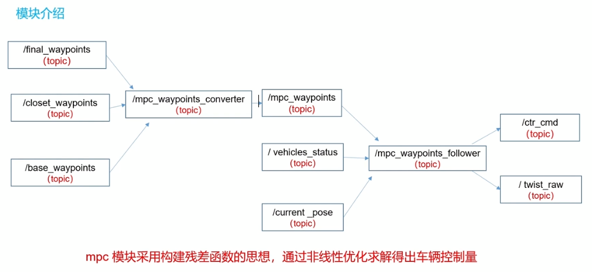

# 控制模块

## 自动驾驶控制算法概述



规划控制的内容主要在于前半截，后半截的底盘控制为另外的领域


## velocity_set模块源码解析及仿真



基本大体上借助于final_waypoints的轨迹，不会有太大的变动


### 源码解析

#### velocity.cpp

路径为：`\src\autoware\core_planning\waypoint_planner\src\velocity_set\velocity_set.cpp`

- 输入

  ```
  // velocity set info subscriber
  ros::Subscriber config_sub = nh.subscribe("config/velocity_set", 1, &VelocitySetInfo::configCallback, &vs_info);
  ros::Subscriber points_sub = nh.subscribe(points_topic, 1, &VelocitySetInfo::pointsCallback, &vs_info);
  ros::Subscriber localizer_sub = nh.subscribe("localizer_pose", 1, &VelocitySetInfo::localizerPoseCallback, &vs_info);
  ros::Subscriber control_pose_sub = nh.subscribe("current_pose", 1, &VelocitySetInfo::controlPoseCallback, &vs_info);
  ros::Subscriber detectionresult_sub = nh.subscribe("/state/stopline_wpidx", 1, &VelocitySetInfo::detectionCallback, &vs_info);
  
  // vector map subscriber
  ros::Subscriber sub_dtlane = nh.subscribe("vector_map_info/cross_walk", 1, &CrossWalk::crossWalkCallback, &crosswalk);
  ros::Subscriber sub_area = nh.subscribe("vector_map_info/area", 1, &CrossWalk::areaCallback, &crosswalk);
  ros::Subscriber sub_line = nh.subscribe("vector_map_info/line", 1, &CrossWalk::lineCallback, &crosswalk);
  ros::Subscriber sub_point = nh.subscribe("vector_map_info/point", 1, &CrossWalk::pointCallback, &crosswalk);
  ```

- 输出

  ```
  // publisher
  ros::Publisher detection_range_pub = nh.advertise<visualization_msgs::MarkerArray>("detection_range", 1);
  ros::Publisher obstacle_pub = nh.advertise<visualization_msgs::Marker>("obstacle", 1);
  ros::Publisher obstacle_waypoint_pub = nh.advertise<std_msgs::Int32>("obstacle_waypoint", 1, true);
  ros::Publisher stopline_waypoint_pub = nh.advertise<std_msgs::Int32>("stopline_waypoint", 1, true);
  
  ros::Publisher final_waypoints_pub;
  final_waypoints_pub = nh.advertise<autoware_msgs::Lane>("final_waypoints", 1, true);
  ```

  - final_waypoints为从closed waypoint往后延一定的size的waypoints

  - final_waypoints和safety_waypoints的区别是，虽然都从closed waypoint处开始，但是final_waypoints的长度不超过TemporalWaypointsSize

```
EControl detection_result = obstacleDetection(closest_waypoint, vs_path.getPrevWaypoints(), crosswalk, vs_info,detection_range_pub, obstacle_pub, &obstacle_waypoint);
```

跳转到以下函数


##### ObstacleDetection函数

该函数用于进行障碍物检测

```
EControl detection_result = pointsDetection(vs_info.getPoints(), closest_waypoint,lane,crosswalk,vs_info,obstacle_waypoint,&obstacle_points);
displayDetectionRange(lane,crosswalk,closest_waypoint,detection_result,*obstacle_waypoint,vs_info.getStopRange(),vs_info.getDecelerationRange(), detection_range_pub);
```

display即用于进行可视化


##### 再跳转到pointsDetection函数

```
EControl pointsDetection(const pcl::PointCloud<pcl::PointXYZ>& points, const int closest_waypoint,const autoware_msgs::Lane& lane, const CrossWalk& crosswalk, const VelocitySetInfo& vs_info,int* obstacle_waypoint, ObstaclePoints* obstacle_points)
```

输入为points，即为point lane，去掉地面之后的点

有没有去掉障碍物是通过点云反射来知道的，因为地面不算做障碍物，所以要把障碍物去掉


##### 再跳转到detectStopObstacle函数

```
int detectStopObstacle(const pcl::PointCloud<pcl::PointXYZ>& points, const int closest_waypoint,const autoware_msgs::Lane& lane, const CrossWalk& crosswalk, double stop_range,double points_threshold, const geometry_msgs::PoseStamped& localizer_pose,ObstaclePoints* obstacle_points, EObstacleType* obstacle_type,const int wpidx_detection_result_by_other_nodes)
```

-   从closest_waypoint开始，在设定好的范围内开始搜索

```
for (int i = closest_waypoint; i < closest_waypoint + STOP_SEARCH_DISTANCE; i++)
{
}
```

之后就进行正常的检查

- 将waypoints转换到lidar坐标系下

```
geometry_msgs::Point waypoint = calcRelativeCoordinate(lane.waypoints[i].pose.pose.position, localizer_pose.pose);
tf::Vector3 tf_waypoint = point2vector(waypoint);
tf_waypoint.setZ(0);
```


## pure_pursuit模块源码解析及仿真

**[算法原理](../车辆控制/基于几何的车辆横向控制学习笔记.md)**



- 首先对于车辆来说，在打方向盘后车辆会行驶出一条圆弧，这是车辆的运动学模型，如上图所示，在转向轮的角度为$\theta$、前后轮距为$l$时，可以确定转弯半径$R=\frac{l}{tan\theta}$，打死方向盘时会有最小转弯半径
- 对于纯跟踪控制而言，需要控制车辆从当前位置cur_pose到给定的轨迹点goal。抛开goal在车辆的前进方向上的可能性（该情况对应圆弧半径∞），车需要打方向盘至一定角度才能经过点goal。**所以纯跟踪控制的目的与输出为，确定方向盘打多少角度$\theta$**。


- 输入

  ```
  sub1_ = nh_.subscribe("final_waypoints", 10,
  &PurePursuitNode::callbackFromWayPoints, this);
  sub2_ = nh_.subscribe("current_pose", 10,
  &PurePursuitNode::callbackFromCurrentPose, this);
  sub3_ = nh_.subscribe("config/waypoint_follower", 10,
  &PurePursuitNode::callbackFromConfig, this);
  sub4_ = nh_.subscribe("current_velocity", 10,
  &PurePursuitNode::callbackFromCurrentVelocity, this);
  ```

  包含了由规划模块输出的waypoints，以及当前车辆的位置current_pose与速度current_velocity

- 输出

  ```
  pub1_ = nh_.advertise<geometry_msgs::TwistStamped>("twist_raw", 10);
  pub2_ = nh_.advertise<autoware_msgs::ControlCommandStamped>("ctrl_raw", 10);
  pub3_ = nh_.advertise<tablet_socket_msgs::gear_cmd>("gear_cmd", 0);
  ```
  
  为控制信号ctrl_cmd，包括车辆的线速度、线加速度与转向角；twist_raw应该是用于仿真中车辆的控制
  
  剩下均为一些可视化的内容
  
  ```
  pub11_ = nh_.advertise<visualization_msgs::Marker>("next_waypoint_mark", 0);
  pub12_ = nh_.advertise<visualization_msgs::Marker>("next_target_mark", 0);
  pub13_ = nh_.advertise<visualization_msgs::Marker>("search_circle_mark", 0);
  // debug tool
  pub14_ = nh_.advertise<visualization_msgs::Marker>("line_point_mark", 0);
  pub15_ =
  nh_.advertise<visualization_msgs::Marker>("trajectory_circle_mark", 0);
  pub16_ = nh_.advertise<std_msgs::Float32>("angular_gravity", 0);
  pub17_ = nh_.advertise<std_msgs::Float32>("deviation_of_current_position", 0);
  pub18_ =
  nh_.advertise<visualization_msgs::Marker>("expanded_waypoints_mark", 0);
  ```


### 源码解析

#### 主函数`PurePursuitNode`

- 定义了pp_为实例化的类

  ```
  pp_.setLookaheadDistance(computeLookaheadDistance());
  pp_.setMinimumLookaheadDistance(minimum_lookahead_distance_);
  ```

  - `setLookaheadDistance` 函数定义了前视距离，同时也设定了一个最小的前视距离`setMinimumLookaheadDistance`

- 判断能否获取曲率的标志位，是否能够获得曲率，作为后面速度输出的重要判据，同时获取曲率

  ```
  bool can_get_curvature = pp_.canGetCurvature(&kappa);
  ```

  `canGetCurvature`是主要函数，主要目的是检查能否返回曲率值，即说明车辆可以正常控制

- 总结

  - 首先接收必要的订阅信息，并设置要跟踪的点的长度ld，这个值过小会导致车辆震荡（类似于直线行驶时不停左右拐）

  - 在规划的轨迹上找到距离当前位置超过ld的第一个waypoint**(函数名为getNextWaypoint，但不是获取距离当前位置最近的点)**，如果找不到，说明当前轨迹已经快到头了，则不控制

  - 若能找到，又计算了一遍当前位置到轨迹上所有点的距离，确保存在距离超过最小ld距离的点**（个人感觉这边没必要，如果能执行到这，说明有存在超过ld的点，那么必然存在超过最小ld的点）**

  - 接下来计算$\theta$值，分两种情况
    - 不进行插值，直接用上述搜索到的超过ld的第一个waypoint作为目标点，虽然与设定的参数距离有出入，但可接受
    - 进行插值，对超过ld的第一个waypoint与其邻接的一个点计算一条直线方程，再以current_pose为圆心，ld为半径求交点，将该交点作为目标点


## mpc模块源码解析及仿真

**[控制原理](../车辆控制算法/MPC控制学习笔记.md)**     该算法的可靠性更高！









### 源码解析

路径为：`src\autoware\core_planning\mpc_follower\src\mpc_waypoints_converter.cpp`

- 输入输出

  ```
  pub_waypoints_ = nh_.advertise<autoware_msgs::Lane>("/mpc_waypoints", 1);
  sub_closest_waypoint_ = nh_.subscribe("/closest_waypoint", 1, &MPCWaypointsConverter::callbackClosestWaypoints, this);
  sub_base_waypoints_ = nh_.subscribe("/base_waypoints", 1, &MPCWaypointsConverter::callbackBaseWaypoints, this);
  sub_final_waypoints_ = nh_.subscribe("/final_waypoints", 1, &MPCWaypointsConverter::callbackFinalWaypoints, this);
  ```

  用来发布局部路径信息


- 输入的参考轨迹首先进入mpc_waypoints_converter，重算closet_waypoints(这是由于发布轨迹并不是连续实时的，接收时closet_waypoints可能已经改变)，并截取closet_waypoints前后一段的局部轨迹发布给mpc核心算法使用

  ```
  int base_start = std::max(closest_idx - back_waypoints_num_, 0);
  for (int i = base_start; i < closest_idx; ++i)
  {
      mpc_waypoints.waypoints.push_back(base_waypoints_.waypoints.at(i));
      mpc_waypoints.waypoints.back().twist = final_waypoints.waypoints[1].twist;
  }
  
  int final_end = std::min(front_waypoints_num_ + 1, (int)final_waypoints.waypoints.size());
  for (int i = 1; i < final_end; ++i)
  {
  	mpc_waypoints.waypoints.push_back(final_waypoints.waypoints.at(i));
  }
  ```

  - mpc_waypoints将被用于真正mpc控制的参考轨迹，同时还需要输入车辆当前的位姿与速度
  - 输出为控制量

跳转到`mpc_follower_core.cpp`


#### 主要函数`calculateMPC`

- 首先获取MPC配置，包括前向预测的状态次数N；采样时间DT；状态量、输入与输出的维度DIM_X、DIM_U、DIM_Y**（这三项数值根据模型不同而不同，在autoware中默认使用kinematics，数值分别为3，1，2，通过构造函数初始化写死）**

  ```
  const int N = mpc_param_.prediction_horizon;
  const double DT = mpc_param_.prediction_sampling_time;
  const int DIM_X = vehicle_model_ptr_->getDimX();  
  const int DIM_U = vehicle_model_ptr_->getDimU();  
  const int DIM_Y = vehicle_model_ptr_->getDimY();   
  
  // autoware中定义车辆运动学模型
  pnh_.param("vehicle_model_type", vehicle_model_type_, std::string("kinematics"));
  if (vehicle_model_type_ == "kinematics")
  {
      double steer_tau;
      pnh_.param("vehicle_model_steer_tau", steer_tau, double(0.1));
  
      vehicle_model_ptr_ = std::make_shared<KinematicsBicycleModel>(wheelbase_, amathutils::deg2rad(steer_lim_deg_), steer_tau);
      ROS_INFO("[MPC] set vehicle_model = kinematics");
  }
  
  // 查看对应的模型的状态量维度
  KinematicsBicycleModel::KinematicsBicycleModel(const double &wheelbase, const double &steer_lim, const double &steer_tau)
      : VehicleModelInterface(/* dim_x */ 3, /* dim_u */ 1, /* dim_y */ 2)
  {
      wheelbase_ = wheelbase;
      steer_lim_ = steer_lim;
      steer_tau_ = steer_tau;
  };
  ```

- 其次为MPC指定初始状态x0，具体做法步骤为：

  - 根据传感器获得的车辆当前位姿，确定参考轨迹上距离当前位姿最近的一个点calcNearestPoseInterp：

    - 计算轨迹点中距离当前位姿最近的点p1
    - 在p1前后确定距离当前位姿第二近的点p2
    - 通过p1、p2插值得到p_nearest，并记录该点对应的时间

  - 根据当前位姿与最近点p_nearest的位姿作差，转换到frenet坐标系下，作为误差的初始状态x0，在kinematics模型下，三个状态量分别为：横向距离误差、朝向角误差与当前的方向盘(车轮)角

    ```
    const double err_x = vehicle_status_.pose.position.x - nearest_pose.position.x;
    const double err_y = vehicle_status_.pose.position.y - nearest_pose.position.y;
    const double sp_yaw = tf2::getYaw(nearest_pose.orientation);
    const double err_lat = -sin(sp_yaw) * err_x + cos(sp_yaw) * err_y;
    
    /* get steering angle */
    const double steer = vehicle_status_.tire_angle_rad;
    
    if (vehicle_model_type_ == "kinematics")
    {
    	x0 << err_lat, yaw_err, steer;
    }
    ```

- 指定MPC的起止时间，从参考轨迹最近邻点p_nearest对应的时间开始，加上需要预测的N个离散化时间N*DT，以及控制周期ctrl_period，以及延迟补偿时间。在这里对延迟补偿进行说明：

  - 延迟补偿的目的，控制信号发布有延迟，如果以当前x0为初始状态开始计算，发布控制信号时实际车辆的初始状态并不为x0，这受到之前发布的控制信号的影响，因此需要根据之前控制信号对x0做一个变化预测，以尽可能估计发布时的初始状态，这就是延迟补偿
  - 延迟补偿的实现方式，通过设置一个固定大小的双端队列input_buffer，把每次计算的MPC控制量存在这里(push_back and pop_front)，在正式的MPC开始前，通过input_buffer里的控制量与状态转移方程计算x0的变化x0->x_curr，将重新估计的x_curr作为MPC的输入初始状态

- 接下里就是进行N次前向预测，构建矩阵，转化成优化器可以求解的形式，在autoware中使用qp求解器求解，并把控制量放入到input_buffer中，用于下次MPC的补偿

  ```
  /////////////// generate mpc matrix  ///////////////
  /*
     * predict equation: Xec = Aex * x0 + Bex * Uex + Wex
     * cost function: J = Xex' * Qex * Xex + (Uex - Uref)' * Rex * (Uex - Urefex)
     * Qex = diag([Q,Q,...]), Rex = diag([R,R,...])
     */
  Eigen::MatrixXd Aex = Eigen::MatrixXd::Zero(DIM_X * N, DIM_X);     // 状态转移矩阵
  Eigen::MatrixXd Bex = Eigen::MatrixXd::Zero(DIM_X * N, DIM_U * N); // 输入矩阵
  Eigen::MatrixXd Wex = Eigen::MatrixXd::Zero(DIM_X * N, 1);         // 噪声
  Eigen::MatrixXd Cex = Eigen::MatrixXd::Zero(DIM_Y * N, DIM_X * N); //
  Eigen::MatrixXd Qex = Eigen::MatrixXd::Zero(DIM_Y * N, DIM_Y * N); // 状态量权重，一般为对称阵
  Eigen::MatrixXd Rex = Eigen::MatrixXd::Zero(DIM_U * N, DIM_U * N); // 输入量权重，一般为对称阵
  Eigen::MatrixXd Urefex = Eigen::MatrixXd::Zero(DIM_U * N, 1);      // 输入量参考
  ```

  - 在参考轨迹上根据MPC预测的时间采样轨迹点，获得N个轨迹点对应的速度与曲率

    ```
    MPCTrajectory mpc_resampled_ref_traj;
    if (!MPCUtils::interp1dMPCTraj(ref_traj_.relative_time, ref_traj_, mpc_time_v, mpc_resampled_ref_traj))
    {
    	ROS_WARN("[MPC] calculateMPC: mpc resample error, stop mpc calculation. check code!");
    	return false;
    }
    ```

  - 计算N个MPC时间对应的状态转移方程（各矩阵会根据车辆速度、运动曲率有所不同），**计算矩阵的函数根据模型不同进行了重载，分别在vehicle_model_bicycle_dynamics/kinematics/kinematics_no_delay.cpp**中

    ```
    for (int i = 0; i < N; ++i)
    {
        const double ref_k = mpc_resampled_ref_traj.k[i];
        const double ref_vx = mpc_resampled_ref_traj.vx[i];
        const double ref_vx_squared = ref_vx * ref_vx;
    
        /* get discrete state matrix A, B, C, W */
        vehicle_model_ptr_->setVelocity(ref_vx);
        vehicle_model_ptr_->setCurvature(ref_k);
        vehicle_model_ptr_->calculateDiscreteMatrix(Ad, Bd, Cd, Wd, DT);
        
        ...
    }
    ```

  - 参考输入的计算，对于kinematics模型，就是pure_pursuit中的方向盘角度输入作为参考，相当于先验

    ```
    vehicle_model_ptr_->calculateReferenceInput(Uref);
    
    void KinematicsBicycleModel::calculateReferenceInput(Eigen::MatrixXd &Uref)
    {
        Uref(0, 0) = std::atan(wheelbase_ * curvature_);    // wheelbase: 车轴距
    }
    ```

  - 至此，所有矩阵构建完毕，开始优化求解，autoware的qp优化求解是二次型求解，第一节理论中已说明


