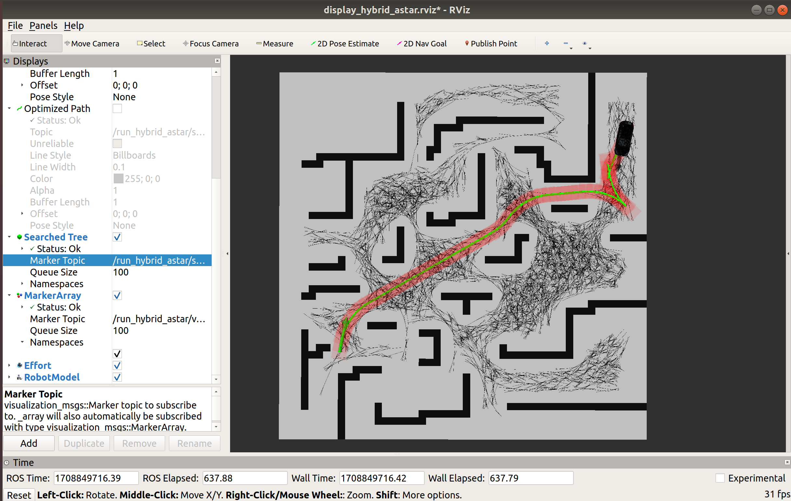

# Hybrid A Star

## 前言

[源码地址](https://github.com/zm0612/Hybrid_A_Star)

以下为仿真过程

<video src="../../imgs/hybrid_Astar-2024-02-25_16.38.19.mp4"></video>


### 搜索树展示

在`hybrid_a_star_flow.cpp`中发布了三个话题，分别为：**规划轨迹、加上车宽的轨迹、搜索树（所有遍历过的点）**



- 绿色路径是规划的路径 `/searched_path` ，红色路径是加上车宽的路径`/vehicle_path`，黑色细线是搜索树`/searched_tree`


## 功能包编译所需环境

(1). **C++11 or C++0x Compiler**

(2). **ROS Melodic**: I'm developing on the melodic version. Using other versions of ROS, it should also work normally

```shell
sudo apt-get install ros-melodic-costmap-*
sudo apt-get install ros-melodic-map-server
sudo apt-get install ros-melodic-tf
```

(3). **Eigen 3**

```shell
sudo apt-get install libeigen3-dev
```

(4).  **glog**

```shell
sudo apt-get install libgoogle-glog-dev
```


## 仿真环境搭建

```shell
# new folder
mkdir hybrid_a_star_ws/src -p
cd hybrid_a_star_ws/src

# Clone the repository
git clone https://github.com/zm0612/Hybrid_A_Star.git

# Build
cd hybrid_a_star_ws
catkin_make
```


## 仿真运行

```shell
source devel/setup.bash
roslaunch hybrid_a_star run_hybrid_a_star.launch
```

**The starting point is selected by the `2D Pose Estimate` in rviz, and the end point is selected by the `2D Nav Goal`.**

> I provide multiple maps, you just need to modify the variable image in `hybrid_a_star/maps/map.yaml` file.

> If your start and end points are too close to obstacles, the collision detection mechanism may be triggered and no feasible paths will be searched and displayed


## 参考

(1). [Practical Search Techniques in Path Planning for Autonomous Driving](https://ai.stanford.edu/~ddolgov/papers/dolgov_gpp_stair08.pdf)

(2). [The Bresenham Line-Drawing Algorithm](https://www.cs.helsinki.fi/group/goa/mallinnus/lines/bresenh.html)

(3). [A simple car](http://planning.cs.uiuc.edu/node658.html)
