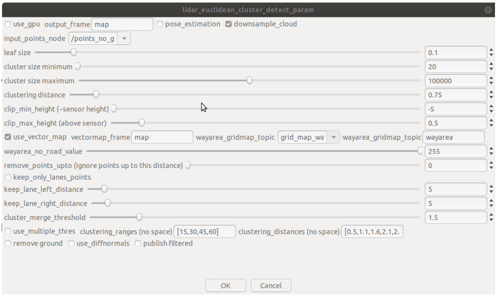
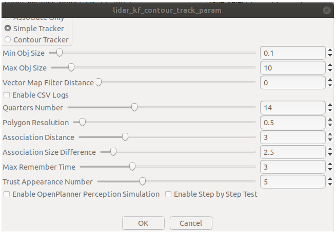
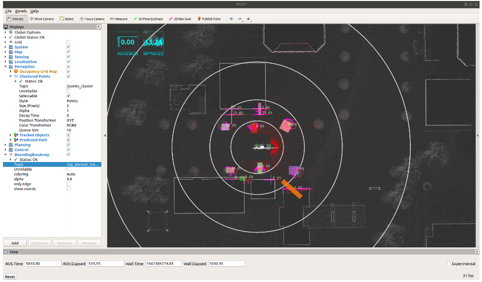
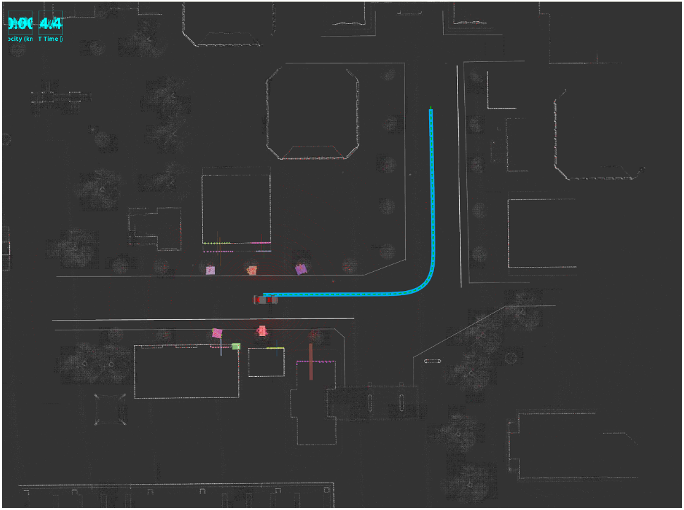
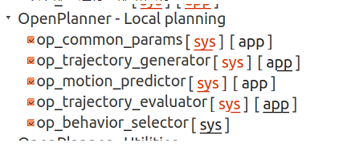

# 在Autoware中使用openPlanner进行路径规划

- 参考资料：[Autoware中openplanner路径规划与避障_](https://blog.csdn.net/weixin_45168199/article/details/123314131?ops_request_misc=&request_id=&biz_id=102&utm_term=autoware的openplanner报错Error: P&utm_medium=distribute.pc_search_result.none-task-blog-2~all~sobaiduweb~default-0-123314131.142^v46^pc_rank_34_1&spm=1018.2226.3001.4187)

## 介绍

- 基于点云地图与矢量地图，根据之前已经记录下的路径点轨迹，在仿真环境中完成循迹
- 局部路径的规划使用 openPlanner 进行

**但目前好像无法直接使用加载进的全局路径，还是只能在 Rviz 中设定终点，使用 global_openPlanner 进行规划全局轨迹**

## 配置

### 1. 加载地图、传感器、进行定位

同之前[在Autoware中使用Astar进行路径规划仿真](使用Astar路径规划仿真.md)一样，需要加载地图、传感器，阱行点云预处理，使用ndt_matching进行定位，发布当前位置与速度

**注意：需要把点云地图和矢量地图都加载进来，因为 openPlanner 依赖于矢量地图，并且需要对 `world->map` 的 tf 关系进行配置，也就是加载 tf 文件**

在runtime_manager界面，

1. 在`Map -> Point Cloud`加载pcd地图，`Map -> Vector Map`加载vector map

   `Map -> TF`加载tf.launch（**主要是tf2发布world和map的关系**）

2. 加载传感器：先在`Sensing->Drivers-> LIDARS->Velodyne VLP-16`的配置文件中选择雷达的配置，path 为`/home/kang/autoware-1.13/src/autoware/utilities/autoware_launcher/plugins/driver/lidar/vlp16.yaml`， 然后勾选雷达。（**本电脑对加载vlp16.yaml报错，但不影响后续操作，所以这一步未必需要**）

3. 对激光雷达生成的点云进行降采样和预处理：

   - 勾选 `Points Downsampler->voxel_grid_filter`，注意在其 `app` 中选择话题为 `/points_raw` 
   - 勾选 `Points Preprocessor->ray_ground_filter` ， 注意在其 `app` 中选择话题为 `/points_raw`

4. 使用 ndt_matching 进行点云匹配定位：勾选 `Computing -> Localization -> lidar_localizer -> ndt_matching` 。此时 RViz 中可以接收到话题 `\points_raw` 的数据，可以显示出传感器的扫描结果。

5. 勾选`Localizer -> autoware_connector -> vel_pose_connect`节点（**不要遗漏这一步**）

### 2. 欧式聚类 + 卡尔曼滤波

参考资料：

1. [使用激光雷达进行目标检测](https://blog.csdn.net/m0_45388819/article/details/108702416?ops_request_misc=&request_id=&biz_id=102&utm_term=autoware%20lidar%20euclidean%20culst&utm_medium=distribute.pc_search_result.none-task-blog-2~all~sobaiduweb~default-0-108702416.142%5Ev46%5Epc_rank_34_1&spm=1018.2226.3001.4187)
2. [激光雷达目标检测与跟踪](https://blog.csdn.net/m0_57579469/article/details/122159235)

#### 欧式聚类

首先使用 `Detection -> lidar_detector -> lidar_euclidean_cluster_detect` 进行障碍物聚类识别，即对非地面点进行聚类。其配置如下：

**注意：如果使用的不是autoawre原版源码，而是使用的实验室的autoawre.gf版本的代码，那欧式聚类中关于参考系选择部分的源码已经修改了，如上图的app中，`output frame`必须写map，这样后面的卡尔曼滤波模块才能正常运行**

- 此时在rviz中会出现一团团点云簇

#### 卡尔曼滤波追踪

然后，勾选`Detection -> lidar_detector -> lidar_tracker -> lidar_kf_contour_track`，进行对目标的跟踪

- `lidar_euclidean_cluster_detect`节点发布的话题是`/detection/lidar_detector/cloud_clusters`，但`lidar_kf_contour_track` 节点源码中订阅的话题为`/cloud_clusters`，所以需要将其更改为`/detection/lidar_detector/cloud_clusters`，然后重新编译一下。

节点配置如下：

- **Vector Map Filter Distance 需要设置为0**，还不太清楚其具体含义，但如果设置得太大会导致追踪失败。
- **这里一定不要勾选 `Enable OpenPlanner Perception Simulation` **，因为现在是在 gazebo 环境中进行测试，而不是在 autoware 提供的 openPlanner Simulator 中进行测试！

**勾选后，在 Rviz 中，Add `BoundingBoxArray`选项，然后topic选择 /op_planner_tracked_boxes 话题的消息后，便能用更彩色鲜艳的box去可视化这些检测到的障碍物**

### 3. 使用op_global_planner规划全局路径

在 Rviz 中使用 `2D Nav Goal` 设定终点目标，注意一定要选取到矢量图中 lane 的附近。

### 4. 使用openPlanner进行局部路径规划

勾选以下部分进行局部路径规划：

### 5. 启用控制进行跟踪

主要使用 `pure_pursuit` 和 `twist_filter` 进行跟踪控制