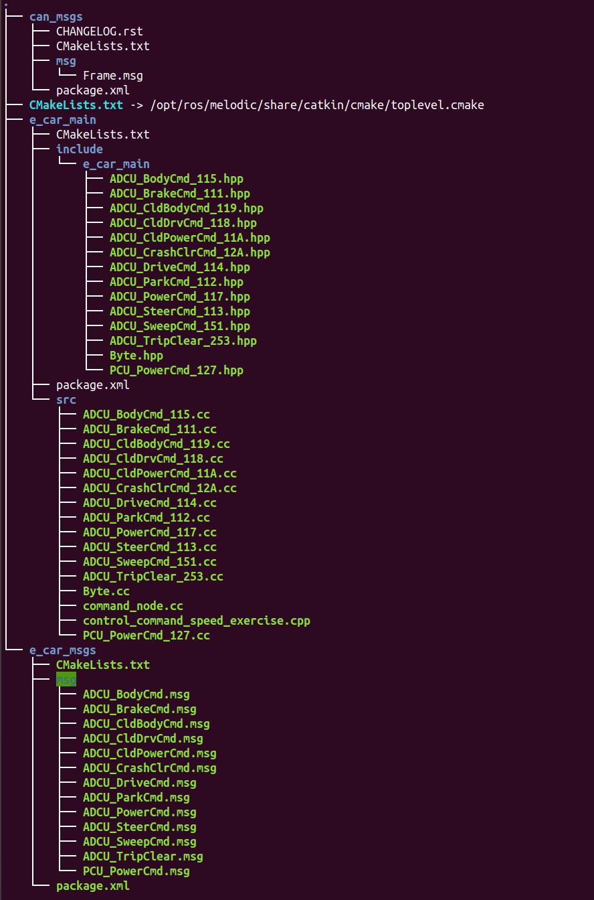
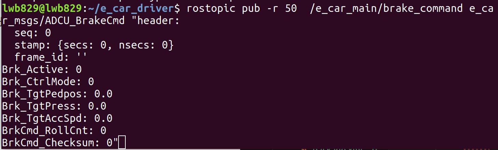
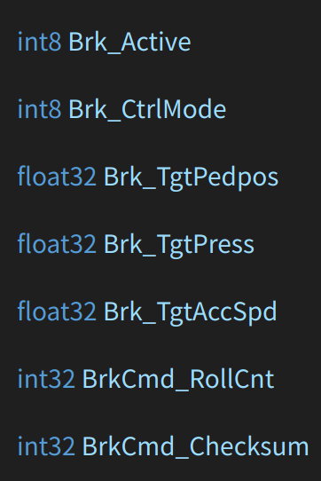
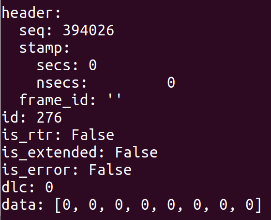
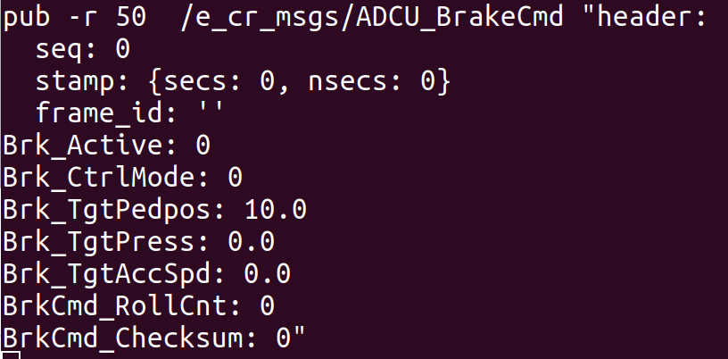
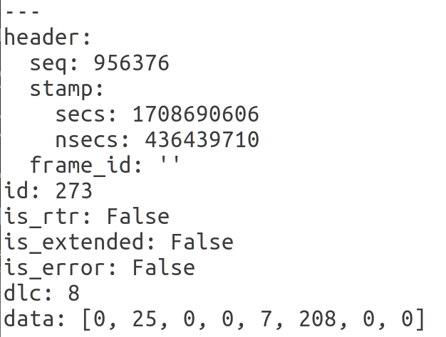
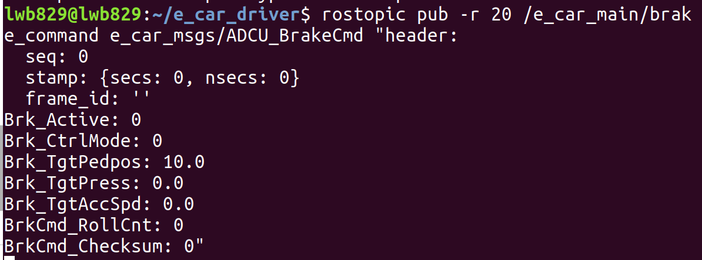
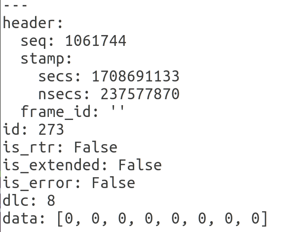
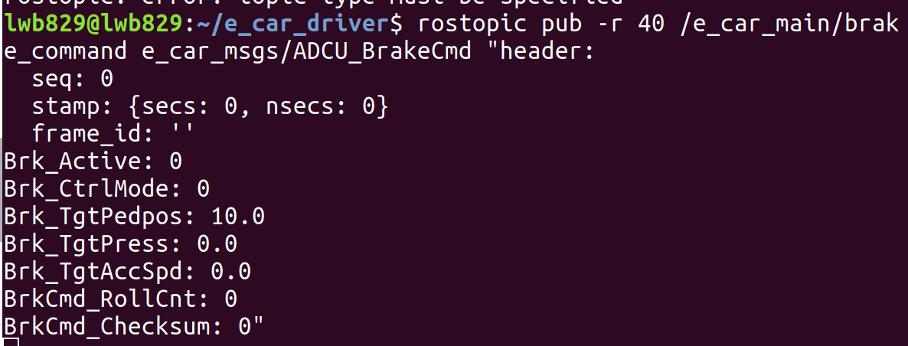

# CAN通信测试

以下过程为车辆CAN通信的command node节点运行测试，主要是查看数据流是否流通（手动给输入能否得到输出）


## 工作空间

首先在主目录下创建了名称为`e_car_driver`的工作空间，以下为`e_car_driver/src`下的所有文件



通过`catkin_make`指令在`e_car_driver`路径下编译，编译成功后进行测试


## 测试过程

### 1.启动roscore

### 2.另起一个终端，设置终端环境变量（==每另起一个终端，都需要进行环境变量设置，后面步骤就省略描述==）

```
lwb829@lwb829:~/e_car_driver$ source devel/setup.bash 
```

### 3.在同一终端中，运行command node节点

```
lwb829@lwb829:~/e_car_driver$ rosrun e_car_main e_car_main_command_node
```

此处通过Tab补全得到后面的e_car_main_command_node，其中**后面的`_command_node` 为CMakeLists.txt文件中可执行文件的project_name**

```cmake
add_executable(${PROJECT_NAME}_command_node 
src/ADCU_BrakeCmd_111.cc
src/ADCU_SteerCmd_113.cc
src/ADCU_ParkCmd_112.cc
src/ADCU_BodyCmd_115.cc
src/ADCU_DriveCmd_114.cc
src/ADCU_PowerCmd_117.cc
src/ADCU_CldDrvCmd_118.cc
src/ADCU_CldBodyCmd_119.cc
src/ADCU_CldPowerCmd_11A.cc
src/ADCU_CrashClrCmd_12A.cc
src/ADCU_TripClear_253.cc
src/PCU_PowerCmd_127.cc
src/ADCU_SweepCmd_151.cc
src/Byte.cc
src/command_node.cc
)
```


### 4.另起一个终端，测试节点中的每个主题（此处以brake_command为例）

```
lwb829@lwb829:~/e_car_driver$ rostopic pub -r 50 /e_car_main/brake_command e_car_msgs/ADCU_BrakeCmd "header:
```

得到输出如下：



可以看到，这里与`e_car_nsgs/msg/ADCU_BrakeCmd.msg`文件下的内容相对应



可以看到，这里的每个输入均为0


### 5.另起一个终端，查看输出消息流

在`command_node`代码文件编译中，可以得知输出消息主题为`/sent_messages`：

```c++
pub_can = nh.advertise<can_msgs::Frame>("/sent_messages", 10, true);
```

故通过如下命令查阅消息

```
lwb829@lwb829:~/e_car_driver$ rostopic echo /sent_messages
```

此时，会发现该终端中不断显示消息内容，其内容基本为如下形式：



这与`can_msgs/msg/Frame.msg`中的形式相同

但我们同时可以发现，这里面的data数据均为0，这是因为前面的输入也均为0


### 6.更改消息流输入，测试输出

更改消息流输入，此处示例将`Brk_TgtPedpos`由0.0更改为10.0



此时再查阅输出消息流，并保存为一个txt文件

```
lwb829@lwb829:~/e_car_driver$ rostopic echo /sent_messages > 1.txt
```

该`1.txt`文件自动保存在`e_car_driver`目录下，我们可以发现一处有了变动



其中：

- `id:273` 表明对应`ADCU_BrakeCmd`报文消息，这是因为`ADCU_BrakeCmd` 的ID为111，**此111为十六进制数，转化为十进制数为273**，从而对应上

- `data: [0, 25, 0, 0, 7, 208, 0, 0]`表明**输出由原来的全为0变成现在的不全为0，说明消息流的输入和输出相通**


### 7.成功验证消息流通


## 问题解答

### 问题一：为什么第四步中设置频率为50？设置成其它的行不行？

在第4步中，我们使用的命令行为：

```
lwb829@lwb829:~/e_car_driver$ rostopic pub -r 50 /e_car_main/brake_command e_car_msgs/ADCU_BrakeCmd "header:
```

这是因为在`comman_node.cc`文件中，有一个`timer_callback`函数，关于brake的部分为：

```c++
int t_nsec = 0;
t_nsec = can_brake.header.stamp.toNSec();
brake_prev_t = t_nsec;
now = ros::Time::now().toNSec();
//以上为变量now和brake_prev_t的设置过程，只截取了最后的关键部分

if(now - brake_prev_t>30000000)
    {
        for (uint i = 0; i < 8; i++)
        {
            can_brake.id = brake_command.ID;
            can_brake.data[i] = 0;
        }
        pub_can.publish(can_brake);
    }
    else
    {
        pub_can.publish(can_brake);
    }
```

这里的30000000纳秒(ns)=0.03秒(s)，频率为$1/0.03 \approx 33.3$ 次/秒，即**==如果距离上一次发布消息已经过去了至少0.03s，就要发布一次新消息，也就是说发布消息的频率应该大于等于33.3==；如果距离上一次发布消息时间不足0.03s，就直接发布上一次处理过的CAN消息**

- **实验验证**

  1. 此处设置消息输入频率为20次/秒

  

  得到结果如下图所示，可看到`id:273` 的data数据全为0

  

  2. 此处设置消息输入频率为40次/秒
  
  
  
  得到结果如下图所示，可看到`id:273` 的data数据与上述50次/秒的相同

从而说明只要消息输入频率大于33.3次/秒即可


