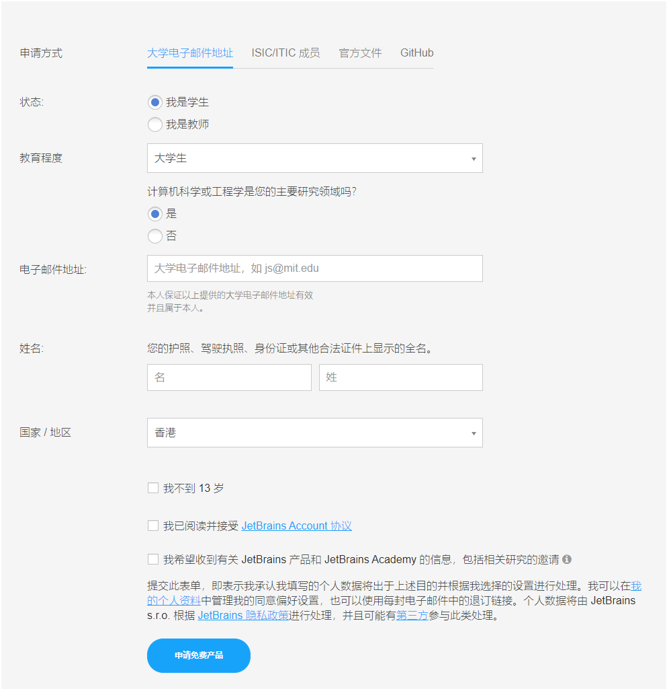
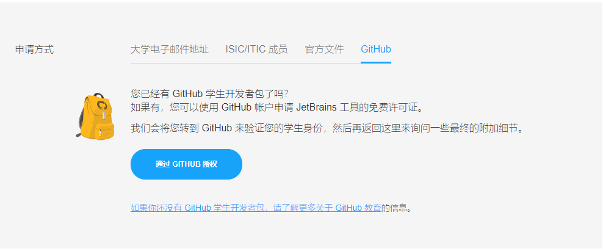

# JetBrains和Github的学生（教育）认证

**正确的步骤是：先开通Github学生认证，再开通JetBrains学生认证**

+ Github学生认证好像没有明确的一年必须再申请一次的要求，但JetBrains有！

+ 先将教育邮箱设为Github的第一邮箱，然后完成Github的学生认证。

  再将Github账户中的教育邮箱信息全部移除，再进入到JetBrains的验证，使用第四种通过Github.

## 一、JetBrains学生认证

JetBrains系的软件（主要是Pycharm、IDEA），professional版本相较于community版本，无论是界面，还是功能，都丰富不少。在校大学生可以依靠学信网认证完成教育认证，这并不困难，但需要注意几个地方。

申请链接：[https://www.jetbrains.com.cn/community/education/#students/](https://www.jetbrains.com.cn/community/education/#students/)

进入上面链接后，下拉找到"apply immerdiately"，点击进入后，可以看到如下图

+ 第一种方法 “大学电子邮件地址” 是最方便的，只需要.edu.cn结尾的学校邮箱即可。

  但这种方式由于被滥用，而且因为一些学校被制裁的原因，这种方式已经不再 容易通过。

+ 第三种方式 “官方文件”，基本是没有问题，只是需要一两周时间的人工审核时间。其需要的是学信网的在线验证报告，以及对应的验证码。

+ **以及这篇笔记的重点是第四种方式 “github”**

  **本人推荐用第四种方式，因为这也会让你享受到github的很多pro版的功能，但是这里需要注意很多地方：**

  

  无论是方法几，注册JetBrains的账号时，都不要直接用.edu.cn的教育邮箱去注册，只能是在上图验证中要填的邮箱中 填教育邮箱！！

  + 如果直接用教育邮箱注册JetBrains账号，会将你的教育邮箱直接转为普通用户账号，导致以后的认证都无法成功，会显示邮箱is blocked。这篇笔记的初衷就是解决这个问题！

  + 关于教育邮箱的使用，由于JetBrains自身的问题，会出现一个bug：**如果github信息中的邮箱部分，有填入过教育邮箱，那JetBrains用第四种Github认证的时候，会报错，表示这个教育邮箱已经被使用过**
  
    所以方法四的前提之一是Github的personal profile和设置中，都不要有教育邮箱的信息，Jet都能发现；而另一个前提就是首先获得Github的学生认证。见下一节：

## 二、Github Education

github的学生认证完成后（即获取学生开发包），可以获得的权益非常之多，这其中就包括对JetBrains所有软件的教育认证，以及GitLens、Github Copilot等实用的插件（这两个牛逼的插件都是需要付费的，可以在jetbrains，vscode等编辑器中 使用）

**但是Github的教育认证并不简单，本人尝试了多次，总结了一些经验：**

尽管上一节中提到JetBrains的第四种方式认证必须保证Github中的邮件不包含教育邮箱，但Github的教育认证 最好得是教育邮箱，这大大提高通过率。（**所以这里有一点是：在Github成功认证后，就把教育邮箱从Github的账户中移除**）

链接：[https://education.github.com/pack/offers](https://education.github.com/pack/offers)

进入链接后，点击上栏中Students->Get your Students Develop Pack，即可正式进入认证

按照要求，填入一系列信息，邮箱最好选择教育邮箱，学校名称如实填写即可（中文即可，会自动弹出全称），以及一个如何使用github的提问，这个提问的回答无关紧要。

然后点击 “continue”，进入到最关键的一步：（**在点击continue后，会弹出需要使用你的位置，此时必须保证没有使用VPN，而且最好连了校园网，至少保证你的IP在你的学校**）

然后，就是需要上传有效的认证文件，尽管他有多种推荐，但我还是**推荐学信网的在线验证报告**，但需要一些处理：

+ 首先由于在线验证报告不能提供英文版，但是Github这里的验证**最好要是英文的认证文件**，这里直接用浏览器的翻译功能即可，如Chrome中，右键翻译网页即可。

+ **然后就剩下上传认证文件，这是最关键的一步，按照网上的经验，不要选择直接从本地拖一个.png文件到栏中，尽管你可能觉得这样清晰，但反而据经验来看 更容易被拒绝。**

  

  正确的做法是 **使用摄像头！！**。其实github学生认证用手机的浏览器更好，在当前步就可以直接用手机摄像头拍摄，只要对着电脑屏幕的 翻译好的认证报告 拍照即可，保证相对清晰即可！！！！

  以及文件下面的"Proof Type"选择 “Dated school ID"！！

最后，点击提交即可，在对应邮箱查看反馈。Github认证的一个优点就是反馈非常快（应该是 全部都是人机验证的原因）。反馈失败的话，就多试几次！

- **注意：当反馈邮件告诉你失败时，可以看到它给你的反馈建议，你可以逐条去核对是否满足条件，未必是最后的身份验证照片有误**

**在成功提交后，需要3天左右的时间进行审核，审核通过结果可在邮箱收到通知，此时即意味着成功完成了GitHub的学生认证**

完成Github的学生开发包获取后，就可以愉快地使用 Github Copilt、Gitlens等强大的插件，插件在vscode中install后，都需要进一步认证登陆。

