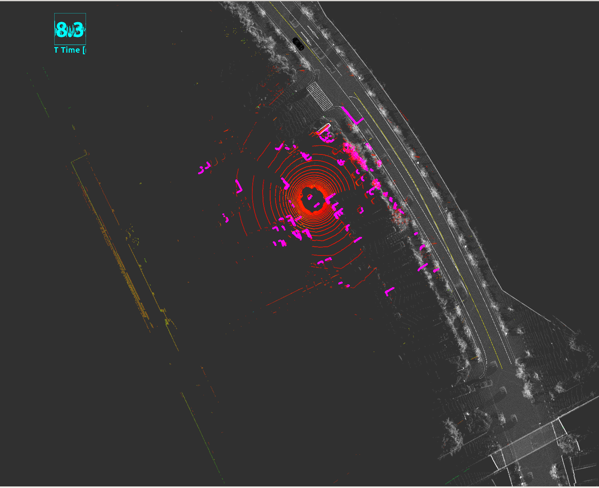
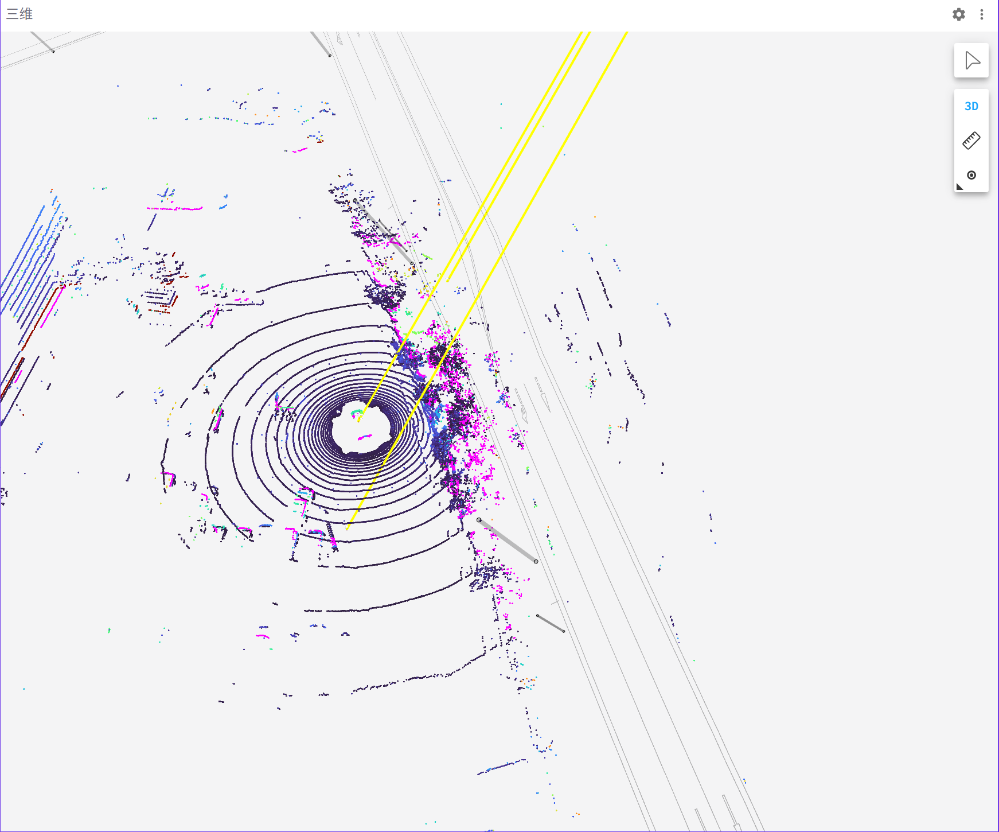

# foxglove studio 可视化工具

官方文档：https://docs.foxglove.dev/docs/introduction/

参考文档：https://zhuanlan.zhihu.com/p/648222186

`foxglove`是全平台通用，可以在浏览器中使用，也可作为Linux、Windows和macOS上的桌面应用程序使用。

`foxglove`是自动驾驶领域一款功能丰富、集成度高的**数据可视化软件**，它可以用于ROS1和ROS2，也可以用于其他的数据源，例如CSV、JSON、Protobuf等。


和ROS中常用的可视化软件`Rviz`相比，`foxglove`的优势在于：

- `foxglove`的可视化功能更加丰富，通过添加Panels(相当于Rviz中的插件)，指定topic完成可视化。支持ROS中所有的数据类型，例如`sensor_msgs/Image`、`sensor_msgs/PointCloud2`、`nav_msgs/OccupancyGrid`等。**以及支持自定义数据类型**。
- Panels中的Plot功能，可以实时绘制topic的数据，例如绘制`/odom(PoseStamped)`的`pose.pose.position.x`随时间的变化曲线。
- **最重要的是，可以无痛迁移，不需要修改程序中的任何代码**。


## 安装

在官网https://foxglove.dev/download进行下载linux压缩文件进行安装即可

`foxglove`可以通过以下几种方式连接到autoware的数据源：

- Files
  - `rosbag`文件（支持本地文件和云文件）
- Live connection
  - Foxglove WebSocket (**推荐**)
  - Rosbridge
  - ...

- 如果想要在线连接，实时显示感知的结果，还需要安装ros包，在终端输入如下命令

  ```
  sudo apt install ros-melodic-foxglove-bridge
  ```

  下载对应版本的`rosbridge`，例如`melodic`，`noetic`


## 数据连接

- 首先启动一个autoware的仿真环境，此处以官方demo为例子

  

- 再启动foxglove-brige

  **需要source 一下项目的工作空间，以便Plot功能可以读取到自定义话题**

  ```
  source install/setup.bash
  roslaunch foxglove_bridge foxglove_bridge.launch
  ```

- 启动foxglove（网页版或桌面端均可），选择`Open connection`，左侧栏中选择`Foxglove Websocket`，URL保持默认(ws://localhost:8765)，继续点击`Open`，即可连接到数据源。

  

可以点击左上角`+`(Add Panel)，选择要添加的面板

- 例如`3D`，在`Topic`中选中`/points_map`，将其右侧的小眼睛打开，即可看到3D点云地图。 选中`/points_raw`，即可看到点云 选中`vector_map`，即可看到矢量地图 ...




## 面板

### 1. 3D

大部分数据类型都可以在3D Panel中可视化，例如点云、objects、map、栅格地图、轨迹...

**与rviz中的可视化基本同步**

- 和Rviz一样，选择topic的时候，选择程序中专门为可视化而输出的话题，例如markers等等


