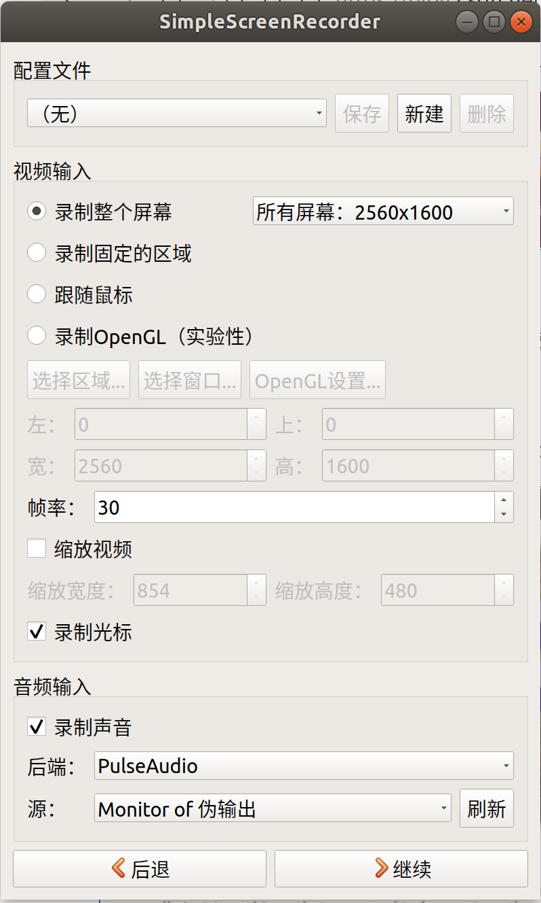
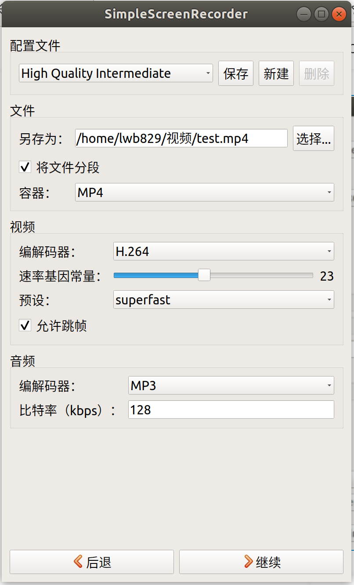
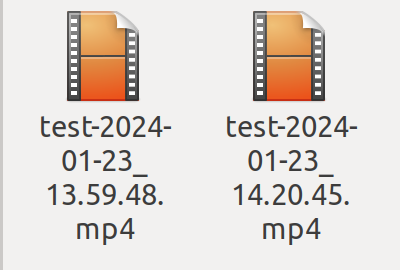
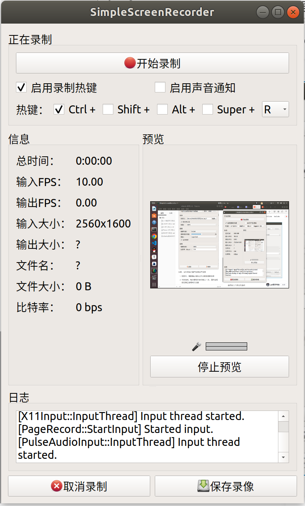
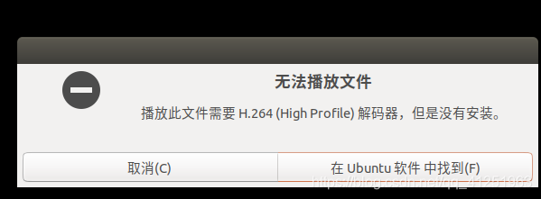
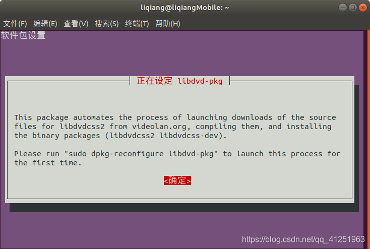
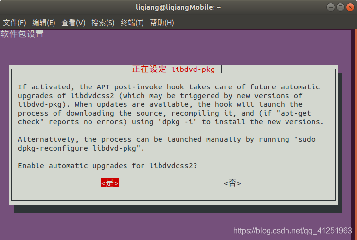
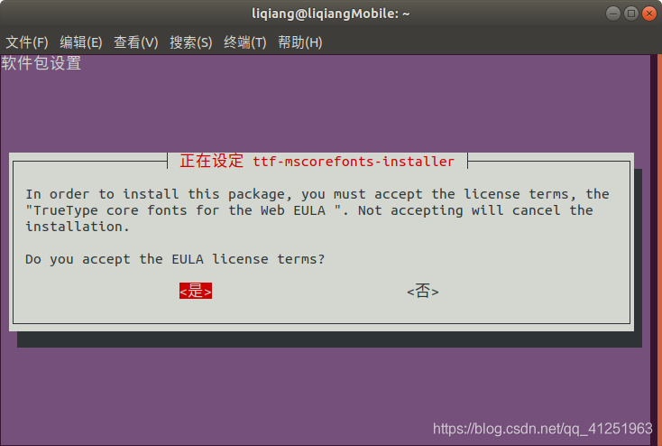

# ubuntu录屏

推荐使用**SimpleScreenRecorder**软件


## 安装流程

打开终端，依次输入以下命令

```
#添加源
sudo add-apt-repository ppa:maarten-baert/simplescreenrecorder

#更新源
sudo apt-get update

#安装
sudo apt-get install simplescreenrecorder
```


## 软件设置

常用设置如下（也可自己改变）



此处选择High Quality Intermediate高清视频



**注意：文件存放位置与名称可选择改变或不改变**

1. **改变时，需要确认存放文件夹和该视频名称**
2. **名称不改变时，每次录制不会代替上一次，因为在视频名称后自带时间记录**

可以在该页面下开始录制，或者直接在右上角右键快速录制




## 安装H.264(High Profile)解码器

在录制完是视频后，第一次尝试打开发现如下情况


- 解决办法

1. 更新存储库

   ```
   sudo apt-get update
   ```
   
2. 安装以下包含视频播放器最常见解码器的软件包

   ```
   sudo apt-get install libdvdnav4 libdvdread4 gstreamer1.0-plugins-bad gstreamer1.0-plugins-ugly libdvd-pkg
   ```
   
   过程如下：
   
   选择**否**即可
   
   
   
3. 继续安装ubuntu受限的附加功能

   ```
   sudo apt-get install ubuntu-restricted-extras
   ```
   
   选择**是**即可
   
   

安装完成！

**注意：若安装完成后还是无法播放视频，重启计算机即可**