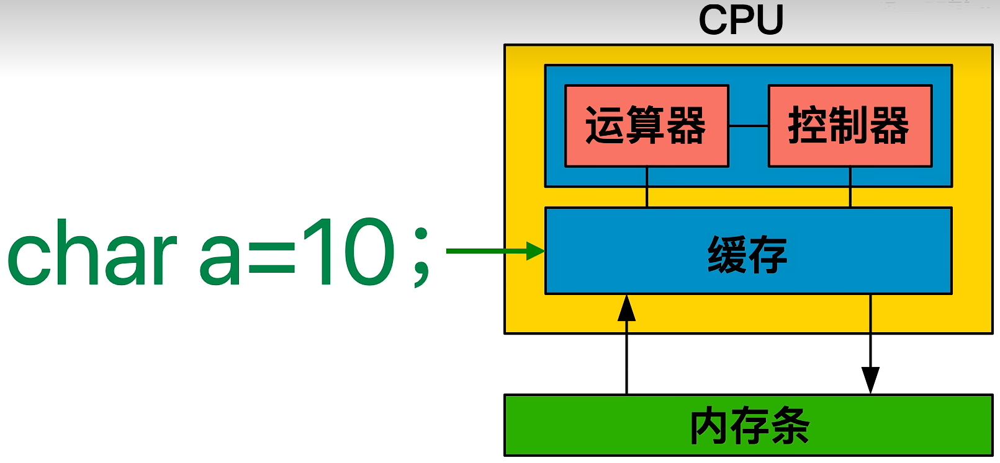
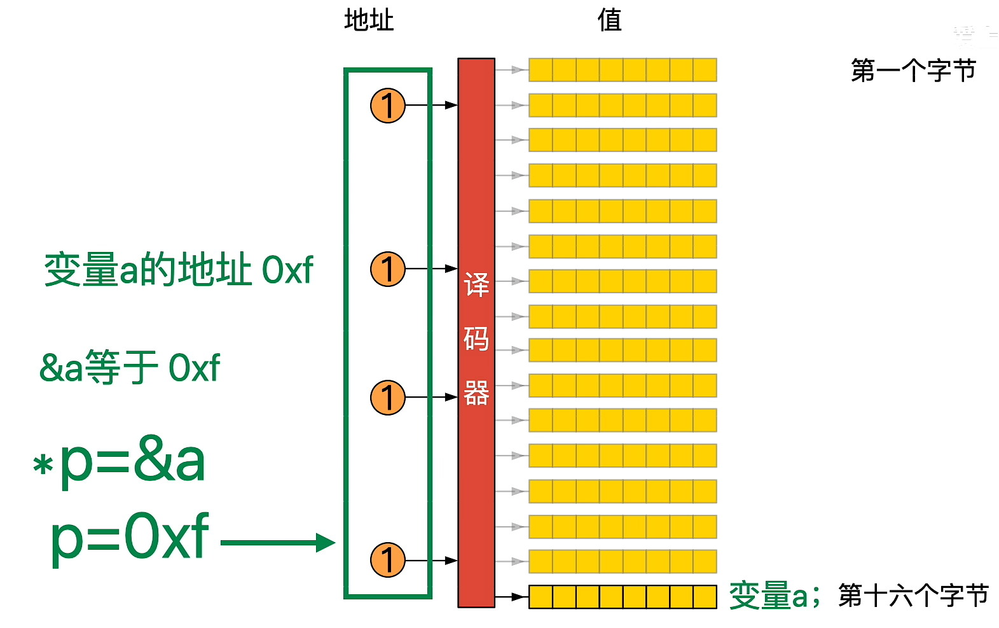
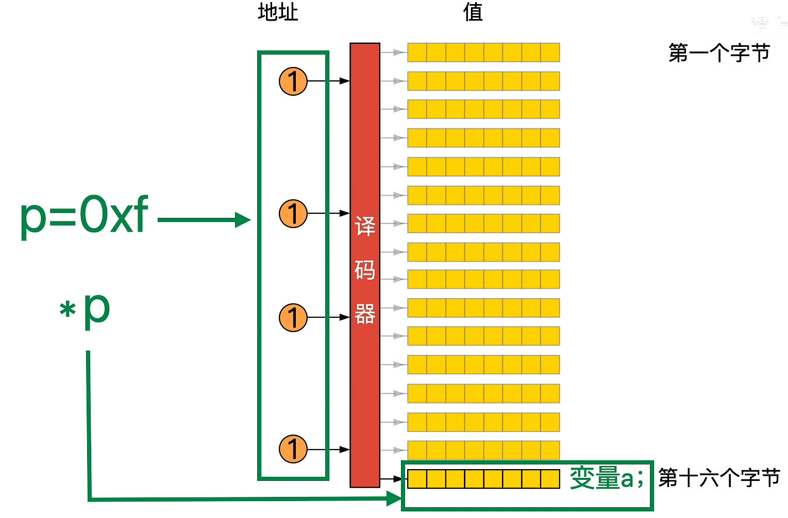

# C＋＋语言编译（结合[google代码规范](https://zh-google-styleguide.readthedocs.io/en/stable/google-cpp-styleguide/contents/)）

##命名约定

### 通用命名规则

尽可能使用描述性的命名，让代码易于新读者理解更重要。不要用只有项目开发者能理解的缩写， 也不要通过砍掉几个字母来缩写单词。

```c++
int price_count_reader;    // 无缩写
int num_errors;            // "num" 是一个常见的写法
int num_dns_connections;   // 人人都知道 "DNS" 是什么

int n;                     // 毫无意义.
int nerr;                  // 含糊不清的缩写.
int n_comp_conns;          // 含糊不清的缩写.
int wgc_connections;       // 只有贵团队知道是什么意思.
int pc_reader;             // "pc" 有太多可能的解释了.
int cstmr_id;              // 删减了若干字母.
```

### 文件命名

一般全部以小写为主，可以包含下划线（__）或连字符（-）

```cc
my_useful_class.cc
my-useful-class.cc
myusefulclass.cc

myusefulclass_test.cc // _unittest 和 _regtest 已弃用.
```

### 类型命名

类型名称的每个单词首字母均大写， 不包含下划线：MyExcitingClass，MyExcitingEnum。

所有类型命名 —— 类，结构体，类型定义 (typedef)，枚举，类型模板参数 —— 均使用相同约定，即**以大写字母开始**，每个单词首字母均大写，不包含下划线。例如:

```c++
// 类和结构体
class UrlTable { ...
class UrlTableTester { ...
struct UrlTableProperties { ...

// 类型定义——给数据类型取别名
typedef hash_map<UrlTableProperties *, string> PropertiesMap;

// using 别名
using PropertiesMap = hash_map<UrlTableProperties *, string>;

// 枚举
enum UrlTableErrors { ...
```

### 变量命名

- 变量 (包括函数参数) 和数据成员名**一律小写**，单词之间**用下划线连接**。

```c++
string table_name;  // 好 - 用下划线.
string tablename;   // 好 - 全小写.
string tableName;  // 差 - 混合大小写
```

- **类**的成员变量**以下划线结尾**，但结构体的就不用。

```c++
class TableInfo //类
{
...
private:
string table_name_;  // 好 - 后加下划线.
string tablename_;   // 好.
static Pool<TableInfo>* pool_;  // 好.
};
```

```c++
struct UrlTableProperties //结构体
{
string name;
int num_entries;
static Pool<UrlTableProperties>* pool;
};
```

### 函数命名

#### 总述

常规函数使用**大小写混合**，取值和设值函数则要求**与变量名匹配**：MyExcitingFunction()，MyExcitingMethod()，my_exciting_member_variable()，set_my_exciting_member_variable()。

#### 说明

一般来说，函数名的**每个单词首字母大写** (即 “驼峰变量名” 或 “帕斯卡变量名”)，**没有下划线**。对于首字母缩写的单词，更倾向于将它们视作一个单词进行首字母大写（例如，写作 StartRpc（）而非 StartRPC（））。


## 注释约定

### 注释风格

**统一风格**，使用**//**或者**/* */**均可，但**//更常用**

### 类注释

每个类的定义都要附带一份注释， 描述类的功能和用法，除非它的功能相当明显。

### 函数注释

函数声明处的注释描述函数功能；定义处的注释描述函数实现。


## 头文件中的#define保护（用的不多）

- 目的：防止头文件被多次包含而造成编译错误

- Include guards方法：标准化方法，所有标准兼容的编译器都支持

  举例——头文件名称为：my_header.h
  
  ```c++
  #ifndef MY_HEADER_H
  #define MY_HEADER_H
  
  // 头文件内容
  
  #endif // MY_HEADER_H
  ```
  
  问题：存在略显繁琐，需要三行代码，并且需要确保宏名的唯一性
  
  如果需要最大程度的可移植性和兼容性，使用 include guards 是更安全的选择
  
- 现常用如下方法，该方法非标准，但被大多数现代编译器支持

  ```
  #pragma once
  ```

​	简单，只有一行代码，在某些编译器上可能有性能优势


## 预处理include

- 基于google规范的**顺序**： 相关头文件，C 库， C++ 库， 其他库的.h， 本项目内的.h

- ROS中C++常用的include

  - `import rospy = #include "ros/ros.h"`

  - `from pix_driver_msgs.msg import GearCommand = #include "pix_driver_msgs/GearCommand.h"`

  - `from autoware_msgs.msg import VehicleCmd = #include ''autoware_msgs/VehicleCmd.h''`

  - `import math = #include<cmath>`

  - `import time  = #include<ctime>`

  - class ×× **：** = class ××  **{}**


## 基础数据类型

- 基本分类：

  - bool型
  - 整型 （char型从本质上说，也是种整型类型，它是长度为1的整数，通常用来存放字符的ASCII码）
  - 浮点型

- int_t同类

  是typedef定义的**表示标志**，是一种表示规范，是通过typedef给类型起的别名，而不是一种新的数据类型。

  举例：

  ```c++
  typedef signed char             int8_t;
  typedef short int               int16_t;
  typedef int                     int32_t;
  typedef long int                int64_t;
  
  typedef unsigned char           uint8_t;
  typedef unsigned short int      uint16_t;
  typedef unsigned int            uint32_t;
  typedef unsigned long int       uint64_t;
  ```

  - 注意：**uint8_t实际是一个char**，输出uin8_t类型的变量**实际输出**的是其**对应的字符**，而不是真实数字。


## ==指针！==

- 目的：用来存储变量在内存中的地址

  - 一般变量的存储地点：CPU中的**缓存**，即属于RAM中的SRAM（静态RAM），而内存条为DRAM（动态RAM）

  

- 声明格式：变量类型   * 变量名（多用于C）   或     **变量类型 *  变量名（多用于C＋＋）**

  - **注意：声明处的‘*’仅仅是声明，不作为间接运算符** 

  - &：取地址运算符，**获取变量地址**

  - *：间接运算符/解除引用运算符，**获取某地址对应的值**

举例：

```c++
int a=5;//设a的地址为EE，b的地址为FF
int* b=&a;//将b指向a，赋值为a的地址（等于指针指向该变量）
此时：
&b=FF；
b=EE；
*b=5;

若此时有：*b=100；
则：a=100；
```





- 数组名：多数情况下，C++将数据名视为数组的**第1个元素的地址**

- 指针算术：C++允许将指针与整数相加，加1的结果等于**原来的地址值加上指向的对象占用的总字节数**


## 类和对象

一般形式为：

```c++
class 类名
{
  public:
    <公有数据和函数>
  private:
    <私有数据和函数>
  protected:
    <保护数据和函数>
}；
```


### 对象成员的访问

- **圆点访问**方式：
  - 对象名.成员名 
  - (*指向对象的指针).成员名  
- **指针访问**方式：
  - 对象指针变量名->成员名
  - (&对象名)->成员名  


### 构造函数

- 格式： 

  ```c++
  <类名>：：<类名>（<形参表>）
  {
      <函数体>
  }
  ```

- 特点：

  - 必须为**公有**
  - **函数名与类名相同**
  - 可以重载
  - 不仅指定返回类型
  - 不能被显式调用

- **无定义任何构造函数**时，系统会**自动生成一个无参数、空函数体的默认构造函数**


### class中的拷贝构造函数（构造函数后）

- 拷贝构造函数：

  如果类中没有定义拷贝构造函数，编译器将提供一个拷贝构造函数，功能是把**已存在对象的成员变量赋值给新对象的成员变量**。

  - **用一个已存在的对象创建新的对象**格式：

  ```c++
  类名 新对象名（已存在的对象名）;
  类名 新对象名 = 已存在的对象名;
  ```

  - **拷贝构造函数**格式：

  ```c++
  类名（const 类名& 对象名）{……}
  ```

  - 特点：

    - 必须为**公有**
    - 函数名必须**与类名相同**
    - 没有返回值  
    - 如果类中定义了拷贝构造函数，编译器将不提供拷贝构造函数
    - 拷贝构造函数可以重载，可以有默认参数

    ```c++
    类名（……,const 类名& 对象名,……）{……}
    ```


### 析构函数

-  格式：

  ```c++
  <类名>：：~<类名>（）
  {
    
  }
  ```

- 特点：
  - 必须为**公有**
  - 名字同类名，与构造函数名的区别在于**前面加~**，表明**功能相反**
  - 一个类中**只能定义一个析构函数**
  - 不能指定返回类型
  - 在释放一个对象时被自动调用
- **无定义任何析构函数**时，系统会**自动生成一个默认的构造函数**


### this指针

`this` 指针是类的每个非静态成员函数中隐含的一个指针，指向调用成员函数的当前对象。

- 用途：
  - 通常用于在成员函数中访问调用该函数的对象的成员变量。当类的成员变量和函数参数同名时，`this` 指针可以帮助区分它们
  
    ```c++
    class MyClass {
    private:
        int value;
    
    public:
        // 构造函数
        MyClass(int value) {
            // 使用this指针来区分成员变量和构造函数参数
            this->value = value;  // 左边的 value 是成员变量，右边的是参数
        }
    
        // 显示成员变量的值
        void display() {
            cout << "Value: " << this->value << endl;  // 使用 this 指针访问成员变量
        }
    };
    ```
  
  - 可以返回当前对象本身，实现链式调用
  
    ```c++
    class MyClass {
    private:
        int value;
    
    public:
        MyClass(int value) : value(value) {}
    
        // 修改值，并返回当前对象
        MyClass& setValue(int newValue) {
            this->value = newValue;  // 使用 this 指针修改成员变量
            return *this;  // 返回当前对象
        }
    
        void display() const {
            cout << "Value: " << value << endl;
        }
    };
    
    int main() {
        MyClass obj(10);
        obj.setValue(20).setValue(30).setValue(40);  // 链式调用
        obj.display();  // 输出：Value: 40
        return 0;
    }
    ```
  
    `setValue` 函数返回 `*this`，即当前对象本身
  
- 特点：

  - 静态成员函数没有 `this` 指针，因为它们不属于某个对象，而是属于整个类
  - 是一个由C＋＋编译器自动产生且较常用的一个隐含对象指针，不能被显式声明
  - 是一个局部变量，局部于某个对象
  - 是一个const指针，不能修改或给它赋值


### 类的静态成员

指声明为**static的成员**，在类的范围内**所有对象共享该数据**

- 引用格式：
  - <类名>：：<静态成员>
  - 对象名.共有静态成员
  - 对象指针->静态成员
  
- 静态数据成员：
  - 格式：<数据类型> <类名>：：<静态数据成员名>=<初始值> 
  
- 静态成员函数：
  - 定义：在一般函数**定义前加上static关键字** 
  
  - 不访问类中的非静态成员
  
    

### const

保护即需要共享、又需要防止改变的数据，应该声明为常量进行保护

- 常数据成员————const修饰数据成员
- 常成员函数————const修饰成员函数
  - 声明格式：类型 函数名（参数表） const； 
- 常对象————const修饰类的对象
  - 定义格式：const 类名 对象名； / 类名 const 对象名；
    - 如：const int foo


## 类型转换

尽量使用如**static_cast<>（）**这种显式类型转换，而不要使用 int y = (int)x 或 int y = int(x) 等转换方式


##ros::NodeHandle类

`ros::NodeHandle`是一个重要的类，它允许你与ROS系统进行通信。它提供了一个接口，用于**访问ROS的功能，例如创建发布者、订阅者、服务、参数等**。在C++中，可以通过创建 `ros::NodeHandle`对象来访问ROS的各种功能。

`ros::NodeHandle` 的对象通常在ROS节点的构造函数中创建，然后在整个节点的生命周期中被用于与ROS系统进行通信。通过使用 `ros::NodeHandle` 对象，你的程序可以方便地与其他ROS节点进行消息交换和服务调用。


## 动态数组

### vector

- 初始化

  ```C++
  #include <vector>
  
  std::vector<int> vec1;                  // 空的 vector
  std::vector<int> vec2(10);              // 包含 10 个元素的 vector，初始值为默认值（int 为 0）
  std::vector<int> vec3(10, 5);           // 包含 10 个元素的 vector，初始值为 5
  std::vector<int> vec4 = {1, 2, 3, 4};   // 使用初始化列表
  ```

- 访问元素

  ```C++
  std::vector<int> vec = {1, 2, 3, 4};
  
  // 获取第一个（front）和最后一个元素（back）
  int first = vec.front();
  int last = vec.back();
  ```

- 修改元素

  ```c++
  vec.push_back(1);// 在末尾添加元素1
  vec.push_back(2);// 在末尾添加元素2
  
  // 在特定位置插入元素
  vec.insert(vec.begin(), 0);    // 在开头插入 0
  vec.insert(vec.begin() + 1, 5); // 在第二个位置插入 5
  ```

- 删除元素

  ```c++
  // 删除最后一个元素
  vec.pop_back();
  
  // 删除特定位置的元素
  vec.erase(vec.begin() + 1); // 删除第二个元素，vec.end()
  
  // 清空所有元素
  vec.clear();
  ```

- 大小和容量

  ```c++
  std::vector<int> vec = {1, 2, 3, 4};
  size_t size = vec.size();       // 当前元素数量
  size_t capacity = vec.capacity(); // 当前分配的存储容量
  bool is_empty = vec.empty();    // 检查 vector 是否为空
  
  // 改变大小
  vec.resize(6, 0); // 现在 vec 包含 6 个元素，多出来的用 0 填充
  ```

- 交换

  ```c++
  std::vector<int> vec1 = {1, 2, 3};
  std::vector<int> vec2 = {4, 5, 6};
  
  // 交换 vec1 和 vec2 的内容
  vec1.swap(vec2);
  ```

- 迭代器

  `std::vector<int>::iterator` 是一个迭代器类型，用于遍历和操作 `std::vector<int>` 容器中的元素

  作用：

  1. **遍历 `vector` 元素**：通过迭代器，可以从 `vector` 的起始位置遍历到结束位置，访问每一个元素。
  2. **访问和修改元素**：迭代器不仅能访问 `vector` 中的元素，还能修改这些元素的值。
  3. **与算法结合**：迭代器可以与标准库中的算法（如 `std::sort`, `std::find`, `std::for_each` 等）结合使用，实现对 `vector` 中元素的操作。

  ```c++
  std::vector<int> vec = {1, 2, 3, 4, 5};
  
  // 使用 iterator 进行遍历
  for (std::vector<int>::iterator it = vec.begin(); it != vec.end(); ++it) {
      std::cout << *it << " ";  // 通过解引用访问元素值，输出 1 2 3 4 5 
  }
  std::cout << std::endl;
  
  // 使用 iterator 修改元素
  for (std::vector<int>::iterator it = vec.begin(); it != vec.end(); ++it) {
      *it = *it * 2;  // 将每个元素的值翻倍
  }
  
  // 再次遍历，输出修改后的元素
  for (std::vector<int>::iterator it = vec.begin(); it != vec.end(); ++it) {
      std::cout << *it << " ";  // 输出 2 4 6 8 10
  }
  std::cout << std::endl;
  ```

  - **解引用操作符 `*`**：用来访问迭代器指向的元素的值


### set

`std::set` 是一种有序集合，它自动对元素进行排序，并且不允许有重复的元素，适用于需要保证元素唯一性和自动排序的场景。

**主要功能与方法与vector相同**

- 初始化

  ```c++
  std::set<int> s;              // 默认构造函数，空 set
  std::set<int> s = {1, 2, 3};  // 使用列表初始化 set
  ```

- 元素访问和修改

  ```c++
  s.insert(4);        // 插入元素 4，如果 4 已存在，则不会插入
  s.erase(2);         // 删除元素 2
  s.clear();          // 清空 set，删除所有元素
  s.find(3);          // 查找元素 3，返回一个迭代器，若未找到则返回 s.end()
  s.count(3);         // 返回 3 是否存在，存在返回 1，不存在返回 0
  ```

- 查询和属性

  ```c++
  s.size();           // 返回元素数量
  s.empty();          // 判断 set 是否为空
  ```

- 遍历

  ```c++
  for (auto it = s.begin(); it != s.end(); ++it) {
      std::cout << *it << " ";  // 输出：set 中的元素按顺序排列
  }
  
  // 使用范围循环
  for (int val : s) {
      std::cout << val << " ";
  }
  
  ```

- **自定义排序**

  **默认情况下，`std::set` 使用 `<` 运算符来比较元素并确定它们在集合中的顺序**然而，如果你需要自定义排序规则，可以通过传递一个自定义的比较函数来实现

  假设现有一结构体为dds，自定义比较器函数对象可编写如下**（重载 `operator()`）**：

  ```c++
  struct dds {
      int id;
      std::string name;
  };
  
  // 自定义比较器函数对象
  struct Compare {
      bool operator()(const dds& lhs, const dds& rhs) const {
          return lhs.id < rhs.id;
      }
  };
  ```

  `lhs` 和 `rhs` 分别是要比较的两个 `dds` 对象；如果 `lhs` 应该排在 `rhs` 之前，返回 `true`；否则返回 `false`。

  此时该set数组可定义为如下：

  ```
  std::set<dds, Compare> lwb;
  ```


### vector与set区别

**顺序性**：

- `std::vector` 是按插入顺序存储数据，不进行自动排序。
- `std::set` 自动对元素进行排序，默认按升序排列。

**唯一性**：

- `std::vector` 允许有重复元素。
- `std::set` 不允许有重复元素，如果插入重复元素，则该操作不会生效。


## `valarray`模板类

专门设计用于处理**数值数组**，提供了一些用于数学运算和元素批量处理的操作符和函数，这使得 `valarray` 非常适合用于需要对大量数据进行数学计算的场景

- 声明与初始化：与vector相同

  ```c++
  std::valarray<int> va = {1, 2, 3, 4, 5};
  ```

- 元素访问：和 `vector` 类似，`valarray` 也支持下标运算符 `[]` 进行元素访问

  ```c++
  std::valarray<int> va = {1, 2, 3, 4, 5};
  std::cout << va[2] << std::endl;  // 输出 3
  ```

- 数学运算（函数）

  ```c++
  std::valarray<int> va1 = {1, 2, 3, 4, 5};
  std::valarray<int> va2 = {10, 20, 30, 40, 50};
  
  // 加法运算符应用于所有元素
  std::valarray<int> va3 = va1 + va2;
  
  // va1的每个元素乘以 2
  std::valarray<int> va4 = va1 * 2;
  
  // 一元负号应用于所有元素
  std::valarray<int> va5 = -va1;
  
  // 计算平方根
  std::valarray<double> result = std::sqrt(va);
  ```

  - 支持的运算符包括：`+`、`-`、`*`、`/`、`%`、`&`、`|`、`^` 等

  - 其他可用的数学函数包括：

    - `std::abs()`：取绝对值

    - `std::cos()`、`std::sin()`、`std::tan()`：三角函数

    - `std::exp()`：指数函数

    - `std::log()`：对数函数

    - `std::pow()`：幂函数

- `valarray`的切片（slice）与子数组：`valarray` 支持对数组的部分元素进行操作，可以通过 `std::slice` 和 `std::gslice` 访问部分数组

  - `slice` ：可以从 `valarray` 中选择一部分元素，进行批量操作

    ```c++
    std::valarray<int> va = {1, 2, 3, 4, 5, 6, 7, 8, 9, 10};
    
    // 创建切片，从索引1开始，选择5个元素，步长为2
    std::slice my_slice(1, 5, 2);
    
    // 使用切片操作从 valarray 中提取对应的元素
    std::valarray<int> sliced_va = va[my_slice];
    
    // 修改切片中的元素，将所有选中的元素加10
    va[std::slice(1, 5, 2)] += 10;
    ```

    - `std::slice(start, size, stride)`：`start` 表示起始索引，`size` 表示选取的元素个数，`stride` 表示步长
    - 通过切片直接对 `valarray` 中部分元素进行修改

  - `gslice`：类似于 `slice`，同时允许从多维数组中选择元素，它不仅可以指定步长，还可以处理多个维度

    ```c++
    // 以 4x3 矩阵（即 12 个元素的数组）为例
    std::valarray<int> matrix = {
        1,  2,  3,    // 第1行
        4,  5,  6,    // 第2行
        7,  8,  9,    // 第3行
        10, 11, 12    // 第4行
    };
    
    // 定义每个维度的大小（例如，我们需要 2x2 子矩阵）
    std::valarray<size_t> sizes = {2, 2};  // 2 行 2 列
    // 定义步长，行之间步长为 3，列之间步长为 1
    std::valarray<size_t> strides = {3, 1};
    
    // 提取子矩阵，从索引 0 开始
    std::gslice my_gslice(0, sizes, strides);
    
    // 使用 gslice 操作提取子数组
    std::valarray<int> sliced_matrix = matrix[my_gslice];
    
    matrix[std::gslice(0, sizes, strides)] += 10;
    ```

  - 区别：

    - 维度：`slice` 只能处理一维数据，而 `gslice` 能处理多维数据（矩阵、张量等）
    - 灵活性：`gslice` 提供更多灵活性，可以针对每个维度单独指定步长，而 `slice` 只支持一维数据的步长控制

- 常用方法

  - `sum()` ：用于计算 `valarray` 所有元素的和

    ```c++
    std::valarray<int> va = {1, 2, 3, 4, 5};
    std::cout << va.sum() << std::endl;  // 输出 15
    ```

  - `min()` 和 `max()`： 用于返回 `valarray` 中的最小值和最大值

    ```c++
    std::valarray<int> va = {1, 2, 3, 4, 5};
    std::cout << "Min: " << va.min() << ", Max: " << va.max() << std::endl;  // 输出 Min: 1, Max: 5
    ```

  - `apply()` ：函数可以对 `valarray` 中的每个元素应用自定义的函数

    ```c++
    std::valarray<int> va = {1, 2, 3, 4, 5};
    
    // 将每个元素乘以 2
    std::valarray<int> result = va.apply([](int x) { return x * 2; });
    ```

  - `resize()` ：用于调整 `valarray` 的大小，并将新元素初始化为默认值

    ```c++
    std::valarray<int> va = {1, 2, 3};
    va.resize(5, 0);  // 调整大小为5，新元素初始化为0
    ```

  - `shift()` ：用于将 `valarray` 中的元素向左或向右移动，空出的位置将填充默认值。`cshift()`： 是循环移位

    ```c++
    std::valarray<int> va = {1, 2, 3, 4, 5};
    
    // 左移2位，空位补0
    std::valarray<int> shifted_va = va.shift(2);  // {3, 4, 5, 0, 0}
    
    // 右移2位，空位补0
    std::valarray<int> shifted_va = va.shift(-2);  // {0, 0, 1, 2, 3}
    
    // 向左循环移动2位
    std::valarray<int> cshifted_left = va.cshift(2);  // {3, 4, 5, 1, 2}
    
    // 向右循环移动2位
    std::valarray<int> cshifted_right = va.cshift(-2);  // {4, 5, 1, 2, 3}
    ```


## map键值对

### `std::map`

- 声明和初始化

  ```C++
  #include <map>
  #include <string>
  
  std::map<int, std::string> map1;            // 空的 map
  std::map<int, std::string> map2 = {         // 使用初始化列表初始化
      {1, "one"},
      {2, "two"},
      {3, "three"}
  };
  ```

- 修改元素

  ```c++
  std::map<int, std::string> map; //举例
  
  // 插入单个元素
  map.insert({1, "one"});
  
  // 删除特定键的元素
  map.erase(2); // 删除键为 2 的元素
  
  // 清空所有元素
  map.clear();
  ```

- 大小和容量

  ```c++
  size_t size = map.size();       // 当前元素数量
  bool is_empty = map.empty();    // 检查 map 是否为空
  ```

- **make_pair()函数（创建键值对）**

  ```c++
  // 创建一个 std::map
  std::map<int, std::string> myMap;
  
  // 使用 std::make_pair 插入元素
  myMap.insert(std::make_pair(1, "one"));
  myMap.insert(std::make_pair(2, "two"));
  myMap.insert(std::make_pair(3, "three"));
  ```

  - `std::pair`的访问

    ```c++
    // 通过first和second成员来访问
    std::pair<int, std::string> p = std::make_pair(1, "one");
    std::cout << p.first << ": " << p.second << std::endl;
    ```

- **自动排序**

  `std::map` 会根据键（`key`）的值进行排序。默认情况下，`std::map` 使用 `<` 操作符（即 `std::less`）来比较键的大小，从而确定元素的顺序。因此，`std::map` 中的元素总是按键值从小到大自动排序。

  - **内置类型**：对于像 `int`、`float`、`double`、`char` 等内置数据类型，C++ 已经定义了 `<` 操作符的行为，直接比较它们的值即可

  - **字符串类型**：对于 `std::string` 类型，`<` 操作符比较的是字符串的字典顺序（lexicographical order）。这意味着比较是逐字符进行的，从字符串的第一个字符开始，如果第一个字符相同，则比较第二个字符，依此类推

  - **自定义类型**：对于自定义类型（即用户定义的类或结构体），如果想要将它们作为 `std::map` 的键使用，并且希望 `std::map` 自动排序，你需要在该类型中定义 `<` 操作符，或者提供一个**自定义的比较器**

    ```c++
    struct MyKeyCompare {
        bool operator()(const MyKey& lhs, const MyKey& rhs) const {
            if (lhs.x != rhs.x) {
                return lhs.x < rhs.x;
            } else {
                return lhs.y < rhs.y;
            }
        }
    };
    
    std::map<MyKey, int, MyKeyCompare> myMap;
    
    ```


### `std::unordered_map`

与 `std::map` 不同，`std::unordered_map` 的**元素顺序是不可预测的，不保证插入顺序**，适用于频繁查找和不关心顺序的场景

示例：

```c++
std::unordered_map<std::string, int> myMap;

// 插入键值对
myMap["apple"] = 1;
myMap["banana"] = 2;
myMap["orange"] = 3;

// 访问元素
std::cout << "apple: " << myMap["apple"] << std::endl;

// 查找元素
if (myMap.find("banana") != myMap.end()) {
    std::cout << "banana exists with value: " << myMap["banana"] << std::endl;
}

// 遍历 unordered_map ！！！
for (const auto &pair : myMap) {
    std::cout << pair.first << ": " << pair.second << std::endl;
}
```

其它用法与map均相同！！！


## 结构体

### 结构数组

将同一类型的多个结构体存储在一个数组中

示例：

```c++
// 定义一个结构体
struct Student {
    std::string name;
    int age;
    float grade;
};

// 创建一个结构体数组
Student students[3];

// 初始化结构体数组的元素
students[0] = {"Alice", 20, 85.5f};
students[1] = {"Bob", 21, 90.0f};
students[2] = {"Charlie", 19, 88.0f};
```

- 访问与修改元素

  ```
  students[0].grade = 89.5f;  // 修改第一个学生的成绩
  ```

- 遍历结构数组

  ```C++
  for(int i = 0; i < 3; i++) {
      std::cout << students[i].name << " is " << students[i].age << " years old." << std::endl;
  }
  ```

- 动态分配结构数组

  ```c++
  Student* students = new Student[n];
  
  // 初始化动态数组的元素
  for(int i = 0; i < n; i++) {
      std::cout << "Enter name, age, and grade for student " << i+1 << ": ";
      std::cin >> students[i].name >> students[i].age >> students[i].grade;
  }
  
  // 访问动态数组的元素
  for(int i = 0; i < n; i++) {
      std::cout << students[i].name << " has a grade of " << students[i].grade << std::endl;
  }
  
  // 释放动态分配的内存
  delete[] students;
  ```

- 结构数组的排序

  可以使用标准库中的 `std::sort` 函数对结构体数组进行排序，通常需要自定义排序规则

  ```c++
  // 自定义比较函数，按成绩排序
  bool compareByGrade(const Student &a, const Student &b) {
      return a.grade > b.grade;  // 降序排列
  }
  
  // 排序结构体数组
  std::sort(students, students + 3, compareByGrade);
  
  // 输出排序后的结果
  for(int i = 0; i < 3; i++) {
      std::cout << students[i].name << ": " << students[i].grade << std::endl;
  }
  ```

- 结合`std::vector`使用结构体数组

  ```C++
  std::vector<Student> students;
  
  // 向 vector 中添加学生
  students.push_back({"Alice", 20, 85.5f});
  students.push_back({"Bob", 21, 90.0f});
  // 遍历 vector
  for(const auto& student : students) {
      std::cout << student.name << " has a grade of " << student.grade << std::endl;
  }
  ```


## 枚举

有两种类型：**传统枚举**(unscoped enum) 和 **强类型枚举**(scoped enum，也称为**enum class**)


### 传统枚举

传统枚举没有作用域限制，枚举成员可以在整个作用域内使用

定义方式：

```c++
enum Color { Red, Green, Blue };
```

这里，`Red`、`Green`、`Blue` 是具名常量，它们的默认值分别是 `0`，`1`，`2`

- 注：传统枚举的成员会自动转换为整数类型（`int`），这可能导致意外的错误。


### 强类型枚举(enum class)

与传统枚举不同，`enum class` 拥有自己的作用域，枚举成员**不会自动转换为整数类型**，从而提高了类型安全性

定义方式：

```c++
enum class Color { Red, Green, Blue };

int main() {
    Color myColor = Color::Red;  // 必须使用作用域限定符
    if (myColor == Color::Red) {
        std::cout << "The color is Red" << std::endl;
    }
    return 0;
}
```

在这个例子中，`myColor` 被赋值为 `Color::Red`，**必须使用作用域限定符 `Color::` 来访问枚举成员**，避免了传统枚举的隐式转换问题。

- 由于 `enum class` 的类型安全特性，枚举成员不会自动转换为整数。如果需要将枚举值转换为整数，可以使用 `static_cast` 进行显式转换

  ```c++
  int value = static_cast<int>(Color::Red);  // value == 0
  ```

强类型枚举的遍历：

```c++
enum class Color { Red, Green, Blue, Last };

int main() {
    for (int i = static_cast<int>(Color::Red); i < static_cast<int>(Color::Last); i++) {
        std::cout << "Color: " << i << std::endl;
    }
```


### 基础类型指定

默认情况下，枚举类型的底层类型是 `int`，但可以显式指定为其他整型类型，如 `char`、`short`、`unsigned int` 等

```c++
enum class Color : char { Red, Green, Blue };
```


## 与时间相关

### `chrono`库

```c++
// 获取当前时间
auto start = std::chrono::steady_clock::now();
auto end = std::chrono::steady_clock::now();

// 系统休眠
std::this_shread::sleep_for(std::chrono::seconds(90));

// 获取等待时间
auto duration = std::chrono::duration_cast<std::chrono::minutes>(end-start).count()

```


### `std::tm`结构体

- 结构体定义

```c++
struct tm {
    int tm_sec;    // 秒，范围从 0 到 59
    int tm_min;    // 分，范围从 0 到 59
    int tm_hour;   // 小时，范围从 0 到 23
    int tm_mday;   // 一月中的第几天，范围从 1 到 31
    int tm_mon;    // 月份，范围从 0 到 11（0 表示一月）
    int tm_year;   // 自 1900 年以来的年数
    int tm_wday;   // 一周中的第几天，范围从 0 到 6（0 表示星期天）
    int tm_yday;   // 一年中的第几天，范围从 0 到 365（0 表示一月一日）
    int tm_isdst;  // 夏令时标识符，正值表示采用夏令时，零表示不采用夏令时，负值表示信息不可用
};
```

- 具体使用

```c++
//获取当前时间
std::time_t t = std::time(nullptr); // 获取当前时间点
std::tm* now = std::localtime(&t);  // 分解为本地时间

std::cout << "Year: " << (now->tm_year + 1900) << '\n';
std::cout << "Month: " << (now->tm_mon + 1) << '\n';
std::cout << "Day: " << now->tm_mday << '\n';
std::cout << "Hour: " << now->tm_hour << '\n';
std::cout << "Minute: " << now->tm_min << '\n';
std::cout << "Second: " << now->tm_sec << '\n';
```


## to_string()函数

- 用法：用于将数值转换为字符串

```c++
#include <iostream>
#include <string>

int num = 42;
std::string str = std::to_string(num);
```


## printf()函数

- 用法：用于进行格式化输出
  - `%d`：十进制整数
  - `%f`：浮点数（小数）
  - `%c`：单个字符
  - `%s`：字符串
  - `%x`：十六进制整数

```c
int a = 10;
float b = 3.14;
char c = 'A';
const char* str = "Hello, World!";

printf("Integer: %d", a);        // 输出十进制整数
printf("Float: %f", b);          // 输出浮点数
printf("Character: %c", c);      // 输出字符
printf("String: %s", str);       // 输出字符串
printf("Hexadecimal: %x", a);    // 输出十六进制整数
```


## scanf()函数

- 用法：用于进行格式化输入
  - `%d`：读取十进制整数
  - `%f`：读取浮点数
  - `%c`：读取单个字符
  - `%s`：读取字符串

```C
int a;
float b;
char c;
char str[100];

scanf("%d", &a);         // 读取整数
printf("You entered: %d", a);

scanf("%f", &b);         // 读取浮点数
printf("You entered: %f", b);

scanf("%c", &c);        // 读取字符
printf("You entered: %c", c);

scanf("%s", str);        // 读取字符串
printf("You entered: %s", str);
```


## 动态分配内存

### malloc()函数

- 用法：用于动态分配内存，返回指向分配内存的指针

```c++
void* malloc(size_t size); //size为所需要分配的字节数
```

- 示例

  ```c++
  #include <iostream>
  #include <cstdlib>
  
  int main() {
      // 动态分配一个 int 类型的内存
      int* p = (int*)malloc(sizeof(int));
  
      // 检查内存分配是否成功
      if (p != nullptr) {
          *p = 42;  // 给动态分配的内存赋值
          std::cout << "Value: " << *p << std::endl;
  
          free(p);  // 使用完后释放内存
      } else {
          std::cout << "Memory allocation failed" << std::endl;
      }
  
      return 0;
  }
  ```

  - `malloc` 返回的指针需要进行类型转换，因为它返回的是 `void*` 类型
  - 使用 `malloc` 分配的内存需要手动调用 `free` 来释放，防止内存泄漏
  - `malloc`不会调用构造函数，因此对于非基本类型的对象，建议使用`new` 操作符


### new()函数

- 用法：用于动态内存分配的操作符，它不仅分配内存，还会调用对象的构造函数
- 优点：使用 `new` 操作符可以方便地在堆上创建单个对象或数组，并且在使用 `delete` 或 `delete[]` 释放内存时，自动调用对象的析构函数，进行内存清理。

- 示例

  - 分配单个对象

    ```c++
    int* p = new int(42); // 在堆上分配一个 int，初始值为 42
    ```

    代码等价于

    ```c++
    int* p = (int*)malloc(sizeof(int));
    *p = 42;
    ```

  - 分配数组

    ```c++
    int* arr = new int[10]; // 在堆上分配一个包含 10 个 int 的数组
    ```

  - 释放单个对象

    ```c++
    delete p; // 释放 p 指向的内存，调用析构函数（如果存在）
    ```

    等价于

    ```c++
    free(p);
    ```

  - 释放数组

    ```c++
    delete[] arr; // 释放数组内存，调用每个元素的析构函数（如果存在）
    ```

    等价于

    ```c++
    free(arr);
    ```


###  malloc 与 new 的比较

- malloc：

  - 仅分配内存，不调用构造函数
  - 必须手动释放内存（使用 `free`）

- new：

  - `new` 和 `delete` 必须匹配使用：使用 `new` 分配的内存必须用 `delete` 释放，而 `new[]` 分配的数组内存必须用 `delete[]` 释放

  - 分配内存并调用构造函数

  - 可以与 `delete` 一起使用以释放内存，且自动调用析构函数

  

### Lamda函数

是一种匿名函数，能够在一行中定义并直接使用，它允许定义捕获列表、参数列表、返回类型，以及函数体

- **基本语法**

  ```c++
  [capture](parameters) -> return_type { function_body };
  ```

  - `capture`：捕获列表，用于捕获上下文中的变量，可以按值（`=`）或按引用（`&`）捕获。

  - `parameters`：参数列表，与普通函数的参数列表相同。

  - `return_type`：返回类型，可选。如果省略，编译器会根据 `function_body` 推导返回类型。

  - `function_body`：函数体，包含 Lambda 函数的逻辑。

- **捕获列表**

  用于指定 Lambda 函数中要使用的**外部变量**，捕获可以通过值或引用进行

  - **按值捕获（=）：** 捕获外部变量的副本，Lambda 函数内部对变量的修改**不会影响外部**。

  - **按引用捕获（&）：** 捕获外部变量的引用，Lambda 函数内部对变量的修改**会影响外部**。

  示例：

  ```c++
  int x = 10;
  int y = 20;
  
  // 按值捕获
  auto lambda_by_value = [x]() { return x + 10; };
  std::cout << "按值捕获 x: " << lambda_by_value() << std::endl; // 按值捕获 x: 20
  
  // 按引用捕获
  auto lambda_by_ref = [&y]() { y += 10; };
  lambda_by_ref();
  std::cout << "按引用捕获 y: " << y << std::endl; // 按引用捕获 y: 30
  
  // 混合捕获
  auto mixed_capture = [=, &y]() { y += x; };
  ```

- **参数列表**

  Lambda 函数的参数列表（**内部变量**）与普通函数相同，允许传递参数。

  ```c++
  auto add = [](int a, int b) { return a + b; };
  std::cout << "3 + 5 = " << add(3, 5) << std::endl; // 8
  ```

- **返回类型**

  Lambda 函数的返回类型可以由编译器自动推导；如果推导不明确或需要指定不同的返回类型，可以显式指定。

  ```c++
  // 自动推导返回类型
  auto lambda_auto = [](int a, int b) { return a + b; };
  
  // 显式指定返回类型
  auto lambda_explicit = [](int a, int b) -> double { return a / double(b); };
  ```


## `extern`用法

`extern` 是一个关键字，用来声明变量或函数是在别的文件或作用域中定义的，表明它们的存储是在其他位置进行的，但可以在当前文件或作用域中使用

- 声明外部变量：**只能在变量的定义处进行初始化，而不能在 `extern` 声明处初始化**

  ```C++
  // file1.cpp
  // 定义一个全局变量
  int globalVar = 42;
  
  // file2.cpp
  // 错误用法：extern int globalVar = 42; 
  extern int globalVar;
  std::cout << "globalVar = " << globalVar << std::endl;
  ```

  - `globalVar` 在 `file1.cpp` 中定义，但通过 `extern` 关键字，`file2.cpp` 中可以访问它

- 函数声明：C++ 函数默认是 `extern` 的，因此你可以在多个文件中声明和使用同一个函数

  ```c++
  // file1.cpp
  // 函数定义
  void myFunction() {
      std::cout << "This is myFunction!" << std::endl;
  }
  
  // file2.cpp
  // 函数声明（可以省略 extern，因为函数默认是 extern）
  extern void myFunction();
  int main() {
      myFunction();  // 调用在另一个文件中定义的函数
      return 0;
  }
  ```

- 注意：`extern` 只做**声明**而不做**定义**，因此它不会为变量或函数分配内存，只是告诉编译器这个变量或函数在其他地方定义

- 当使用 `extern` 声明全局变量时，确保在某个源文件中正确定义变量（初始化它）

- 不能对 `extern` 声明的变量进行初始化


## 函数模板

用于创建可以处理不同数据类型的通用函数

- 基本用法：以 `template` 关键字开头，后面跟着模板参数列表，通常以尖括号 `<...>` 包裹，模板参数列表包含一个或多个类型参数或非类型参数

  ```c++
  template <typename T>
  T add(T a, T b) {
      return a + b;
  }
  ```

  - `T`： 是一个占位符，表示将被实际的类型替换
  - `T add(T a, T b)`：接受两个相同类型的参数并返回同类型的结果

- 实例化：在使用模板函数时，编译器会根据传递的实际参数类型来**自动实例化函数模板**

  ```c++
  int x = 5, y = 10;
  double a = 2.5, b = 3.7;
  
  // 调用 int 类型的 add 函数
  std::cout << "int: " << add(x, y) << std::endl; // int: 15
  
  // 调用 double 类型的 add 函数
  std::cout << "double: " << add(a, b) << std::endl; // double: 6.2
  ```

- 多类型参数：函数模板不仅可以有一个类型参数，还可以有多个，通过使用多个类型参数，你可以创建更灵活的模板

  ```c++
  template <typename T1, typename T2>
  auto add(T1 a, T2 b) -> decltype(a + b) {
      return a + b;
  }
  ```

  - `template <typename T1, typename T2>`：定义了两个类型参数 T1 和 `T2`
  - `auto` 和 `decltype`：这里使用 `auto` 和 `decltype` 推导返回类型，返回 `a + b` 的结果类型

- 显示实例化：如果不想依赖编译器自动推导模板参数，可以在调用时显式指定模板参数

  ```c++
  int x = 5;
  double y = 6.5;
  
  // 显式指定模板参数类型
  std::cout << add<int, double>(x, y) << std::endl;
  ```

- 函数模板与函数重载：函数模板可以和普通函数进行重载，也可以和其他模板函数重载，编译器根据最匹配的参数类型选择合适的函数


