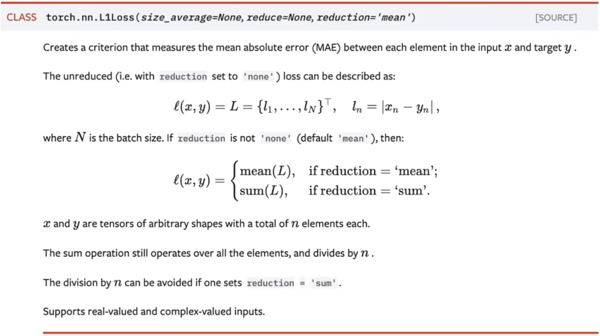
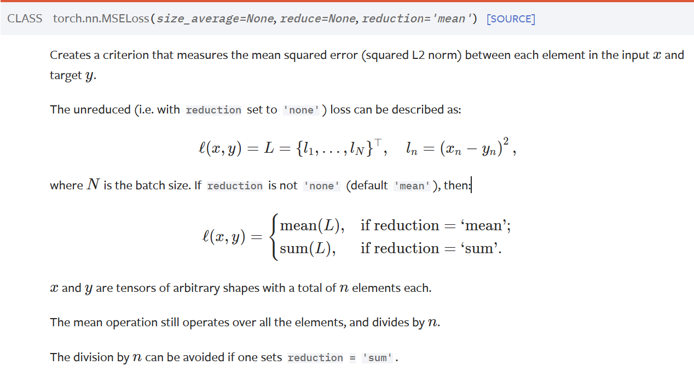

# Pytorch学习笔记(图像)

## Python四大常用库

### numpy库

是python科学计算库的基础，包含了强大的N维数组对象和向量运算。

```python
import numpy as np
```


### pandas库

是建立在numpy基础上的高效数据分析处理库，是Python的重要数据分析库。

```python
import pandas as pd
```


### Matplotlib库

是一个主要用于绘制二维图形的Python库，用于绘图、可视化等。

```python
import matplotlib.pyplot as plt #plot的缩写 #matplotlib.pylot是绘制各类可视化图形的命令字库

#举例1
plt.figure(figsize=(7,5)) #图像的宽高,单位为英寸

plt.plot(x,y,linewidth=5) #设置线条宽度
plt.xlabel("x",fontsize=10) #设置字体大小
plt.ylabel("y",fontsize=10)
plt.savefig("××.png",bbox_inches='tight') #保存图像，并确保保存的图像没有被裁剪
plt.show()

#举例2
img1 = np.random.rand(3, 3)  # 一个随机的3x3数组
img2 = np.random.rand(4, 4)  # 另一个随机的4x4数组

# 用于在 Matplotlib 的图形窗口中显示图像1
plt.imshow(img1)

# 创建一个新的图形，并在其中显示图像2
plt.figure()
plt.imshow(img2)

# 一次性显示所有已创建的图形
plt.show()
```


### PIL(Pillow)库

是一个具有强大图像处理能力的第三方库，用于图像处理等。

```python
from PIL import Image
import numpy as np

img=Image.open("路径")
img.save("路径")
img.show #在系统默认的图像查看器中打开图像
```


## OS模块

### 导入

`import os`用于导入名为 `os` 的模块。`os` 模块提供了与操作系统交互的功能，例如文件和目录操作、环境变量等。

```python
import os
```


### os.listdir()用法

是 Python 中 `os` 模块提供的一个函数，用于**返回指定目录中的文件和子目录列表**。

举例：

```python
import os

# 指定目录路径
directory_path = "/path/to/directory"

# 获取目录中的文件和子目录列表
files_and_dirs = os.listdir(directory_path)

# 打印文件和子目录列表
print("Files and Directories:", files_and_dirs)
```

**注意**：返回的列表中只包含文件和目录的名称，不包含完整的路径。如果你需要完整路径，可以使用 `os.path.join(directory_path, file_or_dir)`


### os.path.join()用法

是 Python 中 `os.path` 模块提供的一个函数，**用于连接路径中的各个部分，并返回一个新的路径**。

举例：

```python
import os

# 连接路径
path = os.path.join("folder", "subfolder", "file.txt")
print(path)
```

`os.path.join` 将字符串 `"folder"、"subfolder"` 和 "file.txt" 连接在一起，根据当前操作系统的路径规则生成正确的路径。例如，如果运行在 Windows 上，生成的路径可能是 "folder\subfolder\file.txt"。


## 数据处理

### 数据路径

在python中，反斜杠有特殊的转义含义，例如 `\n` 表示换行。

**注意**：如果你的路径中包含了反斜杠并且被误解释为转义字符，可能会导致`ValueError: embedded null character`这个错误。

**解决方法**：使用**原始字符串**（raw string）来表示路径，即在字符串前面加上 `r`，即告诉python不要对反斜杠进行转义

​	举例：

```python
train_root = r"E:\研一课程\视觉检测\图像增强作业\dataset\train"
img_path = r"E:\研一课程\视觉检测\图像增强作业\dataset\train\GT\0.png"
img = Image.open(img_path)
img.show()
```


### Dataset

提供一种方式去**获取数据集**及其label，包括实现以下两个功能：

- 如何获取每一个数据及其label
- 告诉我们总共有多少数据 

它定义了访问数据集的标准接口，包括 `__getitem__` 方法，用于按索引获取样本；以及 `__len__` 方法，用于获取数据集的大小。

举例：

```python
from torch.utils.data import Dataset

class ImageData(Dataset):
    def __init__(self, data, targets): #类的初始化，提供全局变量
        self.data = data
        self.targets = targets
        
    def __getitem__(self,index): #index索引，可缩写为idx
        x = self.data[index]
        y = self.targets[index]
        return x, y
        
    def __len__(self): #计算数据集长度
        return len(self.data)
```

  

### Dataloader

- 用于**批量加载数据**的迭代器。它接受一个 `Dataset` 对象作为参数，并允许你迭代地访问数据集的批量样本。

- 提供了多个功能，包括批量加载、数据随机打乱、并行加载等。它将数据集划分为多个批次，使得在训练过程中可以更高效地加载数据。

常规参数设置形式:

```python
train_loader = DataLoader(train_dataset, batch_size=10, shuffle=True, num_workers=0, drop_last=False)
```

- `train_dataset`：数据集对象，通常是继承自 `torch.utils.data.Dataset` 的自定义**数据集类的实例**。

-  `batch_size`：每个批次的样本数量，即指定了**每次从数据集中加载多少个样本**。

- `shuffle`：是否在每个epoch中**随机打乱数据**。如果是`True`，则在每个 epoch 开始时随机打乱数据，有助于**提高模型的泛化性能**。

- `num_workers`：用于数据加载的子进程数量。特别是当数据集较大时，可以加快数据加载速度。默认值为 `0`，表示在主进程中加载数据（**注意：在Windows系统中，最好设置为0，不然容易报错**）。

- `drop_last`：如果设置为 `True`，则在最后一个不足一个批次大小的 epoch 中丢弃余下的样本。默认值为 `False`。

举例：

```python
from torch.utils.data import DataLoader

# 假设有一个 ImageDataset 对象
image_dataset = ImageDataset(data, targets)

# 创建 DataLoader 对象
dataloader = DataLoader(image_dataset, batch_size=32, shuffle=True)
```


### 总结

- `DataLoader` 使用 `Dataset` 对象作为数据源。在创建 `DataLoader` 时，你将 `Dataset` 对象传递给它，然后可以使用 `DataLoader` 对象进行批量加载和迭代。

- 通常，在训练神经网络时，你会创建一个自定义的 `Dataset` 对象来加载和组织训练数据，然后使用 `DataLoader` 对象对数据进行批量加载，以提高训练效率。

==**`Dataset` 用于表示数据集，而 `DataLoader` 用于在训练过程中有效地加载和迭代数据集。**==


## Tensor数据类型与存储结构

### 数据类型

- 一共包括9种数据类型，3大类


`torch.LongTensor`常用在深度学习中的标签值 ，比如分类任务中的类别标签0，1，2等；`torch.FloatTenso`r常用做深度学习中可学习参数或者输入数据的类型

#### pytorch中的`type()`和`dtype`

`tensor.type()`：返回的是数据所属的**Tensor类型**，如 `torch.LongTensor`等
`tensor.dtype`：返回的是tensor**数据**自身的**类型**，如`torch.int8`, `torch.long`等

举例：

```python
x = torch.tensor([1, 2])
print(x.type()) # torch.LongTensor
print(x.dtype)  # torch.int64


y = torch.tensor([1., 2., 3.])
print(y.dtype)  # torch.float32
```

**注意**：pytorch默认的整数是**int64**， 默认的浮点数是**float32**


#### 张量创建

举例：

```python
# 方式1：直接在后面用dtype定义tensor类型
x = torch.tensor([1, 2, 3], dtype=torch.int8)
print(x.dtype)  # torch.int8
 
# 方式2: 参考上面数据类型表格中的最右侧Tensor type来新建不同类型的张量
y = torch.CharTensor([1, 2, 3])
print(y.dtype)  # torch.int8
```

**注意**：==`torch.tensor()`和`torch.Tensor()`新建张量的区别==

1. `torch.Tensor()`本质是`torch.FloatTensor()`，新建的tensor是float类型的

2.  `torch.tensor(data, dtype=None, device=None, requires_grad=False)` 可以根据dtype定义不同类型

举例：

```python
x = torch.Tensor([1, 2])
print(x.type()) # torch.FloatTensor
y = torch.tensor([1, 2], dtype=torch.long)
print(y.type())  # torch.LongTensor
```


### 存储结构

- 头信息区 Tensor：保存张量的形状size，步长stride，数据类型int, char等信息
- 存储区 Storage：保存真正的数据，Storage是在data之上的接口
- 头信息区的占用内存较小，Storage为主要的占用内存


### torch.cat拼接

是一个用于在指定的维度上拼接（concatenate）张量的函数

- 基本原理
  - **确定拼接维度：** 用户通过 `dim` 参数指定希望在哪个维度上进行拼接。例如，如果 `dim=0`，则在第一个维度上拼接
  - **检查拼接维度的大小：** 确保在除拼接维度之外的其他维度上，所有输入张量的大小都一致，只有拼接维度上的大小可以不同
  - **按指定维度拼接：** 将输入张量沿着指定维度连接在一起，拼接后的维度大小将是输入张量在拼接维度上的大小之和

- 举例

```python
import torch

# 创建两个张量
tensor1 = torch.tensor([[1, 2], [3, 4]])
tensor2 = torch.tensor([[5, 6]])

# 在第0维度上拼接
result = torch.cat((tensor1, tensor2), dim=0)

print(result)
```

`tensor1` 是一个形状为 (2, 2) 的张量，`tensor2` 是一个形状为 (1, 2) 的张量。`torch.cat((tensor1, tensor2), dim=0)` 将这两个张量在第 0 维度上拼接，得到一个形状为 (3, 2) 的新张量

- 主要优点
  - **连接不同来源的特征：** 在一些网络结构中，可能需要将来自不同层或分支的特征连接在一起，以提供更丰富的信息给后续的层
  - **拼接不同通道的特征：** 在卷积神经网络 (CNN) 中，可以使用 `torch.cat` 将不同通道的特征图连接在一起，以构建更复杂的特征表示


## Transforms的常规使用

- 目的：对图像进行变换，即预处理，有助于更好地训练模型

- 结构

  ```python
  from torchvision import transforms 
  ```

  

### Transforms.ToTensor用法

实际上是在**多维数组**，在pytorch中，它是基本的数据结构，是**进行计算的基本数据类型**，用于存储和处理数据。

通过`transforms.ToTensor`去解决两个问题：

  - transforms该如何使用？

    ```python
    #举例：
    tensor_trans=transforms.ToTensor()#创建一个实例
    tensor_img=tensor_trans(img)#进行转换
    
    #也可以合并成一句话
    tensor_img = transforms.ToTensor()(img)
    ```

    - **注意**：`transforms.ToTensor()` 是一个转换类，**不是一个函数**。这意味着它的**实例化**（创建对象）是**必须**的，而不是直接调用。

    将图像数据转换为Pytorch中的张量，可以将图像的像素值**从整数范围[0,255]转换到浮点数范围[0,1]**，具体做法就是将原始数除以255。

    另外，若原始（图像）数据的shape是（H x W x C），通过`transforms.ToTensor()`后shape会变为（C x H x W）。

  - 为什么我们需要Tensor数据类型？

    **神经网络的输入和输出**通常表示为`"Tensor"`对象，是因为神经网络的层和参数操作通常期望输入和输出是**多维数组**。

    `"Tensor"`对象具有自动求导（Autograd）功能，pytorch能够跟踪这些操作，构建计算图，并允许用户对图进行反向传播，从而自动计算梯度。


### torch.reshape用法

是 PyTorch 中用于**改变张量形状**的函数。它可以将一个张量重塑成新的形状，而不改变张量的数据。

- 基本用法：

  ```python
  reshaped_tensor = torch.reshape(input_tensor, new_shape)
  ```

  其中：

  - `input_tensor` 是要重塑的输入张量
  - `new_shape` 是一个元组，表示目标形状

  **注意**：修改的shape必须满足原来的tensor和reshape的tensor**元素个数相等**。比如原来tensor的shape为（2，2，3），元素个数为12，那么要进行reshape必须满足元素个数为12，如（4，3，1），（3，2，2）等等。

- 举例：

  ```python
  import torch
  
  # 创建一个形状为 (2, 3) 的张量
  original_tensor = torch.tensor([[1, 2, 3], [4, 5, 6]])
  
  # 使用 reshape 将其转换为形状为 (3, 2) 的张量
  reshaped_tensor = torch.reshape(original_tensor, (3, 2))
  
  # 打印结果
  print("Original Tensor:")
  print(original_tensor)
  
  print("\nReshaped Tensor:")
  print(reshaped_tensor)
  ```

  其结果为：

  ```python
  Original Tensor:
  tensor([[1, 2, 3],
          [4, 5, 6]])
  
  Reshaped Tensor:
  tensor([[1, 2],
          [3, 4],
          [5, 6]])
  ```

  `original_tensor` 是一个形状为 (2, 3) 的张量，使用 `torch.reshape` 将其转换为形状为 (3, 2) 的张量。（**注意**：新张量的元素顺序与原始张量相同，只是形状发生了改变）


### transforms.Normalize用法

用于**标准化**图像数据的数据转换操作，旨在将输入数据调整为**均值为 0、标准差为 1 的标准正态分布**。

两个参数：均值（mean）和标准差（std）

对于图像中的**每个通道**，该操作使用以下公式进行标准化：

```python
output[channel] = (input[channel] - mean[channel]) / std[channel]
```

举例：

```python
import torch
from torchvision import transforms
from PIL import Image

# 以 RGB 格式打开图像
img = Image.open("example.jpg").convert("RGB")

# 定义均值和标准差
mean = [0.5, 0.5, 0.5]
std = [0.5, 0.5, 0.5]

# 定义 transforms.Normalize 转换
normalize = transforms.Normalize(mean=mean, std=std)

# 将图像转换为 PyTorch 的 Tensor 对象
to_tensor = transforms.ToTensor()
img_tensor = to_tensor(img)

# 对图像进行标准化
normalized_img = normalize(img_tensor)

# 打印标准化后的图像张量
print(normalized_img)
```

这是在将图像从 PIL 图像对象转换为 PyTorch Tensor 对象之后进行的。标准化的操作可以使图像的像素值在[-1,1]之间，有助于神经网络的训练。


### transforms.Resize用法

是 PyTorch 中的一个数据转换类，用于调整图像的大小，它可以将输入的图像调整为指定的尺寸。

举例1：

```python
from torchvision import transforms
from PIL import Image

# 打开图像
img = Image.open("example.jpg")

# 定义 Resize 转换
resize = transforms.Resize((256, 256)) #注意：是双括号

# 应用 Resize 转换
resized_img = resize(img)

```

`transforms.Resize((256, 256))` 创建了一个 `Resize` 转换的实例，指定了目标尺寸为 (256, 256)。然后，通过将该实例应用于图像 `img`，得到了调整大小后的图像 `resized_img`。

- **注意**：`transforms.Resize` 操作默认使用 PIL 库进行图像调整，因此输入图像可以是 **PIL 图像对象**。


也可以使用**单个整数**作为参数，这将使得图像的**短边调整为指定的长度**，同时保持宽高比。

举例2：

```python
resize = transforms.Resize(128)
resized_img = resize(img)
```

这将调整图像的短边为 128 像素，同时保持宽高比。


### transforms.Compose用法

是 PyTorch 中的一个数据转换类，用于将多个**数据转换操作组合**在一起，形成一个数据转换的管道，从而方便数据预处理。

在`Compose()`中的**参数**需要是一个**列表**，而在Python中，列表的表示形式为[数据1，数据2，……]；且其中的数据需要是transforms类型，故它的形式为：

```python
Compose([transforms参数1,transforms参数2,……])
```

举例：

  ```python
from torchvision import transforms

# 定义一系列数据转换操作
transform = transforms.Compose([
    transforms.Resize((256, 256)),  # 调整图像大小
    transforms.ToTensor(),          # 转换为张量
    transforms.Normalize(mean=[0.5, 0.5, 0.5], std=[0.5, 0.5, 0.5])  # 标准化
])

# 使用数据转换管道对图像进行处理
transformed_img = transform(img)
  ```

每个转换操作都是 `transforms` 模块中定义的类的实例，比如 `transforms.Resize`、`transforms.ToTensor` 和 `transforms.Normalize`。

- **注意**：`transforms.Compose`中的转换是**按照列表中的顺序依次应用**的，因此在构建管道时，请注意转换操作的顺序。


## 神经网络的基本骨架—nn.Module的使用！！！

`nn.Module` 是 PyTorch 中的一个基类，用于**定义神经网络模型**。它是构建深度学习模型的基础，所有的神经网络模型都应该继承自 `nn.Module`。

==**基本步骤：**==

### 第一步

**创建**一个新的类，并使其**继承**自 `nn.Module`。

```python
import torch
import torch.nn as nn

class MyModel(nn.Module):
    def __init__(self):
        super(MyModel, self).__init__()
        # 定义模型的层和操作

    def forward(self, x):
        # 定义前向传播逻辑
        return x
```


### 第二步

在模型的 `__init__` 方法中**定义神经网络的层，例如卷积层、全连接层**等模块。

举例：

```python
class MyModel(nn.Module):
    def __init__(self):
        super(MyModel, self).__init__()
        self.conv1 = nn.Conv2d(3, 64, kernel_size=3, stride=1, padding=1)
        self.relu = nn.ReLU()
        self.fc = nn.Linear(64 * 32 * 32, 10)
```


不同的模块有不同的初始化参数，一下为一些常见的模块及其参数解释：

#### 1.卷积层(`nn.Conv2d`)

```python
nn.Conv2d(in_channels, out_channels, kernel_size, stride=1, padding=0)
```

其中：

- `in_channels`: 输入通道数，表示**输入图像**或特征图的**通道数**
- `out_channels`：**输出通道数**，也表示**卷积核的数量**，也是卷积操作后的特征图的通道数。
- `kernel_size`：**卷积核的大小**，可以是单个整数或元组，表示卷积核的高度和宽度。
- `stride`：卷积核的**步幅**，表示卷积核在输入上滑动的步幅，默认为 1。
- `padding`：卷积操作的**填充数**，表示在输入图像的边缘周围添加的零值像素数，默认为 0。（**注意**：通常在实际模型训练时，**令padding=1**）

- `dilation`：该参数决定是否采用**空洞卷积**，**默认为1（不采用）**
- `bias`：即是否要添加偏置参数作为可学习参数的一个，默认为True。
- `padding_mode`：即padding的模式，默认采用零填充`zeros`。


#### 2.全连接层 (`nn.Linear`)

常规用法：

```python
self.fc = nn.Linear(64 * 32 * 32, 10)
```

其中：
-  `nn.Linear(in_features, out_features, bias=True)`
   -  `in_features`: 输入特征的数量，通常是上一层的**输出特征数量**。
   -  `out_features`: 输出特征的数量，表示全连接层的**神经元数量**。
   -   `bias`: 是否使用偏置项，默认为 `True`，表示全连接层的每个神经元都有一个偏置。


#### 3.池化层(nn.MaxPool2d)

是 PyTorch 中的二维最大池化层，用于对输入特征图进行**下采样**。

最大池化的操作：在输入的每个区域中选择最大值，从而**减小特征图的空间维度**。

一般用法和参数：

```python
nn.MaxPool2d(kernel_size, stride=None, padding=0)
```

其中：

- `kernel_size`：池化窗口的大小，可以是单个整数表示正方形窗口，也可以是元组表示高度和宽度不同的矩形窗口。

- `stride`：池化操作的步幅，表示池化窗口在输入上滑动的步幅。**默认值**为 `kernel_size`的。（**注意**：与卷积层的不同）

- `padding`：池化操作的填充数，表示在输入图像的边缘周围添加的零值像素数。

- `ceil_mode`：设置为 `True` 时，池化操作的输出大小计算使用 "ceil" 函数，否则默认为=`False`时，使用 "floor" 函数。


举例：

```python
import torch
import torch.nn as nn

# 创建一个最大池化层
maxpool_layer = nn.MaxPool2d(kernel_size=2, stride=2)

# 输入特征图
input_data = torch.randn(1, 3, 32, 32)  # 一个大小为 (1, 3, 32, 32) 的输入张量

# 应用最大池化操作
output_data = maxpool_layer(input_data)
```

`kernel_size=2` 表示使用 2x2 的池化窗口，`stride=2` 表示步幅为 2，因此在每个 2x2 的窗口中选择最大值，并且窗口之间的距离为 2。这将导致输出的特征图的空间维度减小一半。

**注意**： 在某些情况下，如果你的任务需要保留更多的空间信息，可以考虑使用平均池化 (`nn.AvgPool2d`) 或其他池化操作。


#### 4.非线性激活函数 (`nn.ReLU|nn.Sigmod`)

在神经网络中起到引入非线性变换的作用，从而使得神经网络可以学习更加复杂的函数。

1. `nn.ReLU`

- 是修正线性单元的激活函数，它将输入的所有负值都变为零，保持正值不变。

- 通常不需要额外的初始化参数，因为 ReLU 激活函数没有可学习的参数。

**注意**：ReLU激活函数中存在一个参数为`inplace`，为bool类型变量，通常取默认值`False`以保存原值

举例：

```python
import torch
import torch.nn as nn

# 创建一个 ReLU 激活函数
relu = nn.ReLU()

# 输入数据
input_data = torch.randn(1, 10)

# 应用 ReLU 激活函数
output_data = relu(input_data)
```


2. `nn.Sigmod`

- 它是sigmoid函数的激活函数，它将输入值压缩到 (0, 1) 范围内。

- 主要用于二分类问题，输出可以被解释为概率。在输出层的**二分类**问题中常用于将模型的输出映射到 (0, 1) 的范围。

举例：

```python
import torch
import torch.nn as nn

# 创建一个 Sigmoid 激活函数
sigmoid = nn.Sigmoid()

# 输入数据
input_data = torch.randn(1, 10)

# 应用 Sigmoid 激活函数
output_data = sigmoid(input_data)
```


#### 5.nn.Sequential的使用

用于构建简单顺序模型的容器。它允许你**按照顺序将一系列的神经网络层组织起来**。通过 `nn.Sequential`，你可以更方便地定义模型，而无需手动定义每一层的连接。

举例：

```python
import torch.nn as nn

# 使用 nn.Sequential 定义一个简单的模型
model = nn.Sequential(
    nn.Linear( input_size, hidden_size),  # 输入层到隐藏层的线性变换
    nn.ReLU(),  # ReLU 激活函数
    nn.Linear(hidden_size, output_size)   # 隐藏层到输出层的线性变换
)
```

该实例构建了一个简单的全连接神经网络，包含一个输入层、一个隐含层和一个输出层。


#### 6.nn.Dropout的使用

是一种正则化技术，旨在**减少**神经网络的**过拟合**。过拟合是指模型在训练集上表现良好，但在未见过的数据上表现较差的情况。

在神经网络中，每个神经元都与前一层的所有神经元相连接。`Dropout`通过在训练过程中随机将一些神经元的输出置零，从而减少神经元之间的依赖性，强制网络学习更加鲁棒和泛化性更强的特征。

**注意**：只能用在训练部分而不能用在测试部分

举例：

```python
import torch.nn as nn

class MyModel(nn.Module):
    def __init__(self):
        super(MyModel, self).__init__()
        self.fc1 = nn.Linear(in_features=100, out_features=50)
        self.dropout = nn.Dropout(p=0.5)  # p是dropout的概率

    def forward(self, x):
        x = self.fc1(x)
        x = nn.functional.relu(x)
        x = self.dropout(x)  # 在训练时应用dropout
        return x
```

`nn.Dropout`的概率（`p`）为0.5，这意味着在每个训练步骤中，每个神经元有50%的概率被临时关闭（输出被置零）。这有助于防止模型过度拟合训练数据，提高模型的泛化能力。


### 第三步

在 `forward` 方法中**定义**模型的**前向传播逻辑**。这是模型接收输入并生成输出的地方。

```python
class MyModel(nn.Module):
    def __init__(self):
        super(MyModel, self).__init__()
        self.conv1 = nn.Conv2d(3, 64, kernel_size=3, stride=1, padding=1)
        self.relu1 = nn.ReLU()
        self.linear1 = nn.Linear(64 * 32 * 32, 10)

    def forward(self, x):
        x = self.conv1(x)
        x = self.relu1(x)
        x = x.view(x.size(0), -1)
        x = self.linear1(x)
        return x
```


### 第四步

**创建模型实例**，然后可以像调用函数一样调用该实例，传入输入数据进行前向传播。

```python
#将模型切换到评估模式,通常会关闭一些特定于训练的操作，如nn.Dropout中的dropout
model.eval()

model = MyModel()
input_data = torch.randn(1, 3, 32, 32)  # 一个大小为 (1, 3, 32, 32) 的输入张量
output = model(input_data)
```


## 损失函数和反向传播

### 损失函数（Loss）

#### nn.L1loss

- 目的：
  - 计算实际输出和目标之间的差距
  - 为我们更新输出提供一定的依据（反向传播） 

- 基本原理：




#### nn.MSEloss(均方误差)

- 基本原理：



 

### 反向传播（loss.backward）

是用于计算梯度的关键步骤。梯度计算是训练神经网络的核心部分，它允许我们根据损失函数对模型参数进行优化。

举例：

```python
import torch
import torch.nn as nn

# 示例：定义模型和损失函数
model = nn.Linear(10, 1)  # 示例模型
criterion = nn.MSELoss()  # 示例损失函数

# 示例输入和目标
input_data = torch.randn(1, 10)
target = torch.randn(1, 1)

# 计算损失
output = model(input_data)
loss = criterion(output, target)

# 反向传播
loss.backward()
```


## 优化器

用于更新神经网络模型的参数，以**最小化损失函数**。PyTorch 提供了多种优化器，其中最常见的是随机梯度下降（SGD），还有诸如 Adam、RMSprop 等更先进的优化器。

举例：

```python
import torch
import torch.nn as nn
import torch.optim as optim

# 示例：定义模型和损失函数
class SimpleModel(nn.Module):
    def __init__(self):
        super(SimpleModel, self).__init__()
        self.fc = nn.Linear(10, 1)

    def forward(self, x):
        return self.fc(x)

model = SimpleModel()
criterion = nn.MSELoss()

# 示例输入和目标
input_data = torch.randn(1, 10)
target = torch.randn(1, 1)

# 示例优化器（使用随机梯度下降）
optimizer = optim.SGD(model.parameters(), lr=0.01)

# 训练循环
for epoch in range(100):
    # 前向传播
    output = model(input_data)
    loss = criterion(output, target)

    # 反向传播
    optimizer.zero_grad()  # 梯度清零
    loss.backward()

    # 参数更新
    optimizer.step()
```

使用了一个简单的线性模型和均方误差损失（`nn.MSELoss`）。然后，我们选择了随机梯度下降优化器（`optim.SGD`），并在训练循环中使用了 `zero_grad()` 方法将梯度清零，`backward()` 方法进行反向传播，以及 `step()` 方法更新模型参数。


### Adam优化器

Adam（Adaptive Moment Estimation）是一种**自适应学习率**的优化算法，它在梯度下降的基础上引入了动量和适应性学习率。


## 模型的保存与读取

### 保存

1. **保存整个模型**

   使用`torch.save`函数可以保存整个模型，包括模型的结构和参数

   ```python
   torch.save(model, 'model.pth')
   ```

   即将整个模型保存到名为 `model.pth` 的文件中。

2. **保存模型参数（推荐）**

   使用`model.state_dict()` 获取模型的参数字典，然后使用 `torch.save` 保存这个。

   ```python
   torch.save(model.state_dict(), 'model_params.pth')
   ```


### 读取

1. 要加载保存的整个模型，可以使用 `torch.load` 函数，并将加载的结果分配给模型对象。

   ```python
   loaded_model = torch.load('model.pth')
   ```

2. 要加载保存的模型参数，需要**先创建一个与原始模型结构相同的模型**，然后使用 `load_state_dict` 方法加载参数。

```python
loaded_model = SimpleModel()
loaded_model.load_state_dict(torch.load('model_params.pth'))
```


## tqdm库

```python
from tqdm import tqdm
```

在 Python 中导入了 `tqdm` 库中的 `tqdm` 函数。`tqdm` 是 "taqaddum" 的缩写，意为 "进展" 或 "前进"，它是一个用于在命令行界面中显示进度条的库。

`tqdm` 主要用于在循环或迭代过程中**显示进度条**，以便用户能够清楚地看到程序的执行进度。这对于处理大量数据或执行耗时较长的任务时特别有用，因为用户可以实时了解到任务的完成程度。

举例：

```python
from tqdm import tqdm
import time

# 创建一个包含100个元素的列表
data = range(100)

# 使用tqdm显示进度条
for item in tqdm(data, desc='Processing'):
    # 模拟处理每个元素的耗时操作
    time.sleep(0.1)
```

`tqdm(data, desc='Processing')` 接受一个可迭代对象（这里是包含100个元素的列表）作为参数，并在循环中显示一个进度条。`desc` 参数用于指定进度条前面显示的描述性文本。


