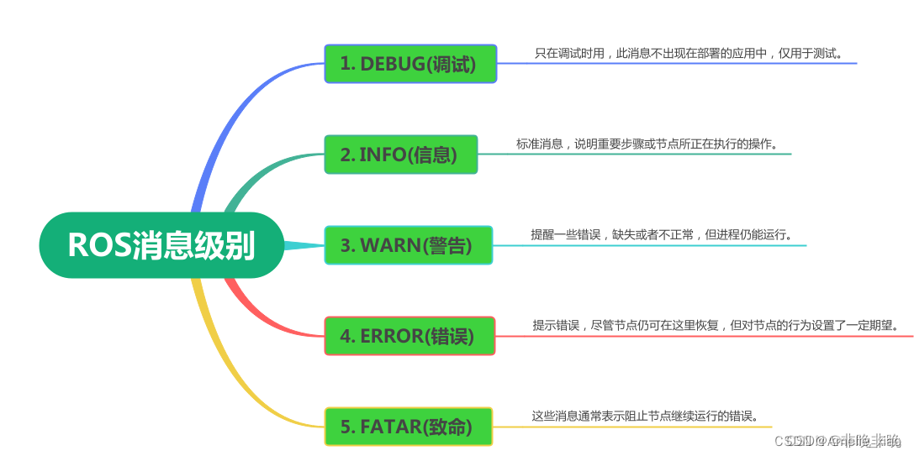
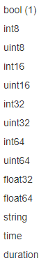
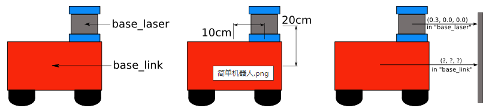
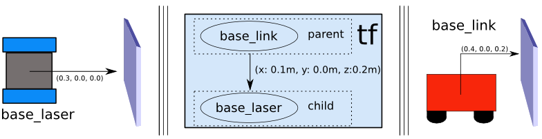

# ROS文件系统（可结合wiki官网）

## ROS中的日志（log）消息

### 日志系统


日志 (`log`) 系统的功能是让程序生成一些日志消息，显示在屏幕上、发送到特定 `topic` 或者储存在特定 `log` 文件中，以方便调试、记录、报警等。


### 日志消息

在ROS中，**有一个特殊的话题叫作`/rosout`，它承载着所有节点的所有日志消息**。`/rosout`消息的类型是`rosgraph_msgs/Log`：


`rosgraph_msgs/Log`消息用来让各个节点发布日志消息，这样一来就能让网络上的任何一个人都看到。

可以认为`/rosout`是一个加强版的`print()`：它不是向终端输出字符串，而是可以将字符串和元数据放到一个消息中，发送给网络上的任何一个人。


### 日志等级

`ROS`有5个日志记录标准级别，这些名称是输出信息的函数的一部分，他们遵循以下语法：

```
ROS_<LEVEL>[_<OTHER>]
```

日志消息按照**严重性由低到高**可以分为 5 级：

- `DEBUG`
- `INFO`
- `WARN`
- `ERROR`
- `FATAL`

每个消息级别用于不同的目的：

- `DEBUG`(调试)：只在调试时用，此消息不出现在部署的应用中，仅用于测试；
- `INFO`(信息)：标准消息，说明重要步骤或节点所正在执行的操作；
- `WARN`(警告)：提醒一些错误、缺失或者不正常，但进程仍能运行；
- `ERROR`(错误)：提示错误，尽管节点仍可在这里恢复，但对节点的行为设置了一定期望；
- `FATAR`(致命)：这些消息通常表示阻止节点继续运行的错误。




### 日志消息的生成

由五个 C++ 宏来产生日志消息，每个宏对应一个级别：

```c++
ROS_DEBUG_STREAM(message);  
ROS_INFO_STREAM(message);  
ROS_WARN_STREAM(message);  
ROS_ERROR_STREAM(message);  
ROS_FATAL_STREAM(message);
```

其实这个宏的定义就把格式输出包含到里面，其中各个宏的参数`message`可以处理`C++`中标准输出流(`ostream`)中的各种表达式，比如：`std::cout`。这包括在 `int` 或者 `double` 这种基本数据类型上使用插入操作符(`<<`)，以及已经重载这个操作符的复合数据类型。

我们经常也能看到不带`_STREAM`的消息，它们的区别如下：

```c++
ROS_INFO(“INFO message %d”,k);  // 相当于c中的printf;
ROS_INFO_STREAM ( "INFO message." << k);  // 相当于c++中的cout;
```


### 日志消息的查看

日志消息有三个不同的输出目的地，包括屏幕、`rosout topic`、`log` 文档。其中发布到 `rosout topic` 的 `msg` 类型是 `rosgraph_msgs/Log`。

我们可以通过`rostopic echo /rosout` 来查看消息，也可以通过一个节点来订阅日志话题，还可以通过指令`rqt_console`来通过图形界面来显示日志消息：


### 日志级别设置

**`ROS` 默认只处理 `INFO` 或者更高级别消息，`DEBUG` 级别的消息会被忽略**。

`rqt`界面配置：

```
rosrun rqt_logger_level rqt_logger_level
```

```
rosrun rqt_console rqt_console
```

会弹出两个窗口：


图中列出了节点列表、日志记录器列表、日志级别列表。在图中操作与 `rosservice` 命令的效果一致。


## 创建ROS软件包

### catkin软件包组成

一个包要想称为catkin软件包，必须符合以下要求：

- 这个包必须有一个符合catkin规范的package.xml文件
  - 这个`package.xml`文件提供有关该软件包的元信息
- 这个包必须有一个catkin版本的CMakeLists.txt文件
  - 如果它是个Catkin元包的话，则需要有一个`CMakeList.txt`文件的相关样板
- 每个包必须有自己的目录
  - 这意味着在同一个目录下不能有嵌套的或者多个软件包存在

最简单的软件包看起来就像这样：

```c++
my_package/
  CMakeLists.txt
  package.xml
```


### 创建catkin工作空间

```c++
$ mkdir -p ~/catkin_ws/src
$ cd ~/catkin_ws/src
$ catkin_init_workspace
```


###创建功能包

```c++
$ cd ~/catkin_ws/src //退回到src目录下
$ catkin_create_pkg <package_name> [depend1] [depend2] [depend3] //其中depend为依赖
```

例如：

```c++
$ catkin_create_pkg beginner_tutorials std_msgs rospy roscpp
```

会**在catkin_ws的src目录下创建一个名为beginner_tutorials的文件夹**，这个文件夹里面包含**一个include目录，一个src目录，一个package.xml文件和一个CMakeLists.txt文件**，两个文件都已经部分填写了你在执行catkin_create_pkg命令时提供的信息。

**所有源码**必须放入**功能包中**中进行编译，其中**src目录下一般放置cpp文件**之类的功能包代码的，**include目录下放置一些比如.h的头文件**

**注意**：同一工作空间下，不能存在同名功能包


#### 一些可能会用到的依赖包

```c++
cpp_common
rostime
roscpp_traits
roscpp_serialization
catkin
genmsg
genpy
message_runtime
gencpp
geneus
gennodejs
genlisp
message_generation
rosbuild
rosconsole
std_msgs
rosgraph_msgs
xmlrpcpp
roscpp
rosgraph
ros_environment
rospack
roslib
rospy
```


####编译catkin工作空间

```c++
$ cd ~/catkin_ws/
$ catkin_make
```

此时**产生devel和build两个目录**，在devel文件夹里面可以看到几个`setup.sh`文件，是开发空间的默认位置；build目录是构建空间的默认位置，同时cmake和make也是在这里被调用来配置和构建软件包。source文件中的任何一个都可以将当前工作空间设置在环境的最顶层。在`~/.bashrc`中最后source的`setup.bash`将是最顶层的工作空间。

```c++
$ catkin_make install
```

此时才会产生intsall文件夹


#### 设置catkin环境变量

```c++
$ source devel/setup.bash //非常重要
//可通过 $ echo $ROS_PACKAGE_PATH 查找ROS功能包的路径
```


####创建自定义msg类型功能包及后续连带操作（可参考http://wiki.ros.org/msg）

可创建一个空的package单独存放msg类型文件，并在其中创建的msg文件夹下新建一个名为`××.msg`消息类型文件（比如`Test.msg`）
msg文件由两部分组成：**字段**和**常量**。字段是消息内部发送的数据，常量定义可用于解释这些字段的有用值（例如，整数值的类似枚举常量）。

- **字段**：字段类型 字段名称

  - **字段类型**：

    int8取值范围是：-128 ~ 127

    int16 意思是16位整数(16bit integer)，相当于short 占2个字节 -32768 — 32767

    int32 意思是32位整数(32bit integer), 相当于 int 占4个字节 -2147483648 —2147483647

    int64 意思是64位整数(64bit interger), 相当于 long long 占8个字节 -9223372036854775808 — 9223372036854775807  

  - 

    

  - **字段名称**：限制为字母字符，后跟字母数字和下划线的任意混合

  - **标头**：**.msg文件的第一个字段为：Header header 必须添加，否则报错**

- 常量：常量类型 常量名称=常量值

例如：int32 X=123；string FOO=foo 

比如Test.msg的内容如下：

```msg
float32[] data
float32 vel
geometry_msgs/Pose pose
string name
```


##### 修改package.xml文件

需要`message_generation`生成C++或Python能使用的代码，需要`message_runtime`提供运行时的支持，所以package.xml中添加以下**两句**：

```xml
<build_depend> message_generation </build_depend>
<exec_depend> message_runtime </exec_depend>
```


##### 修改CMakeLists.txt文件

- 首先调用`find_package`查找依赖的包，必备的有`roscpp、rospy、message_generation`，**其他根据具体类型添加**，比如上面的msg文件中用到了`geometry_msgs/Pose pose`类型，那么必须查找`geometry_msgs`

  ```cmake
  find_package(catkin REQUIRED COMPONENTS roscpp rospy message_generation std_msgs geometry_msgs)
  ```

- 然后是`add_message_files`，指定msg文件

```cmake
add_message_files(
  FILES
  Test.msg
  # Message2.msg
)
```

- 然后是`generate_messages`，指定生成消息文件时的依赖项，比如上面嵌套了其他消息类型`geometry_msgs`，那么必须注明

```cmake
#generate_messages必须在catkin_package前面
generate_messages(
 DEPENDENCIES
 geometry_msgs
)
```

- 然后是`catkin_package`设置运行依赖

```cmake
catkin_package(
CATKIN_DEPENDS message_runtime
)
```


####理解package.xml文件（xml为可拓展标记语言）√

```xml
<?xml version="1.0"?>
<package format="2">
  <name>pix_driver</name>//功能包名字
  <version>0.0.0</version>//版本号
  <description>The pix_driver package</description>//功能包的描述信息

  <!-- One maintainer tag required, multiple allowed, one person per tag -->
  <!-- Example:  -->
  <!-- <maintainer email="jane.doe@example.com">Jane Doe</maintainer> -->
  <maintainer email="team1@todo.todo">team1</maintainer>//维护者的email地址信息

    
  <!-- One license tag required, multiple allowed, one license per tag -->
  <!-- Commonly used license strings: -->
  <!--   BSD, MIT, Boost Software License, GPLv2, GPLv3, LGPLv2.1, LGPLv3 -->
  <license>TODO</license>


  <!-- Url tags are optional, but multiple are allowed, one per tag -->
  <!-- Optional attribute type can be: website, bugtracker, or repository -->
  <!-- Example: -->
  <!-- <url type="website">http://wiki.ros.org/pix_driver</url> -->


  <!-- Author tags are optional, multiple are allowed, one per tag -->
  <!-- Authors do not have to be maintainers, but could be -->
  <!-- Example: -->
  <!-- <author email="jane.doe@example.com">Jane Doe</author> -->


  <!-- The *depend tags are used to specify dependencies -->
  <!-- Dependencies can be catkin packages or system dependencies -->
  <!-- Examples: -->
  <!-- Use depend as a shortcut for packages that are both build and exec dependencies -->
  <!--   <depend>roscpp</depend> -->
  <!--   Note that this is equivalent to the following: -->
  <!--   <build_depend>roscpp</build_depend> -->
  <!--   <exec_depend>roscpp</exec_depend> -->
  <!-- Use build_depend for packages you need at compile time: -->
  <!--   <build_depend>message_generation</build_depend> -->
  <!-- Use build_export_depend for packages you need in order to build against this package: -->
  <!--   <build_export_depend>message_generation</build_export_depend> -->
  <!-- Use buildtool_depend for build tool packages: -->
  <!--   <buildtool_depend>catkin</buildtool_depend> -->
  <!-- Use exec_depend for packages you need at runtime: -->
  <!--   <exec_depend>message_runtime</exec_depend> -->
  <!-- Use test_depend for packages you need only for testing: -->
  <!--   <test_depend>gtest</test_depend> -->
  <!-- Use doc_depend for packages you need only for building documentation: -->
  <!--   <doc_depend>doxygen</doc_depend> -->
    //功能包的依赖
  <buildtool_depend>catkin</buildtool_depend>
  <build_depend>autoware_msgs</build_depend>
  <build_depend>can_msgs</build_depend>
  <build_depend>roscpp</build_depend>
  <build_depend>std_msgs</build_depend>
  <build_depend>pix_driver_msgs</build_depend>
    
  <build_export_depend>autoware_msgs</build_export_depend>
  <build_export_depend>can_msgs</build_export_depend>
  <build_export_depend>roscpp</build_export_depend>
  <build_export_depend>std_msgs</build_export_depend>
  <build_export_depend>pix_driver_msgs</build_export_depend>
    
  <exec_depend>autoware_msgs</exec_depend>
  <exec_depend>can_msgs</exec_depend>
  <exec_depend>roscpp</exec_depend>
  <exec_depend>std_msgs</exec_depend>
  <exec_depend>pix_driver_msgs</exec_depend>


  <!-- The export tag contains other, unspecified, tags -->
  <export>
    <!-- Other tools can request additional information be placed here -->

  </export>
</package>
```


####理解CMakeLists.txt文件（用于编译的cmake规则列表）√

CMake是一个**跨平台的编译 (Build)工具**，可以用简单的语句来描述所有平台的编译过程。 该文件用于编译在 ROS 中编写的程序的命令，还具有将源代码和其他文件转换为可执行文件（即您的计算机可以运行的代码）的命令。

```cmake
cmake_minimum_required(VERSION 3.0.2)
project(pix_driver)

## Compile as C++11, supported in ROS Kinetic and newer
# add_compile_options(-std=c++11)

set(autoware_msgs_DIR ~/autoware.gf2/autoware-1.14/install/autoware_msgs/share/autoware_msgs/cmake/)
set(autoware_vehicle_msgs_DIR /home/t/ros_driver/catkin_ws_msg/devel/share/autoware_vehicle_msgs/cmake/)

## Find catkin macros and libraries
## if COMPONENTS list like find_package(catkin REQUIRED COMPONENTS xyz)
## is used, also find other catkin packages
//找到依赖的功能包
find_package(catkin REQUIRED COMPONENTS
  autoware_msgs
  can_msgs
  roscpp
  std_msgs
  pix_driver_msgs
)

## System dependencies are found with CMake's conventions
# find_package(Boost REQUIRED COMPONENTS system)


## Uncomment this if the package has a setup.py. This macro ensures
## modules and global scripts declared therein get installed
## See http://ros.org/doc/api/catkin/html/user_guide/setup_dot_py.html
# catkin_python_setup()

################################################
## Declare ROS messages, services and actions ##
################################################

## To declare and build messages, services or actions from within this
## package, follow these steps:
## * Let MSG_DEP_SET be the set of packages whose message types you use in
##   your messages/services/actions (e.g. std_msgs, actionlib_msgs, ...).
## * In the file package.xml:
##   * add a build_depend tag for "message_generation"
##   * add a build_depend and a exec_depend tag for each package in MSG_DEP_SET
##   * If MSG_DEP_SET isn't empty the following dependency has been pulled in
##     but can be declared for certainty nonetheless:
##     * add a exec_depend tag for "message_runtime"
## * In this file (CMakeLists.txt):
##   * add "message_generation" and every package in MSG_DEP_SET to
##     find_package(catkin REQUIRED COMPONENTS ...)
##   * add "message_runtime" and every package in MSG_DEP_SET to
##     catkin_package(CATKIN_DEPENDS ...)
##   * uncomment the add_*_files sections below as needed
##     and list every .msg/.srv/.action file to be processed
##   * uncomment the generate_messages entry below
##   * add every package in MSG_DEP_SET to generate_messages(DEPENDENCIES ...)

## Generate messages in the 'msg' folder
# add_message_files(
#   FILES
#   Message1.msg
#   Message2.msg
# )

## Generate services in the 'srv' folder
# add_service_files(
#   FILES
#   Service1.srv
#   Service2.srv
# )

## Generate actions in the 'action' folder
# add_action_files(
#   FILES
#   Action1.action
#   Action2.action
# )

## Generate added messages and services with any dependencies listed here
# generate_messages(
#   DEPENDENCIES
#   autoware_msgs#   can_msgs#   std_msgs
# )

################################################
## Declare ROS dynamic reconfigure parameters ##
################################################

## To declare and build dynamic reconfigure parameters within this
## package, follow these steps:
## * In the file package.xml:
##   * add a build_depend and a exec_depend tag for "dynamic_reconfigure"
## * In this file (CMakeLists.txt):
##   * add "dynamic_reconfigure" to
##     find_package(catkin REQUIRED COMPONENTS ...)
##   * uncomment the "generate_dynamic_reconfigure_options" section below
##     and list every .cfg file to be processed

## Generate dynamic reconfigure parameters in the 'cfg' folder
# generate_dynamic_reconfigure_options(
#   cfg/DynReconf1.cfg
#   cfg/DynReconf2.cfg
# )

###################################
## catkin specific configuration ##
###################################
## The catkin_package macro generates cmake config files for your package
## Declare things to be passed to dependent projects
## INCLUDE_DIRS: uncomment this if your package contains header files
## LIBRARIES: libraries you create in this project that dependent projects also need
## CATKIN_DEPENDS: catkin_packages dependent projects also need
## DEPENDS: system dependencies of this project that dependent projects also need
catkin_package(
 INCLUDE_DIRS include
 LIBRARIES pix_driver
 CATKIN_DEPENDS autoware_msgs can_msgs roscpp std_msgs pix_driver_msgs
# DEPENDS system_lib
)

###########
## Build ##
###########

## Specify additional locations of header files
## Your package locations should be listed before other locations
include_directories(
 include
  ${catkin_INCLUDE_DIRS}
)

## Declare a C++ library
# add_library(${PROJECT_NAME}
#   src/${PROJECT_NAME}/pix_driver.cpp
# )

## Add cmake target dependencies of the library
## as an example, code may need to be generated before libraries
## either from message generation or dynamic reconfigure
# add_dependencies(${PROJECT_NAME} ${${PROJECT_NAME}_EXPORTED_TARGETS} ${catkin_EXPORTED_TARGETS})

## Declare a C++ executable
## With catkin_make all packages are built within a single CMake context
## The recommended prefix ensures that target names across packages don't collide
//把代码编译成可执行文件
add_executable(${PROJECT_NAME}_report_node 
src/report_node.cc
src/steering_report_502.cc
src/Byte.cc
src/gear_report_503.cc
src/bms_report_512.cc
src/brake_report_501.cc
src/park_report_504.cc
src/throttle_report_500.cc
src/vcu_report_505.cc
)

add_executable(${PROJECT_NAME}_command_node
src/command_node.cc
src/brake_command_101.cc
src/gear_command_103.cc
src/park_command_104.cc
src/steering_command_102.cc
src/throttle_command_100.cc
src/vehicle_mode_command_105.cc
src/acu_sweepctrlcmd_107.cc
src/Byte.cc
)

## Rename C++ executable without prefix
## The above recommended prefix causes long target names, the following renames the
## target back to the shorter version for ease of user use
## e.g. "rosrun someones_pkg node" instead of "rosrun someones_pkg someones_pkg_node"
# set_target_properties(${PROJECT_NAME}_node PROPERTIES OUTPUT_NAME node PREFIX "")

## Add cmake target dependencies of the executable
## same as for the library above

//add_dependencies（）为添加依赖项，

add_dependencies(${PROJECT_NAME}_report_node ${${PROJECT_NAME}_EXPORTED_TARGETS} ${catkin_EXPORTED_TARGETS})
add_dependencies(${PROJECT_NAME}_command_node ${${PROJECT_NAME}_EXPORTED_TARGETS} ${catkin_EXPORTED_TARGETS})

## Specify libraries to link a library or executable target against

//target_link_libraries（），用于代码的可执行文件的链接，其中${catkin_LIBRARIES}为ROS基本库

target_link_libraries(${PROJECT_NAME}_report_node
  ${catkin_LIBRARIES}
)

target_link_libraries(${PROJECT_NAME}_command_node
  ${catkin_LIBRARIES}
)

#############
## Install ##
#############

# all install targets should use catkin DESTINATION variables
# See http://ros.org/doc/api/catkin/html/adv_user_guide/variables.html

## Mark executable scripts (Python etc.) for installation
## in contrast to setup.py, you can choose the destination
# catkin_install_python(PROGRAMS
#   scripts/my_python_script
#   DESTINATION ${CATKIN_PACKAGE_BIN_DESTINATION}
# )

## Mark executables for installation
## See http://docs.ros.org/melodic/api/catkin/html/howto/format1/building_executables.html
# install(TARGETS ${PROJECT_NAME}_node
#   RUNTIME DESTINATION ${CATKIN_PACKAGE_BIN_DESTINATION}
# )

## Mark libraries for installation
## See http://docs.ros.org/melodic/api/catkin/html/howto/format1/building_libraries.html
install(TARGETS ${PROJECT_NAME}_report_node
  ARCHIVE DESTINATION ${CATKIN_PACKAGE_LIB_DESTINATION}
  LIBRARY DESTINATION ${CATKIN_PACKAGE_LIB_DESTINATION}
  RUNTIME DESTINATION ${CATKIN_GLOBAL_BIN_DESTINATION}
)

install(TARGETS ${PROJECT_NAME}_command_node
  ARCHIVE DESTINATION ${CATKIN_PACKAGE_LIB_DESTINATION}
  LIBRARY DESTINATION ${CATKIN_PACKAGE_LIB_DESTINATION}
  RUNTIME DESTINATION ${CATKIN_GLOBAL_BIN_DESTINATION}
)

## Mark cpp header files for installation
# install(DIRECTORY include/${PROJECT_NAME}/
#   DESTINATION ${CATKIN_PACKAGE_INCLUDE_DESTINATION}
#   FILES_MATCHING PATTERN "*.h"
#   PATTERN ".svn" EXCLUDE
# )

## Mark other files for installation (e.g. launch and bag files, etc.)
# install(FILES
#   # myfile1
#   # myfile2
#   DESTINATION ${CATKIN_PACKAGE_SHARE_DESTINATION}
# )

#############
## Testing ##
#############

## Add gtest based cpp test target and link libraries
# catkin_add_gtest(${PROJECT_NAME}-test test/test_pix_driver.cpp)
# if(TARGET ${PROJECT_NAME}-test)
#   target_link_libraries(${PROJECT_NAME}-test ${PROJECT_NAME})
# endif()

## Add folders to be run by python nosetests
# catkin_add_nosetests(test)
```


## ROS中计算程序执行时间

### 定时器

#### 创建对象

- 作用：按照一定频率调用回调函数

- 一般用法：

  ```c++
  ros::NodeHandle nh;
  ros::Timer timer = nh.createTimer(ros::Duration period, <callback>, bool oneshot = false);
  ros::spin();
  ```

  其中：

  - period：是调用定时器回调函数时间间隔。

    举例：ros::Duration(0.1)，即每0.1秒执行一次回调函数

  - callback：回调函数名

  - oneshot：默认为false，表示是否只执行一次

  **注意**：一定要用到spin函数


#### 回调函数

- 作用：提供当前定时器的时间信息

- 一般用法：

```c++
void timerCallback(const ros::TimerEvent &e);
```

ros::TimerEvent结构体作为参数传入，它提供时间的相关信息，对于调试和配置非常有用

- ros::TimerEvent结构体格式：

  ```c++
  struct TimerEvent
  {
    Time last_expected;                     
    Time last_real;                        
    Time current_expected;                  
    Time current_real;                     
    struct
    {
      WallDuration last_duration;         
    } profile;
  };
  ```

  -  ros::Time last_expected 上次回调期望发生的时间
  -  ros::Time last_real 上次回调实际发生的时间
  -  ros::Time current_expected 本次回调期待发生的时间
  -  ros::Time current_real 本次回调实际发生的时间
  -  ros::WallTime profile.last_duration 上次回调的时间间隔（结束时间-开始时间），是wall-clock时间


### 其它

- 时间格式

分为**时刻（Time）**和**持续时间（Duration）**，且分为秒（s）和纳秒（ns），换算关系为：`1nsec=1e-9sec`

```c++
int32 sec
int32 nsec
```

- ros::Time::now()

检索当前时间，是**时刻**时间

- ros::Duration

代表**持续的一段**时间，可以是复数

- toSec()

将“1 ros时间格式说明”中所表示的格式**转为秒**（s）

- toNSec()

将时间或时间戳**转为纳秒**（ns）


## 理解ROS节点

节点是ROS软件包中的一个**可执行文件**。ROS节点使用ROS客户端库与其他节点通信，节点可以发布或订阅话题，也可以提供或使用服务。

- roscore=ros+core，是运行所有ROS程序前首先要运行的命令（注：保证**有一个roscore在运行**就够了）
- rospy = Python客户端库
- roscpp = C++客户端库
- rosnode=ros+node，显示当前**正在运行**的ROS节点信息（注：要**保持以前的终端开着**）
- rosout用于收集和记录节点的调试输出，所以总是在运行的
- **rosrun=ros+run，可以用包名直接运行软件包内的节点（而不需要知道包的路径）**


## 理解ROS话题

节点与节点之间是通过一个**ROS话题来相互通信**的。

**rostopic命令工具可获取ROS话题的信息**

**rostopic pub**可以把数据发布到当前某个正在广播的话题上

用法：

```c++
rostopic pub [topic] [msg_type] [args]
```

更多内容可以参考[ROSwiki](http://wiki.ros.org/cn/ROS/Tutorials/UnderstandingTopics#ROS.2Bi92YmA-)


### ROS消息

话题的通信是通过**节点间发送ROS消息**实现的


## ROS中发布者Publisher的编程实现（C++）

### 1.必须包含的**头文件**

`include "ros/ros.h"`

###2.具体代码示例（可结合对应[wiki](http://wiki.ros.org/cn/ROS/Tutorials/WritingPublisherSubscriber%28c%2B%2B%29)）

```c++
#include "ros/ros.h"
#include "std_msgs/String.h"//引用了位于std_msgs包里的std_msgs/String消息
#include <sstream>//用于字符串流操作

int main(int argc, char **argv)
{
  
  // ROS节点初始化
  ros::init(argc, argv, "talker");

  // 创建节点句柄，管理节点资源
  ros::NodeHandle n;

  // 创建一个Publisher，发布名为chatter的主题，消息类型为std_msgs::String，队列长度1000
  ros::Publisher chatter_pub = n.advertise<std_msgs::String>("chatter", 1000);//n为上方句柄；advertise为ROS自带的标准函数，将一个Publisher与特定的消息类型和主题关联起来，使得你的节点能够发布该类型的消息到该主题上
    
  // 设置循环的频率，此处为10Hz
  ros::Rate loop_rate(10);

  int count = 0;
  while (ros::ok())//roscpp将安装一个SIGINT处理程序，它能够处理Ctrl+C操作，让ros::ok()返回false
  {
   //初始化std_msgs::String类型的消息，基于String.msg文件中的定义去进行编译
    std_msgs::String msg;
    std::stringstream ss;
    ss << "hello world " << count;
    msg.data = ss.str();

    ROS_INFO("%s", msg.data.c_str());


    chatter_pub.publish(msg);//发布者把这个信息广播给了任何已连接的节点

    ros::spinOnce();//用来接收回调函数

    loop_rate.sleep();//按照循环频率延时
    ++count;
  }

  return 0;
}
```

**总结：如何实现一个发布者**

- 初始化ROS节点
- 向ROS Master注册节点信息，包括发布的话题名和话题中的消息类型
- 创建消息数据
- 按照一定频率循环发布消息


### 3.函数使用：

`ros::Publisher turtle_vel_pub = n.advertise<消息类型>( “发布话题的名字”, 消息缓冲队列大小, bool latch = false )`

当**latch为默认值=false**时，表示**最新发布的消息不会被保持在主题上**，新的订阅者只有在消息发布时才会接收到消息，而不会立即接收到最新的消息。在这种情况下，新的订阅者只有在有新的消息发布到 `/turtle1/cmd_vel` 主题时才会接收到消息。

当latch=true时，表示**消息将被持久化**，新的订阅者在连接到主题时会立即接收到最新的消息。

**注意：*一般来说，对于静态地图为true，如果没有给出初始地图则为false。***


## ROS中订阅者Subscriber的编程实现(C++)

### 1.必须包含的**头文件**

`include "ros/ros.h"`

###2.具体代码示例（可结合对应[wiki](http://wiki.ros.org/cn/ROS/Tutorials/WritingPublisherSubscriber%28c%2B%2B%29)）

```c++
#include "ros/ros.h"
#include "std_msgs/String.h"

//回调函数，当有新消息到达chatter话题时它就会被调用
void chatterCallback(const std_msgs::String::ConstPtr& msg)//长指针
{
  ROS_INFO("I heard: [%s]", msg->data.c_str());//将接收到的信息打印出来，此处的data应为数据流
}

int main(int argc, char **argv)
{
  ros::init(argc, argv, "listener");

  ros::NodeHandle n;

  ros::Subscriber chatter_sub = n.subscribe("chatter", 1000, chatterCallback);//通过主节点订阅chatter话题，ROS将调用chatterCallback()函数，1000为队列大小

  ros::spin();//循环等待回调函数

  return 0;
}
```

**总结：如何实现一个订阅者**

- 初始化ROS节点
- 订阅需要的话题
- 循环等待话题消息，接收到消息后进入回调函数
- 在回调函数中完成消息处理


## roslaunch的用法

### 使用roslaunch

roslaunch可以用来**启动**定义在launch（启动）文件中的**节点**

- 用法：

```c++
$ roslaunch [package] [filename.launch]
```

- 目的：

通过XML文件实现多节点的配置和启动（**可自动启动ROS Master，即无需单独roscore**）

- launch目录的创建：

```c++
$ mkdir launch
$ cd launch
```


### launch文件基础解析

```xml
<launch>

  <group ns="turtlesim1">
    <node pkg="turtlesim" name="sim" type="turtlesim_node"/>
  </group>

  <group ns="turtlesim2">
    <node pkg="turtlesim" name="sim" type="turtlesim_node"/>
  </group>

  <node pkg="turtlesim" name="mimic" type="mimic">
    <remap from="input" to="turtlesim1/turtle1"/>
    <remap from="output" to="turtlesim2/turtle1"/>
  </node>

</launch>
```

- 以`<launch>`开头（根元素）表明这是一个launch文件，作为**启动标签**，`</launch>`作为**结束标签**

- `<group ns="turtlesim1">，<group ns="turtlesim2">`为创建的**分组**，并以命名空间（namespace）标签来区分

- `<node>`作为**启动节点**

  ```xml
  <node pkg="package-name" type="executable-name" name="node-name"/>
  ```

  - pkg：节点所在的**功能包名称**
  - type：节点的**可执行文件名称**
  - name：节点**运行时的名称**
  - output：控制某节点**打印到**当前**终端**

- `<param>/<rosparam>`：设置**ROS系统运行中的参数**，存储**在参数服务器中**

  ```xml
  <param name="output_frame" value="odom"/>
  ```

  - name：参数名
  - value：参数值

- `<arg>`：launch文件**內部的局部变量**，仅限于**launch文件中**使用

  ```xml
  <arg name="arg-name" default="arg-value"/>
  ```

  - name：参数名
  - value：参数值

  **调用：**

  ```xml
  <param name="foo" default="$(arg arg-name)"/>
  ```

- `<include>`：**包含其它launch文件**，类似C语言中的头文件

  ```xml
   <include file=".../.../other.launch"/>
  ```

  - file：包含的其它launch文件路径

  

- `<remap>`：重映射ROS计算图资源的命名 

  ```xml
  <remap from="/turtlebot/cmd_vel" to="/cmd_vel" />
  ```

  - from：原命名
  - to：映射之后的命名

- 注释：

  ```xml
  <!-- ××× -->
  ```

其中×××为注释部分


## ROS变量初始化大体框架

```python
class ×× ：
    def __init__(self):
        self.speed = 0.0
        self.gear_act = 3
        self.timer = rospy.Time.now().to_sec()  # 获取当前系统时间，并转换为秒数
        self.stop_for_shift = False
        ......
```

等于

```c++
class ×× 
{
 private://成员变量声明
    double speed;
    int gear_act;
    double timer; // 获取当前系统时间，并转换为秒数
    bool stop_for_shift;
    ......
    
 public:
    ××()//创建构造函数
    {
    speed=0.0;
    gear_act=3;,
    timer=ros::Time::now().toSec();// 获取当前系统时间，并转换为秒数
    stop_for_shift=false,
    ......
    }    
}     
```


## 客户端Client的编程实现

### 主程序代码

```c++
#include "ros/ros.h"
#include "beginner_tutorials/AddTwoInts.h"
#include <cstdlib>

int main(int argc, char **argv)
{
  ros::init(argc, argv, "add_two_ints_client");
  if (argc != 3)
  {
    ROS_INFO("usage: add_two_ints_client X Y");
    return 1;
  }

  ros::NodeHandle n;
  //ros::ServiceClient对象的作用是在稍后调用服务
  ros::ServiceClient client = n.serviceClient<beginner_tutorials::AddTwoInts>("add_two_ints");//为add_two_ints服务创建一个客户端
  beginner_tutorials::AddTwoInts srv;
  srv.request.a = atoll(argv[1]);
  srv.request.b = atoll(argv[2]);
  //实例化一个自动生成的服务类，并为它的request成员赋值。一个服务类包括2个成员变量：request和response，以及2个类定义：Request和Response
  if (client.call(srv))//由于服务调用被阻塞，它将在调用完成后返回。如果服务调用成功，call()将返回true，并且srv.response中的值将是有效的。如果调用不成功，则call()将返回false且srv.response的值将不可用。
  {
    ROS_INFO("Sum: %ld", (long int)srv.response.sum);
  }
  else
  {
    ROS_ERROR("Failed to call service add_two_ints");
    return 1;
  }

  return 0;
}
```

**总结：如何实现一个客户端**

- 初始化ROS节点
- 创建一个Client实例
- 发布服务请求数据
- 等待Server处理之后的应答结果


### 配置编译规则

- 设置需要编译的代码和生成的可执行文件
- 设置链接库

在下面的代码添加如下命令：

```cmake
#   ${catkin_LIBRARIES}
# )

add_executable(add_two_ints_client src/add_two_ints_client.cpp)
target_link_libraries(add_two_ints_client ${catkin_LIBRARIES})
add_dependencies(add_two_ints_client beginner_tutorials_gencpp)

#############
## Install ##
#############
```


## 服务端Server的编程实现

### 主程序代码

```c++
#include "ros/ros.h"
#include "beginner_tutorials/AddTwoInts.h"

bool add(beginner_tutorials::AddTwoInts::Request  &req,
         beginner_tutorials::AddTwoInts::Response &res)//提供了AddTwoInts服务，它接受srv文件中定义的请求（request）和响应（response）类型，并返回一个布尔值
{
  res.sum = req.a + req.b;
  ROS_INFO("request: x=%ld, y=%ld", (long int)req.a, (long int)req.b);
  ROS_INFO("sending back response: [%ld]", (long int)res.sum);
  return true;
}
//两个整数被相加，和已经存储在了响应中。然后记录一些有关请求和响应的信息到日志中。完成后，服务返回true。

int main(int argc, char **argv)
{
  ros::init(argc, argv, "add_two_ints_server");
  ros::NodeHandle n;

  ros::ServiceServer service = n.advertiseService("add_two_ints", add);
  ROS_INFO("Ready to add two ints.");
  ros::spin();

  return 0;
}
```

**总结：如何实现一个服务端**

- 初始化ROS节点
- 创建一个Server实例
- 循环等待服务请求，进入回调函数
- 在回调函数中完成服务功能的处理，并反馈应答数据


### 配置编译规则

- 设置需要编译的代码和生成的可执行文件
- 设置链接库

在下面的代码添加如下命令：

```cmake
#   ${catkin_LIBRARIES}
# )

add_executable(add_two_ints_server src/add_two_ints_server.cpp)
target_link_libraries(add_two_ints_server ${catkin_LIBRARIES})
add_dependencies(add_two_ints_server beginner_tutorials_gencpp)

#############
## Install ##
#############
```


## ROS坐标管理系统—TF功能包

tf tree定义了不同坐标系之间的平移和旋转的偏移量。

案例：

该机器人具有一个移动底座，其顶部安装有单个激光器。在提到机器人时，我们定义两个坐标系：一个对应于机器人底座的中心点，另一个对应于安装在底座顶部的激光器的中心点。我们将连接到移动底座的坐标系称为“base_link”（为了导航，将其放置在机器人的旋转中心很重要），我们将连接到激光器的坐标系称为“base_laser”。

假设我们知道激光器安装在移动底座中心点前方 10 厘米和上方 20 厘米处。这给了我们一个将“base_link”坐标系与“base_laser”坐标系关联起来的平移偏移量。具体来说，我们知道要从“base_link”坐标系获取数据到“base_laser”坐标系，我们必须应用 (x: 0.1m, y: 0.0m, z: 0.2m) 的平移，并从“将“base_laser”坐标系转换为“base_link”坐标系，我们必须应用相反的平移（x：-0.1m，y：0.0m，z：-0.20m）。

**我们可以使用tf定义“base_link”和“base_laser”之间的关系，并让它为我们管理两个坐标系之间的转换。**



我们将创建两个节点，一个用于“base_link”坐标系，一个用于“base_laser”坐标系。

**注意：我们首先需要决定哪个节点将是父节点，哪个节点将是子节点，因为tf 假设==所有转换都从父级移动到子级==。**

这里我们**选择“base_link”坐标系作为父坐标系**，因为当其他部件/传感器添加到机器人中时，通过遍历“base_link”坐标系将它们与“base_laser”坐标系关联起来最有意义。

这意味着与连接“base_link”和“base_laser”的边相关的变换应该是（x：0.1m，y：0.0m，z：0.2m）。设置此变换树后，将“base_laser”帧中接收的激光扫描转换为“base_link”帧就像调用 tf 库一样简单。


### tf关系可视化

- 语言可视化

```
rosrun tf view_frames
```

- 命令行可视化

```
rosrun tf tf_echo 坐标系1 坐标系2
```

- 地图可视化

```
rosrun rviz rviz -d ...
```


### 代码编写

- 首先，我们将首先为源代码创建一个包，并为其指定一个简单的名称，例如“robot_setup_tf”。我们将依赖于roscpp、tf和Geometry_msgs。

```
catkin_create_pkg robots_setup_tf roscpp rospy tf Geometry_msgs
```

- 之后，我们需要创建一个节点来完成通过ROS广播base_laser→ base_link转换的工作。在刚刚创建的`robots_setup_tf`包中，并将以下代码粘贴到`src/tf_broadcaster.cpp`文件中。


#### tf广播器代码

```c++
#include <ros/ros.h>
#include <tf/transform_broadcaster.h>

int main(int argc, char** argv){
  ros::init(argc, argv, "robot_tf_publisher");
  ros::NodeHandle n;

  ros::Rate r(100);

  tf::TransformBroadcaster broadcaster;

  while(n.ok()){
    broadcaster.sendTransform(
      tf::StampedTransform(
        tf::Transform(tf::Quaternion(0, 0, 0, 1), tf::Vector3(0.1, 0.0, 0.2)),
        ros::Time::now(),"base_link", "base_laser"));
    r.sleep();
  }
}
```

tf 包提供了`tf::TransformBroadcaster`的实现，创建一个`TransformBroadcaster`对象。

`使用TransformBroadcaster`发送转换需要五个参数。首先，我们传入旋转变换，该变换由 btQuaternion 指定`，`用于需要在两个坐标系之间发生的任何旋转。在这种情况下，我们不想应用旋转，因此我们发送一个由俯仰、滚动和偏航值构造而成的`btQuaternion`，其值为零。其次，`btVector3`用于我们想要应用的任何翻译。然而，我们确实想要应用平移，因此我们创建了一个`btVector3`，对应于激光距机器人底座 10 厘米的 x 偏移和 20 厘米的 z 偏移。第三，我们需要为正在发布的转换提供一个时间戳，我们只需使用`ros::Time::now() 来`标记它。第四，我们需要传递我们正在创建的链接的父节点的名称，在本例中为“base_link”。第五，我们需要传递我们正在创建的链接的子节点的名称，在本例中为“base_laser”。

- 如何实现一个tf广播器

1. 定义tf广播器（TransformBroadcaster）
2. 创建坐标变换值
3. 发布坐标变换


#### tf监听器代码

我们创建了一个通过 ROS 发布`base_laser` → `base_link`转换的节点。现在，我们将编写一个节点，该节点将使用该变换来获取“base_laser”框架中的一个点，并将其转换为“base_link”框架中的一个点。

在`robots_setup_tf包中，创建一个名为``src/tf_listener.cpp`的文件并粘贴以下内容：

```c++
#include <ros/ros.h>
#include <geometry_msgs/PointStamped.h>
#include <tf/transform_listener.h>

void transformPoint(const tf::TransformListener& listener){
  //我们将在base_laser坐标系中创建一个点，并将其转换为base_link坐标系
  geometry_msgs::PointStamped laser_point;
  laser_point.header.frame_id = "base_laser";

  //我们将仅使用可用于我们的简单示例的最新转换
  laser_point.header.stamp = ros::Time();

  //只是空间中的任意点
  laser_point.point.x = 1.0;
  laser_point.point.y = 0.2;
  laser_point.point.z = 0.0;

  try{
    geometry_msgs::PointStamped base_point;
    listener.transformPoint("base_link", laser_point, base_point);

    ROS_INFO("base_laser: (%.2f, %.2f. %.2f) -----> base_link: (%.2f, %.2f, %.2f) at time %.2f",
        laser_point.point.x, laser_point.point.y, laser_point.point.z,
        base_point.point.x, base_point.point.y, base_point.point.z, base_point.header.stamp.toSec());
  }
  catch(tf::TransformException& ex){
    ROS_ERROR("Received an exception trying to transform a point from \"base_laser\" to \"base_link\": %s", ex.what());
  }
}

int main(int argc, char** argv){
  ros::init(argc, argv, "robot_tf_listener");
  ros::NodeHandle n;

  tf::TransformListener listener(ros::Duration(10));

  //我们每秒变换一个点一次
  ros::Timer timer = n.createTimer(ros::Duration(1.0), boost::bind(&transformPoint, boost::ref(listener)));

  ros::spin();

}
```


- 如何实现一个tf监听器

1. 定义tf监听器（TransformListener）
2. 查找坐标变换（waitForTransform,lookupTransform）


#### 构建代码

打开由`roscreate-pkg`自动生成的`CMakeLists.txt`文件，并将以下行添加到文件底部。

```cmake
add_executable(tf_broadcaster src/tf_broadcaster.cpp)
add_executable(tf_listener src/tf_listener.cpp)
target_link_libraries（tf_broadcaster ${catkin_LIBRARIES}）
target_link_libraries（tf_listener ${catkin_LIBRARIES}）
```


#### 运行代码

```
roscore
rosrun robots_setup_tf tf_broadcaster
rosrun robots_setup_tf tf_listener
```


### tf的一些实用操作

**在终端中直接执行下列命令：**

- 使用`rostopic`查看话题，包含`/tf`与`/tf_static`, 前者是 TF 发布的话题，后者是 TF2 发布的话题，分别调用命令打印二者的话题消息

  `rostopic echo /tf`: 当前会循环输出坐标系信息

  `rostopic echo /tf_static`: 坐标系信息只有一次

  **特别说明:TF的static_transform_publisher是假的静态TF(还是有频率,一些代码使用的时候还是会涉及到时间戳的问题),而TF2的static_transform_publisher才是真正的静态**

  - 例如autoware中的runtime manager,其中默认的发布base_link_2_velodyne的方式是TF,有时候在仿真的时候会引起时间戳的报错.改称tf2的方式就好了:

    ```
    <!-- tf代表是tf1，tf1的静态发布static_transform_publisher其实是假的，默认按照10hz，或者可以设置 -->
    <node pkg="tf" type="static_transform_publisher" name="base_link_to_localizer" args="$(arg x) $(arg y) $(arg z) $(arg yaw) $(arg pitch) $(arg roll) $(arg frame_id) $(arg child_frame_id) $(arg period_in_ms)"/>
    ```

    ```
    <!-- 建议使用tf2，tf2的静态发布是真的。tf2的静态发布节点包在tf2_ros中 -->
    <node pkg="tf2_ros"  type="static_transform_publisher" name="base_link_to_localizer" args="$(arg x) $(arg y) $(arg z) $(arg yaw) $(arg pitch) $(arg roll) $(arg frame_id) $(arg child_frame_id)" />
    ```


- `tf_monitor` ：将当前的坐标系转换关系打印到终端控制台

  ```
  rosrun tf tf_monitor
  ```

  

- `tf_monitor <source_frame> <target_target>`：打印特定的坐标系关系

  ```
  rosrun tf tf_monitor /map /base_link
  ```

  

- **`tf_echo <source_frame> <target_frame>` ：把特定的坐标系之间的平移旋转关系，打印到终端控制台**

  ```
  rosrun tf tf_echo /map /base_link
  ```

  

- 在终端临时发布坐标系间的关系

  ```
  # TF2
  rosrun tf2_ros static_transform_publisher 0 0 0 0 0 0 /base_link /laser
  # TF
  rosrun tf static_transform_publisher 0 0 0 0 0 0 /base_link /laser 100
  ```

  

# Python与C++编译区别

## 话题订阅

举例：

- python下：

```python
from pix_driver_msgs.msg import GearReport
def __init__(self): #前提
self.sub_gear_report = rospy.Subscriber('/pix/gear_report', GearReport, self.gear_report_callback)
def gear_report_callback(self, msg):
```

- C++下：

```c++
#include "pix_driver_msgs/GearReport.h"
ros::Subscriber sub_gear_report; //前提
ros::NodeHandle nh; //前提
sub_gear_report= nh.subscribe("/pix/gear_report", 1, &ControlConverter::gear_report_callback,this);
void ControlConverter::gear_report_callback(const pix_driver_msgs::GearReport::ConstPtr &msg)
```

- ==区别==：

  - **消息类型**（GearReport）**放的位置不同**

    - 原因：**在C++中**，当你使用`&ControlConverter::gear_report_callback`时，编译器知道这是一个`ControlConverter`类的成员函数，因此可以根据函数签名推断消息类型，因此在订阅主题时**可以省略消息类型**。

      ​            **在python中**，由于动态类型和运行时类型推断的特性，需要**显式地提供消息类型**，即`GearReport`，以便在运行时进行正确的订阅。

  - **ConstPtr的用法**

    - 在ROS中， `ConstPtr`是一个**智能指针**类型，指向常量的消息对象。此处表示一个常量引用，该引用指向`pix_driver_msgs::GearReport`的消息类型。

