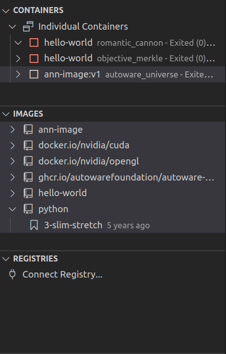
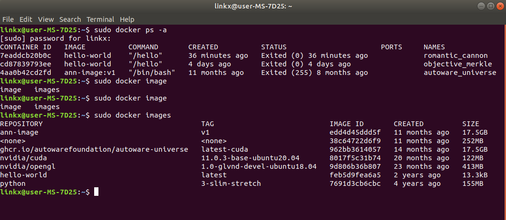
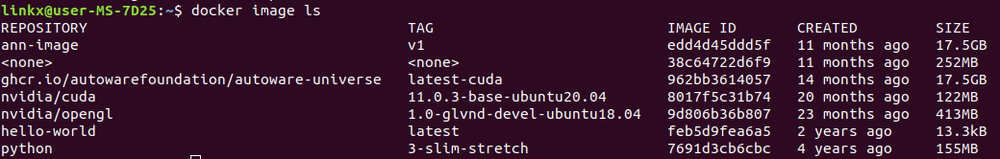
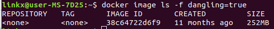
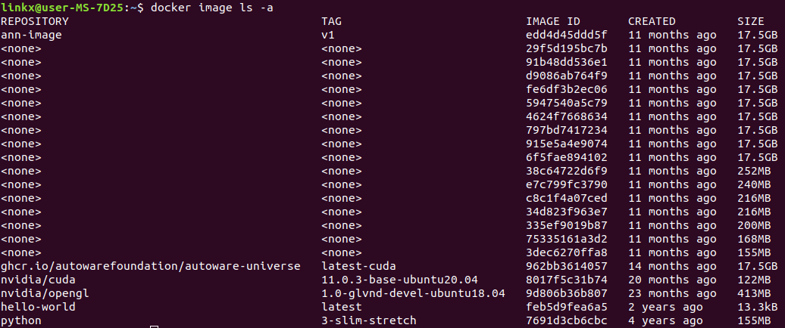
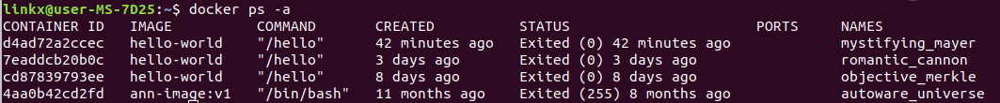
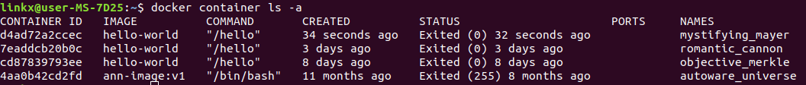

# Docker学习笔记

推荐参考官方文档进行学习

再提供一个中文文档：[Docker—从入门到实践](https://yeasy.gitbook.io/docker_practice/)


## 1. Docker安装

Docker官方提供桌面版的Docker软件（wins/linux/mac）：[Docker Desktop](https://www.docker.com/)

在linux系统中，可以直接使用包管理工具，如ubuntu中的apt

- 在VSCODE中，非常推荐安装Docker的扩展，可以提供Dockerfile的语法检测、代码高亮、自动补全等

  也可以在菜单运行各种Docker命令，并且在左侧面板中也可以看到创建的所有镜像、容器等等

- 需要在安装Docker之后，然后在VSCODE中安装插件


### 1.1 安装Docker步骤

[docker配置官方教程](https://github.com/autowarefoundation/autoware_ai_documentation/wiki/docker-installation)

- 删除旧版或者不兼容版本的Docker

  ```
  $ sudo apt-get remove docker docker-engine docker.io
  ```

- 安装依赖

  ```
  $ sudo apt-get update
  $ sudo apt-get install apt-transport-https ca-certificates curl software-properties-common
  ```

- 添加Docker官方的GPG密钥

  ```
  $ curl -fsSL https://download.docker.com/linux/ubuntu/gpg | sudo apt-key add -
  ```

- 密钥验证

  ```
  $ sudo apt-key fingerprint 0EBFCD88
  ```

- 添加Docker源到系统

  ```
  $ sudo add-apt-repository "deb [arch=amd64] https://download.docker.com/linux/ubuntu $(lsb_release -cs) stable"
  ```

- 安装Docker

  ```
  $ sudo apt-get update
  $ sudo apt-get install docker-ce
  ```

- 测试安装是否成功

  ```
  $ sudo docker run hello-world
  ```


### 1.2 安装nvidia-docker2

nvidia-docker2是对docker的封装，提供一些必要的组件可以很方便的在容器中使用GPU资源执行代码，nvidia-docker2共享了宿主机的CUDA Driver 通过命令行直接安装

```
$ sudo apt install nvidia-docker2
```

但有可能报软件定位失败错误`E:Unable to locate package nvidia-docker2` 可以通过如下命令解决

```
$ curl -s -L https://nvidia.github.io/nvidia-docker/gpgkey | \
  sudo apt-key add -
$ distribution=$(. /etc/os-release;echo $ID$VERSION_ID)
$ curl -s -L https://nvidia.github.io/nvidia-docker/$distribution/nvidia-docker.list | \
  sudo tee /etc/apt/sources.list.d/nvidia-docker.list
$ sudo apt-get update
$ sudo apt-get install -y nvidia-docker2
```

安装完毕后重启docker使之生效

```
$ sudo systemctl daemon-reload
$ sudo systemctl restart docker
```


### 1.3 将docker添加到用户组

在ubuntu中，docker默认是root用户**（即每一条docker命令都要加上sudo前缀）**

如果想要在普通用户下使用docker（**即docker命令不需要再加sudo前缀**），需要将docker添加到用户组，方法如下：

```
$ sudo gpasswd -a <your username> docker   # 将用户添加到docker组中
$ newgrp docker   # 更新docker组
$ reboot  # 重启电脑生效
```


### 1.4 vscode docker插件

VSCODE的Docker插件安装后，一般也无法立即使用，需要进行一些配置，否则直接显示`Failed to connect. Is docker running?`

原因分析：

- 原因是docker使用unix socket进行通讯，但是unix socket属于root用户，但是普通用户需要使用sudo才能开启root权限，但是普通的操作并没有root权限。

有两种配置方法：

- 方法一（**未验证过**）

  ```
  sudo groupadd docker          #添加docker用户组
  sudo gpasswd -a $USER docker  #将当前用户添加至docker用户组
  newgrp docker                 #更新docker用户组
  
  reboot                        # 重启电脑
  ```

- 方法二（**验证过**）

  ```
  sudo chmod 777 /var/run/docker.sock
  ```

  然后重启VSCODE即可生效



**在安装完docker后，我们同样可以在本地文件夹(apt安装的docker的默认位置为/var/lib/docker)查找到镜像images和容器containers**

==**使用`sudo docker ps -a`查询所有容器，使用`sudo docker images`查询所有镜像：如下图所示，containers下面的容器数量与查询数量一致，且id对应**==




## 2. 一些概念

### 2.1 镜像

操作系统分为 **内核** 和 **用户空间**：

- 对于 `Linux` 而言，内核启动后，会挂载 `root` 文件系统为其提供用户空间支持


- **Docker 镜像**（`Image`），就相当于是一个 `root` 文件系统。比如官方镜像 `ubuntu:18.04` 就包含了完整的一套 Ubuntu 18.04 最小系统的 `root` 文件系统

==**镜像并非是像一个 `ISO` 那样的打包文件，镜像只是一个虚拟的概念，其实际体现并非由一个文件组成，而是由一组文件系统组成，或者说，由多层文件系统联合组成。**==

- **分层存储**：镜像构建时，会一层层构建，前一层是后一层的基础。每一层构建完就不会再发生改变，后一层上的任何改变只发生在自己这一层。

  **在构建镜像的时候，需要额外小心，每一层尽量只包含该层需要添加的东西，任何额外的东西应该在该层构建结束前清理掉。**


### 2.2 容器

镜像（`Image`）和容器（`Container`）的关系，就像是面向对象程序设计中的 `类` 和 `实例` 一样，镜像是静态的定义，容器是镜像运行时的实体。容器可以被创建、启动、停止、删除、暂停等。

容器的实质是进程，但与直接在宿主执行的进程不同，容器进程运行于属于自己的独立的命名空间。因此容器可以拥有自己的 `root` 文件系统、自己的网络配置、自己的进程空间，甚至自己的用户 ID 空间。

像是运行在一个隔离的环境里，使用起来就像是在一个独立于宿主的系统下操作一样，这种特性使得容器封装的应用比直接在宿主运行更加安全。

- **容器存储层**：每一个容器运行时，是以镜像为基础层，在其上创建一个当前容器的存储层，该存储层为容器运行时读写而准备的。

  它的生存周期和容器一样，容器消亡时，容器存储层也随之消亡。因此，任何保存于容器存储层的信息都会随容器删除而丢失。

**按照 Docker 最佳实践的要求，容器不应该向其存储层内写入任何数据，容器存储层要保持无状态化。**

所有的文件写入操作，都应该使用**数据卷**或者**绑定宿主目录**，这些位置的读写可以跳过容器存储层，直接对宿主发生读写，其性能和稳定性更高。**数据卷的生存周期独立于容器，容器消亡，数据卷不会消亡。使用数据卷后，容器删除或者重新运行之后，数据却不会丢失。**


### 2.3 仓库

镜像构建完成后，可以很容易的在当前宿主机上运行

但是，如果需要在其它服务器上使用这个镜像，我们就需要一个集中的存储、分发镜像的服务，Docker Registry就是这样的服务

一个 **Docker Registry** 中可以包含多个 **仓库**（`Repository`）；每个仓库可以包含多个 **标签**（`Tag`）；每个标签对应一个镜像。

我们可以通过 `<仓库名>:<标签>` 的格式来指定具体是这个软件哪个版本的镜像。如果不给出标签，将以 `latest` 作为默认标签。

- 以 [Ubuntu 镜像](https://hub.docker.com/_/ubuntu) 为例，`ubuntu` 是仓库的名字，其内包含有不同的版本标签，如，`16.04`, `18.04`。我们可以通过 `ubuntu:16.04`，或者 `ubuntu:18.04` 来具体指定所需哪个版本的镜像。如果忽略了标签，比如 `ubuntu`，那将视为 `ubuntu:latest`。


## 3. 镜像

### 3.1 获取镜像

Docker运行容器前需要本地存在对应的镜像，如果本地不存在该镜像，Docker会从镜像仓库下载该镜像，比如在[Docker Hub](https://hub.docker.com/search?q=&type=image)上有大量的高质量镜像可以使用

从仓库获取镜像的命令是 `docker pull`。其命令格式为：

```
$ docker pull [选项] [Docker Registry 地址[:端口号]/]仓库名[:标签]
```

具体可通过 `docker pull --help` 命令看到

- Docker 镜像仓库地址：地址的格式一般是 `<域名/IP>[:端口号]`。默认地址是 Docker Hub(`docker.io`)。

- 仓库名：如之前所说，这里的仓库名是两段式名称，即 `<用户名>/<软件名>`。**对于 Docker Hub，如果不给出用户名，则默认为 `library`，也就是官方镜像。**

  例如如下命令

  ```
  $ docker pull ubuntu:18.04
  18.04: Pulling from library/ubuntu
  92dc2a97ff99: Pull complete
  be13a9d27eb8: Pull complete
  c8299583700a: Pull complete
  Digest: sha256:4bc3ae6596938cb0d9e5ac51a1152ec9dcac2a1c50829c74abd9c4361e321b26
  Status: Downloaded newer image for ubuntu:18.04
  docker.io/library/ubuntu:18.04
  ```

  上面的命令中没有给出 Docker 镜像仓库地址，因此将会从 Docker Hub （`docker.io`）获取镜像。而镜像名称是 `ubuntu:18.04`，因此将会获取官方镜像 `library/ubuntu` 仓库中标签为 `18.04` 的镜像。`docker pull` 命令的输出结果最后一行给出了镜像的完整名称，即： `docker.io/library/ubuntu:18.04`。

从下载过程中可以看到我们之前提及的分层存储的概念，镜像是由多层存储所构成。下载也是一层层的去下载，并非单一文件。下载过程中给出了每一层的 ID 的前 12 位。并且下载结束后，给出该镜像完整的 `sha256` 的摘要，以确保下载一致性。

在使用上面命令的时候，你可能会发现，你所看到的层 ID 以及 `sha256` 的摘要和这里的不一样。这是因为官方镜像是一直在维护的，有任何新的 bug，或者版本更新，都会进行修复再以原来的标签发布，这样可以确保任何使用这个标签的用户可以获得更安全、更稳定的镜像。


以上面的 `ubuntu:18.04` 为例，如果我们打算启动里面的 `bash` 并且进行交互式操作的话，可以执行下面的命令：

```
$ docker run -it (--rm) ubuntu:18.04 /bin/bash
```

**注意：`docker run` 后面指定的是一个镜像，是利用镜像生成容器，并启动容器**

上面用到的参数含义如下：

- `-it`：这是**两个参数**，**一个是 `-i`：交互式操作，一个是 `-t` ：生成一个终端**。

  我们这里打算进入 `bash` 执行一些命令并查看返回结果，因此我们需要交互式终端。

- `--rm`：这个参数是说容器退出后随之将其删除。**默认情况下，为了排障需求，退出的容器并不会立即删除**，除非手动 `docker rm`。**我们这里只是随便执行个命令，看看结果，不需要排障和保留结果，因此使用 `--rm` 可以避免浪费空间。**

- `ubuntu:18.04`：这是指用 `ubuntu:18.04` 镜像为基础来启动容器。

- `/bin/bash`：放在镜像名后的是 **命令**，这里我们希望有个交互式 Shell，因此用的是 `/bin/bash`。

这里，我们执行了 `cat /etc/os-release`，这是 Linux 常用的查看当前系统版本的命令，从返回的结果可以看到容器内是 `Ubuntu 18.04.1 LTS` 系统。


- 注意：也可以添加-d来指定容器的运行模式，如一般情况下我们希望docker在后台运行，则可以使用如下命令

  ```
  $ docker run -itd --name ubuntu-test ubuntu:18.04 bash
  ```

  - `ubuntu:18.04`这种写法是必须的，如果仅仅只写了`docker run -itd --name ubuntu-test ubuntu bash`，它会先报错`ubuntu:latest`不存在，然后再pull一个最新的ubuntu（**加版本是因为你在pull的时候也加了版本**）
  
  - **注意**：容器是否会长久运行，是和 `docker run` 指定的命令有关，和 `-d` 参数无关。
  
  - 使用 `-d` 参数启动后会返回一个唯一的 id，也可以通过如下命令来查看容器信息
  
    ```
    $ docker container ls
    ```

在添加-d后默认不会进入容器，但已经创建了一个新的正在运行的容器，要想进入容器需要使用指令**`docker exec`(后面介绍)** 启动后会进入容器环境


### 3.2 列出镜像

#### 3.2.1 列出全部镜像

可使用以下命令

```
$ docker image ls
```



列表包含了 `仓库名`、`标签`、`镜像 ID`、`创建时间` 以及 `所占用的空间`。

- **镜像 ID**则是镜像的唯一标识，一个镜像可以对应多个**标签**

这里面所显示的`SIZE`大小实际为：**镜像下载到本地后，展开后的各层所占空间的总和**

- **注意**：`docker image ls` 列表中的镜像体积总和并非是所有镜像实际硬盘消耗，实际镜像硬盘占用空间很可能要比这个列表镜像大小的总和要小的多


#### 3.2.2 列出部分镜像

1. 根据仓库名列出镜像

   ```
   $ docker image ls ubuntu
   ```

2. 制定仓库名和标签

   ```
   $ docker image ls ubuntu:18.04
   ```


### 3.3 虚悬镜像

上面的镜像列表中，还可以看到一个特殊的镜像，这个镜像既没有仓库名，也没有标签，均为 `<none>`。

- 原因：由于新旧镜像同名，旧镜像名称被取消，从而出现仓库名、标签均为 `<none>` 的镜像


用如下命令可以专门显示这类镜像

```
$ docker image ls -f dangling=true
```



一般来说，虚悬镜像已经失去了存在的价值，是可以随意删除的，可以用下面的命令删除。

```
$ docker image prune
```


### 3.4 中间层镜像

默认的 `docker image ls` 列表中只会显示顶层镜像，如果希望显示包括中间层镜像在内的所有镜像的话，需要加 `-a` 参数。

```
$ docker image ls -a
```



这样会看到很多无标签的镜像，与之前的虚悬镜像不同，这些无标签的镜像很多都是中间层镜像，是其它镜像所依赖的镜像。

- **注意**：这些无标签镜像不应该删除，否则会导致上层镜像因为依赖丢失而出错（也没必要删除，因为只要删除那些依赖它们的镜像后，这些依赖的中间层镜像也会被连带删除）


### 3.5 删除本地镜像

- ==**注意：删除某个镜像前，需要先删除依赖于该镜像的容器！！！！！！！**==

可以使用 `docker image rm` 命令，其格式为：

```
$ docker image rm [选项] <镜像1> [<镜像2> ...]
```

其中，`<镜像>` 可以是 `镜像短 ID`、`镜像长 ID`、`镜像名` 或者 `镜像摘要`，以下以电脑中已有的`ann-image`镜像举例

- 使用`镜像ID`删除

`docker image ls` 默认列出的**IMAGE ID就已经是短 ID 了，一般取前3个字符以上，只要足够区分于别的镜像就可以了。**

```
$ docker image rm edd
```

- 使用`镜像名`删除

  ```
  $ docker image rm ann-image
  ```

- 使用`镜像摘要`删除(更加精确)

  ```
  $ docker image ls --digests
  
  $ docker image rm [REPOSITORY]@[DIGEST]
  ```


## 4. 容器

容器是独立运行的一个或一组应用，以及它们的运行态环境。

对应的，虚拟机可以理解为模拟运行的一整套操作系统（提供了运行态环境和其他系统环境）和跑在上面的应用。


### 4.1 查询所有容器

可使用如下命令

```
$ docker ps -a
```




### 4.2 新建并启动容器

主要命令为`docker run`

可以参考前面[获取镜像](###3.1 获取镜像)下内容

当利用 `docker run` 来创建容器时，Docker 在后台运行的标准操作包括：

- 检查本地是否存在指定的镜像，不存在就从 [registry](https://yeasy.gitbook.io/docker_practice/repository) 下载
- 利用镜像创建并启动一个容器
- 分配一个文件系统，并在只读的镜像层外面挂载一层可读写层
- 从宿主主机配置的网桥接口中桥接一个虚拟接口到容器中去
- 从地址池配置一个 ip 地址给容器
- 执行用户指定的应用程序
- 执行完毕后容器被终止


### 4.3 启动已终止容器

通常情况下可以使用命令

```
docker start ×××
```

其中×××为`容器ID`，支持模糊搜索（即ID的前几位即可）


也可以利用如下命令，直接将一个已经终止（`exited`）的容器启动运行。

```
$ docker container start 
```

**注意：start是启动一个之前生成过的容器，而run是利用镜像生成容器，并启动容器**


### 4.4 终止容器

对于上一章节中只启动了一个终端的容器，**用户通过 `exit` 命令或 `Ctrl+d` 来退出终端时，所创建的容器立刻终止**。

- 终止状态的容器可以用如下命令看到

  ```
  $ docker container ls -a
  ```

  

  处于终止状态的容器，可以通过 `docker container start` 命令来重新启动。

- 可以通过命令将一个运行态的容器终止，并重新启动

  ```
  $ docker restart <容器ID>
  ```

  这里的容器ID同样支持模糊搜索


### 4.5 进入容器（直接调试）

在使用 `-d` 参数时，容器启动后会进入后台

某些时候需要进入容器进行操作，**推荐使用`exec`命令而不使用`attach`命令，后者退出容器会导致容器的停止**

```
$ docker exec -it <容器ID> /bin/bash
```


### 4.6 导出和导入容器

实现在现有镜像（如ubuntu基础镜像）上搭建环境，进行二次封装

- 导出容器—`docker export`

  ```
  $ docker container ls -a
  CONTAINER ID        IMAGE               COMMAND             CREATED             STATUS                    PORTS               NAMES
  7691a814370e        ubuntu:18.04        "/bin/bash"         36 hours ago        Exited (0) 21 hours ago                       test
  $ docker export 7691a814370e > ubuntu.tar
  ```

  这将导出ID为769的容器快照到本地文件ubuntu.tar

- 导入容器—`docker import`

  ```
  docker import ×××.tar [REPOSITORY]
  ```

  

### 4.7 删除容器

如果要删除一个运行中的容器，可以添加 `-f` 参数。

```
$ docker rm -f <容器ID>
```

用下面的命令可以清理掉所有处于终止状态的容器

```
$ docker container prune
```


## 5. 仓库

仓库是**集中存放镜像的地方**

仓库可以被认为是一个具体的项目或目录。例如对于仓库地址 `docker.io/ubuntu` 来说，`docker.io` 是注册服务器地址，`ubuntu` 是仓库名


可以在[Docker Hub](https://hub.docker.com/)上免费注册一个账号，可以非常便捷地利用一条命令将build好的镜像push到Docker Hub


### 5.1 拉取镜像

可以通过 `docker search` 命令来查找官方仓库中的镜像，并利用 `docker pull` 命令来将它下载到本地

根据是否是官方提供，可将镜像分为两类。

一种是类似 `centos` 这样的镜像，被称为基础镜像或根镜像。这些基础镜像由 Docker 公司创建、验证、支持、提供。这样的镜像往往使用单个单词作为名字。

还有一种类型，比如 `ansible/centos7-ansible` 镜像，它是由 Docker Hub 的注册用户创建并维护的，往往带有用户名称前缀。可以通过前缀 `username/` 来指定使用某个用户提供的镜像，比如 ansible 用户。

例如，下载官方`centos`镜像到本地，命令为

```
$ docker pull centos
```


### 5.2 推送镜像

可以在登录Docker Hub后通过 `docker push` 命令来将自己的镜像推送到上面 


