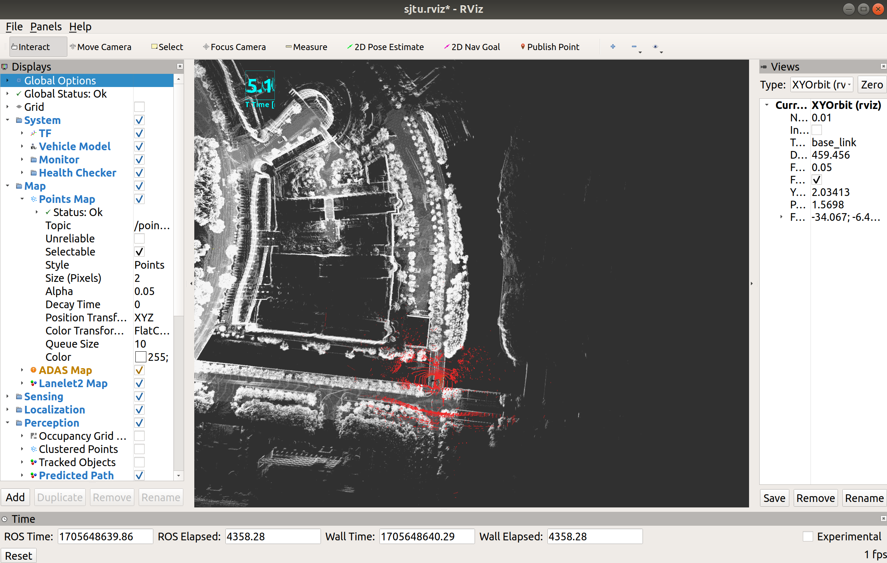
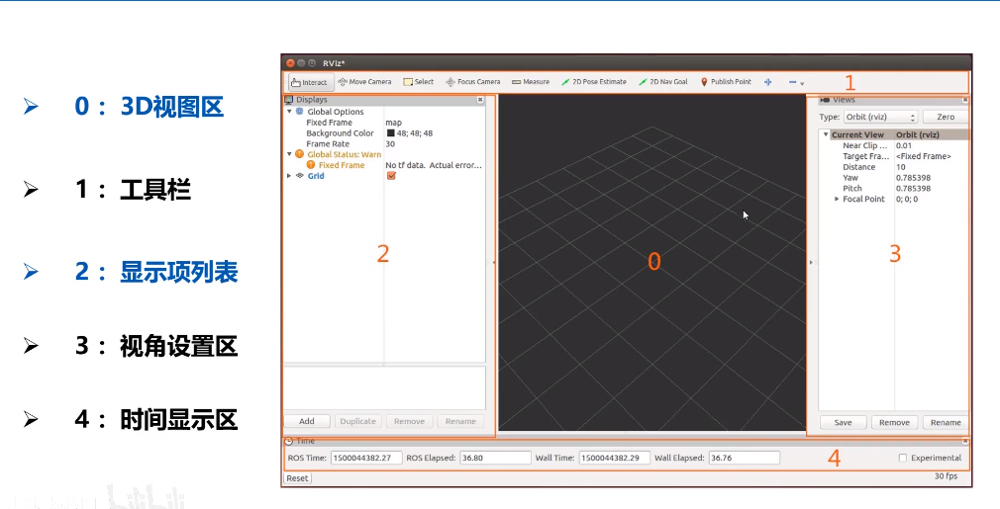
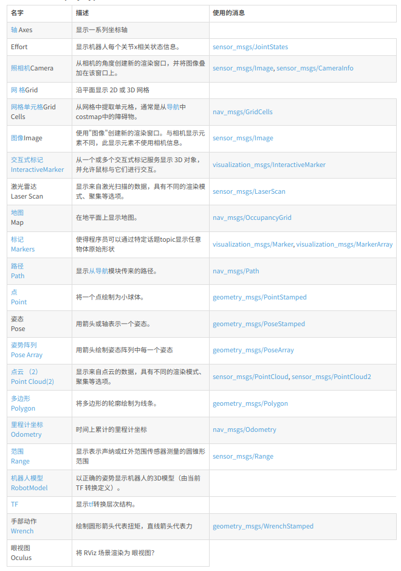

# rviz学习笔记

rviz是ROS的一个**可视化工具**，用于可视化传感器的**数据**和状态信息。

rviz支持丰富的数据类型，通过加载不同的Dispalys类型来可视化，每一个Dispaly都有一个独特的名字。




## rviz启动流程

1. 初始化ROS环境：在终端中运行命令来初始化ROS环境，还会将相关的环境变量设置为当前会话所需要的值

```
source install/setup.bash
//或者
 . install/setup.bash 
```

2. 启动rviz：

 ```
   (rosrun) rviz
 ```

rviz界面将会打开，并显示默认的配置文件。

**注意：在启动rviz前，保证roscore已经开启**


## rviz顶端工具栏功能选项介绍

1. 'Interact'（交互）: 与可视化对象进行交互,如拖动、旋转等。
2. 'Move Camera'（移动相机）: 移动相机视角。
3. 'Select'（选择）: 可以点击选择特定的可视化对象。
4. 'Focus Camera'（聚焦相机）: 相机视角对准某个特定的点。
5. 'Measure'（测量）: 测量两点之间的距离。
5. '2D Pose Estimate'（2维姿态估计）: 在2D地图上设置机器人的初步估计位置和方向。

7. '2D Nav Goal'（2维导航目标）: 在2D地图上设置机器人的导航目标。

8. 'Publish Point'（发布点）: 发布一个在3D空间中选定的点。


## 鼠标控制

1. 旋转视图：按住鼠标左键并拖动，可以旋转视图。当你拖动鼠标时，场景会随之旋转，以改变视角。

2. 平移视图：按住鼠标中键（或同时按下鼠标左右键）并拖动，可以平移视图。这样可以改变场景在视图中的位置。

3. 缩放视图：滚动鼠标滚轮可以进行视图的缩放。向前滚动滚轮可以放大视图，向后滚动可以缩小视图。//按住鼠标右键并向上下滑动，向上为放大，向下为缩小**（推荐，更加快速）**

4. 选择对象：单击鼠标左键可以选择特定的对象。选中对象后，你可以对其进行进一步的操作，如移动或调整属性。


## rviz界面



- 菜单栏

1. File（文件）：包括打开、保存和退出相关功能。
2. Edit（编辑）：包括撤销、重做、剪切、复制、粘贴等编辑操作。
3. View（视图）：用于调整RViz窗口的布局和显示设置，如放大/缩小、重置视图、显示面板等。
4. Add（添加）：用于添加不同类型的可视化元素，如点云、网格、3D模型、路径等。
5. Tools（工具）：包括选择、平移、旋转、缩放等工具，用于交互式操作可视化元素。
6. Panels（面板）：提供额外的面板，例如属性、TF、目标、插件等，用于配置和监控。
7. Displays（显示）：用于配置和管理已添加的可视化元素，包括选择显示类型、修改属性等。
8. Global Options（全局选项）：用于设置全局参数，如坐标系、时间步长、背景颜色等。
9. Help（帮助）：提供关于RViz的帮助文档和其他辅助功能。


- Displays面板

1. 显示类型："Displays"面板提供了多个显示类型选项，包括点云（PointCloud2）、激光数据（LaserScan）、图像（Image）、路径（Path）等。你可以根据需要选择相应的显示类型。

2. **添加可视化对象**：通过"Add"按钮，在"Displays"面板中添加新的可视化对象。例如，你可以添加机器人模型、传感器数据或者其他自定义的可视化对象。

3. 配置显示属性：对于每个可视化对象，你可以在"Displays"面板中配置其特定的显示属性。例如，你可以设置颜色、尺寸、透明度等属性，以使对象更符合可视化需求。

4. 可视化对象列表：在"Displays"面板中，你可以看到当前已添加的可视化对象列表。你可以选择其中的对象，并对其进行后续的配置和操作。

5. 删除和禁用对象："Displays"面板还提供了删除和禁用可视化对象的选项。你可以从列表中选择相应的对象，并使用右键菜单进行删除或禁用。

6. 全局选项：在"Displays"面板的顶部，你可以找到一些全局选项，用于控制所有可视化对象的共享设置。例如，你可以更改全局视图模式、坐标轴显示和背景颜色等。


- View面板

1. 3D视图控制："View"面板提供了多种方式来控制3D视图。你可以使用鼠标和键盘进行旋转、平移和缩放操作，以改变视角和场景显示。

2. **视图模式**：你可以在"View"面板中选择不同的视图模式，如“Orbit”（轨道）、“FPS”（第一人称）或“Top Down”（俯视）。每种模式都有自己的相机控制方式和视角效果。

3. 摄像机位置和方向：通过"View"面板，你可以手动设置或重置摄像机的位置和方向。这允许你快速切换到特定的视角或回到默认视图。

4. 缩放比例：你可以使用"View"面板中的缩放滑块来调整场景的缩放比例。这对于放大或缩小特定区域或对象很有用。

5. 显示边界框：在"View"面板中，你可以选择是否显示场景中的边界框。这对于检查对象的几何范围和空间占用非常有用。

6. 可视化选项：在"View"面板中，你可以配置一些可视化选项，如显示坐标轴、网格、背景颜色等。这些选项可以帮助你更好地理解和导航场景。


## 主要插件




