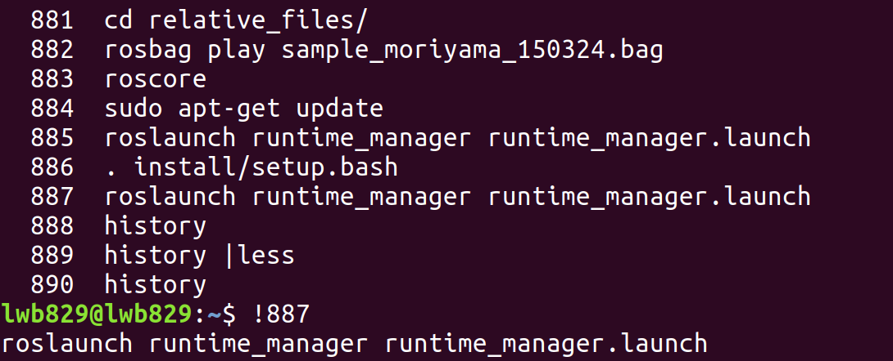
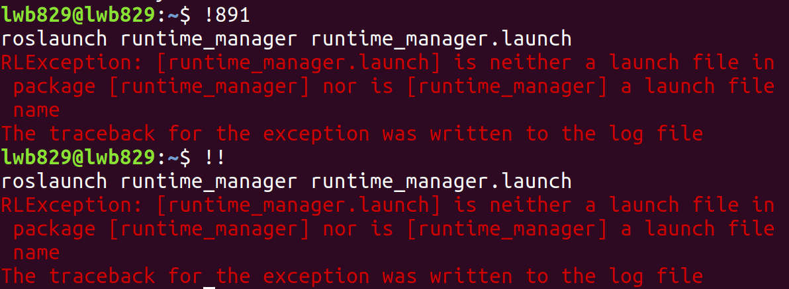
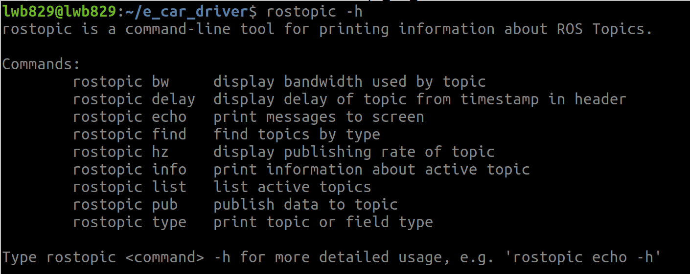
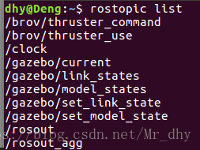
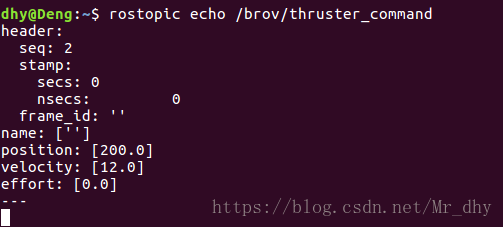

# ubuntu系统学习

## ubuntu常用命令

- sudo：临时以root权限运行
- cd：切换目录
- pwd：打印当前目录
- mkdir：创建路径（目录）
- ls：打印当前路径下文件
- touch：创建新文件
- cp：复制粘贴
- mv：移动/重命名
- rm：删除


## 解决ubuntu中各文件操作权限的巧妙方法

类似于以**管理员身份**（root用户）打开文件

```
$ sudo nautilus
```


## rospack用法（=ros+pack(age)）

rospack允许你获取软件包的有关信息。在本教程中，我们只涉及到`find`参数选项，**该选项可以返回软件包的所在路径**。

用法：

```
$ rospack find [package_name] 
    
例如: $ rospack find roscpp
将会输出：/opt/ros/<distro>/share/roscpp
```


## roscd用法(=ros+cd)

roscd是rosbash命令集的一部分，它允许你**直接切换目录（cd）到某个软件包或者软件包集**当中。

用法：

```
$ roscd [locationname[/subdir]]
```

注意，就像ROS中的其它工具一样，roscd只能切换到那些路径已经包含在ROS_PACKAGE_PATH环境变量中的软件包。要查看ROS_PACKAGE_PATH中包含的路径，可以输入：

```c++
$ echo $ROS_PACKAGE_PATH //非常好用,可以用来检查环境变量
```

你的ROS_PACKAGE_PATH环境变量应该包含那些保存有ROS软件包的路径，并且每个路径之间用冒号（:）分隔开来。一个典型的ROS_PACKAGE_PATH环境变量如下：

```c++
/opt/ros/<distro>/base/install/share
```

跟其他环境变量路径类似，你可以在ROS_PACKAGE_PATH中添加更多的目录，每条路径使用冒号（:）分隔。


roscd也可以**切换到一个软件包或软件包集的子目录**中。

执行：

```c++
$ roscd roscpp/cmake
$ pwd
```

应该会看到：

```c++
YOUR_INSTALL_PATH/share/roscpp/cmake
```


## rosls用法(=ros+ls)

rosls是rosbash命令集的一部分，它允许你直接**按软件包的名称执行ls命令**（而不必输入绝对路径）。

用法：

```c++
$ rosls [locationname[/subdir]]
```

示例：

```c++
$ rosls roscpp_tutorials
```

应输出:

```c++
cmake  launch package.xml   srv
```


## 快速查看/使用终端历史命令

```
history
```

- 快速执行某支令，将查找到的指令复制粘贴执行，或者通过**!+命令编号**的形式执行



- 如果只是想重复使用最后一个使用的命令，只要使用两个感叹号就能快速执行之。



- **使用ctrl+r可快速搜索想要的历史命令，且终端会自动补齐**


## rostopic用法

rostopic包含rostopic命令行工具，用于显示有关ROS主题的调试信息，包括发布者，订阅者，发布率和ROS消息

它还包含一个实验性Python库，用于动态获取有关主题的信息并与之交互

```
rostopic -h
```

用于查看ROS（Robot Operating System）中 `rostopic` 命令的帮助文档




### 查看ROS正在发布的话题

```
rostopic list
```

结果示例：


### 显示发布的消息内容

```
rostopic echo /topic_name
```

结果示例：


### 显示主题的发布率

```
rostopic hz /topic_name
```

默认情况下，报告的速率是rostopic运行整个时间的平均速率


### 打印有关主题的信息

```
rostopic info /topic_name
```

输出包括该主题的发布者、订阅者、消息类型等内容


### 查询指定主题的消息类型

```
rostopic type /topic_name
```

输出为该主题的消息类型，通常是一个ROS消息类型的完全限定名称，例如“std_msgs/String”

然后可以查阅该消息类型的详细信息，包括消息的字段和数据类型

```
rosmsg show std_msgs/String
```


### 手动发布消息

```
rostopic pub [topic] [msg_type] [args]
```

- `[topic]`: 指定要发布消息的**主题名称**。
- `[msg_type]`: 指定要发布的**消息类型**。这通常是一个ROS消息的完全限定名称，如`std_msgs/String`。
- `[args]`: 指定消息的实际内容，这取决于消息类型。


#### 基本模式（锁存模式）

举例：假设一个名为‘/chatter’的主题，其消息类型为‘std_msgs/String’，则可以使用如下命令

```
rostopic pub /chatter std_msgs/String "hello, world"
```

意为：发布一个字符串消息 "hello, world" 到 `/chatter` 主题

- 注意：启动rostopic后上线的所有新订阅者都将听到此消息

  **可以随时按ctrl-C停止此操作**


#### 一次模式

示例如下：

```
rostopic pub -1 [topic] [msg_type] 
```

如果不想使用ctrl-C停止rostopic ，则可以一次模式发布。rostopic将使邮件锁定3秒钟，然后退出


#### 速率模式

示例如下：

```
rostopic pub -r 10(可改为其它) [topic][msg_type] 
```

此处‘r’为Rate频率，后面的数字‘10’表示发布消息的频率，以Hz为单位，即‘-r 10’指定了消息发布的速率为10次/秒

使用管道输入或文件输入时，速率模式为默认(10hz)，所以此时为10


## Tab键补全功能

