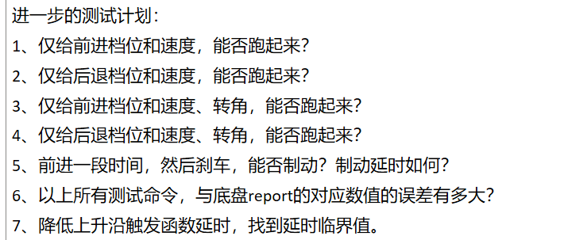

# 2024.3.4

## 已完成内容

1. CAN连通
2. 能够把CAN报文转换成为ROS消息
3. report上传部分数据流流通


## 笔记

- CAN笔记

  切换到`EU..`目录下

  - 启动CAN

    ```
    ./start.sh
    ```

  - 打印车辆CAN数据流

    ```
    candump can1
    ```

- 代码修改笔记

  1. **在一个class类中**，进行数据的输入(subscribe)时，要指定回调函数的地址的类，比如

  ```c++
  sub_control_command = nh.subscribe("/vehicle_cmd", 1, &ControlConverter::control_command_callback,this);
  ```

  其中**`control_command_callback`为该ControlConverter类中的一个成员函数**，所以在使用时需要加入`&ControlConverter::`

  并且在这种情况下，在**定义`control_command_callback`回调函数时不需要重复声明**，例如

  ```cc
  void ControlConverter::control_command_callback(const autoware_msgs::VehicleCmd::ConstPtr &msg)
  ```

  其中**`ControlConverter::control_command_callback`即为重复声明，需去掉类声明，修改为如下**

  ```cc
  void control_command_callback(const autoware_msgs::VehicleCmd::ConstPtr &msg)
  ```

  即可

  

  2. **指针访问对象成员方式**

  ```cc
  void control_command_callback(const autoware_msgs::VehicleCmd::ConstPtr &msg)
  {
        speed = fabs(msg->ctrl_cmd.linear_velocity);
        steer = -500 * (msg->ctrl_cmd.steering_angle / 0.43);
        ros::Time stamp = ros::Time::now();
  ...
  }
  ```

  其中，`msg` 是一个指向 `autoware_msgs::VehicleCmd` 类型对象的指针，所以`msg->ctrl_cmd.linear_velocity` 表示访问 `VehicleCmd` 对象中 `ctrl_cmd` 成员变量的 `linear_velocity` 属性

  **`msg` 是一个 `autoware_msgs::VehicleCmd` 类型的常量指针，因此使用 `->` 来访问它的成员，而不是使用 `.`。**

  

  3. **节点对应依赖**

  在`CMakeLists.txt`文件中，**每一个节点对应的依赖需要即使添加，即`一个节点名称`对应`一个dependencies和一个libraries`**，示例如下：

  ```cmake
  add_executable(${PROJECT_NAME}_command_node 
  src/ADCU_BrakeCmd_111.cc
  src/ADCU_SteerCmd_113.cc
  src/ADCU_ParkCmd_112.cc
  src/ADCU_BodyCmd_115.cc
  src/ADCU_DriveCmd_114.cc
  src/ADCU_PowerCmd_117.cc
  src/ADCU_CldDrvCmd_118.cc
  src/ADCU_CldBodyCmd_119.cc
  src/ADCU_CldPowerCmd_11A.cc
  src/ADCU_CrashClrCmd_12A.cc
  src/ADCU_TripClear_253.cc
  src/PCU_PowerCmd_127.cc
  src/ADCU_SweepCmd_151.cc
  src/Byte.cc
  src/command_node.cc
  )
  ```

  对应依赖为

  ```cmake
  add_dependencies(${PROJECT_NAME}_command_node ${${PROJECT_NAME}_EXPORTED_TARGETS} ${catkin_EXPORTED_TARGETS})
  
  ## Specify libraries to link a library or executable target against
  target_link_libraries(${PROJECT_NAME}_command_node
     ${catkin_LIBRARIES}
   )
  ```

  和

  ```cmake
  add_executable(${PROJECT_NAME}_control_converter
  src/control_command_speed_exercise.cpp
  )
  ```

  对应依赖为

  ```cmake
  add_dependencies(${PROJECT_NAME}_control_converter ${${PROJECT_NAME}_EXPORTED_TARGETS} ${catkin_EXPORTED_TARGETS})
  
  ## Specify libraries to link a library or executable target against
  target_link_libraries(${PROJECT_NAME}_control_converter
     ${catkin_LIBRARIES}
   )
  ```


## 需要修改的地方


1. 修改raw_vehicle_command_converter下的node.hpp和node.cpp文件，主要包括信号名称等内容

2. 修改代码，打通control_converter和command_node的数据流

   **方法：通过启动`e_car_main_command_node`和`e_car_main_control_converter`两个节点后，通过rqt_graph图形可视化来判断数据流**


# 2024.3.5

## 已完成内容

1. report报文部分数据流全部流通，能够正确接收到车辆实际的速度、转角等信息


## 遇到的问题

手动给定速度、转角等控制输入，消息接收端部分正确，部分错误

初步估计为代码逻辑问题，主要集中在`/vehicle_cmd`的回调函数`control_command_callback`部分

 

## 需要修改的地方

1. 根据使用手册说明要求，加入power_cmd的定义部分，即开启自动驾驶的电源部分
1. 先将有关清扫逻辑的内容注释掉，集中解决关于速度、转角的内容，防止清扫逻辑的错误对其造成影响
1. body_cmd和power_cmd未有效发布话题，即`nh.advertise()`和`××.publish()`没有一一对应


# 2024.3.7

## 遇到的问题

单个报文信号成功显示对应/vehicle_cmd的输入，但是依然无法使能车辆自驾功能


## 需要修改的地方

控制报文信号字节传输逻辑出现问题，与原来PIX、龙马的逻辑不同，故代码也需要更新，不能仿照原来的去写


**查询某报文信号字节传输是否正确小技巧**

- 给定该报文信号输入值（十进制数），通过判断其**自身的二进制数 和 传入的二进制数 是否满足对应的起始位和长度关系**，从而确定字节、位传输是否正确


# 2024.3.8

## 遇到的问题

测试了brake_cmd,drive_cmd,park_cmd,power_cmd,steer_cmd,body_cmd共6个主要报文信号，现在发现传输数据均为0，即数据无法传输给车辆


## 需要修改的地方

初步排查为command_node.cc节点中代码逻辑出现问题


# 2024.3.9

## 已完成内容

通过手动输入/vehicle_cmd话题中的信号值，能够使得车辆进入自动驾驶模式，即在report部分读取到对应输入信息，说明5个active信号输入均正确

给定steer转角开度，能够实现车辆前轮对应转向


## 遇到的问题

- 给定目标车辆前进速度设定，无法实现前进功能

- 进入自动驾驶模式不稳定，有时候出现修改代码再改回来就无法进入自驾模式的情况


## 需要修改的地方

初步判断为park_enable信号应设置为0（False），经过验证确实如此


# 2024.3.10

## 启动全流程

记录一下独自全流程测试的过程，经过多次测试，认为以下启动过程比较可靠

- 注意事项：**在启动各项节点前，必须将遥控器的==SA杆上拨==，进入自动驾驶状态**

  当车辆动起来之后，可以将SA杆下拨进入遥控模式，从而停止车辆运动；

  **但是，此时再回拨SA杆至上位时，需重启所有节点（经过验证后得出的结论），才能进入自动驾驶模式**

1. 启动`Dowunloads/EMU8`目录下的的车辆CAN

   ```
   ./start.sh //需要输入密码
   candump can1 //测试流通性
   ```

2. 启动CAN通信的下发报文command节点

   ```
   roslaunch ...
   ```

3. 启动CAN通信的上传报文report节点

   ```
   roslaunch ...
   ```

4. 启动socket节点

   ```
   roslaunch ...
   ```

5. 发布/vehicle_cmd话题命令

   ```
   rostopic pub -r 60 /vehicle_cmd ...
   ```

此时，车辆能够进入自动驾驶状态并运动


## 遇到的问题

在发布/vehicle_cmd命令中，现阶段gear保持为1（前进状态）

另三个输入参数为ctrl_cmd下的：linear_velocity；linear_acceleration；steering_angle

经过测试，发现保持linear_velocity=1不变的情况下

- 当给定steering_angle=20（大于0，左转向）时，需要给linear_acceleration不为0的值，例如我在实际测试中给的linear_acceleration=0.2，此时车辆能够进入自驾状态并行驶，而linear_acceleration=0时，则无法进入进入自动驾驶状态也无法行驶
- 当给定steering_angle=-20（小于0，右转向）时，需要保持linear_acceleration=0，车辆才能够进入自驾状态并行驶，而linear_acceleration=0.2时，则无法进入进入自动驾驶状态也无法行驶





# 2024.3.11

## 测试汇总

车辆能够稳定进入自动驾驶模式

- 注意：经过测试验证，需要rostopic pub**两次**/vehicle_cmd话题命令，才能够进入自动驾驶模式（第一次总是失败）

测试过程如下：

1. 后退档，速度为3，转角为10deg，结果为：能够进入自动驾驶模式，转角正常，倒车行驶状态正常，反馈角度比设定角度大0.035deg

2. 后退档，速度为3，转角为1deg，结果为：能够进入自动驾驶模式，转角正常，倒车行驶状态正常，反馈角度比设定角度小0.105deg

3. 前进档，速度为3，转角为1deg，结果为：能够进入自动驾驶模式，转角正常，前进行驶状态正常，反馈角度比设定角度小0.105deg

4. 前进档，速度为3，转角为-20deg，结果为：能够进入自动驾驶模式，转角正常，前进行驶状态正常，反馈角度比设定角度大0.105deg，即为-19.895edg

5. 只给定刹车大小为100，此时显示TgtPedpos=38.4，TgtPress=31

   此时尝试转动后轮，发现基本无法转动，故认为刹车成功

   **注意：经过测试，该刹车命令大概会保持10s左右，就自动还原，故不是一直处于刹车状态**


## 一些注意的点

- **自动驾驶状态下，车辆反馈速度稳定比给定速度小1km/h**

  底盘速度限速最大为10km/h，故车辆上传速度信息最大为9km/h

  经过测试，当TgtVelspd=3时，两个后轮的转速基本一致；但给定车辆目标速度小于3时，左后轮基本不转动，右轮则表现正常

- **自动驾驶状态下，反馈转角误差不固定**

  根据测试情况，暂时认为转角给定越大，反馈的误差越大，但最大误差也基本保持在0.1deg左右


## 问题

遥控模式下：车辆后轮左轮与右轮转速不一致，左边慢，右边快

