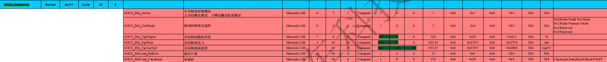
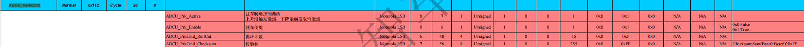
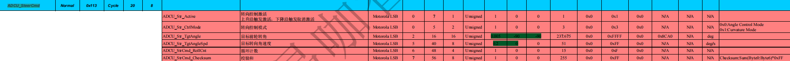
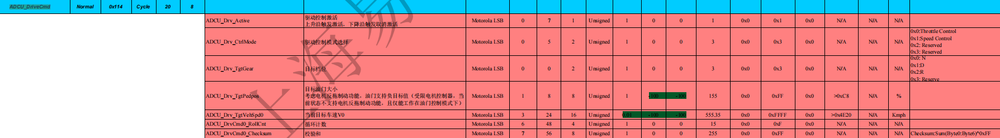
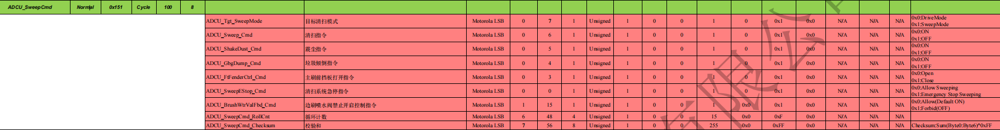

# CAN控制报文信号解析

## 总述

下面包含了多种不同的报文，每个报文都有特定的意义，每个报文中的每个位也会有不同的含义。下面主要分每个报文来记录控制的信号，在代码编译中有帮助！

**只记录自动驾驶所涉及的报文，远程驾驶暂不涉及**


### ADCU_BrakeCmd（刹车控制）

```
标识符0x111。
报文发送类型：Normal 
报文周期时间：20 (ms)
报文长度：8 (BYTE)
```



- ADCU_Brk_Active：制动激活，取1为激活，取0为取消激活
- ADCU_Brk_CtrlMode：制动模式选择，0为制动踏板位置模型，1为制动压力模式，2、3保留
- ADCU_Brk_TgtPedpos：制动踏板目标开度，单位为百分比(%)


### ADCU_ParkCmd（驻车控制）

```
标识符0x112。
报文发送类型：Normal 
报文周期时间：20 (ms)
报文长度：8 (BYTE)
```



- ADCU_Prk_Active：驻车激活，取1为激活，取0为取消激活
- ADCU_Prk_Enable：取1为使能，取0则否


### ADCU_SteerCmd（转向控制）

```
标识符0x113。
报文发送类型：Normal 
报文周期时间：20 (ms)
报文长度：8 (BYTE)
```



- ADCU_Str_Active：转向激活，取1为激活，取0为取消激活
- ADCU_Str_CtrlMode：转向模式，0为角度控制模式，1为曲率控制模式

- ADCU_Str_TgtAngle：前轮目标转角（前轮驱动，后轮从动），单位为角度(degree)


### ADCU_DriveCmd（驱动控制）

```
标识符0x114。
报文发送类型：Normal 
报文周期时间：20 (ms)
报文长度：8 (BYTE)
```



- ADCU_Drv_Active：驱动控制，取1为激活，取0为取消激活
- ADCU_Drv_CtrlMode：驱动模式，0为油门控制，1为速度控制，2、3保留

- ADCU_Drv_TgtGear：目标档位，0为空档(N)，1为前进档(D)，2为倒车档(R)，3保留
- ADCU_Drv_TgtVehSpd0：当前目标车速V0，单位为千米/小时(km/h)


### ADCU_SweepCmd（清扫控制）

```
标识符0x151。
报文发送类型：Normal 
报文周期时间：100 (ms)
报文长度：8 (BYTE)
```



- ADCU_Tgt_SweepMode：目标清扫模式，0为驾驶模式，即在沿着路径行驶的过程中进行对地面的清扫；1为全覆盖模式，即车辆根据预设的清扫算法或者规划进行自主行驶，扫描整个区域
- 下面几行均为清扫的功能指令：0为开启，1为关闭