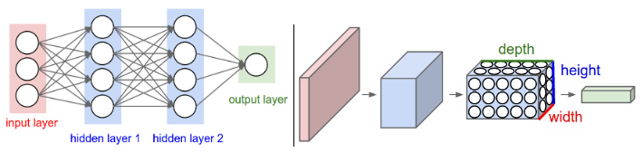
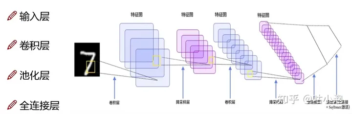
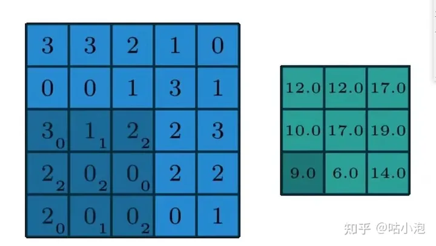

# Convolutional Neural Networks (CNN)

参考链接：[CNN笔记：通俗理解卷积神经网络](https://blog.csdn.net/v_JULY_v/article/details/51812459?ops_request_misc=%7B%22request%5Fid%22%3A%22170979384916800226558618%22%2C%22scm%22%3A%2220140713.130102334..%22%7D&request_id=170979384916800226558618&biz_id=0&utm_medium=distribute.pc_search_result.none-task-blog-2~all~top_positive~default-1-51812459-null-null.142^v99^pc_search_result_base6&utm_term=CNN&spm=1018.2226.3001.4187)

## 人工神经网络

### 神经元

每个神经元接受线性组合的输入后，最开始只是简单的线性加权，后来给每个神经元加上了非线性的激活函数，从而进行非线性变换后输出

每两个神经元之间的连接代表加权值，称之为权重；不同的权重和激活函数，则会导致神经网络不同的输出

神经网络的每个神经元如下：

 基本wx + b的形式，其中

- 、表示输入向量
- 、为权重，几个输入则意味着有几个权重，即每个输入都被赋予一个权重
- b为偏置bias
- g(z) 为激活函数
- a 为输出

g(z) = g( * + * + b )，g表示激活函数，这里的b可以理解成为更好达到目标而做调整的偏置项 

一开始为了简单，人们把激活函数定义成一个线性函数，即对于结果做一个线性变化，比如一个简单的线性激活函数是g(z) = z，输出都是输入的线性变换。后来实际应用中发现，线性激活函数太过局限，于是人们引入了非线性激活函数

### 激活函数

常用的非线性激活函数有`sigmoid`、`tanh`、`relu`等等，前两者`sigmoid`/`tanh`比较常见于全连接层，后者`relu`常见于卷积层

1. 这里先介绍下最基础的`sigmoid`函数，其表达式如下：

其中z是一个线性组合，比如z可以等于：b + * + *。通过代入很大的正数或很小的负数到g(z)函数中可知，其结果趋近于0或1

**sigmoid函数的功能是相当于把一个实数压缩至0到1之间。当z是非常大的正数时，g(z)会趋近于1，而z是非常小的负数时，则g(z)会趋近于0**

2. 实际梯度下降中，sigmoid容易饱和、造成终止梯度传递，且没有0中心化。咋办呢，可以尝试另外一个激活函数：ReLU，其图形表示如下

### 传统神经网络(NN)

将下面这种神经单元

组织在一起，便形成了神经网络，下图便是一个三层神经网络结构：

上图中最左边的原始输入信息称之为输入层，最右边的神经元称之为输出层（上图中输出层只有一个神经元），中间的叫隐藏层

- 输入层（Input layer），众多神经元（Neuron）接受大量非线形输入讯息。输入的讯息称为输入向量。
- 输出层（Output layer），讯息在神经元链接中传输、分析、权衡，形成输出结果。输出的讯息称为输出向量。
- 隐藏层（Hidden layer），简称“隐层”，是输入层和输出层之间众多神经元和链接组成的各个层面。如果有多个隐藏层，则意味着多个激活函数。

### 卷积神经网络(CNN)

下图所示，左图就是我们传统的神经网络 (NN), 右图就是卷积神经网络 (Convolutional Neural Network, CNN)

我们在这张图中可以明显地看出，左图看上去像二维的，右图好像是一个三维的图。举个例子，比如在传统神经网络输入的一张图有784个像素点，所以输入层就有784个神经元，但在我们的CNN中输入的就是原始的图像28 *28 *1（是三维的），它是一个三维的矩阵。我们可以看到右图中又定义三维名称 "height * width * depth", 简称 "h * w * d"，接下来我们就围绕着卷积层和深度到底怎么变换展开

#### 整体架构

下图所示就是 CNN 的整体架构，总共有四个部分：输入层，卷积层，池化层，全连接层，ReLU层

##### 输入层

上图中最左侧假设就是我们需要输入的图片 “7”，假设是‘28 *28 *3’，分别对应 "h * w * d", 其中对于图片输入来说通常是以 RGB 三通道的形式输入，所以 d 通常是3

##### 卷积层

-  对图像（不同的数据窗口数据）和滤波矩阵（一组固定的权重：因为每个神经元的多个权重固定，所以又可以看做一个恒定的滤波器filter）做**内积**（逐个元素相乘再求和）的操作就是所谓的『卷积』操作

下图中红框框起来的部分便可以理解为一个**滤波器**，即带着一组固定权重的神经元；**多个滤波器叠加便成了卷积层**

比如下图中，图中左边部分是原始输入数据，图中中间部分是滤波器filter，图中右边是输出的新的二维数据

现举例如下：

我们输入的是5 *5 *1的图像，深色部分（右下角）3 *3 *1是我们定义的一个卷积核（简单来说可以看做一个矩阵形式运算器），通过原始输入图像和卷积核做运算可以得到绿色部分的结果，怎么样的运算呢？

- 实际很简单就是我们看左图中深色部分，处于中间的数字是图像的像素，处于右下角的数字是我们卷积核的数字，只要对应相乘再相加就可以得到结果。例如图中“3 *0+1 *1+2 *2+2 *2+0 *2+0 *0+2 *0+0 *1+0 *2=9“

那如果我们的 d>1 的时候又是如何计算的？现如下图所示

- 左边是输入（7 *7 *3中，7 *7代表图像的像素/长宽，3代表R、G、B 三个颜色通道）
- 中间部分是两个不同的滤波器Filter w0、Filter w1
- 最右边则是两个不同的输出

随着左边数据窗口的平移滑动，滤波器Filter w0 / Filter w1对不同的局部数据进行卷积计算

**类似wx + b，w对应滤波器Filter w0，x对应不同的数据窗口，b对应Bias b0，相当于滤波器Filter w0与一个个数据窗口相乘再求和后，最后加上Bias b0得到输出结果1**

##### 池化层

简单来说，池化即取区域平均或最大，如下图所示

上图所展示的是max-pooling (最大池化) 的一个操作，即取区域最大，即上图左边部分中左上角2x2的矩阵中6最大，右上角2x2的矩阵中8最大，左下角2x2的矩阵中3最大，右下角2x2的矩阵中4最大，所以得到上图右边部分的结果：6 8 3 4

还有一种比较常见的是mean-pooling（平均池化）就是把区域内的数字加起来做个平均值，比如蓝色区域就是（1+0+3+4）/4=2

##### 全连接层（FC层）

相当于在最后面加一层或多层传统神经网络（NN）层，**我们在连接全连接层前，需要把我们的CNN的三维矩阵进行展平成二维，比如说从池化层出来的是5 *5 *3的图像，在输入到全连接层展平成1 *75以满足全连接层的输入模式**

