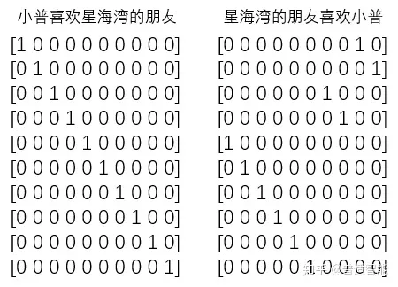

# Embedding layer

## 背景

“Embedding”直译是**嵌入式、嵌入层**

简单来说，我们常见的**地图**就是对于**现实地理的Embedding**，现实的地理地形的信息其实远远超过三维，但是地图通过颜色和等高线等来最大化表现现实的地理**信息**。

在 NLP 领域，如何把词进行编码成数字，从而能输入到数学模型是需要考虑的

**one-hot编码**

- one-hot 编码，又称独热编码、一位有效编码。其方法是使用 N 位状态寄存器来对 N 个状态进行编码，每个状态都有它独立的寄存器位，并且在任意时候，其中只有一位有效。
- one-hot 编码是分类变量作为二进制向量的表示。这首先要求将分类值映射到整数值，然后，每个整数值被表示为二进制向量，除了整数的索引之外，它都是零值，它被标记为1

举例如下：




但是 one-hot 编码有以下缺点：

- 对于具有非常多类型的类别变量，变换后的向量维数过于巨大，且过于稀疏。
- 映射之间完全独立，并不能表示出不同类别之间的关系。


## Embedding是什么

**嵌入层是将正整数（索引值）转换为固定尺寸的稠密向量**。这句话来自 `keras` 文档中对 embedding 层的解释，非常概括，不太容易理解，但确实概括了要干的事情。

- 比如一句话，“我爱中国” 对应的索引为`[0,1,2,3]`，要将这个索引转化为固定大小且稠密的向量来表示，而不是稀疏的one-hot编码。可以表示为`[[0.2,0.5],[0.6,−0.1],[0.8,0.4],[0.5,0.5]]`。
- 词嵌入通常是 8-1024 维度，根据数据量的大小来调整，高维度的嵌入能更好的捕捉词之间的关系，但是需要更多的数据来训练


## Embedding是如何实现的

embedding 层可以看作是一张从索引映射到稠密向量的查找表，当使用 embedding 层的时候, embedding 层和神经网络其他层一样，权重是随机初始化的。根据你的训练任务, embedding 层通过反向传播逐渐调整。

Embedding 目的是把一个高纬的，每个维度上相对稀疏的数据投影到相对低维的，每个维度可以取实数集的数据操作。本质上是用连续空间替代（准）离散空间，以增加空间利用率，减少不必要的参数.

NLP 和推荐系统里的 embedding, 输入数据就是 word ID 或 item ID, 也就是 one hot encoding, 输入维度就是词的个数，每个维度上取 01, 空间利用率极低。这种情况下，一般的 embedding 的实现方式就是一个用全连层，输入维度高，输出维度低。

例如在 TensorFlow 中，用于句子分类时的嵌入层，输入是整数索引，经过嵌入层、池化层、全连接输入训练可以得到嵌入层权重，即词嵌入。


## Pytorch中Embedding Layer的用法

主要步骤：

1. 准备好所要使用的语料库
2. 构建字典，使语料库中的每个词都对应一个索引
3. 利用Embedding Layer对输入的自然语言做embedding，作为网络的第一层
4. 训练模型，更新第3步输入的权重


官方给出的embedding的参数如下：

```
torch.nn.Embedding(num_embeddings, embedding_dim, padding_idx=None, max_norm=None, norm_type=2.0, scale_grad_by_freq=False, sparse=False, _weight=None, device=None, dtype=None)
```

- num_embeddings : 构建语料库字典的大小
- embedding_dim : 每个词向要编码成向量的长度
- padding_idx:输出遇到此下标时用0填充(非必要参数)
- max_norm：对词嵌入进行归一化，使他们的范数小于max_norm(非必要参数)
- norm_type: max_norm在计算范数时的范数类型，如：可以选择1范数，2范数
- scale_grad_by_freq：将通过小批量中单词频率的倒数来缩放梯度。这里的词频是指输入的句子。
- sparse：如果为True，则与权重矩阵相关的梯度转变为稀疏张量。这里的稀疏张量是指方向传播的时候只更新当前使用此的权重矩阵，加快更新速度。这里和word2vec的负采样有相似之处


## 应用

最常用的就是词嵌入表达，但是万物可嵌入. Embedding 在输入数据没有较好的数据表示时，能将输入数据根据下游任务转化为可学习的高维度向量表示，比如输入的为单词、图片或者输入的为空间位置等。

在进行特征提取工作时，很难捕捉空间(时间)维度。通过使用深度学习嵌入层，我们可以通过提供一系列用户行为(作为索引)作为模型的输入来有效地捕捉这个空间维度

