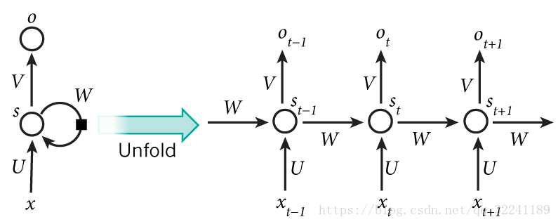
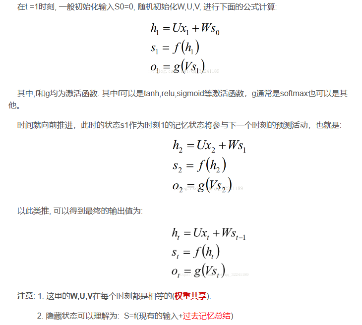
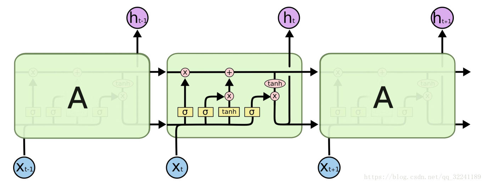
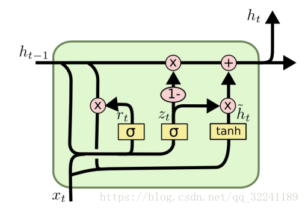

# Recurrent Neural Network (RNN)

## 概述

细想BP算法，CNN(卷积神经网络)我们会发现，他们的输出都是只考虑前一个输入的影响而不考虑其它时刻输入的影响，比如简单的猫、狗、手写数字等单个物体的识别具有较好的效果。但是，对于一些与时间先后有关的，比如视频的下一时刻的预测，文档前后文内容的预测等，这些算法的表现就不尽如人意了。因此，RNN就应运而生了

RNN之所以称为**循环神经网络**，即一个序列当前的输出与前面的输出也有关。具体的表现形式为网络会对前面的信息进行记忆并应用于当前输出的计算中，即隐藏层之间的节点不再无连接而是有连接的，并且隐藏层的输入不仅包括输入层的输出还包括上一时刻隐藏层的输出。

## 基本模型结构

RNN 的基本结构包括输入层、隐藏层和输出层。**其中，隐藏层有一个箭头表示数据的循环更新, 这个就是实现时间记忆功能的方法。它的状态会随时间步更新，并作为下一时间步的输入之一**。这种循环连接使得 RNN 具有记忆能力，能够捕捉序列中的长距离依赖关系

上图为隐藏层的层级展开图， t-1, t, t+1表示时间序列，X表示输入的样本，St表示样本在时间t处的的记忆，St = f(W *S(t-1)+U *X(t)) ；W表示输入的权重，U表示此刻输入的样本的权重，V表示输出的样本权重

## 改进算法

前面介绍了RNN的算法, 它处理时间序列的问题的效果很好, 但是仍然存在着一些问题, 其中较为严重的是容易出现**梯度消失**或者**梯度爆炸**的问题

因此, 就出现了一系列的改进的算法, 这里介绍主要的两种算法: **LSTM** 和 **GRU**

- 对于**梯度消失**: 由于它们都有特殊的方式存储”记忆”，那么以前梯度比较大的”记忆”不会像简单的RNN一样马上被抹除，因此可以一定程度上克服梯度消失问题

- 对于**梯度爆炸**:用来克服梯度爆炸的问题就是**gradient clipping**，也就是当你计算的梯度超过阈值c或者小于阈值-c的时候，便把此时的梯度设置成c或-c

### LSTM算法（长短期记忆网络）

LSTM 是 RNN 的一种变体，它通过引入门控机制解决了 RNN 的长程依赖问题。LSTM 的核心是细胞状态 (cell state), 它能够在网络中传递长距离信息

LSTM 的结构包括输入门、遗忘门和输出门，以及细胞状态的更新。用于遗忘的门叫做"**遗忘门**", 用于信息增加的叫做"**信息增加门**",最后是用于输出的"**输出门**"

LSTM 的公式如下： 
$$
\begin{aligned} i_t &= \sigma(W_{ii}x_t + W_{hi}h_{t-1} + W_{ci}c_{t-1} + b_i), \\ f_t &= \sigma(W_{if}x_t + W_{hf}h_{t-1} + W_{cf}c_{t-1} + b_f), \\ c_t &= f_t \odot c_{t-1} + i_t \odot tanh(W_{ic}x_t + W_{hc}h_{t-1} + b_c), \\ o_t &= \sigma(W_{io}x_t + W_{ho}h_{t-1} + W_{co}c_t + b_o), \\ h_t &= o_t \odot tanh(c_t), \end{aligned}
$$
其中，$i_t$、$f_t$、$o_t$ 分别为输入门、遗忘门和输出门的输出，$c_t$ 为当前时间步的细胞状态，$h_t$ 为当前时间步的隐藏状态，$\sigma$ 为 sigmoid 激活函数，$\odot$ 为逐元素相乘。

## GRU算法（门控循环单元）

GRU是2014年提出的一种LSTM改进算法. **它将忘记门和输入门合并成为一个单一的更新门, 同时合并了数据单元状态和隐藏状态, 使得模型结构比之于LSTM更为简单**

GRU 的计算公式如下：
$$
\begin{aligned} z_t &= \sigma(W_{iz}x_t + W_{hz}h_{t-1} + b_z), \\ r_t &= \sigma(W_{ir}x_t + W_{hr}h_{t-1} + b_r), \\ \tilde{h}_t &= tanh(W_{ih}x_t + W_{rh}(r_t \odot h_{t-1}) + b_h), \\ h_t &= (1 - z_t) \odot h_{t-1} + z_t \odot \tilde{h}_t, \end{aligned}
$$
 其中，$z_t$、$r_t$ 分别为更新门和重置门的输出，$\tilde{h}_t$ 为临时隐藏状态，$h_t$ 为当前时间步的隐藏状态。

## 注意事项

RNN, LSTM 和 GRU 在处理不同类型的序列数据时有各自的优势和适用场景. RNN 适用于简单的序列数据，但容易出现梯度消失或梯度爆炸问题; LSTM 和 GRU 能够捕捉长距离依赖关系，其中 LSTM 更适用于更复杂的序列数据，而 GRU 参数较少，计算更高效。

- 在实际应用中，选择合适的循环神经网络结构和超参数是非常重要的。例如，选择隐藏层的神经元数量、是否使用双向 RNN, 是否堆叠多层 RNN 等因素都会影响模型的性能。
- RNN 在处理长序列数据时可能会出现梯度消失或梯度爆炸问题，可以通过梯度裁剪、权重正则化等方法进行缓解。

## 总结

本文详细介绍了 RNN(循环神经网络) 的原理、基本结构、常见变体模型 (LSTM, GRU) 以及 Python 代码实现. RNN 作为一种处理序列数据的神经网络结构，在自然语言处理、时间序列预测、语音识别等领域有着广泛的应用。

在实际项目中，我们需要根据任务的特点和数据的性质选择合适的循环神经网络结构，并进行合理的超参数调整，以实现模型的优化。同时，我们也可以尝试使用其他序列模型，如 Transformer, BERT 等，以进一步提升模型性能。

