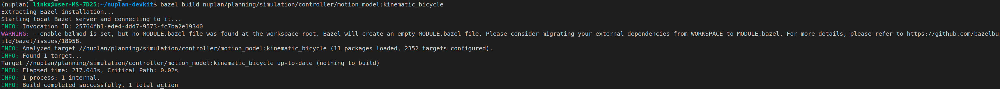

# nuPlan

> 基于深度学习的车辆预测规划方法，结合深蓝学院课程进行学习

- [官网](https://www.nuscenes.org/nuplan#planning)
- [nuPlan-devkit环境源码地址](https://github.com/motional/nuplan-devkit)


## 一、环境配置

**本人的环境配置主要参考了弘毅师兄的仓库笔记**

全程参考nuplan-devkit/docs/installation.md，**但需要修改一些requirements中的库版本**，具体如下：

- 在`nuplan-devkit/requirements_torch.txt`中，更新torch(以及torchvision)的版本，否则后续的训练会报错

  ```
  --find-links https://download.pytorch.org/whl/torch_stable.html
  --find-links https://data.pyg.org/whl/torch-1.9.0+cu111.html
  future==0.18.1
  pytorch-lightning==1.3.8    # Used widely
  setuptools==59.5.0
  timm  # Used in model_raster
  
  # torch==1.9.0+cu111;      platform_system == "Linux"
  torch==1.12.0+cu116;      platform_system == "Linux"  # torch的版本不能是1.9.0，否则会报错“module 'torch' has no attribute 'frombuffer'”
  torch==1.9.0;            platform_system == "Darwin"
  torch_scatter==2.0.9; platform_system == "Linux"
  torchmetrics==0.7.2
  # torchvision==0.10.0+cu111
  torchvision==0.13.0+cu116
  ```

- 在`nuplan-devkit/requirements.txt`中，降低Pillow的版本，否则会在后续的训练中报错PIL

  ```
  Pillow==9.5.0    # 避免是10.0.0的版本，否则报错： module 'PIL.Image' has no attribute 'ANTIALIAS'
  ```

其余环境配置，按照如下方法即可

```
conda env create -f environment.yml
conda activate nuplan
cd naplan-devkit

#最好用以下命令配置环境，可以避免因依赖包数量大，从而出现终端卡顿
pip install -r requirements_torch.txt
pip install -r requirements.txt

#虚拟环境卸载
conda remove -n ××× --all
```


- 官方文档中的关于“数据集路径”的说明，必须严格遵守。**即如果数据集不放在`~/nuplan/`下，就要在`~/.bashrc`中，添加环境变量，指明数据集路径**。

  通常这是必须的，因为Ubuntu的用户目录下，往往没有足够的空间来存放数据集。例如，本人将数据集放在移动硬盘中，而ubuntu的用户目录是在另一块固态，那么就需要在`~/.bashrc`中添加参考路径；同时，需要确保该硬盘由读写权限，所以至少需要去文件夹侧栏中点击一下，才能挂载

  - **注意：**本人一开始尝试将数据集放在其它路径中，但是经过测试发现，`nuplan_scenario_tutorial.ipynb`和`nuplan_framework.ipynb`两个notebook无法跑通，**原因是无法找到`NUPLAN_MAPS_ROOT`这个环境变量（尽管我已经按照要求将`NUPLAN_MAPS_ROOT`,`NUPLAN_DATA_ROOT`,`NUPLAN_DB_ROOT`三者的路径在`.bashrc`文件中正确表达），经过网上查找后试了几个方法均不太行**
  - **补充记录：该电脑在更改环境变量并进行source后，虽然在终端使用echo命令可以得到修改后的环境变量路径，但是在代码中测试发现并无改变；经过多次尝试，发现可能是由于电脑环境的原因，需要重新启动电脑一次，才能够在代码的`getenv`命令下得到正确结果**

  最后我将数据集放在移动硬盘中，即需要在.bashrc文件中写入如下内容

  ```
  # 在.bashrc文件中写入
  export NUPLAN_DATA_ROOT="media/.../nuplan/dataset"
  export NUPLAN_MAPS_ROOT="media/.../nuplan/dataset/maps"
  export NUPLAN_DB_FILES="media/.../nuplan/dataset/nuplan-v1.1/splits/mini"
  
  # 在终端中刷新环境变量
  source ~/.bashrc
  
  #重启电脑
  ```

- 数据集的结构，参考`nuplan-devkit/docs/dataset_setup.md`，即： **sensor_blobs下的传感器原始数据，暂时没有get到使用方法，如果只是按照`nuplan-devkit/tutorials`中notebook的训练方式，可以不用管sensor_blobs下的数据**

  ```
  ~/nuplan
  ├── exp
  │   └── ${USER}
  │       ├── cache
  │       │   └── <cached_tokens>
  │       └── exp
  │           └── my_nuplan_experiment
  └── dataset
      ├── maps
      │   ├── nuplan-maps-v1.0.json
      │   ├── sg-one-north
      │   │   └── 9.17.1964
      │   │       └── map.gpkg
      │   ├── us-ma-boston
      │   │   └── 9.12.1817
      │   │       └── map.gpkg
      │   ├── us-nv-las-vegas-strip
      │   │   └── 9.15.1915
      │   │       └── map.gpkg
      │   └── us-pa-pittsburgh-hazelwood
      │       └── 9.17.1937
      │           └── map.gpkg
      └── nuplan-v1.1
         ├── splits 
         │     ├── mini 
         │     │    ├── 2021.05.12.22.00.38_veh-35_01008_01518.db
         │     │    ├── 2021.06.09.17.23.18_veh-38_00773_01140.db
         │     │    ├── ...
         │     │    └── 2021.10.11.08.31.07_veh-50_01750_01948.db
         │     └── trainval
         │          ├── 2021.05.12.22.00.38_veh-35_01008_01518.db
         │          ├── 2021.06.09.17.23.18_veh-38_00773_01140.db
         │          ├── ...
         │          └── 2021.10.11.08.31.07_veh-50_01750_01948.db
         └── sensor_blobs   
               ├── 2021.05.12.22.00.38_veh-35_01008_01518                                           
               │    ├── CAM_F0
               │    │     ├── c082c104b7ac5a71.jpg
               │    │     ├── af380db4b4ca5d63.jpg
               │    │     ├── ...
               │    │     └── 2270fccfb44858b3.jpg
               │    ├── CAM_B0
               │    ├── CAM_L0
               │    ├── CAM_L1
               │    ├── CAM_L2
               │    ├── CAM_R0
               │    ├── CAM_R1
               │    ├── CAM_R2
               │    └──MergedPointCloud 
               │         ├── 03fafcf2c0865668.pcd  
               │         ├── 5aee37ce29665f1b.pcd  
               │         ├── ...                   
               │         └── 5fe65ef6a97f5caf.pcd  
               │
               ├── 2021.06.09.17.23.18_veh-38_00773_01140 
               ├── ...                                                                            
               └── 2021.10.11.08.31.07_veh-50_01750_01948
  ```

  - 只是为了测试，可以只用mini数据集，即`nuplan-v1.1/splits/mini`下的数据，并且不用配置sensor_blobs下的数据


## 二、ipynb文件运行

**Vscode可以直接打开`ipynb`文件, 并且安装对应插件后，选择好 conda 环境就可以直接运行，这里全部运行可以帮助判断是否跑通**

- 注意：最好用vscode而不是pycharm，这里我的pycharm下会告诉我这个`nest_asyncio`依赖包不符合条件，但是在

**除了可以在 notebook 中运行，还可以直接在命令行中运行，对应的命令都在`nuplan_framework.ipynb`有提供，举例如下：**

```
conda activate nuplan
cd ~/nuplan-devkit  # or wherever you have the nuplan-devkit
python nuplan/planning/script/run_training.py \
  experiment_name=raster_experiment \
  py_func=train \
  +training=training_raster_model \
  scenario_builder=nuplan_mini \
  scenario_filter.limit_total_scenarios=500 \
  lightning.trainer.params.max_epochs=10 \
  data_loader.params.batch_size=8 \
  data_loader.params.num_workers=8
```

**经过本人实际测试，以上 notebook 的运行都是没有问题的，并且终端运行训练也是没有问题的。不过暂时是在 mini 数据集上测试的，因为完整数据集太大了........**

- 在终端中的训练，结果会保存在 `~/nuplan/exp/exp` 下
- Simulation 的结果保存也同理


## 三、使用经验

### 1. 创建控制器的车辆模型

参考 `nuplan/planning/simulation/controller/motion_model/kinematic_bicycle.py` 中的 `KinematicBicycle` 类，可以创建自己的车辆模型。

- **注意：创建的model需要在同目录的`BUILD`中进行编译，从而再创建规划器（Planner）时使用该模型**

例如在 `tutorials/nuplan_planner_tutorial.ipynb` 中，有 `Creating the planner` 的指导，其中创建的 `SimplePlanner` 就指定了 `motion_model` 参数，这个参数就可以指向自己创建的车辆模型：

```python
from typing import List, Type

import numpy as np
import numpy.typing as npt

from nuplan.common.actor_state.ego_state import DynamicCarState, EgoState
from nuplan.common.actor_state.state_representation import StateSE2, StateVector2D, TimePoint
from nuplan.common.actor_state.vehicle_parameters import get_pacifica_parameters, VehicleParameters
from nuplan.planning.simulation.observation.observation_type import DetectionsTracks, Observation
from nuplan.planning.simulation.planner.abstract_planner import AbstractPlanner, PlannerInitialization, PlannerInput
from nuplan.planning.simulation.trajectory.interpolated_trajectory import  InterpolatedTrajectory
from nuplan.planning.simulation.trajectory.abstract_trajectory import AbstractTrajectory
from nuplan.planning.simulation.controller.motion_model.kinematic_bicycle import KinematicBicycleModel
from nuplan.planning.simulation.controller.motion_model.kinematic_model import BasicKinematicModel  # 引入自建的模型


class SimplePlanner(AbstractPlanner):
    """
    Planner going straight
    """

    def __init__(self,
                horizon_seconds: float,
                sampling_time: float,
                acceleration: npt.NDArray[np.float32],
                max_velocity: float = 5.0,
                steering_angle: float = 0.0):
        self.horizon_seconds = TimePoint(int(horizon_seconds * 1e6))
        self.sampling_time = TimePoint(int(sampling_time * 1e6))
        self.acceleration = StateVector2D(acceleration[0], acceleration[1])
        self.max_velocity = max_velocity
        self.steering_angle = steering_angle
        self.vehicle = get_pacifica_parameters()
        #此处为框架自带model，可在此此处修改model
        self.motion_model = KinematicBicycleModel(self.vehicle)
```

关于如何使用 `BUILD`，这是利用 `bazel` 编译，内部的`py_libraray` 规则告诉 Bazel 如何构建 Python 库

如下为 `BUILD`的源码

```python
load("@rules_python//python:defs.bzl", "py_library")

package(default_visibility = ["//visibility:public"])

py_library(
    name = "abstract_motion_model",
    srcs = ["abstract_motion_model.py"],
    deps = [
        "//nuplan/common/actor_state:dynamic_car_state",
        "//nuplan/common/actor_state:ego_state",
        "//nuplan/common/actor_state:state_representation",
    ],
)

py_library(
    name = "kinematic_bicycle",
    srcs = ["kinematic_bicycle.py"],
    deps = [
        "//nuplan/common/actor_state:dynamic_car_state",
        "//nuplan/common/actor_state:ego_state",
        "//nuplan/common/actor_state:state_representation",
        "//nuplan/common/actor_state:vehicle_parameters",
        "//nuplan/common/geometry:compute",
        "//nuplan/planning/simulation/controller:utils",
        "//nuplan/planning/simulation/controller/motion_model:abstract_motion_model",
    ],
)
```

每个 `py_library` 调用都定义了一个 Python 库，其中包含了一些关键的属性：

- `name`: 库的名称，这是引用该库时使用的标识符。

- `srcs`: 包含库源代码的文件列表。

- `deps`: 该库依赖的其他库的列表，这些依赖必须也通过 Bazel 进行管理。

  - 这些路径均为该py文件中的上方所引用的依赖路径


- **Bazel的ubuntu安装**

  第 1 步：将 Bazel 分发 URI 添加为软件包来源，使用 Bazel 的 apt 代码库。注意：此步骤只需执行一次。

  ```
  sudo apt install apt-transport-https curl gnupg
  curl -fsSL https://bazel.build/bazel-release.pub.gpg | gpg --dearmor >bazel-archive-keyring.gpg
  sudo mv bazel-archive-keyring.gpg /usr/share/keyrings
  echo "deb [arch=amd64 signed-by=/usr/share/keyrings/bazel-archive-keyring.gpg] https://storage.googleapis.com/bazel-apt stable jdk1.8" | sudo tee /etc/apt/sources.list.d/bazel.list
  ```

  第 2 步：安装和更新 Bazel

  ```
  sudo apt update && sudo apt install bazel
  ```

  安装后，可以在进行常规系统更新时升级到较新版本的 Bazel

  ```
  sudo apt update && sudo apt full-upgrade
  ```

  bazel 软件包始终安装最新的稳定版 Bazel，可通过如下命令查看版本

  ```
  bazel --version
  ```


编译方法（就以kinematic_bicycle）为例，在终端（ubuntu或者python都可以）中，在`nuplan-devkit`根目录下执行如下命令

```
bazel build nuplan/planning/simulation/controller/motion_model:kinematic_bicycle
```

运行结果如下图所示：




### 2. 使用规划器进行仿真

在 `nuplan_framework.ipynb` 中，有 `Simulating a planner` 的指导，其中在 `Preparing the simulation config` 时，可以指定 `PLANNER` 参数，这个参数就可以指向任意规划器

例如在 `nuplan_framework.ipynb` 中列出的 `simple_planner` 和 `ml_planner`:

```python
# Location of path with all simulation configs
CONFIG_PATH = '../nuplan/planning/script/config/simulation'
CONFIG_NAME = 'default_simulation'

# Select the planner and simulation challenge
PLANNER = 'simple_planner'  # [simple_planner, ml_planner]
...
cfg = hydra.compose(config_name=CONFIG_NAME, overrides=[
  f'experiment_name={EXPERIMENT}',
  f'group={SAVE_DIR}',
  f'planner={PLANNER}',
  f'+simulation={CHALLENGE}',
  *DATASET_PARAMS,
])
```

```python
from nuplan.planning.script.run_simulation import main as main_simulation

# Run the simulation loop (real-time visualization not yet supported, see next section for visualization)
main_simulation(cfg)

# Simple simulation folder for visualization in nuBoard
simple_simulation_folder = cfg.output_dir
```

- 也可以指向自己创建的规划器，例如  中自建的 `SimplePlanner`，这个自建规划器的使用方法不能和上面一样直接在 `cfg` 中指定 `PLANNER` 字段，而是需要在调用 `simulation` 时直接传入规划器：

  ```python
  from nuplan.planning.script.run_simulation import run_simulation as main_simulation
  
  planner = SimplePlanner(horizon_seconds=10.0, sampling_time=0.25, acceleration=[0.0, 0.0])
  
  # Run the simulation loop (real-time visualization not yet supported, see next section for visualization)
  main_simulation(cfg, planner)
  ```

  **更具体的如何使用自建的规划器进行仿真测试，可以参考[nuPlan_develop](学习笔记/深蓝学院预测规划/nuplan_develop.md)中的内容。**


### 3. 利用`nuBoard`进行仿真结果的可视化

首先参考`nuplan_planner_tutorial.ipynb`，获取仿真结果的文件

```python
# Get nuBoard simulation file for visualization later on
simulation_file = [str(file) for file in Path(cfg.output_dir).iterdir() if file.is_file() and file.suffix == '.nuboard']
```

然后在 `Prepare the Simulation config`中有介绍，依然是设置 `cfg` 字段：

```python
from tutorials.utils.tutorial_utils import construct_simulation_hydra_paths

# Location of paths with all simulation configs
BASE_CONFIG_PATH = os.path.join(os.getenv('NUPLAN_TUTORIAL_PATH', ''), '../nuplan/planning/script')
simulation_hydra_paths = construct_simulation_hydra_paths(BASE_CONFIG_PATH)

# Create a temporary directory to store the simulation artifacts
SAVE_DIR = tempfile.mkdtemp()

# Select simulation parameters
EGO_CONTROLLER = 'perfect_tracking_controller'  # [log_play_back_controller, perfect_tracking_controller]
OBSERVATION = 'box_observation'  # [box_observation, idm_agents_observation, lidar_pc_observation]
DATASET_PARAMS = [
    'scenario_builder=nuplan_mini',  # use nuplan mini database (2.5h of 8 autolabeled logs in Las Vegas)
    'scenario_filter=one_continuous_log',  # simulate only one log
    "scenario_filter.log_names=['2021.07.16.20.45.29_veh-35_01095_01486']",
    'scenario_filter.limit_total_scenarios=2',  # use 2 total scenarios
]

# Initialize configuration management system
hydra.core.global_hydra.GlobalHydra.instance().clear()  # reinitialize hydra if already initialized
hydra.initialize(config_path=simulation_hydra_paths.config_path)

# Compose the configuration
cfg = hydra.compose(config_name=simulation_hydra_paths.config_name, overrides=[
    f'group={SAVE_DIR}',
    f'experiment_name=planner_tutorial',
    f'job_name=planner_tutorial',
    'experiment=${experiment_name}/${job_name}',
    'worker=sequential',
    f'ego_controller={EGO_CONTROLLER}',
    f'observation={OBSERVATION}',
    f'hydra.searchpath=[{simulation_hydra_paths.common_dir}, {simulation_hydra_paths.experiment_dir}]',
    'output_dir=${group}/${experiment}',
    *DATASET_PARAMS,
])
```

- 其中 `DATASET_PARAMS` 字段可以指定仿真的数据集，例如 `scenario_filter.log_names` 可以指定具体的 `.db` 文件 (nuplan 使用数据集格式，存下各类仿真场景，用于训练或者仿真)。

最后，启动`nuBoard`：

```python
from nuplan.planning.script.run_nuboard import main as main_nuboard

# Run nuBoard
main_nuboard(cfg)
```

- 在弹出的 `nuBoard` 界面中，在左侧栏选中 `Scenarios`，如果没有直接出现仿真结果，那就需要**手动加载：点击右上角的齿轮图标，依次选择 ``Scenario Type`(模拟场景),`Log Name` (这是 `simulation_file` 中已经指定了的 `.db` 场景数据集)...然后就可以看到仿真的结果了。**

**更详细的 scenario 可视化方法，可以在 `nuplan_scenario_visualization.ipynb` 中找到。**
