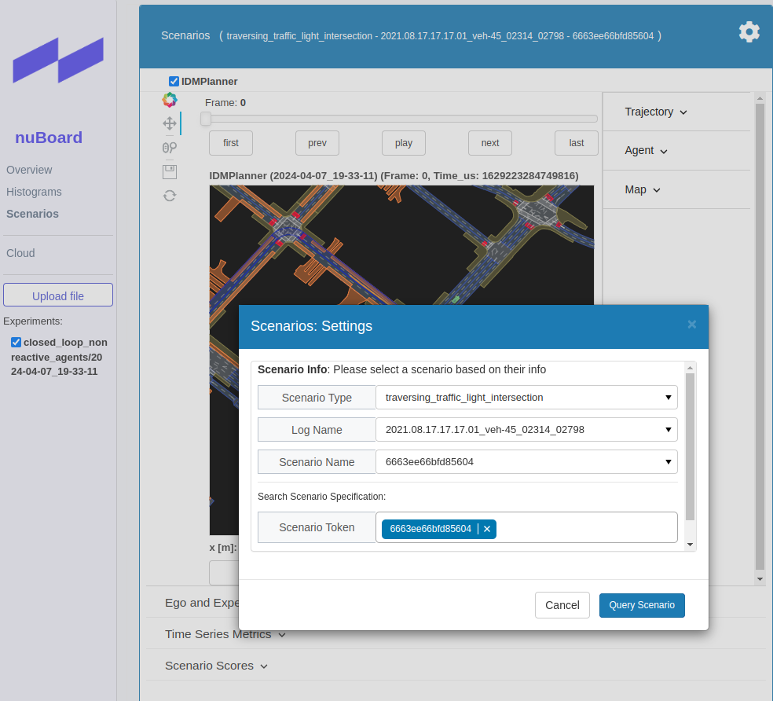

# 使用 nuPlan 框架进行预测、决策和规划算法的开发

> 本文档为 `nuPlan` 的使用案例，主要介绍在 `nuPlan` 框架和数据集的基础上，开发预测、决策和规划算法，并进行仿真和可视化。

> 具体以深蓝学院规控课程的 Project2 为例，使用 nuPlan 框架进行规划算法的开发。

> 需要下载该Project2的代码压缩包，其中有讲师修改过的代码


## 主函数入口文件

`./nuplan/planning/script/run_planner.py` 为主函数入口文件，主要用于加载配置文件、初始化规划器、执行仿真和启动 nuBoard 可视化等。

- 在该py文件中的第12行插入了如下代码（基于本电脑的目录路径）

  ```
  os.chdir(os.environ['HOME'])+'/nuplan-devkit/nuplan/planning/script'
  ```

  目的是无论在哪个目录执行该脚本，都会将当前工作目录切换到`nuplan/planning/script`目录下。


### 1. 选择测试token

在`run_planner.py`中，取消任意一个token的注释，即可测试该token, 场景选择可从简单`following_lane_without_lead`到复杂`starting_unprotected_cross_turn`:

```python
DATASET_PARAMS = [
    # 'scenario_builder=nuplan_mini',  # use nuplan mini database (2.5h of 8 autolabeled logs in Las Vegas)
    # 'scenario_filter=one_continuous_log',  # simulate only one log
    # "scenario_filter.log_names=['2021.07.16.20.45.29_veh-35_01095_01486']",
    # 'scenario_filter.limit_total_scenarios=2',  # use 2 total scenarios
    # 'scenario_filter=all_scenarios',  # initially select all scenarios in the database
    # 'scenario_filter.scenario_types=[near_multiple_vehicles, on_pickup_dropoff, starting_unprotected_cross_turn, high_magnitude_jerk]',  # select scenario types
    # 'scenario_filter.num_scenarios_per_type=2',  # use 10 scenarios per scenario type
    
    'scenario_builder=nuplan_mini',  # use nuplan mini database (2.5h of 8 autolabeled logs in Las Vegas)
    'scenario_filter=one_continuous_log',  # simulate only one log

    # "scenario_filter.log_names=['2021.06.23.15.56.12_veh-16_00839_01285']", # changing_lane
    # "scenario_filter.scenario_tokens=['6d1811320c635e82']",

    # "scenario_filter.log_names=['2021.07.09.20.59.12_veh-38_01208_01692']",  # near_multiple_vehicles
    # "scenario_filter.scenario_tokens=['4f3cac1a0bcb5b89']",

    # "scenario_filter.log_names=['2021.08.17.18.54.02_veh-45_00665_01065']",  # following_lane_without_lead
    # "scenario_filter.scenario_tokens=['d5eddf5327a55d5c']",

    # "scenario_filter.log_names=['2021.07.16.00.51.05_veh-17_01352_01901']",  # following_lane_without_lead
    # "scenario_filter.scenario_tokens=['628313fbe48550ac']",

    # "scenario_filter.log_names=['2021.08.17.16.57.11_veh-08_01200_01636']",  # following_lane_without_lead
    # "scenario_filter.scenario_tokens=['6ec306ff06e35a17']",

    # "scenario_filter.log_names=['2021.05.12.22.28.35_veh-35_00620_01164']",  # following_lane_with_slow_lead
    # "scenario_filter.scenario_tokens=['1971267bb0135ef5']",

    # "scenario_filter.log_names=['2021.06.07.12.54.00_veh-35_01843_02314']", # following_lane_with_slow_lead
    # "scenario_filter.scenario_tokens=['4f612f81037e5cf7']",

    # "scenario_filter.log_names=['2021.08.17.18.54.02_veh-45_00665_01065']",  # starting_unprotected_cross_turn
    # "scenario_filter.scenario_tokens=['7ff1de6b23035dc8']",

    # "scenario_filter.log_names=['2021.09.16.15.12.03_veh-42_01037_01434']",  # starting_left_turn
    # "scenario_filter.scenario_tokens=['3ec8944f0e5a5637']",

    # "scenario_filter.log_names=['2021.10.05.07.10.04_veh-52_01442_01802']",   # starting_unprotected_cross_turn
    # "scenario_filter.scenario_tokens=['40cef783435759d3']",

    # "scenario_filter.log_names=['2021.10.06.17.43.07_veh-28_00508_00877']",  # starting_unprotected_cross_turn
    # "scenario_filter.scenario_tokens=['9a48aa6a1ebd5027']",

    # "scenario_filter.log_names=['2021.08.17.16.57.11_veh-08_01200_01636']", # starting_unprotected_cross_turn
    # "scenario_filter.scenario_tokens=['6088036cf6d15e1c']",

    # "scenario_filter.log_names=['2021.06.14.16.48.02_veh-12_04978_05337']",  # starting_unprotected_cross_turn
    # "scenario_filter.scenario_tokens=['143076200fec5eb1']",

    "scenario_filter.log_names=['2021.10.01.19.16.42_veh-28_02011_02410']",  # starting_unprotected_cross_turn
    "scenario_filter.scenario_tokens=['be051cec36545b3d']",
```

- 使用`nuplan-mini`数据集，选择`log_names`和`scenario_tokens`，即可测试对应的场景。
- 数据结构的维护是使用Database的，其结构可参考[nuPlan笔记](学习笔记/深蓝学院预测规划/nuPlan.md)


### 2. 用nuPlan已有的planner进行框架测试

在 `run_planner.py` 中可以选择一个 nuPlan 已有的 planner, 例如: `IDMPlanner`, 来测试整个框架是否正常运行。

- **注意：该py文件的运行可以参考上述笔记**

  其中本人一开始尝试使用`Run Code`插件，但遇到了`SyntaaxError：invalid syntax`报错，后来与师兄交流过后发现问题在于：**该py文件没有在nuplan的conda环境中运行**

  **在终端（ubuntu或者vscode）中先进入conda环境，然后通过`python ×××.py`的命令运行**

如果正确，仿真结束后会自动在浏览器中弹出 nuBoard 界面，无需 `Upload File`, 直接在 Scenarios 栏中，点击右上角的设置按钮，在弹出的界面选择 `log`, `token`等信息，即可查看仿真结果。

以下三个为自带的planner

```python
# planner = SimplePlanner(horizon_seconds=10.0, sampling_time=0.25, acceleration=[0.0, 0.0])
planner = IDMPlanner(target_velocity=10.0, min_gap_to_lead_agent=1.0, headway_time=1.5, accel_max=1.0, decel_max=3.0, planned_trajectory_samples=16, planned_trajectory_sample_interval=0.5, occupancy_map_radius=40)
# planner = MyPlanner(horizon_seconds=8.0, sampling_time=0.25, max_velocity=17)
```

- `MyPlanner` 是自定义的 planner, 可以在 `./nuplan/planning/simulation/planner/project2/my_planner.py` 中进行开发。
- `simple_planner.py` 和 `idm_planner.py` 均在 `./nuplan/planning/simulation/planner` 目录下，是 nuPlan 框架自带的 planner



- 在弹出的 `nuBoard` 界面中，在左侧栏选中 `Scenarios`，**如果没有直接出现仿真结果，那就需要手动加载**：

  点击右上角的齿轮图标，依次选择 ``Scenario Type`(模拟场景),`Log Name` (这是 `simulation_file` 中已经指定了的 `.db` 场景数据集)...然后就可以看到仿真的结果了。

**更详细的 scenario 可视化方法，可以在 `nuplan_scenario_visualization.ipynb` 中找到。**


### 3. 实现自己的预测器

在 `./nuplan/planning/simulation/planner/project2/simple_predictor.py` 中，实现自己的预测器，预测 objects 的轨迹，替换 `predicted_trajectories = []` 即可。

```python
# TODO：1.Predicted the Trajectory of object
            for object in objects:
                predicted_trajectories = []  # predicted_trajectories : List[PredictedTrajectory]
                object.predictions = predicted_trajectories
```


### 4. 实现自己的规划器

在 `./nuplan/planning/simulation/planner/project2/my_planner.py` 中，实现自己的规划器


- `planning` 函数即是规划器，可以实现自己的规划算法

```python
# TODO: 2. Please implement your own trajectory planning.
    def planning(self,
                 ego_state: EgoState,
                 reference_path_provider: ReferenceLineProvider,
                 object: List[TrackedObjects],
                 horizon_time: TimePoint,
                 sampling_time: TimePoint,
                 max_velocity: float) -> List[EgoState]:
        """
        Implement trajectory planning based on input and output, recommend using lattice planner or piecewise jerk planner.
        param: ego_state Initial state of the ego vehicle
        param: reference_path_provider Information about the reference path
        param: objects Information about dynamic obstacles
        param: horizon_time Total planning time
        param: sampling_time Planning sampling time
        param: max_velocity Planning speed limit (adjustable according to road speed limits during planning process)
        return: trajectory Planning result
        """

        ...

        trajectory = []
        return trajectory
```


- `my_planner.py` 中已经提供了一个简单的规划器，可用作参考

```python
# TODO: 2. Please implement your own trajectory planning.
    def planning(self,
                 ego_state: EgoState,
                 reference_path_provider: ReferenceLineProvider,
                 object: List[TrackedObjects],
                 horizon_time: TimePoint,
                 sampling_time: TimePoint,
                 max_velocity: float) -> List[EgoState]:
        """
        Implement trajectory planning based on input and output, recommend using lattice planner or piecewise jerk planner.
        param: ego_state Initial state of the ego vehicle
        param: reference_path_provider Information about the reference path
        param: objects Information about dynamic obstacles
        param: horizon_time Total planning time
        param: sampling_time Planning sampling time
        param: max_velocity Planning speed limit (adjustable according to road speed limits during planning process)
        return: trajectory Planning result
        """

        # 可以实现基于采样的planer或者横纵向解耦的planner，此处给出planner的示例，仅提供实现思路供参考
        # 1.Path planning
        optimal_path_l, optimal_path_dl, optimal_path_ddl, optimal_path_s = path_planning( \
            ego_state, reference_path_provider)

        # 2.Transform path planning result to cartesian frame
        path_idx2s, path_x, path_y, path_heading, path_kappa = transform_path_planning(optimal_path_s, optimal_path_l, \
                                                                                       optimal_path_dl,
                                                                                       optimal_path_ddl, \
                                                                                       reference_path_provider)

        # 3.Speed planning
        optimal_speed_s, optimal_speed_s_dot, optimal_speed_s_2dot, optimal_speed_t = speed_planning( \
            ego_state, horizon_time.time_s, max_velocity, objects, \
            path_idx2s, path_x, path_y, path_heading, path_kappa)

        # 4.Produce ego trajectory
        state = EgoState(
            car_footprint=ego_state.car_footprint,
            dynamic_car_state=DynamicCarState.build_from_rear_axle(
                ego_state.car_footprint.rear_axle_to_center_dist,
                ego_state.dynamic_car_state.rear_axle_velocity_2d,
                ego_state.dynamic_car_state.rear_axle_acceleration_2d,
            ),
            tire_steering_angle=ego_state.dynamic_car_state.tire_steering_rate,
            is_in_auto_mode=True,
            time_point=ego_state.time_point,
        )
        trajectory: List[EgoState] = [state]
        for iter in range(int(horizon_time.time_us / sampling_time.time_us)):
            relative_time = (iter + 1) * sampling_time.time_s
            # 根据relative_time 和 speed planning 计算 velocity accelerate （三次多项式）
            s, velocity, accelerate = cal_dynamic_state(relative_time, optimal_speed_t, optimal_speed_s,
                                                        optimal_speed_s_dot, optimal_speed_s_2dot)
            # 根据当前时间下的s 和 路径规划结果 计算 x y heading kappa （线形插值）
            x, y, heading, _ = cal_pose(s, path_idx2s, path_x, path_y, path_heading, path_kappa)

            state = EgoState.build_from_rear_axle(
                rear_axle_pose=StateSE2(x, y, heading),
                rear_axle_velocity_2d=StateVector2D(velocity, 0),
                rear_axle_acceleration_2d=StateVector2D(accelerate, 0),
                tire_steering_angle=heading,
                time_point=state.time_point + sampling_time,
                vehicle_parameters=state.car_footprint.vehicle_parameters,
                is_in_auto_mode=True,
                angular_vel=0,
                angular_accel=0,
            )

            trajectory.append(state)

        trajectory = []
        return trajectory
```


### 5. 仿真可视化

运行`run_planner.py`，在仿真结束后会自动在浏览器中弹出 nuBoard 界面，效果展示如下：

场景选择：

```python
"scenario_filter.log_names=['2021.10.01.19.16.42_veh-28_02011_02410']",  # starting_unprotected_cross_turn
"scenario_filter.scenario_tokens=['be051cec36545b3d']",
```

在弘毅师兄的笔记中，**将这个动态场景通过先录屏成一个mp4视频，然后通过`ffmpeg`工具转换成gif动图**，具体方法为：

先通过`sudo apt-get install ffmpeg`安装`ffmpeg`，一般的mp4转gif命令为`ffmpeg input.mp4 output.gif`

- `ffmpeg -ss 00:00:14 -i test_00.mp4 -to 18 -r 20 -s 480x960 -vf scale=200:-1 test.gif`，其中`-ss`表示开始时间，`-to`表示结束时间，`-r`表示帧率，`-s`表示分辨率，`-vf`表示GIF的缩放大小。


