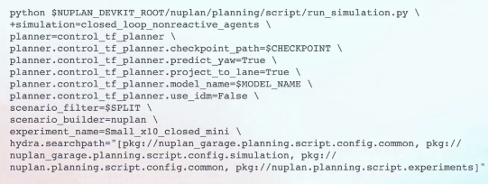
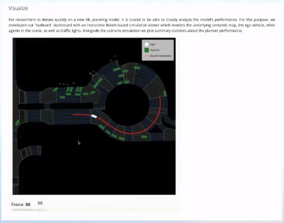

# nuplan-devkit学习

## 1. 场景与地图读取

### 1.1 场景主类

1. class AbstractScenario（abc.ABC）
2. class NuplanScenario（AbstractScenario）


### 1.2 地图主类

1. class AbstractMap（abc.ABC）
2. MapObject

nuplan数据集中，地图中的车道线是以车道中心线表示的


### 1.3 自车信息类

1. **class EgoState（InterpolatableState）**

包含xyz（z通常为0，主要涉及的是二维平面），yaw角，速度velocity和加速度acceleration


## 2. 仿真模拟介绍

### 2.1 概念介绍

- **开环仿真：**无论未来出现什么情况，自车都会根据预先设定好的轨迹去行驶，也就是planner输出的轨迹不影响自车的位置

  优点：可以衡量planner输出的轨迹相对于groundtruth的准确度如何，去掉了累计误差的影响

  缺点：与现实情况有差距，有局限性

  **分数：主要考虑预测轨迹和自车轨迹的位移偏差、航向角偏差**

- **闭环仿真：**自车执行planner输出的轨迹，通过planner的类调取模型，输出对应的planning的结果，这里nuplan会直接将该结果给到控制器（LQR），从而实现轨迹跟踪

  缺点：当planner变化速率过快时，控制器会跟不上；当该control跟完这个轨迹之后，才会输出给自车，让其行驶

  - **无响应闭环**（nonreactive）：**指周围社会车辆对自车运动无响应（避让）**，可在终端输入如下指令进行simple_planner的无响应闭环仿真程序：

    ```
    python nuplan/planning/script/run_simulation.py \
    +simulation=closed_loop_nonreactive_agents \
    planner=simple_planner \
    scenario_builder=nuplan_mini \
    scenario_filter=all_scenarios \
    scenario_filter.scenario_types="[near_multiple_vehicles, on_pickup_dropoff, starting_unprotected_cross_turn, high_magnitude_jerk]" \
    scenario_filter.num_scenarios_per_type=10
    ```

  - **有响应闭环**（reactive）：**指周围社会车辆对自车运动有响应（避让）**，可在终端输入如下指令进行simple_planner的有响应闭环仿真程序：

    ```
    python nuplan/planning/script/run_simulation.py \
    +simulation=closed_loop_reactive_agents \
    planner=simple_planner \
    scenario_builder=nuplan_mini \
    scenario_filter=all_scenarios \
    scenario_filter.scenario_types="[near_multiple_vehicles, on_pickup_dropoff, starting_unprotected_cross_turn, high_magnitude_jerk]" \
    scenario_filter.num_scenarios_per_type=10
    ```

    此情况下，仿真环境需要去模拟整个环境下行人及其他车辆的行迹过程，这种难度比较大

    - 在nuplan中，提供了一种最简单的模拟方式，叫做**IDM（Intelligent Driver Model）的planner，可以理解为一个基于规则的planner，针对即将遇到的冲突，环境中的行人和车辆永远会选择避让，避免使自车发生冲突（显得有些保守）**


### 2.2 nuPlan config配置

代码格式即为上述提供的样式，是Facebook的hydra库的配置

其本身是一个python脚本，即通过python去调用



- 比较值得注意的是planner开头的部分，nuPlan自己预设了一些planner，像刚才提到的IDM就是

- 在这里我们创建的planner是`planner=control_tf_planner`，在调用脚本的时候就把自己的planner传进来，此时nuPlan就知道是调用我们自己的planner，之后也可以给它自定义一些参数

- `scenario_filter`是判断我们在哪个split上去跑，是在train上去跑，val上去泡，还是test上去跑

- `scenario_builder`一般就是nuplan/nuplan_mini，有一个专门的`scenario_builder.py`代码文件

  功能：用来从db文件中获得scenario，然后把获得的scenario相关信息给到planner

- `hydra.searchpath`：自定义hydra的搜索空间，是一个索引list，意味着hydar会从这个list中搜索它需要的config文件

  nuplan官方提供的config路径通常是在`nupaln.planning.script.config.common`和`nupaln.planning.script.experiment`这两个路径中（**最好不要改动**）


### 2.3 可视化界面

nuPlan官方提供：**nuBoard**

可通过官方提供的`nuplan_framework.ipynb`去启动nuBoard，它是先在本地启动一个server，然后有一个链接可以点击过去



除了提供一个可视化场景以外，还可以看到simulation的整个结果，也可以逐个场景去看

缺点：只能看到这一部分的场景，无法看到全景（主要考虑到性能问题）


## 3. Hydra详解

- 参考资料

  [Nuplan源码中Hydra详解 - 知乎 (zhihu.com)](https://zhuanlan.zhihu.com/p/640898896)

  [Nuplan源码中Pytorch Lightning详解 - 知乎 (zhihu.com)](https://zhuanlan.zhihu.com/p/669897894)


### 3.1 Config Group

`nuplan/planning/script/config/`目录下的yaml文件，training，simulation，nuboard分别表示训练过程，评分过程，和可视化过程中需要的配置文件

1. 从common文件表示三者均需用到的配置文件，其详细内容如下：

```
├── common
│   ├── default_common.yaml
│   ├── default_experiment.yaml
│   ├── default_submission.yaml
│   ├── model
│   ├── scenario_builder
│   │   ├── scenario_mapping
│   │   └── vehicle_parameters
│   ├── scenario_filter
│   ├── simulation_metric
│   │   ├── ego_in_stop_line
│   │   ├── high_level
│   │   └── low_level
│   ├── splitter
│   └── worker
├── nuboard
│   └── default_nuboard.yaml
├── simulation
│   ├── default_run_metric_aggregator.yaml
│   ├── default_simulation.yaml
│   ├── default_submission_planner.yaml
│   ├── callback
│   ├── ego_controller
│   │   ├── motion_model
│   │   └── tracker
│   ├── main_callback
│   ├── metric_aggregator
│   ├── observation
│   ├── planner
│   ├── predictor
│   └── simulation_time_controller
└── training
    ├── default_training.yaml
    ├── callbacks
    ├── data_augmentation
    ├── data_augmentation_scheduler
    ├── data_loader
    ├── lightning
    ├── lr_scheduler
    ├── objective
    ├── optimizer
    ├── scenario_type_weights
    ├── training_metric
    └── warm_up_lr_scheduler
```

2. config同级目录**experiments的文件表示实验过程的参数配置**


```
├── simulation
│   ├── closed_loop_nonreactive_agents.yaml
│   ├── closed_loop_reactive_agents.yaml
│   ├── open_loop_boxes.yaml
│   ├── remote_closed_loop_nonreactive_agents.yaml
│   ├── remote_closed_loop_reactive_agents.yaml
│   ├── remote_open_loop_boxes.yaml
│   └── validation_challenge.yaml
└── training
│   ├── training_our_model.yaml
│   ├── training_raster_model.yaml
│   ├── training_simple_vector_model.yaml
│   ├── training_urban_driver_open_loop_model.yaml
│   └── training_vector_model.yaml
```

3. **运行脚本`run_training.py`**在所有配置组yaml文件的上层目录，或者同级目录也可以，这实际上是为了**Entry**python入口传参数方便

```
├── script
│   ├── config
│   ├── experiments
└── run_training.py

# 或者
├── config
├── experiments
└── run_training.py
```


### 3.2 Entry

将@hydra.main写在run_training.py程序入口函数main()的上方，即表示hydra传入cfg参数的入口

**其中CONFIG_PATH表示相对于run_training.py的相对路径，而CONFIG_NAME表示相对路径下yaml文件的名字，即CONFIG_PATH+ CONFIG_NAME中的yaml文件构成参数入口**

```python
if os.environ.get('NUPLAN_HYDRA_CONFIG_PATH') is not None:
    CONFIG_PATH = os.path.join('../../../../', CONFIG_PATH)

if os.path.basename(CONFIG_PATH) != 'training':
    CONFIG_PATH = os.path.join(CONFIG_PATH, 'training')
CONFIG_NAME = 'default_training'


@hydra.main(config_path=CONFIG_PATH, config_name=CONFIG_NAME)
def main(cfg: DictConfig) -> Optional[TrainingEngine]:
    ...
    ...
    
if __name__=='__main__':
    main()
```


### 3.3 源码解析

#### 3.3.1 default_training.yaml

脚本路径为`nuplan/planning/script/config/training/default_training.yaml`

#####  `searchpath`

```yaml
hydra:
  run:
    dir: ${output_dir}
  output_subdir: ${output_dir}/code/hydra           # Store hydra's config breakdown here for debugging
  searchpath:                                       # Only <exp_dir> in these paths are discoverable
    - pkg://nuplan.planning.script.config.common
    - pkg://nuplan.planning.script.experiments   
```

作为hydra的配置参数：

- [x] 一种是以pkg://的方式来找搜索路径，即其文件夹需要是python模块，即在文件夹下添加函数**init.py**

- [ ] 一种是以file:// 的形式来找搜索路径


两种方式既可以采用相对路径也可采用绝对路径的模式。若采用相对路径的模式，则当前路径是Vscode等软件当前打开的文件夹目录/工程目录

##### `Defaults`

defaults的意思是默认采用的配置文件，其语法是加一个 - key: value 或者 - value 

这里的key表示文件夹，value表示文件名，若当前default_training.yaml找不到对应文件则在搜索目录下寻找

符号 ??? 表示缺失值，若调用对应的key会报错

null表示值为None，赋值给python对象即表示没有值


#### 3.3.2 override

- **override表示覆盖原有的参数值**

  以data_augmentation为例，由于data_augmentation等文件夹(key)不在当前文件下，**故采用绝对路径的形式，加一个/，表示该文件夹在global文件配置default_training.yaml文件下**

  

#### 3.3.3 instantiate

**Hydra使用yaml文件中的参数将类实例化的函数instantiate**

其定义如下：

```python
def instantiate(config: Any, *args: Any, **kwargs: Any) -> Any:
    """
    :param config: An config object describing what to call and what params to use.
                   In addition to the parameters, the config must contain:
                   _target_ : target class or callable name (str)
                   And may contain:
                   _args_: List-like of positional arguments to pass to the target
                   _recursive_: Construct nested objects as well (bool).
                                True by default.
                                may be overridden via a _recursive_ key in
                                the kwargs
                   _convert_: Conversion strategy
                        none    : Passed objects are DictConfig and ListConfig, default
                        partial : Passed objects are converted to dict and list, with
                                  the exception of Structured Configs (and their fields).
                        all     : Passed objects are dicts, lists and primitives without
                                  a trace of OmegaConf containers
                   _args_: List-like of positional arguments
    :param args: Optional positional parameters pass-through
    :param kwargs: Optional named parameters to override
                   parameters in the config object. Parameters not present
                   in the config objects are being passed as is to the target.
                   IMPORTANT: dataclasses instances in kwargs are interpreted as config
                              and cannot be used as passthrough
    :return: if _target_ is a class name: the instantiated object
             if _target_ is a callable: the return value of the call
    """
```

- 举例如下：

```python
worker: WorkerPool = (
        instantiate(cfg.worker, output_dir=cfg.output_dir)
        if is_target_type(cfg.worker, RayDistributed)
        else instantiate(cfg.worker)
    )
    validate_type(worker, WorkerPool)
```

假设cfg.worker使用的是`ray_distributed.yaml`：

```yaml
_target_: nuplan.planning.utils.multithreading.worker_ray.RayDistributed
_convert_: 'all'
master_node_ip: null    # Set to a master node IP if you desire to connect to cluster remotely
threads_per_node: null  # Number of CPU threads to use per node, "null" means all threads available
debug_mode: false       # If true all tasks will be executed serially, mainly for testing
log_to_driver: true     # If true, all printouts from ray threads will be displayed in driver
logs_subdir: 'logs'     # Subdirectory to store logs inside the experiment directory
use_distributed: false  # Whether to use the built-in distributed mode of ray
```


#### 3.3.4 Nuplan举例

python run_training运行参数中的**+training=training_vector_model**，这里表示新加的配置文件，即**表示experiments/training文件夹下的training_vector_model.yaml文件**

- 因为当前搜索run_training对应路径下没有，所以会去default_training.yaml另外两个search_path中寻找，发现在pkg://nuplan.planning.script.experiments文件下

而在training文件夹下的training_vector_model.yaml文件中

```yaml
# @package _global_
job_name: vector_model
py_func: train
objective_aggregate_mode: mean

defaults:
  - override /data_augmentation:
      - kinematic_agent_augmentation
      - agent_dropout_augmentation
  - override /objective:
      - imitation_objective
  - override /splitter: nuplan
  - override /model: vector_model
  - override /scenario_filter: training_scenarios
  - override /training_metric:
      - avg_displacement_error
      - avg_heading_error
      - final_displacement_error
      - final_heading_error
```

- `# @package _global_`表示将**该文件夹下的配置参数放在顶层配置文件，即default_training.yaml里面**，最后直接变成cfg的字典配置项

  以`training_vector_model.yaml`文件为例，它的配置项为model=vector_model，表示使用model文件夹下面的`vector_model.yaml`配置文件，并在`build_torch_module_wrapper`(cfg.model)函数中实例化模型

  ```python
  def build_torch_module_wrapper(cfg: DictConfig) -> TorchModuleWrapper:
      """
      Builds the NN module.
      :param cfg: DictConfig. Configuration that is used to run the experiment.
      :return: Instance of TorchModuleWrapper.
      """
      logger.info('Building TorchModuleWrapper...')
      model = instantiate(cfg)
      validate_type(model, TorchModuleWrapper)
      logger.info('Building TorchModuleWrapper...DONE!')
  
      return model
  ```


## 4. Pytorch Lightning详解

Pytorch Lighting更加适合大型工程，它各个模块之间是相互独立的，并且已经把模板写好了，只需要填充相应的内容就好，可以根据下图对比理解


主要分为四个部分：数据加载，构建模型，使用模型，回调函数

前两个部分用于模型训练，在nuplan的训练过程中使用`run_training.py`，后两个部分主要用于模型评估可视化，在nuplan的模拟过程和可视化中使用`run_simulation.py`和`run_nuborad.py`


### 4.1 Dataset

pytorch框架使用`torch.utils.data.Dataset`加载数据集，一般数据是已经准备好了，不需要预处理，所以这部分不需要管

但是如果需要预处理数据需要继承torch.utils.data.Dataset类并重载**getitem**函数

nuplan的数据需要预处理，所以在自定义了ScenarioDataset继承torch.utils.data.Dataset，在函数**getitem**调用compute_features进行数据预处理。调用Trainer.fit()函数开始训练后，每个batchsize会自动调用**getitem**从scenario中提取出map和agent的feature和target信息。

```python
class ScenarioDataset(torch.utils.data.Dataset):
    """
    Dataset responsible for consuming scenarios and producing pairs of model inputs/outputs.
    """

    def __init__(
        self,
        scenarios: List[AbstractScenario],
        feature_preprocessor: FeaturePreprocessor,
        augmentors: Optional[List[AbstractAugmentor]] = None,
    ) -> None:
        """
        Initializes the scenario dataset.
        :param scenarios: List of scenarios to use as dataset examples.
        :param feature_preprocessor: Feature and targets builder that converts samples to model features.
        :param augmentors: Augmentor object for providing data augmentation to data samples.
        """
        super().__init__()

        if len(scenarios) == 0:
            logger.warning('The dataset has no samples')

        self._scenarios = scenarios
        self._feature_preprocessor = feature_preprocessor
        self._augmentors = augmentors

    def __getitem__(self, idx: int) -> Tuple[FeaturesType, TargetsType, ScenarioListType]:
        """
        Retrieves the dataset examples corresponding to the input index
        :param idx: input index
        :return: model features and targets
        """
        scenario = self._scenarios[idx]

        features, targets, _ = self._feature_preprocessor.compute_features(scenario)

        if self._augmentors is not None:
            for augmentor in self._augmentors:
                augmentor.validate(features, targets)
                features, targets = augmentor.augment(features, targets, scenario)

        features = {key: value.to_feature_tensor() for key, value in features.items()}
        targets = {key: value.to_feature_tensor() for key, value in targets.items()}
        scenarios = [scenario]

        return features, targets, scenarios

    def __len__(self) -> int:
        """
        Returns the size of the dataset (number of samples)

        :return: size of dataset
        """
        return len(self._scenarios)
```

compute_features会从scenario中提取特征，其最终会调用nuplan_feature_builder中的get_features_from_scenario和ego_trajectory_target_builder中的get_targets函数（调用哪个文件里面的类中的函数取决于hydra的配置，详见我上一篇文章），或者从cache中load已有的feature和target


### 4.2 LightningDataModule

上述Dataset是应对数据集已经划分好，到batchsize阶段的数据处理了，所以前期还需要划分数据集

**Lighning框架使用pl.LightningDataModule来划分数据集，Nuplan使用的主要函数包括setup，teardown，train_dataloader，val_dataloader，test_dataloader**，前两个函数在数据集开始准备和完成准备时调用，必须重载，后三个函数分别在相应数据阶段时准备

其中一个典型的例子为`datamodule.py`中的`DataModule`类

```python
class DataModule(pl.LightningDataModule):
    def __init__(...)
    	...
        
    def setup(...)
    	...
        
    def teardown(...)
    	...
        
    def train_dataloader(...)
    	...
        
    def val_dataloader(...)
    	...
        
    def test_dataloader(...)
    	...
        
    
```

setup函数主要就是在划分数据集，其最终调用了同脚本中的`create_dataset`函数


### 4.3 模型准备

数据准备好了之后，传入模型只可以开始训练了

**Lightning框架使用LightningModule来加载模型，Nuplan使用的主要的方法有training_step，validation_step，test_step，configure_optimizers**，前三个函数用于相应阶段的训练，最后一个函数用于设置优化器。还有其他的函数具体可以见官方例子

上述流程总结下来就是，Trainer.fit()开始训练之后，先准备数据（上一节的内容），再自动调用training_step/validation_step/test_step开始训练/验证/测试模型

这里以`lighting_module_wrapper.py`中的`LightningModuleWrapper`类为例

```python
class LightningModuleWrapper(pl.LightningModule):
    def __init__(...)
    	...
        
    def _step(...)
        ...
        
    def _compute_objectives(...)
    	...
        
    def _compute_metrics(...)
    	...
        
    def _log_step(...)
    	...
        
    def training_step(...)
    	...
        
    def validation_step(...)
    	...
        
    def test_step(...)
    	...
        
    def forward(...)
    	...
        
    def configure_optimizers(...)
    	...
        
    
```

在函数training_step中实际上调用了内部函数_step，其进行了整个训练的流程，从batch中取出特征features和目标targets，然后用于后续的前向传播，损失函数计算和指标计算


## 5. 车辆模型代码理解

### `abstract_motion_model.py`

路径为：`nuplan/planning/simulation/controller/motion_model/abstract_motion_model.py`

**定义了一个名为 `AbstractMotionModel` 的抽象基类**：即作为一个接口，强制要求任何继承此基类的子类都必须实现 `get_state_dot` 和 `propagate_state` 这两个方法

使用 Python 的 `abc` 模块（Abstract Base Classes，抽象基类模块）来定义，确保所有派生自此基类的子类都必须实现定义的抽象方法

- **函数`get_state_dot`**：求子类实现计算车辆状态导数的逻辑，状态导数是指车辆当前状态（位置、速度、加速度等）随时间的变化率

  接受参数为`state`：一个 `EgoState` 类型的对象，**表示车辆的当前状态**

  返回值为`EgoStateDot` 类型的对象，**表示给定状态的导数**

- **函数`propagate_state`**：实现根据当前状态和理想动态状态，以及给定的时间间隔，预测车辆未来状态的逻辑。

  接受参数为：

  1. `state`：`EgoState` 类型的对象，表示要传播的初始状态。
  2. `ideal_dynamic_state`：`DynamicCarState` 类型的对象，表示预期的动态状态，用于预测未来状态。
  3. `sampling_time`：`TimePoint` 类型，表示预测的时间范围。

  返回值为 `EgoState` 类型的对象，**表示预测的未来车辆状态**。


