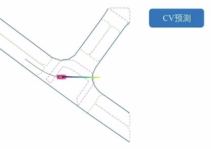
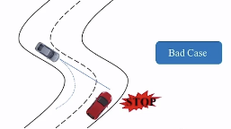

# 基于模型的预测方法

## 1.预测系统发展

**常规车辆轨迹预测指标：FDE和ADE**

- FDE(Final Displacement Error)：指预测得到的车辆轨迹的**最终**位置与真实的最终位置之间的距离差，其计算公式为：
  $$
  FDE=\sqrt{(x_f-x)^2+(y_f-y)^2}
  $$
  其中：$x_f$ 和 $y_f$ 是预测最终位置的横纵坐标，$x$ 和 $y$ 是真实最终位置的横纵坐标

- ADE(Average Displacement Error)：指预测到的车辆轨迹的**每个时刻**位置与真实位置之间的平均距离差，其计算公式为：
  $$
  ADE=\frac{1}{N} \cdot \sum \sqrt{(x_f-x)^2+(y_f-y)^2}
  $$
  其中，$N$ 表示轨迹的时刻数量，$x_i$ 和 $y_i$ 是预测的第 i 时刻位置的横纵坐标，$x$ 和 $y$ 是真实的第 i 个时刻位置的横纵坐标

这两个指标可以用来评估车辆轨迹预测算法的准确性和精度，较小的FDE和ADE值表示预测结果与真实轨迹位置较为接近，表明预测算法性能好


**Recall和Precision**

- Recall：车辆真实轨迹发生改变，但是预测轨迹并无改变，即为recall（召回）低
- Precision：不应该报告的车辆轨迹进行报告，即为precision低


预测方法的发展基本经历了以下三个阶段，但它不意味着是更新迭代，更多的是混合使用。

- 简单运动模型的预测：定速度预测 (Constant Velocity, CV)、定曲率预测 (Constant Turn, CT) 虽然这套方法比较简单，但一套系统里总归是会包含的。其优点在于计算成本低，但缺点很明显，不适合复杂场景，长时预测失准。
- 结合场景先验只是的预测 (如 agent-map, agent-agent 等) 的预测：基于手工特征的意图预测。 **暂时介绍基于手工特征的，后续 learning-based 的会专门介绍。** 其特点是融合意图级别信息，但缺少轨迹级别信息。
- 意图预测（长时+先验）+短时预测（趋势） = 长时轨迹预测


## 2.定速度预测（Constant Velocity）

在一些弱地图, map-less, 弱感知的场景, CV 预测是一个很好的选择。

- **一维匀速运动模型** 

  目标做匀速直线运动，加速度为0。 现实中速度会有清为扰动变化，可视为具有高斯分布的噪声。 
  $$
  \ddot{X} = W(t)
  $$
  一维状态向量：$X = [x, \dot{x}]^T$ 一维连续 Constant Velocity 模型： 
  $$
  \dot{X(t)} = \begin{bmatrix} 0 & 1 \\ 0 & 0 \end{bmatrix} X{(t)} + \begin{bmatrix} 0 \\ 1 \end{bmatrix} W(t)
  $$
   常用离散形式： 
  $$
  X_{k+1} = \begin{bmatrix} 1 & T \\ 0 & 1 \end{bmatrix} X_k + \begin{bmatrix} \frac{T^2}{2} \\ T \end{bmatrix} W_k
  $$
   T 是采样时间间隔, W 等效于加速度的含义

**CV 预测不受道路结构限制，但和一些感知量耦合很重，比如 yaw, velocity 等。很多感知系统对这几个量的估计都不够准确，所以 CV 预测的准确性也会受到影响。**

- **二维匀速运动模型**

  二维状态向量：
  $$
  X = [x, \dot{x}, y, \dot{y}]^T
  $$
  二维连续 Constant Velocity 模型： 
  $$
   \dot{X(t)} = \begin{bmatrix} 0 & 1 & 0 & 0 \\ 0 & 0 & 0 & 0 \\ 0 & 0 & 0 & 1 \\ 0 & 0 & 0 & 0 \end{bmatrix} X{(t)} + \begin{bmatrix} 0 & 0 \\ 1 & 0 \\ 0 & 0 \\ 0 & 1 \end{bmatrix} W(t) 
  $$
  

利用 Nuplan 数据集进行 CV 预测实验，并可视化（要学会如何使用 Nuplan, 例如可视化其道路边界，利用上车辆运动数据等）



```python
def _constant_velocity_heading_from_kinematic(kinematics_data: KinematicsData, src_from_now: float, sampled_at: int) -> np.ndarray:
    """
    Computes a constant velocity baseline for given kinematics data, time window and frequency.
    :param kinematics_data: KinematicsData for agent
    :param src_from_now: How many future seconds to use.
    :param sampled_at: Number of predictions to make per second.
    """
    x, y, vx, vy, _, _, _, _, _, _ = kinematics_data  # 自定义的数据结构
    preds = []
    time_step = 1.0 / sampled_at
    for time in np.arange(time_step, src_from_now + time_step, time_step):
        preds.append((x + vx * time, y + vy * time))
    return np.array(preds)
```

CV预测的Bad Case：



- 这种情况就是缺少 agent-map 信息，无法准确通过道路结构或道路中心线去指导预测，而仅仅是根据当前的速度和加速度去预测的。