# 基于模型的预测方法

## 1.预测系统发展

**常规车辆轨迹预测指标：FDE和ADE**

- FDE(Final Displacement Error)：指预测得到的车辆轨迹的**最终**位置与真实的最终位置之间的距离差，其计算公式为：
  $$
  FDE=\sqrt{(x_f-x)^2+(y_f-y)^2}
  $$
  其中：$x_f$ 和 $y_f$ 是预测最终位置的横纵坐标，$x$ 和 $y$ 是真实最终位置的横纵坐标

- ADE(Average Displacement Error)：指预测到的车辆轨迹的**每个时刻**位置与真实位置之间的平均距离差，其计算公式为：
  $$
  ADE=\frac{1}{N} \cdot \sum \sqrt{(x_f-x)^2+(y_f-y)^2}
  $$
  其中，$N$ 表示轨迹的时刻数量，$x_i$ 和 $y_i$ 是预测的第 i 时刻位置的横纵坐标，$x$ 和 $y$ 是真实的第 i 个时刻位置的横纵坐标

这两个指标可以用来评估车辆轨迹预测算法的准确性和精度，较小的FDE和ADE值表示预测结果与真实轨迹位置较为接近，表明预测算法性能好


**Recall和Precision**

- Recall：车辆真实轨迹发生改变，但是预测轨迹并无改变，即为recall（召回）低
- Precision：不应该报告的车辆轨迹进行报告，即为precision低


预测方法的发展基本经历了以下三个阶段，但它不意味着是更新迭代，更多的是混合使用。

- 简单运动模型的预测：定速度预测 (Constant Velocity, CV)、定曲率预测 (Constant Turn, CT) 虽然这套方法比较简单，但一套系统里总归是会包含的。其优点在于计算成本低，但缺点很明显，不适合复杂场景，长时预测失准。
- 结合场景先验只是的预测 (如 agent-map, agent-agent 等) 的预测：基于手工特征的意图预测。 **暂时介绍基于手工特征的，后续 learning-based 的会专门介绍。** 其特点是融合意图级别信息，但缺少轨迹级别信息。
- 意图预测（长时+先验）+短时预测（趋势） = 长时轨迹预测


## 2.定速度预测（Constant Velocity）

在一些弱地图, map-less, 弱感知的场景, CV 预测是一个很好的选择。

- **一维匀速运动模型** 

  目标做匀速直线运动，加速度为0。 现实中速度会有清为扰动变化，可视为具有高斯分布的噪声。 
  $$
  \ddot{X} = W(t)
  $$
  一维状态向量：$X = [x, \dot{x}]^T$ 一维连续 Constant Velocity 模型： 
  $$
  \dot{X(t)} = \begin{bmatrix} 0 & 1 \\ 0 & 0 \end{bmatrix} X{(t)} + \begin{bmatrix} 0 \\ 1 \end{bmatrix} W(t)
  $$
   常用离散形式： 
  $$
  X_{k+1} = \begin{bmatrix} 1 & T \\ 0 & 1 \end{bmatrix} X_k + \begin{bmatrix} \frac{T^2}{2} \\ T \end{bmatrix} W_k
  $$
   T 是采样时间间隔, W 等效于加速度的含义

**CV 预测不受道路结构限制，但和一些感知量耦合很重，比如 yaw, velocity 等。很多感知系统对这几个量的估计都不够准确，所以 CV 预测的准确性也会受到影响。**

- **二维匀速运动模型**

  二维状态向量：
  $$
  X = [x, \dot{x}, y, \dot{y}]^T
  $$
  二维连续 Constant Velocity 模型： 
  $$
   \dot{X(t)} = \begin{bmatrix} 0 & 1 & 0 & 0 \\ 0 & 0 & 0 & 0 \\ 0 & 0 & 0 & 1 \\ 0 & 0 & 0 & 0 \end{bmatrix} X{(t)} + \begin{bmatrix} 0 & 0 \\ 1 & 0 \\ 0 & 0 \\ 0 & 1 \end{bmatrix} W(t) 
  $$
  

利用 Nuplan 数据集进行 CV 预测实验，并可视化（要学会如何使用 Nuplan, 例如可视化其道路边界，利用上车辆运动数据等）


```python
def _constant_velocity_heading_from_kinematic(kinematics_data: KinematicsData, src_from_now: float, sampled_at: int) -> np.ndarray:
    """
    Computes a constant velocity baseline for given kinematics data, time window and frequency.
    :param kinematics_data: KinematicsData for agent
    :param src_from_now: How many future seconds to use.
    :param sampled_at: Number of predictions to make per second.
    """
    x, y, vx, vy, _, _, _, _, _, _ = kinematics_data  # 自定义的数据结构
    preds = []
    time_step = 1.0 / sampled_at
    for time in np.arange(time_step, src_from_now + time_step, time_step):
        preds.append((x + vx * time, y + vy * time))
    return np.array(preds)
```

CV预测的Bad Case：


- 这种情况就是缺少 agent-map 信息，无法准确通过道路结构或道路中心线去指导预测，而仅仅是根据当前的速度和加速度去预测的。


## 3.定曲率预测（Constant Turn，CT）

大部分情况, CV 预测还是不够用的。自车的曲率一般很容易换算得到，但其他车辆的曲率就不那么容易得到了。通常使用恒定曲率模型来预测，即 Constant Turning Rate，这个值一般通过感知得到，来自于 Yaw Rate (一般都是通过前后几帧插值出来的)

匀速圆周运动离散模型：转角变化率恒定，通常是在CV的基础上加上了曲率的考虑

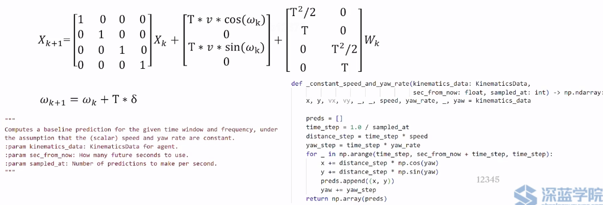


其中，$w_k$是转角量，$\delta$是转角速率（观测出来的）

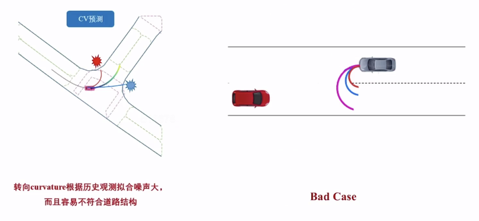

- Yaw Rate 很有可能有较大误差，导致预测不准确。
- Bad Case: 对向掉头车辆的预测，无法准确知道对方的转角，所以轨迹也会飘忽不定。

---

**定速度预测 VS 定曲率预测**

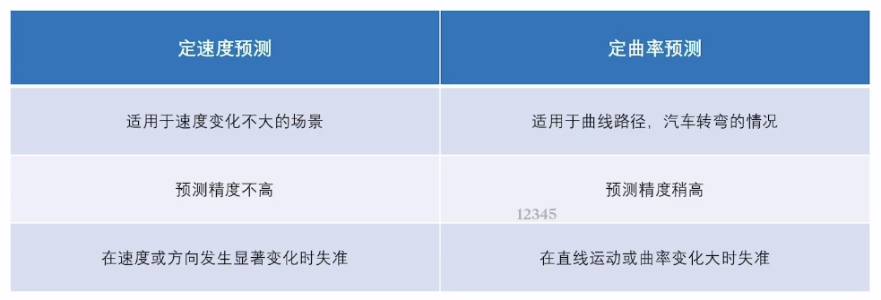

共同局限：长时间区间会失准！！！ 两者其实半斤八两，所以一般只作为系统的兜底选择。

**短期预测 VS 长期预测** 

CV 和 CT 都属于运动趋势的延拓，一般在1s内的预测都是比较准确的，但长时间区间的预测就不太准确了。预测不确定性随着预测时间变长显著增大

- 短期预测：基于运动学模型或者预测网络，完成短时预测，一般为3s
- 长期预测：结合**意图**预测，稳定长时预测，避免远端发散，一般为8s+

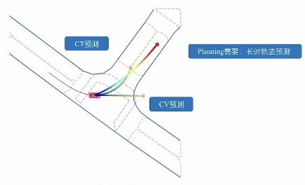

预测本身是具有不确定性的，所以对于长期预测，只能说限制其不确定性，方法就是引入“意图”。

- 很多长期预测都使用网络来做，但意图预测是基于事先制定的规则，所以其展现出的效果会更稳定


## 4.基于手工特征的意图预测

- **意图：**预先定义的车流行为，如变道、左右转等
- **分类：**基于车辆的行为特征，对车辆的意图进行分类

意图很常见地绑定到车道(lane)上，还有路口的交叉口(intersection)等。大部分情况都可以工作的很好，但在一些特殊情况，比如道路情况缺失，导致无法判断意图，进而导致预测失准。 有了意图，就会有类别，就可以做分类，分类问题是大部分网络最先成熟的问题。 尽管这一节是介绍基于模型的，但也会介绍一些基于深度学习的，因为仅靠基于规则或模型的方法无法满足需求。

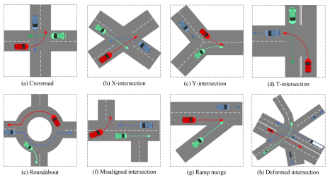


### 基于SVM的意图分类

#### 支持向量机 (Support Vector Machine, SVM)

- SVM 是用于分类问题的有监督学习算法，其基本思想是找到一个超平面$w \cdot x+b=0$，使不同类别的数据点之间的分离最大化
- 支持向量是距离超平面最近的数据点，它们决定了超平面的位置: $y_i(w\cdot x_i+b)=1$

- 需要解决优化问题：

  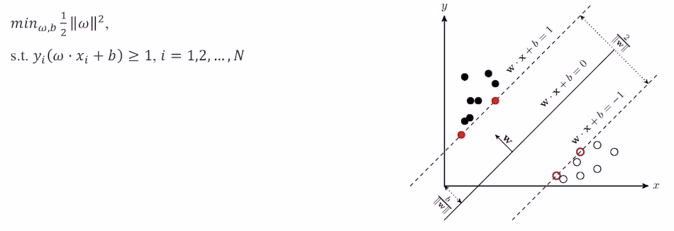

在 Nuplan 数据集中可以提取到很多 label, 并且现在 python 中 SVM 就是调库就行了，所以可以直接用 SVM 来做意图分类。


#### SVM特征选取

- 输入的本质即为：特征feature

- 输出的核心即为：类别class

无论是SVM还是简单的深度模型，它都是在做特征feature到类别class之间的映射

此处以车辆变道举例，它可以看作是一个二分类问题，需要基于一些特征来进行分类。有很多特征可以选取，比如：

- 手工特征标记：
  - 距离目标车道的横向距离
  - 距离目标车道的横向速度
  - 道路实线、虚线
  - 与前车的距离的相对速度
  - ...

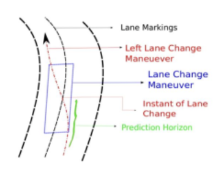

必须尽可能扩充特征维度，以提高分类准确性。否则，特征维度不足，分类效果会很差。为什么现在深度学习这么火，就是因为深度学习可以自动提取特征，不需要人工干预，并且提取的特征维度很高。相较于传统的机器学习，深度学习的原始特征维度更高，所以分类效果更好。

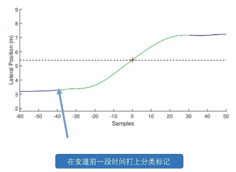

特征标签需要在动作发生之前标记，这样才能做预测。所以**需要提前标记好 label，但是这个提前量是不好确定的，所以这个 label 也是有一定的不确定性，也就成为了一个超参数，需要不断的试验**

- 如果一个变道标签打得过早，那会使得本来应该保持车道的动作被误判为变道，导致分类失准
- 如果变道标签打得很晚，那车辆都有变道动作了才有一定的预测，这样预测就没有意义了


#### SVM输入输出案例

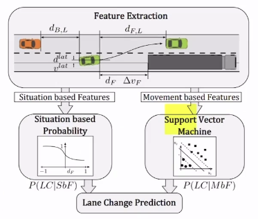

- 输入：历史横向位置、转向角、速度。
- 输出：下一时刻的行为标签 ∈[0,1]：0表示不去该车道；1表示去该车道
- 损失函数：交叉熵损失函数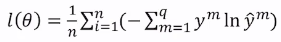

除了手工标记之外，可以使用使用一些更深的网络模型来做意图分类，例如： **基于神经网络的意图预测**


### 基于神经网络的意图预测

通过多层感知机（MLP）预测障碍车会选择哪一条车道行驶，输出每个车道线的概率 **(DNN 模型)**

- **输入：**每个车道线序列障碍物特征和车道线特征组成的62维特征向量 (高维输入就不适合用 SVM)
- **输出：**每条车道线序列的概率
- **模型(MLP_EVALUATOR)：**4层全连接神经网络，每层之间用线性层进行连接

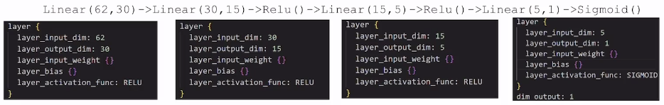

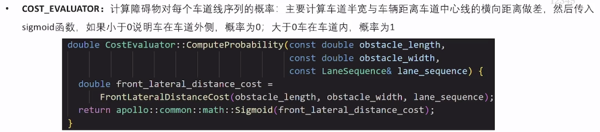

基于规则的方法，其实可以看作就是手动的 SVM, if-else 的结构就可以看作是一个简单的分类器。这些基础的方法常常都为基于神经网络的意图预测进行兜底。


### 其它输出建模方法

#### Apollo对多路口情况进行扇区划分进行交通道路的变道意图预测

- **输入：**障碍物自身运动历史，路口车道信息，周围其他障碍物信息
- **模型：**以障碍物车向为参考方向，划分为12个扇形区域；记录每个扇形区域内是否有离开该路口的车道；将问题转化为12元分类问题

- **输出：选择对应扇区的概率**

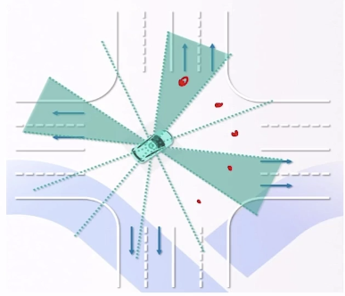

从工程上来说，确定 Input (无脑 concat 各种特征), Model (SVM, DNN, Rule), Output (lanes, sectors), 然后就可以作出预测。可以考虑是否对某些场景有更好的输出形式，或者模型是否有更好的选择。


#### 人工构造的输入特征有天然局限性

- **输入：**利用语义地图信息，把环境转化为图像，相比于以前将特征拼接成一个向量，这样的方法更加通用。但是也更麻烦，因为需要图像的生成。在 CNN 很火的时候，这种方法很常见。


- 不同轨迹渲染成不同的颜色
- 一串拖尾特效表示历史轨迹
- 背景也被渲染出来

除了图像，现在用的更多的是 BEV feature


### 其它的分类模型

#### 基于隐马尔可夫模型的意图估计

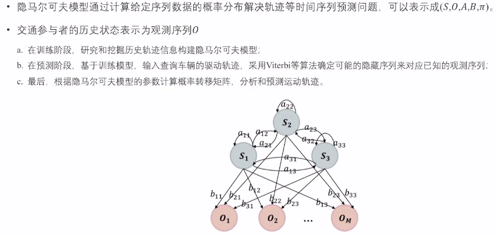


## 5.基于模型的轨迹预测

### 如何将短时轨迹结合长时意图

**长时轨迹生成->轻量化的planner**

核心思想：

- 基于意图估计， 结合地图拿到参考
- 基于短时预测，确定局部运动趋势
- 结合意图估计和短时预测，补全长时轨迹

一方面贴近短时预测的趋势，一方面收敛到长时意图的方向，用优化的思想 constraints：满足运动学，贴合地图； objective：贴近短时预测，收敛到长时意图

但是这个方法的缺点是，约束会很多，因为 agents 很多，如果每个都考虑，那这个规划器会很沉重，但我们需要的是一个轻量级的规划器。传统的 planner 有三板斧：搜索，采样和优化，但这些都很重，**所以我们这里选择曲线拟合**

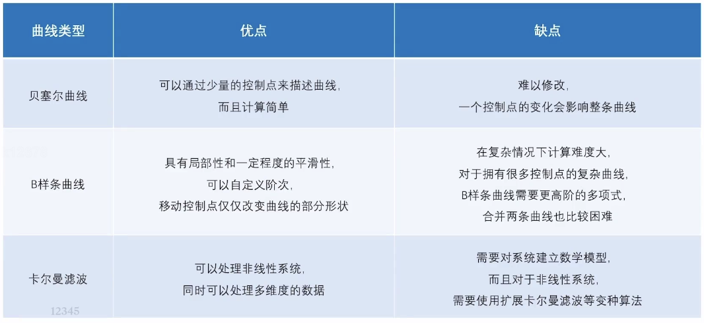

- 这里的卡尔曼滤波可以看作成一种广义的曲线，以车辆运动学往前推算


#### Bezier曲线生成长时轨迹

意图预测判断出车道后，可以灵活基于地图抽取控制点

Bezier曲线的基本原理：

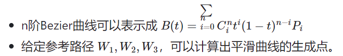

因此控制生成点的生成策略，就可以直接导出曲线。可以**通过一些先验的方法去撒点**，然后通过贝塞尔曲线去拟合这些点，就可以得到一条长时轨迹。

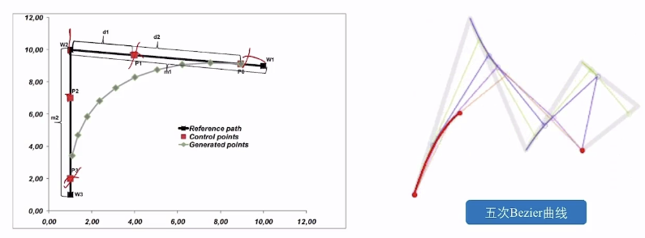


#### Bezier曲线数学方法

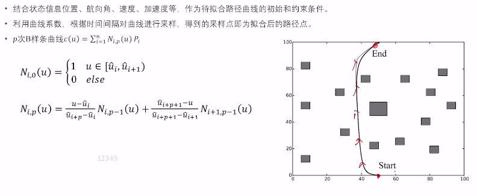


#### Bezier曲线生成长时轨迹

重点关注利用贝塞尔曲线生成长时轨迹的方法，这个方法是轻量级的，而且可以很好地贴合短时预测和长时意图：

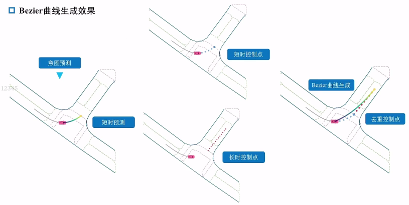

- 通过查询地图，去找到短时预测和长时意图的衔接点，然后对控制点进行去重、插值等操作，最后通过贝塞尔曲线生成长时轨迹。

**利用 Nuplan 数据集进行贝塞尔曲线生成长时轨迹的预测器，并可视化：**

- 短时预测可以使用 CV 或者 CT 预测，然后根据短时预测延伸成长时轨迹，利用贝塞尔曲线，并且可以使用 SVM 或者 DNN 等模型
- 在 python, 曲线或者模型大部分都是调库就行了


## 6.EPSILON：Intention Prediction Network

这是丁文超老师之前的一篇关于预测、规划的论文方法：

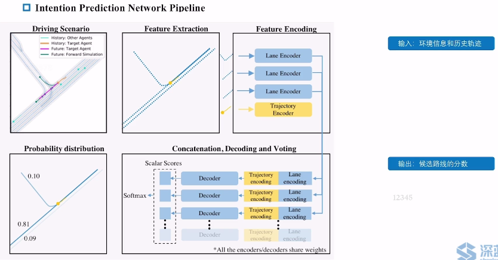

- 在 Driving Scenario 中，是一些历史轨迹，以及目标轨迹；而可能的预测轨迹呈现出多模态的情况
- 在 Feature Extraction 中，需要统一到车辆坐标系
- 在 Feature Encoding 中，可以简单使用 MLP 或者 LSTM
- 在第四步中, `concate()` 了 Lane encoding 和 Trajectory encoding (并且 Trajectory encoding expand 了四份，梯度共享); Decoder 使用 MLP; 最后对输出进行 softmax 归一化（但也不一定需要 softmax 使得概率合为1）

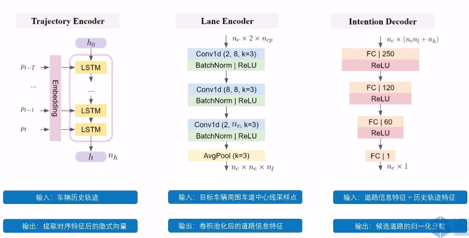

- 对输入轨迹使用 LSTM, 因为轨迹是序列数据

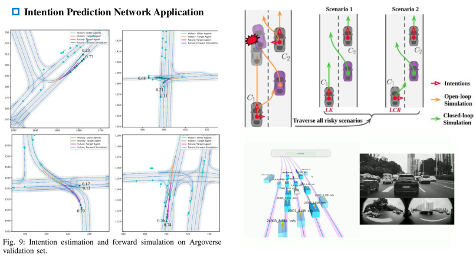

- 得到输出的一系列车道的分数后，怎么转化为轨迹。

  **这里使用了一种叫前向仿真的方法**

  - 前向仿真：采样出一些加速度，沿着候选车道进行仿真（判断是否有相撞等），得到预测轨迹（仿真时间可以自定义，8s或者10s的）
  - 为什么不用轨迹和生成器，因为轨迹生成器无法考虑到智能体的交互，而仿真可以模拟出智能体的交互