# 路径与轨迹规划

- 基于**搜索**的路径规划
- 基于**采样**的路径规划
- 基于**优化**的路径规划

## 1. 基于搜索的路径规划

### 1.1 Dijkstra算法

见如下笔记：[Dijkstra算法](../车辆规划/路径规划/Dijkstra算法.md)

### 1.2 A*算法

见如下笔记：[A*算法](../车辆规划/路径规划/Astar算法.md)

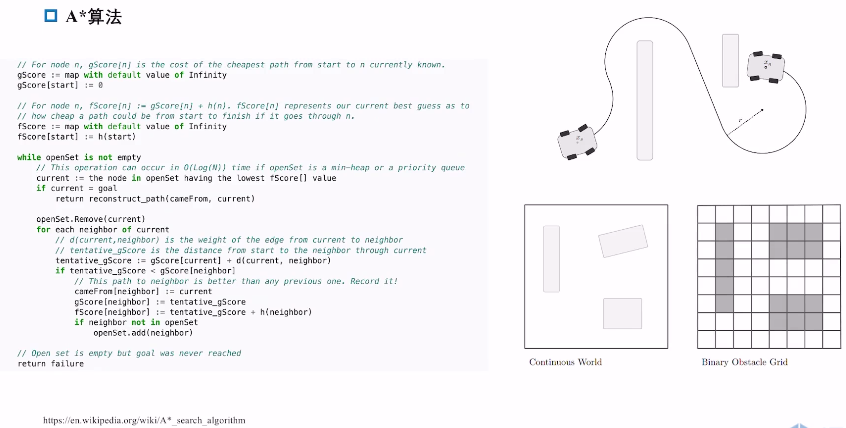

- open list: 用于存放待访问的节点，初始化为起始节点
- close list: 用于存放已访问的节点（已经确定为某种状态），初始化为空
- 不断向周围节点扩展，更新每个节点的 f(n) 值（通常以最小代价为判断），直到找到目标节点或者 open list 为空
- h(n)的设计，是否能准确贴合到目标点的实际距离，关系到算法的结果。避免过量估计，否则会导致算法的效率降低；避免过低估计，否则会导致算法的结果不准确. **A star 会优先向 h(n) 小的方向扩展**

**如果使用 C++ 实现：**

- 可以使用 STL 中的 priority_queue 来实现 open list, 因为每次循环都要首先访问 f(n) 最小的节点，所以使用优先队列来实现 open list 是最合适的
- 在快速判断节点是否访问过，涉及到查询操作，即 Hash 表，可以使用 STL 中的 unordered_map 来实现

**但是，二维格点上进行 A Star 算法缺点：不满足车辆的运动学约束**

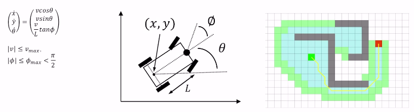

- 如果无法满足运动学约束，即使是搜索到一条最优路径，但控制模块也无法跟踪。
- 车辆运动学模型用的最多的是自行车模型，但是直接套用会增加不必要的复杂度。**习惯性的做法是对节点扩展动作进行离散化处理，即节点扩展的方向不限制于上下左右，而是适当更加密集；扩展的路径不限制于直线，而是圆弧等等** 在此想法上，引出了 Hybrid A*

### 1.3 Hybrid A*算法

见如下笔记：[Hybrid A*算法](../车辆规划/路径规划/Hybrid_Astar.md) ； [Dubins&Reeds-Shepp曲线](../车辆规划/路径规划/Dubins&Reeds-Shepp曲线.md) 

Hybrid 的意义：

- 扩展的 action 层面，定义在了连续的状态空间，采用的是车辆运动学往前传播的方法
- 对于 open set 和 close set 的 状态 (state) 的维护，又是在离散的状态空间

搜索算法的复杂度和判断哪些节点扩展过、哪些节点没被扩展过直接相关，以何种颗粒度 (resolution) 去维护

- 登记节点是否扩展过，以及 cost 更新的时候，以一种大的 resolution 方式更新，即离散；同时也可以使用车辆运动学的方式进行连续的扩展，又是小的 resolution

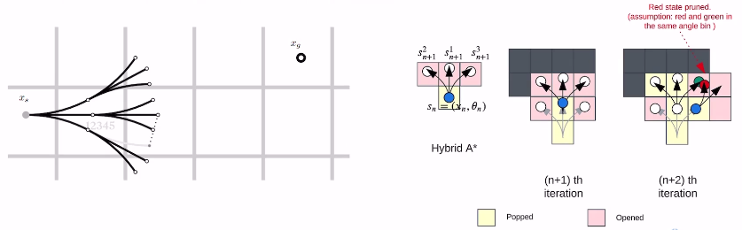

- 在与网格精度大致匹配的条件下，使用 N 种离散的控制动作，比如**离散曲率**
- 该路径是一些受车辆转弯半径约束的圆弧和直线
- 提前终止：计算从当前状态到达目标状态的`Dubins`和`Reeds Shepp`曲线（加速）

**节点的修剪：** 节点的扩展是通过离散曲率在连续空间下进行的，而状态保存又是通过栅格（离散）的方式进行的，所以在一个 cell 中会出现多个节点，这些节点的 cost 是不一样的，所以需要剪枝，只保留 cost 最小的节点。**所以尽管离散曲率增加了复杂度，但又通过在 cell 中的剪枝，减少了搜索的复杂度**

**Dubins:**

- `Dubins`曲线是在满足曲率约束和规定的始端和末端的切线（进入方向）的条件下，连接两个二维平面的最短路径，而且限制目标只能向前行进。
- 从起始点到终止点的最短路径始终可以表示为不超过三个运动基元（直行S、左转L、右转R）的组合。最优的Dubins曲线为集合D={LSL, RSR, RSL, LSR, RLR, LRL}六种中的一种。

**Reeds Shepp:**

- `Reeds-Shepp` 曲线，与 Dubins 曲线的唯一区别是允许反向行进，目标既可以前进，又可以倒退；
- 从起始点到终止点的最短路径始终可以表示为不超过六个运动基元（直行S+ S-、左转L+ L-、右转R+ R-）的组合；
- 与`Dubins`的RLR曲线相比，`Reeds-Shepp`的R+L-R+曲线更短。

**代价计算：** 代价包括节点代价和两个启发函数，即 F(n)=g(n)+ℎ1(n)+ℎ2(n), 其中，

- g(n) 主要考虑路径长度、运动学约束、方向变换的成本；
- ℎ1(n) 只考虑车辆的运动学约束而不考虑障碍物；
- ℎ2(n) 只考虑障碍物而不考虑车辆运动学约束。

## 2. 基于采样的路径规划

见如下笔记：[Frenet坐标系](../车辆规划/运动规划/Frenet坐标系.md)

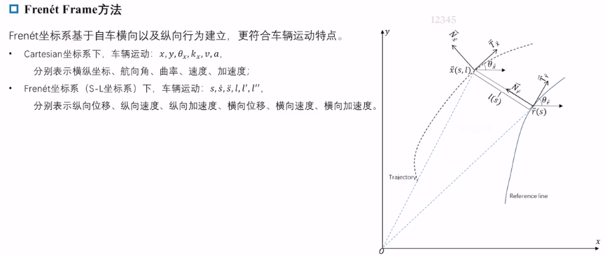

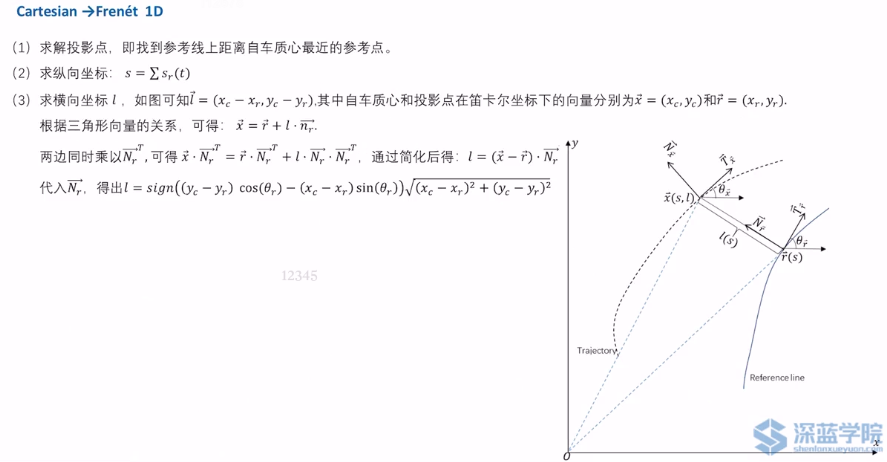

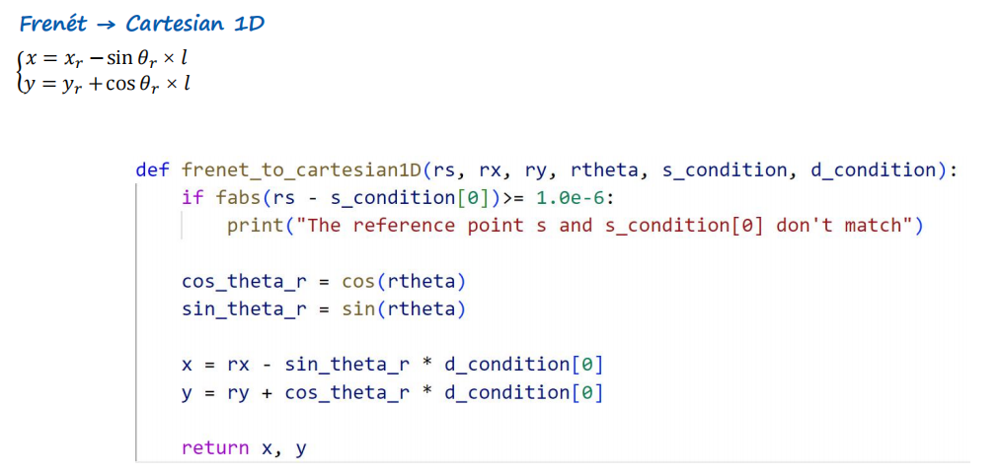

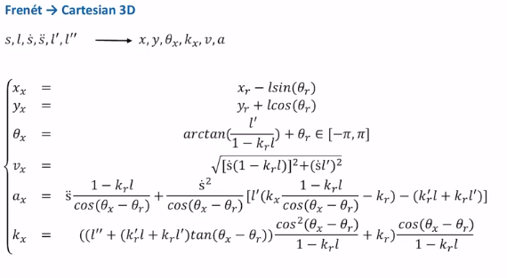

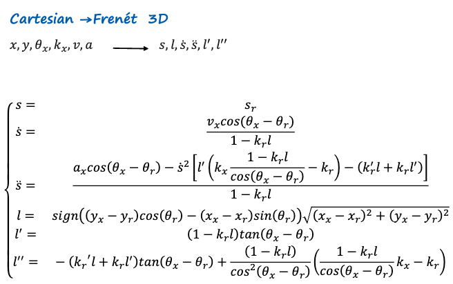

### 贝尔曼 Bellman 最优性原理

对于每个 t=0,1,2,...
$$
V(t, k_t) = \max_{c_t}[f(t, k_t, c_t) + V(t + 1, h(t, k_t, c_T))]
$$
在每个规划步骤中，**都遵循先前计算出的轨迹的剩余部分，提供时间一致性**，这样就感受不到重规划的突变

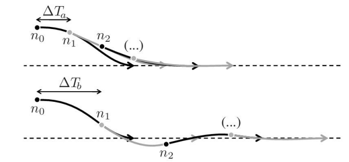

**符合 Bellman 最优性 -> 解决最优控制问题**

在 $s-l$ 坐标系下，**最小化 jerk 平方的积分**的最优解是五次多项式（这几乎是很多规划方法都默认的）

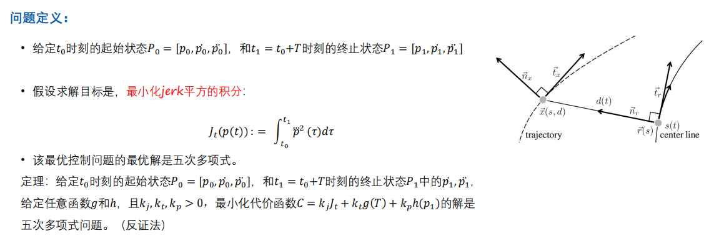

**知道规划路径的最优解是五次多项式，那就直接采样或者别的方法去求解五次多项式的系数就行了，这样就可以得到最优解了**

### 高速与低速轨迹采样

**在参考线坐标系下进行采样，然后转换到笛卡尔坐标系下**

**高速——高速横向运动相比于纵向运动相对幅度非常小，近似横纵向解耦，即横纵向可独立计算**

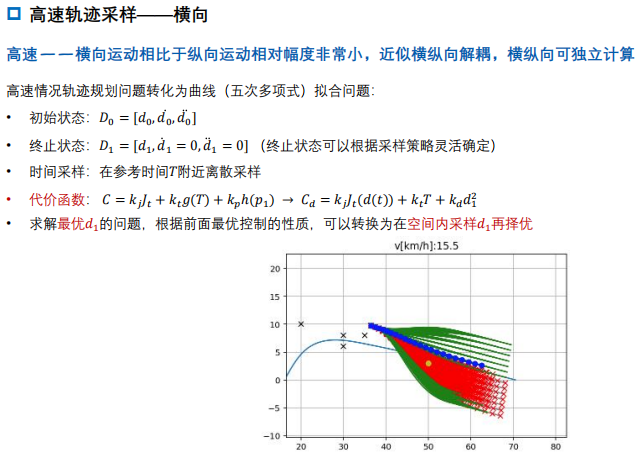

- 高速情况轨迹规划问题转化为曲线（五次多项式）拟合问题：已知起点、终点，在参考时间附近离散采样
- 已知$d_0$ ，采样多个$d_1$，通过设计的代价函数，去选择最优的$d_1$，以此类推，直到采样到终点

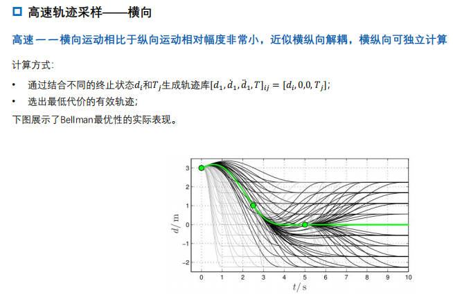

- 每个$d_1$和$d_0$可以形成一条候选采样轨迹，这些形成轨迹库，从中选择最优轨迹
- 根据 Bellman 最优原理，只要每条采样轨迹都是最优的，那就能衔接的非常流畅，但这一般不太可能，因为还必须要求代价函数不能变化，但通常代价函数包括一些障碍物代价，这些代价是变化的。**可能在一些简单的静态环境是符合 Bellman 最优性的，但在动态环境下，就不太可能了**

纵向就可以分一些情况：前方有车，可以有跟车、变道、停车，在这些情况下，合理设计代价函数，就可以得到最优解。前方无车为同理

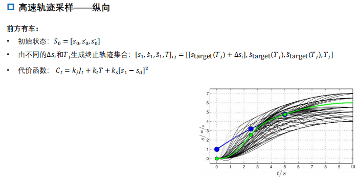

- 跟车时，设置每段采样轨迹的终点 $S(target)$ 距离前车有固定的安全距离；还可以根据前车的加速度，来设置速度的限制
- 变道时，设置 $S(target)$ 为目标车道的位置
- 停车时，设置 $S(target)$ 为停车位置，并且其导数为0，表示停车

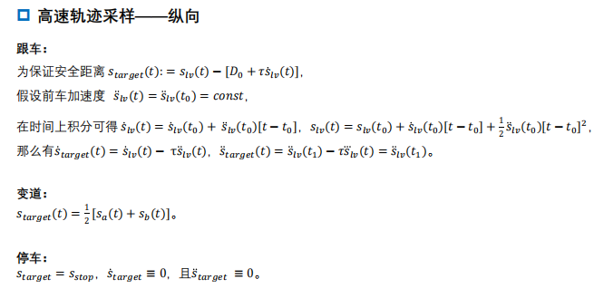

如果前方无车，则可以做速度保持

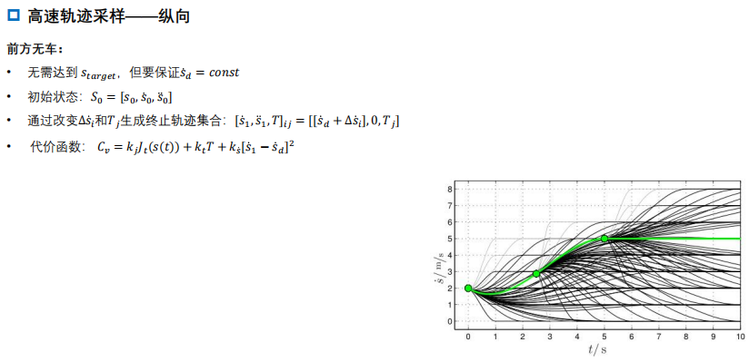

**低速： 低速相较于高速，横向移动和纵向移动就存在可比性，如果继续解耦，会导致违背运动学约束！所以必须考虑两者之间的依赖**

- 低速时，不能直接在 $s-l$ 坐标系下直接采样 $s(t)$ ,$l(t)$，而需要采样 $s(t)$ ,$l(s)$ , 即横向采样的结果依赖于纵向的采样结果，两者结合最后得到 $l(t)$

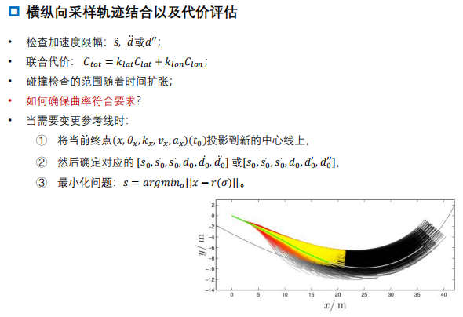

- 低速时可能要额外考虑一个大曲率的问题，因为在 frenet 坐标系采样出的轨迹，在转换到笛卡尔坐标系后，可能会出现很大的曲率，这样就会违反运动学约束

  **所以在每次求解后的检查时，可能需要转化到笛卡尔坐标系后再检查一遍**

### 总结

1. 状态空间中采样得到候选轨迹
   - 初始状态已知，采样轨迹末状态
   - 横纵向分别采用五次多项式进行曲线拟合
   - 遍历横纵向曲线，将横纵向组合成候选轨迹簇
2. 计算代价，选出最优轨迹
   - 纵向 = 目标 + 舒适性 + 碰撞 + 向心加速度
   - 横向 = 横向便宜 + 舒适性
3. 检查约束和碰撞
   - 纵向速度/加速度/加速度率(jerk)是否超出允许范围
   - 曲率是否超出允许范围
   - 横向加速度/加速度率(jerk)是否超出允许范围

## 3. 基于优化的路径规划

**以百度 Apollo EM planner 为例**，可参考本笔记：[EMPlanner](../车辆规划/运动规划/EMPlanner.md)

- 先以车道级别生成一个最可行的轨迹，然后基于安全性和代价函数两方面来选择车道
- **在 $s-l$ 坐标系下解耦成横向和速度规划**
- 在最新的 apollo 中，`EM planner`已经迭代成`Piecewise Jerk Path Optimizer`，其中最大的改变：
  - 横向规划（路径规划）已经不需要先来一次 DP 了，因为上游决策模块会给出 nudge 标签，即已经给出了横向上的决策（即相当于做了 DP 该做的事），所以直接做 QP 就行了

**该方法的缺点：**

- 在需要横纵向联合动作的场景，如窄道会车，如果自车进行路径规划，会发现无解，因为对车的预测轨迹已经和自己的轨迹冲突了。**这时候就需要时空联合规划**