# 时空联合规划

上一章讲解的在 frenet 下采样的方法，已经有一些时空联合的感觉，只不过 planning horizon 比较短，所以更适合高速场景下 reactive 的行为；后面的 apollo 这类路径和速度解耦的方法，在会车这类时间和空间同时考虑的场景，灵活性不够。

可以这么说，之前介绍的方法已经可以覆盖 95% 的驾驶场景了，这一章就是补足剩下的 5% 的场景，属于一些花招，前面的方法是基础。

## 1. 时空联合规划的概念

如何解决窄道会车问题

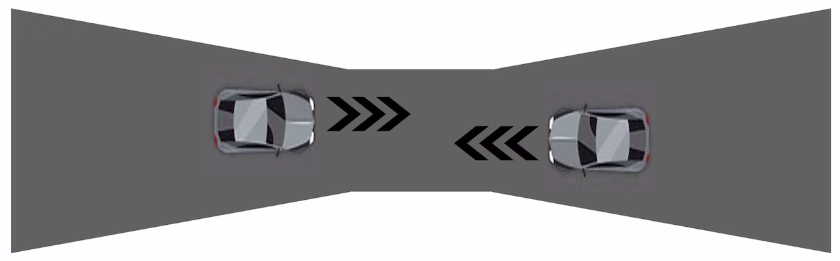

- 如果在这种场景，采取时空解耦的方法，由于路径缺少时间信息，那么规划的路径会直接穿过这条窄道，如果再在上面做速度规划，考虑对向车的预测轨迹后，那么自车会直接刹停

- 如果有了时空联合规划，在预测对向车是想加速抢过去或者停下来让行，就可以联合时间维度

  例如：1. 自车规划出一条让行轨迹，让出了一个时空的空间，等对车通过后，自车再通过；2. 自车规划出一条在时空中加速抢过去的轨迹

时空联合规划的一个问题是求解空间太大了，而之前解耦的方法是节省了算力

空间和时间一般是三维：$xyt$ 或 $slt$​

### 1.1 时空分离算法

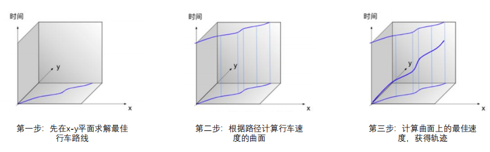

### 1.2 时空联合算法

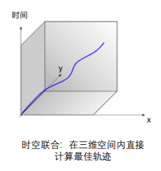

- $xyt$ 或者 $slt$ 空间下，如果直接求解，会面临两个主要问题：
  - 空间 dimension: 非凸 (障碍物越多，越多 local minimum)
  - 交互 interaction

- 如果在时空空间通过搜索或者优化的方法得到一条轨迹，一般还不够。**因为时空空间的生成，是通过障碍物在预测线上投影得到的，而预测线是不准确的**。所以三维空间一般会随时间变化，而本身三维空间的生成就已经非凸了，那他的算力 consumption 就会很大。所以如果再考虑交互，如果直接用一些简单的搜索方法，可能会不可行。

|                        时空分离算法                        |                  时空联合算法                  |
| :--------------------------------------------------------: | :--------------------------------------------: |
| 分两步一次计算两个二维空间的解，每一步损失一个维度的解空间 | 直接在三维空间内计算最优解，求解空间大一个维度 |
|                求解速度相对更快，算力要求低                |     充分考虑动态障碍物信息，路径规划更合理     |
|             复杂动态场景下容易陷入轨迹次优问题             |   符合人类驾驶习惯，适合直接学习人类司机行为   |

> 是不是时空联合没有个 0 和 1 的界限，够不够时空联合，本质上是看这个 planner 时间换空间或空间换时间的能力。

> 不同求解方法其实都在求解问题（在3D空间内，横纵向全打开，找到最优解）的不同近似。但不同方法求这个问题的效率、有效程度不一样。

> 好的方法一般这么几个原则：在每一步求解的时候就打得更开，这样不容易掉入 local minimum. 每一步求解更快。

## 2. 基于搜索的规划方法

在时空空间想找到一个解，**最暴力最直接的方法就是搜索**

在 $xyt$ 空间其实使用比较少，一般在下面几种场景中会采用：

- 路口
- 半结构化环境：停车场、小区...
- 非结构化：乡村道路...

现如今无图规划方法的兴起，因为无图的感知并不可靠，可能环境是结构化的，但给到规划的信息是非结构化的，所以 $xyt$ 的重要程度在提高。不过主流仍然是 $slt$​，大部分场景都能解决

$slt$ 是利用了车辆在大部分正常行驶场景下，横纵向“自然”解耦的特性，不像无人机的横纵向是对等的

**$slt$ 场景建模如下图所示：**

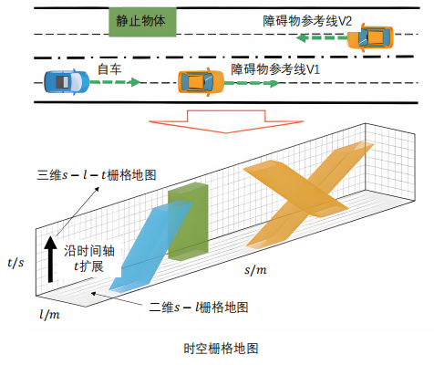

- 障碍物投影到自车的 reference frame 上（以自车的行驶/预测轨迹为参考线），涉及到$cartesian \rightarrow frenet$

- 横向比纵向窄很多，因为一般对自车来说，横向变道空间较小
- 静态障碍物投影后，在时间维度是竖直的，因为其位置不变，而动态障碍物投影后在时间维度是斜的，因为其$s$维度会随着时间变化
- 如果 reference line 是弯的，那三维空间也会随之扭曲。在后面介绍的基于时空走廊的方法中会介绍一下
- 因为目的是想搜索，所以对每个维度都进行栅格化

### 2.1 构建三维时空联合规划地图

**第一步**，首先建立单层的 $x-y$ 栅格地图，如下所示：（可以参考EPSILON下SSC，其中就有把 $xyt$ 向 $slt$ 投影的代码，以及 $slt$​ 栅格地图的建立）

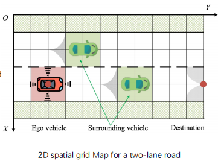

- 建立2D占据栅格地图

- 为了提高搜索效率，消除一部分无用栅格块（不消其实也无所谓）
  - 灰色圆形区域部分：在最大转向角下也会发生碰撞，或不可能达到目的地
  - 半径大小：最小转弯半径
  - 方向：车速方向相切

- 二维 $x-y$​ 栅格地图只具有几何属性，无法直接搜索带有时间属性的可行驶轨迹

**第二步**，建立零时刻的二维栅格地图后，然后**沿时间轴扩展生成三维时空有向无环图：**

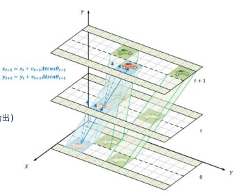

- 多个地图层相互平行
- 相邻图层中的两个状态根据时间步长由有向边相连
- 蓝色有向边连接的点序列：以$\Delta t$为时间步长离散化的时空轨迹（$\Delta t$一般设置为0.2s，1s也行）
- 浅绿色部分：动态障碍物在$\Delta t$为时间步长离散化的位置（由轨迹预测模块给出）

$$
\text{obj} \rightarrow \text{predicted traj} \rightarrow \text{projection along time}
$$

这个投影是分散在 $t$, $t + \Delta t$, $t + 2\Delta t$...下的，从而使整个投影过程显得非常密集

**第三步**，三维时空地图包含的信息：

- 车辆（自车）位置状态信息：搜索起点
- 车辆运动学信息：(Hybrid A*节点扩展需要，但是除了在 $x-y$ 维度的运动学约束，现在每两个维度之间都要考虑约束。也就是在  $xyt$ 或者 $slt$ 空间中不能随意扩展)
  - 蓝色有向线段在 $X-O-T$ 平面的投影斜率为横向速度
  - 蓝色有向线段在 $Y-O-T$ 平面的投影斜率为纵向速度
  - 蓝色有向线段在 $X-O-Y$ 平面的投影倾斜角为偏航角
  - **一般都要做离散化处理，因为连续的话，搜索空间太大了**
- 根据相邻状态可以计算动作空间
- 根据动作空间扩展时空地图（图中由蓝色实线、虚线所示）

### 2.2 基于Hybrid A*的时空节点扩展

在有了三维时空联合地图，以及运动学约束后，就可以开始搜索

根据运动学约束进行扩展：

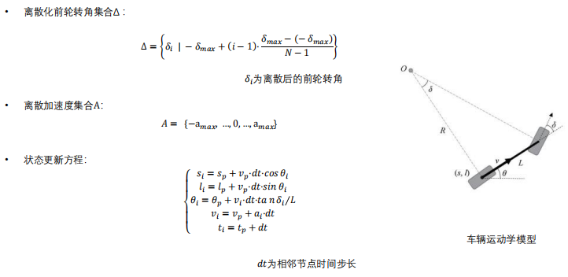

- $f = g + h$

  - g (progress function 比较简单)

    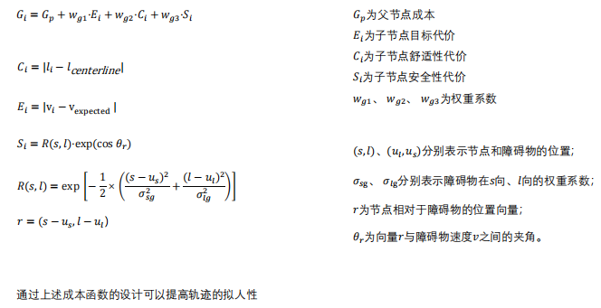

    - $C_i$表示离车道中心线不要太远
    - $E_i$跟上期望速度
    - ...

    真正工程上的 Hybrid A star 可能会有非常多的 cost 设计（5～10），怎么去平衡每一项，是一个很大的挑战

  - h (heuristic function 比较关键)，可以按距离启发，或者按时间启发（这比二维 A star 多了一种）

    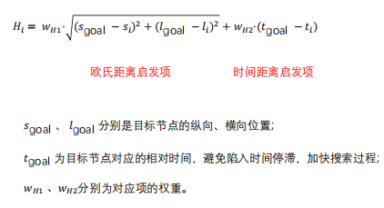

    - **需要注意时间严格不能倒流，即 $t$ 是单调的**。而除了倒车场景，$s$ 一般也是单调的，所以三维联合地图是一个有向无环图 (DAG)

按照正常 A* 流程开始搜索：

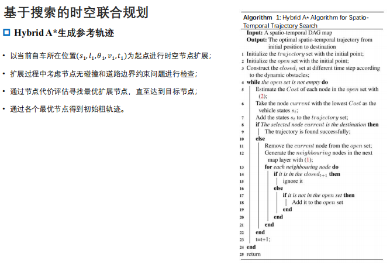

有一个 trick 的点，即**时空代价复用**，即如果下一个时刻的感知变化不大，能否复用已知的代价，这样就能大大减少计算量。有一些方法例如 D*，有相关设计

搜索的方法是最基本的，但也是最暴力最不高效的。像之前介绍的例如变道让行，或加速抢过等轨迹，都在整个解空间中，能不能搜到取决于你的 cost 设计，以及 heuristic function 的设计等等

## 3. 基于迭代计算的规划方法

> 我个人的理解，对于迭代的方法，在时空的感觉上不如搜索方法那么直观，因为搜索的方法相当于完全展开了三个维度。而迭代的方法，通常是$\text{path} \rightarrow \text{speed} \rightarrow \text{path} \rightarrow \text{speed} \rightarrow ...$，这样的迭代，乍一看感觉就是 EM planner 这类普通优化的范式，但我理解是: EM planner 的一条可用路径是迭代一次即可，而时空联合规划对一条可以用的轨迹是在$\Delta t$很小的情况下，迭代了很多次，保持了环境对轨迹的实时影响。

上一章介绍的 EM planner, path-speed decoupling 也可以进一步迭代，这样也能看作是时空联合规划：
以一次 path-speed decoupling 优化后的轨迹作为初值，**将障碍物重新以此投影**，去迭代寻找一条 path, 然后再做速度规划...
即 $\text{path} \rightarrow \text{speed} \rightarrow \text{path} \rightarrow \text{speed} \rightarrow ...$，**这被称为 Alternating Minimization** 

除了上面提到的这种 $E \rightarrow M \rightarrow E \rightarrow M \rightarrow ...$ 的迭代方法，这里介绍一种别的，称为 **`coarse to fine`**

### 3.1 暴力搜索方法潜在问题

- 时空联合搜索的轨迹空间过于庞大
- 减少时间和空间上的搜索复杂度，使规划**聚焦**（意味着可能牺牲了局部最优性）于最优解可能出现的区域

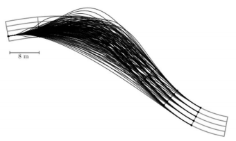

### 3.2 迭代计算方式流程解析

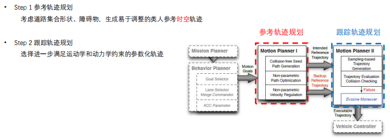

**区别于 EM planner 的迭代流程，这里是：$\text{reference traj} \rightarrow \text{tracking traj}$**

- $\text{tracking traj}$ 的过程中，会考虑到障碍物的影响。释放了$\text{reference traj}$附近一些比较 promising 的区域（轨迹点），通过 tracking 的方式把 planner 当作 tracker, 给予其一定自由度，在 follow reference line schedule 的同时，也能“左右”调整，这样也能具备一定的时空联合能力

#### 3.2.1 reference traj的生成

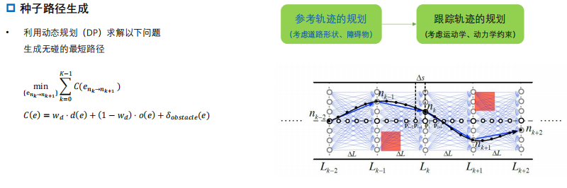

- 一般要做一个 8s 的规划，这一步是时空解耦

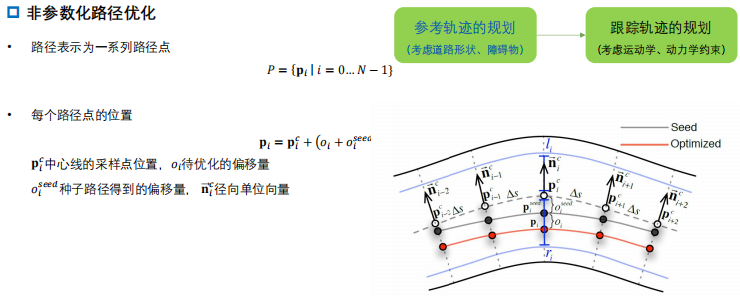

- 其实就是==**散点（x，y）优化**==，这是非常轻量化的方法（这与Bezier和B-spline的控制点优化略有区别）

- 直接对轨迹点的偏移量进行调整优化，只不过这些偏移要参考代价函数

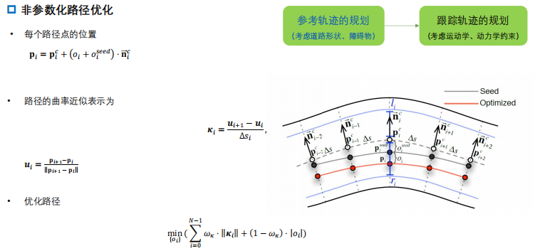

- 散点没有连续的轨迹，所以无法直接通过高阶量来表示曲率，所以这里做近似：**通过前后插值来得到曲率的近似表示（散点优化中，速度、加速度等一般都是通过插值得到的）**

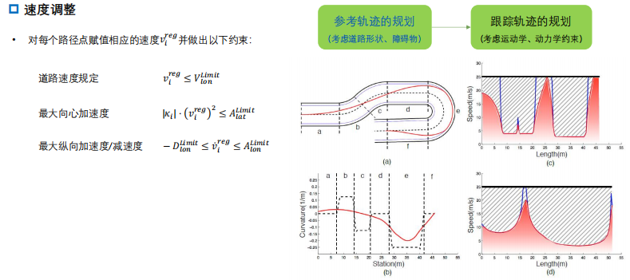

- **速度规划**：对每个路径点赋值相应的速度做一些约束
- 这里只是做了“粗分配”
- 到这里就得到了一条**时空轨迹**：$\text{reference traj}$

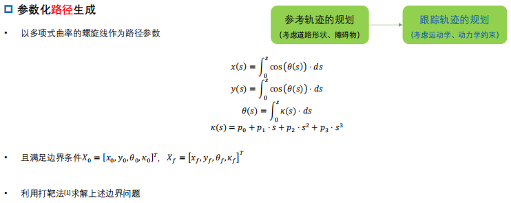

#### 3.2.2 曲线拟合

在tracking之前，还做了一步“曲线拟合”

- 这里用了螺旋线进行拟合

- **不过这一步的存在可能有点多余**。只要前面 $\text{reference traj}$ 的生成中，散点优化足够细，还加上 speed profile, 直接做最后的 tracking 就行了

  好处是：在一些大曲率场景，比如停车场等，就有更加平滑的轨迹

  但是一般的on road场景，一般不需要方向盘这么大的转角，所以不做这步也可以

如果是 EM planner, 做完 $\text{reference traj}$​ 后，就开始做 path 的规划。但这里就开始做跟踪了。

#### 3.2.3 跟踪轨迹的规划

这里给予 polynomial (三次) 进行速度采样：

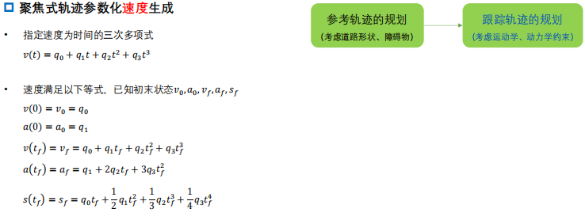

- 对速度进行采样

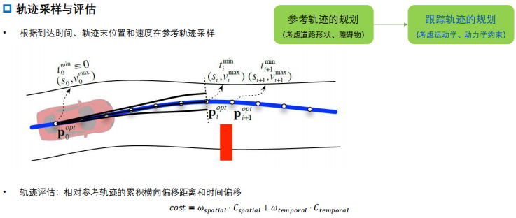

- 蓝色线是 reference traj, 也就是每个时间到什么位置都知道
- 然后基于 reference traj, 在横向、纵向采样一些点，得到一些轨迹簇
- 考虑横向偏移、时间偏移，给予一定自由度，进行评估

> 从可视化的图上看，类似于openPlanner效果

> 从上图的会车角度去看，当对向来车时，自车先沿着reference traj行驶中，对方车辆的预测线到来，此时自车刹车，这时在reference traj的下方会采样生成横向的偏移轨迹，那么这个解会使得对方车辆的progress更高，更加友好；
>
> 同时，在初始解的基础上，这个采样的空间越大，对参考轨迹的依赖也就越弱，复杂度也就越高，接近成为了一个全局采样的问题；采样越少，也就越依赖于初值，那么逃离初值去做出更好的时空联合行为的概率也就越低
>
> 这里的采样，其实就是需要一个balance，因为这个采样场是可以自己根据实际需求去设定和判断的

总结一下，如何加速迭代计算方式规划效率：

- 利用优化粗略生成初始的非参数化轨迹（轻量化的散点优化方法）
- 在参考的轨迹附近聚焦搜索以减少计算：$\text{reference traj} \rightarrow \text{local sampling}$

除了可以做单一的任务规划，也可以考虑 multi-task planning: multi-task 的意思是可以生成多条 reference line:

- lane-keep reference line
- lane-change reference line
- nudge reference line
- ...

每条 reference line 都做 local sampling, 这样就能得到多条轨迹，然后再做评估。这样解空间的维度就非常大，在算力允许的情况下，是比较好的。他一方面无限接近于基于搜索的方法，另一方面 multi-task 生成了很多 promising 的轨迹，在这些基础上再做 local sampling/tracking, 是非常有导向性的

## 4. 基于时空走廊（corridor）的规划方法

无人机常用空间走廊，将走廊和 $slt$​ 结合，就是时空走廊。

### 4.1 语意时空走廊的概念

- 规划面临的问题：自动驾驶的语义要素具有不同形式的数学表征；保证规划轨迹的安全性和可行性。
- **语义时空走廊** (Semantic Spatio-Temporal Corridor)：一系列被语义要素约束的相互连接的无碰撞立方体。

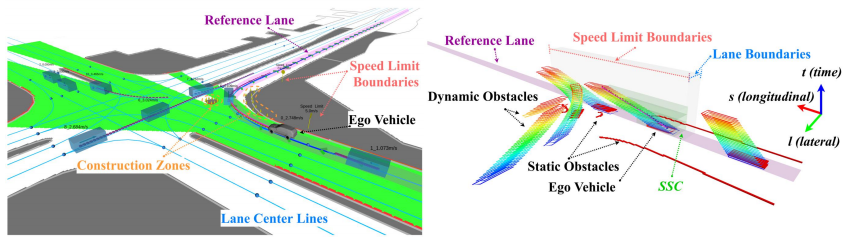

- 左图是 EPSILON 中的场景，以灰色自车的紫色 reference line 为投影基准，得到右图的$slt$空间
- 由于参考轨迹被掰直，所以每个 object 的预测轨迹也是变形的，并且颜色有区分：预测轨迹（立方体）蓝色部分，表示越接近时间维度的0，红色部分表示越接近预测的末尾时间
- 在这些地图元素和预测轨迹的影响下，生成自车的 SSC: Semantic Spatio-Temporal Corridor

### 4.2 轨迹生成框架

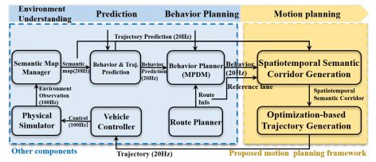

- 环境理解：处理规划所需要的语义要素（占据栅格地图、动态物体、车道线、交通规则）
- 预测：提供移动物体的未来轨迹；
- 行为规划 MPDM[2]: 以前向仿真的方法做决策（根据不同的场景，将自车与其他车都往前推，得到决策）。这类似于前面时空方法的初值生成，会有很多决策结果 (称为 topology), 对每个决策都可以做后续的时空走廊生成...
  - 假设所有车辆直行有限的闭环策略（车道保持，左变道，右变道）
  - 使用简化模型模拟所有车辆的未来状态；
  - 根据代价函数评估未来的局面，选择最优的行为；
- 运动规划：时空语义走廊生成/轨迹优化（**本节重点**）

#### 4.2.1 语义时空走廊的障碍物要素

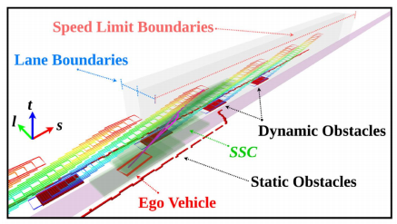

需要建模的元素：

- 坐标系：$s-l-t$ 3D构型空间 (Recall: 用于搜索的$s-l-t$栅格地图)
- 静止障碍物（static obstacles）：横跨整个时间轴的障碍物
- 动态障碍物（dynamic obstacles）：根据预测轨迹（彩色）在时间轴上存在的一系列障碍物
- 红灯：占据特定纵向空间和时间的障碍物（表示某段时间是如论如何都无法向前进的）
- 其他一些语义要素...（都转化成时空下的一些约束，绑定到 $s-l-t$ 的某个或某几个维度）

**这里就是把语义semantic转变成为 $s-l-t$ 中的各种约束，也就是一个abstraction，例如：红灯就是在某个时间不超过某个s；静止障碍物就是在所有时间都不能碰到这个东西；动态障碍物就是在某个t区间内不能碰到这个 $s-l$ 区域；限速就是在某个s区间内速度不超过某个值，变道就是经过这段 $s-l$的时间不能超过某个值**

**把这些环境语义都抽象出来，绑定到 corridor 的 convex space 上，这样其实就建模出了带约束的优化问题 QP**. 这就是这个方法的 baseline

**语义时空走廊的约束要素**：

- 速度约束：道路限速，停止标志
- 时间约束：变道时长
- 软约束与硬约束
- 语义边界的概念：特定语义约束开始和停止生效的位置，例如速度约束的纵向范围$[s_{begin},s_{end}]$, 变道时长约束的横向范围$[l_{begin},l_{end}]$等

##### 生成 convex space/语义时空走廊构建

在生成 convex space 的时候，就尽量贴合语义约束的形状

- **第一步：输入数据**

  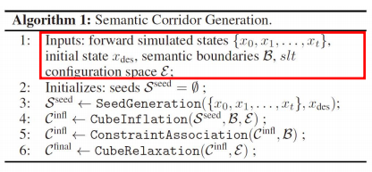

  从初始解开始：

  - 其他车辆的未来状态 (MPDM 前向模拟)
  - 自车出初始状态
  - 语义边界（限速、变道等。不包括障碍物类的，因为障碍物类的在后续 corridor 生成的过程中会自然得到）
  - $s-l-t$构型空间，有了边界和初始解后，就开始撒种子

- **第二步：生成种子**

  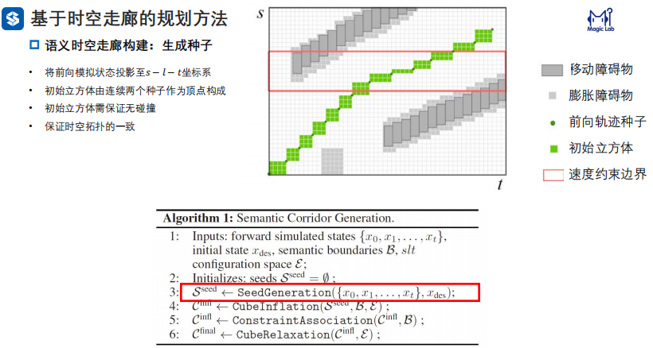

  - 将前向模拟状态投影至$s-l-t$坐标系

  - 初始立方体由连续两个种子作为顶点构成

  - 初始立方体需保证无碰撞

  - 保证时空拓扑的一致

  上图以$s-t$平面为例，演示了种子的生成过程：立方体的走向来自于之前的“预测轨迹”，即前向模拟状态。种子就是指这些粗轨迹点

- **第三步：膨胀立方体**

  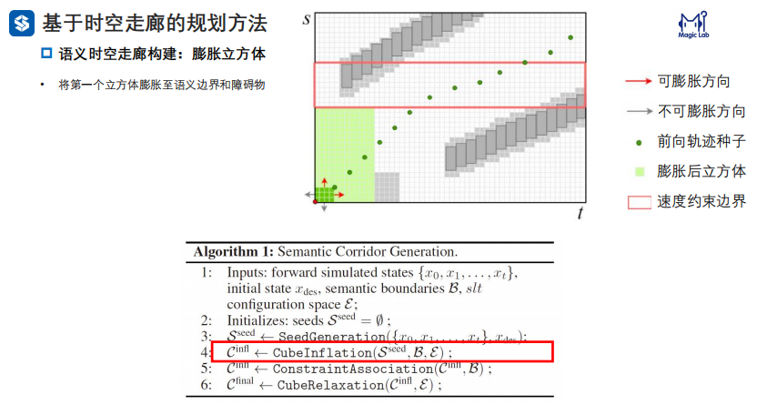

  - 这里是一个矩形膨胀（现在也有些改进，变成了梯形等形状）

  - 将第一个立方体膨胀至语义边界和障碍物，这个膨胀并没有进去红色区域，是因为想要更好地贴合语义约束

- **第四步：关联约束**

  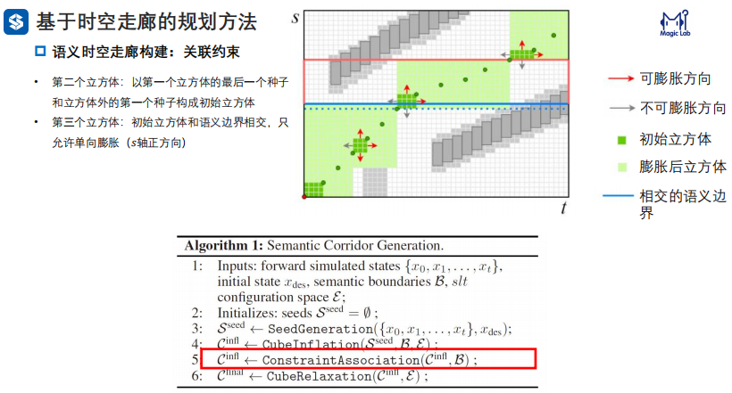

  - 重复刚刚的膨胀过程，每个膨胀的立方体都吃掉了很多种子
  - 缺点：**在立方体的衔接处很窄小，点连接会限制轨迹优化的解空间**，所以这里要做一些 relaxation，也就是尽可能在点连接处增大它地overlane

- **第五步：放宽边界**

  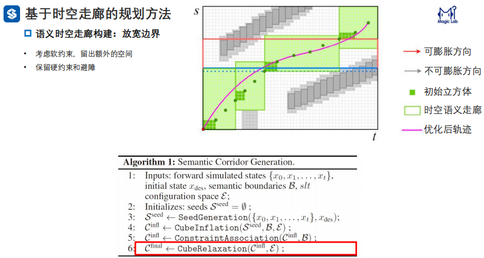

  - 在立方体过渡的地方，给出一些缓冲区(buffer)
  - **时空约束最终转化到一个个立方体，然后在每个立方体中做轨迹优化，然后在连接处以一些放宽的处理衔接起来**

- **==值得讨论的地方==**
  1. 这里的cube立方体能不能变成别的表达形式
  2. 这里的曲线确实比价顺滑，但是对于语义信息的遵守程度有多少？也就是semantic（对语义的遵守程度） $\leftrightarrow$ freedom（空间的自由度） 之间的平衡

上面五步就构建了语义时空走廊，相当于搭建好了优化问题的约束，后续就是优化

### 4.3 保证安全性和可行性的轨迹生成

#### 4.3.1 使用[贝塞尔曲线](../车辆规划/路径规划/Bezier曲线法.md)的参数化优化方法

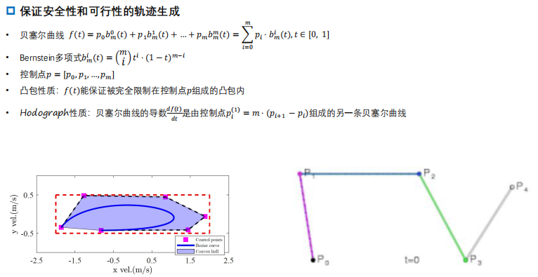

- 通过确定控制点控制曲线的形状
- 凸包性质：轨迹能保证完全限制在控制点组成的凸包内。**如此，由于之前的约束已经转化为 convex space (linear constraints), 只要把控制点放在 convex space 内，就能保证轨迹一定在 convex space 内，也就是保证了绝对安全**
- 贝塞尔曲线求导是另一条贝塞尔曲线，这样**就可以用速度凸包来约束速度曲线，加速度凸包来约束加速度曲线**，并且将控制点约束在速度凸包、加速度凸包中，这样就能保证了速度和加速度的安全性

#### 4.3.2 轨迹表示

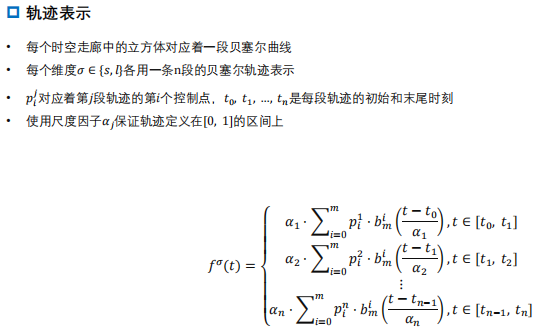

- **每个时空走廊中的立方体对应着一段贝塞尔曲线**。每条轨迹需要给定控制点以及时间，时间在建立时空走廊时就已经确定了，每个立方体的持续时间都是确定的。

- 控制点是优化变量，目的是使的曲线满足一些性质：
  - 安全性：约束每段的控制点在每个的凸包内，每段的速度曲线在速度凸包内，每段的加速度曲线在加速度凸包内
  - 每段曲线间要连续
  - ... 因此可以构建如下优化问题：

#### 4.3.3 优化问题

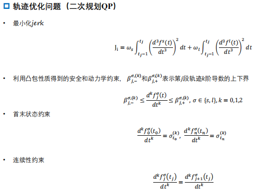

- 最小化 jerk 来作为代价函数，这个代价函数非常简单，是 quadratic，相比之前搜索的方法。因为这里把复杂度转移到了之前时空走廊生成中
- 利用凸包性质得到安全和动力学约束：0阶、1阶、2阶都要在凸包内，这是因为贝塞尔曲线的导数也是贝塞尔曲线，这个约束是 linear 的
- 首末状态约束，也是 linear 的
- 连续性约束，前后两端轨迹在衔接处的导数一致。也是 linear 的

**所以，整个优化问题是一个凸优化问题 (QP)**，可以用现成的 QP solver 求解

#### 4.3.4 运行示例

- 时空走廊变道

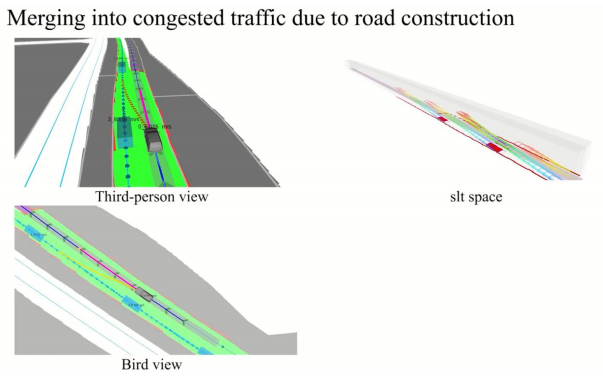

- 时空走廊超车

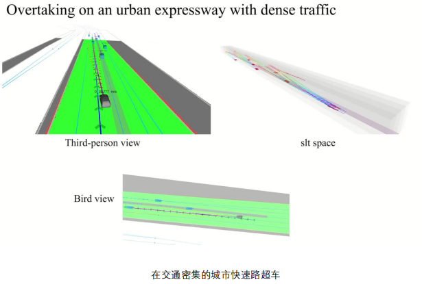

- 时空走廊左转

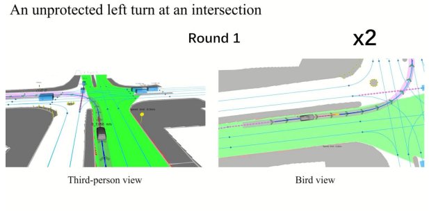

**在 EPSILON 的开源代码中，有 SSC 的轮子 (ssc_planner)，可以直接拿来用，或借鉴开发**:
[https://github.com/HKUST-Aerial-Robotics/EPSILON/tree/master/util/ssc_planner/src/ssc_planner](https://github.com/HKUST-Aerial-Robotics/EPSILON/tree/master/util/ssc_planner/src/ssc_planner)

