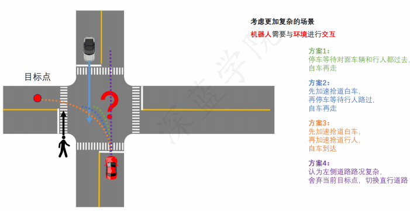
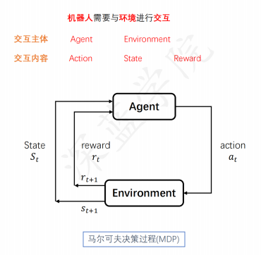
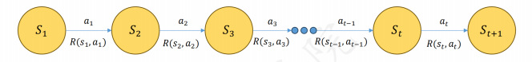
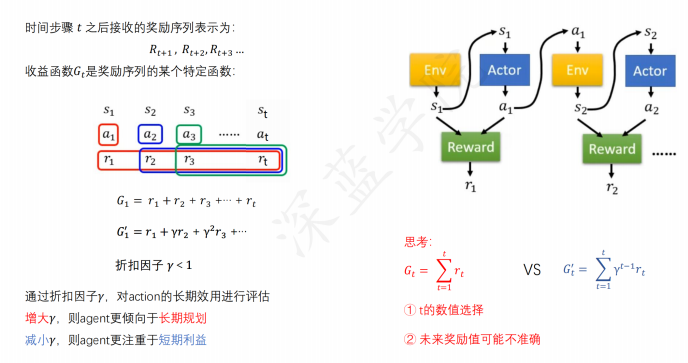
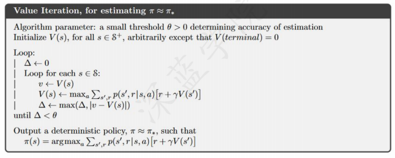

# 决策过程

## 1. 决策过程的概念

已经有了 `planning` 后，为什么还需要 `decision-making`?

- `planning` / `motion planning` 是基于几何关系，是确定性的动作规划。**当你需要完成交互，去进行一些主动性的选择时，就会出现 `probabilistic` 的情况，这时 `deterministic` 的规划就不够了**。例如：在交叉路口，你需要判断是停下来还是加速通过，这就是 `decision-making` 的问题。

- 如果只做基于几何的 `planning`, 那么其实是非常鲁莽的。对于无人车，存在非常多的不确定性，例如交互车辆的预测即使能给出，但也无法是确定性的。

`decision-making` 和 `reinforcement learning`:

- `reinforcement learning` 是 `decision-making` 的一种方法，是一种 `probabilistic` 的方法。虽然好用，但用好也不简单，关于状态`s`, 动作`a`, 奖励`r`的设计，以及如何设计 `policy` 都是非常有讲究的。本节主要介绍 `reinforcement learning` 的在 `decision-making` 中的一些概念。
- 其余的 `decision-making` 方法还有很多，例如 `imitation learning`, `rule-based` 等等。

- 不能简单的执行 `deterministic` 的 `planning` (例如三板斧：采样、搜索、优化)，最直观的原因就是无法确定 $s \rightarrow s'$, 即状态转移是不确定的。
- **每种方案实际上对应一种决策**
- **每种决策实际上对应一簇规划**
- 考虑更复杂的场景, `ego car` 还需要和环境进行交互，可能自己的动作会影响到环境的状态，这就是 `probabilistic` 的决策问题。
- 不再是简单的几何场景，而是**随机过程**。

## 2. 马尔可夫决策过程

**随机过程**：
一个或多个事件、随机系统或者随机现象随时间演变的过程
$$
P(S_{t+1} | S_1, S_2, ..., S_t)
$$

- 概率论研究**静态**随机现象的统计规律
- 随机过程研究**动态**随机现象的统计规律

**马尔可夫链/过程(Markov Chain/Process)**： 具有马尔科夫性质的特殊的随机过程

**马尔可夫性**：
当前时刻的状态，仅与上个时刻的状态有关
$$
P(S_{t+1} | S_1, S_2, ..., S_t) = P(S_{t+1} | S_t)
$$

- 当前状态从历史中捕获了所有相关信息
- 当状态已知的时候，可以抛开历史不管
- **当前状态是未来的充分统计量**，即当前时刻信息已经是所有历史信息的完备表达
- **时间遗忘性**

但真实世界中真正满足马尔可夫性的情况是非常少的，涉及到多维度的状态，多个 agent 之间的交互，这些都是非马尔可夫的。但是马尔可夫性是一个很好的近似，可以用来简化问题。

- 自动驾驶中，可以做简化：例如预测过程中，假设当前时刻状态用前一秒内的状态来预测，如果以车辆位置为状态，那这不会是马尔可夫的，但**将这一秒内所有轨迹的$(x,y)$作为状态，就可以近似为马尔可夫**
- 因此，只要扩大状态空间，包含你所需要的所有历史信息，就可以近似为马尔可夫性。不过，这样会导致状态空间爆炸，所以需要合理

**马尔可夫决策过程(Markov Decision Process, MDP)**： 提供了一套在结果部分受**随机性影响**、另一部分受**决策者控制**下的数学建模框架： 
$$
P(S_{t+1} | S_1, S_2, ..., S_t) = P(S_{t+1} | S_t)\\ P(S_{t+1} | S_t, A_t)
$$

- “轻装上阵”，丢掉历史信息，只保留当前状态

**MDP 形式化地描述了一种强化学习的环境**：

- 环境完全可测，即当前状态可以完全表征过程（马尔可夫性质）

- 对于自动驾驶，可以把$(ego, agents)$​​都建模成 Agent；也可以只把 ego car 建模成 Agent, 而将其他 agents 都放到 Environment 中。

**MDP 五元组**： 马尔可夫决策过程可以由一个五元组$(S, A, R, P_{sa}, \gamma)$来描述：

- $S$：环境状态 (state) 的集合。比如，位置、路况信息
- $A$：智能体动作 (action) 的集合。比如，方向盘转向、加速、刹车
- $R$: 环境对于$(s,a)$作出的反馈的集合，有时奖励只和状态相关
- $P_{sa}$: 环境对于$(s,a)$转移到$s'$的概率。对每个状态$s \in S$和动作$a \in A$，$P_{sa}$是下一个状态在$S$中的概率分布
- $\gamma$: 折扣因子，计算累计反馈时，对于$R$的折扣系数，用于平衡当前奖励和未来奖励的重要

**MDP的动态：**

- 从状态$s_1$开始
- 智能体选择某个动作$a_1 \in A$
- 智能体得到奖励 $R(s_1, a_1)$
- MDP 随机转移到下一个状态$s_2 ～ P_{s_1a_1}$
- 这个过程不断进行
  ...
- 直到终止状态$s_T$出现，或者无止尽地进行下去

**策略定义**： Agent 的策略 (policy) 通常用$\pi$表示

- $\pi$是一个函数，用来表示在状态$S = s$情况下，输出的$a$ (确定型策略) 或$a$的概率分布（随机型策略）
  - 确定型策略：$\pi(s) = a$. 例如使用采样/搜索/优化的方法
  - 随机型策略：$\pi(a|s) = P(A_t = a | S_t = s)$. 例如 MDP/POMDP

**奖励函数**： 预期奖励是以**状态-动作**为双参数的函数，即$r: S \times A \rightarrow R$ 
$$
r(s, a) = E[R_t | S_{t-1} = s, A_{t-1} = a] = \sum_{r \in R} r \sum_{s' \in S} P(s', r | s, a)
$$
**收益函数$G_t$**： 时间步骤$t$​之后接收的奖励序列表示为： 
$$
 R_{t+1}, R_{t+2}, R_{t+3}, ... 
$$
收益函数$G_t$​是奖励序列的某个特定函数：
$$
G_t = R_{t+1} + \gamma R_{t+2} + \gamma^2 R_{t+3} + ... 
$$

- $\gamma$​是折扣因子，用于平衡当前奖励和未来奖励的重要性。因为未来的奖励可能不准确

**MDP 目标和策略**
选择能够最大化累计奖励期望的动作
$$
\begin{aligned}
G_t &= R_{t+1} + \gamma R_{t+2} + \gamma^2 R_{t+3} + ...\\
&= R_{t+1} + \gamma (R_{t+2} + \gamma R_{t+3} + ...)\\
&= R_{t+1} + \gamma G_{t+1}
\end{aligned}
$$
$\gamma \in [0, 1]$是未来奖励的折扣因子，使得和未来奖励相比起来智能体更重视即时奖励

给定一个特定的策略$\pi(s): S \rightarrow A$，即在状态$s$下采取动作$a=\pi(s)$，给定策略$\pi$下的状态$s$的价值函数$V^{\pi}(s)$：
$$
V^{\pi}(s) = E_{\pi}[R{t+1} + \gamma R_{t+2} + \gamma^2 R_{t+3} + ... | S_t = s], s \in S
$$
即**给定起始状态和根据策略$\pi$采取的动作时的累积奖励期望**

在策略$\pi$下，状态$s$下采取动作$a$的价值，表示为$q_{\pi}(s, a)$，作为从状态$s$开始，采取动作$a$ (这里的$a$不一定是$\pi(s)$)后，遵循策略$\pi$的预期回报：
$$
q_{\pi}(s, a) = E_{\pi}[G_t | S_t = s, A_t = a] = E_{\pi}[\sum_{k=0}^{\infty} \gamma^k R_{t+k+1} | S_t = s, A_t = a]
$$
称$q_{\pi}$为策略函数$\pi$的**动作价值函数**

动作价值函数$q_{\pi}(s, a)$和状态价值函数$V^{\pi}(s)$是对偶的，求出其中一个，另一个也就求出了。

## 3. 价值迭代和策略迭代

**价值迭代**： 策略迭代需要每一次迭代过程都包涵策略评估，策略评估需要多次对整个状态集迭代计算，价值迭代可已将贝尔曼最优方程转变为新规则：
$$
V_{k+1}(s) = \max_{a}E_{\pi}[R_{t+1} + \gamma V_k(S_{t+1}) | S_t = s, A_t = a]\\ = \max_{a} \sum_{s',r} p(s',r | s, a) [r + \gamma V_k(s')], s \in S
$$
**对于任意的$V_0$，在保证$V^{*}$存在的情况下，通过迭代计算，${V_k}$最终会收敛到$V^{*}$**

- 迭代停止条件依旧是$V_{k+1}(s)=V_k(s)$

---

**Proof of convergence —— Value iteration converges:**
首先列出已知条件：
$$
\begin{aligned}
&\text{Init}: V^*_0(s) = 0\\
&\text{For} \quad i = 0, 1, 2, ... , H:\\
&\forall s \in S:\\
&V^*_{i+1}(s)=\max_{a}\sum_{s;}T(s,a,s')[R(s,a,s')+\gamma V^*_i(s')]\\
&\pi^*_{i+1}=argmax_{a}\sum_{s'}T(s,a,s')[R(s,a,s')+\gamma V^*_i(s')]
\end{aligned}
$$

- 上面的迭代称为 Bellman Value Iteration, 又称 Value update 或 Bellman update/backup
- 如果值函数收敛，就可以的到 Bellman Optimality Equation：$V^*(s)=\max_{A}\sum_{s'}T(s,a,s')[R(s,a,s')+\gamma V^*(s')]$

假设$V^*_H(s) \rightarrow V^*(s)$, 那么它们两者的差值应该被限制在一个很小的范围内：
$$
\begin{aligned}
&\gamma^{H+1}R(S_{H+1}) + \gamma^{H+2}V^*(S_{H+2}) + ... \leq\\ &\gamma^{H+1}R_{max} + \gamma^{H+2}V_{max} + ... \leq\\ 
&\frac{\gamma^{H+1}R_{max}}{1-\gamma}
\end{aligned}
$$
$r \in (0, 1)$, 当$H \rightarrow \infty$时，$\gamma^{H+1} \rightarrow 0$, 所以$\frac{\gamma^{H+1}R_{max}}{1-\gamma} \rightarrow 0$
因此，$V^*_H(s) \rightarrow V^*(s)$

---

贝尔曼最优方程：
$$
\forall s \in S, V^*(s) = \max_{a} \sum_{s'} T(s,a,s')[R(s,a,s') + \gamma V^*(s')]
$$

- $T(s,a,s')$(状态转移策略)可以被建模成：1.model-based, 2. Neural Network (distribution)
- 一旦决策过程定义好了，就可以通过价值函数知道每个 state 的价值到底多少。就可以将上面公式中的$\max$换成$argmax$，就可以知道当前状态到底应该采取什么 action (加速、减速、超车...)

- 实际中，不会真的等到收敛，而是设定一个阈值，当两次迭代的差值小于阈值时，就停止迭代
- 这个方法的确直观地找到了最优策略，但是计算量很大，因为每次迭代都要遍历所有状态和动作。并且不确定度很大，因为$T(s,a,s')$是如何建模的，建模的怎么样，不确定度就来自于这里。