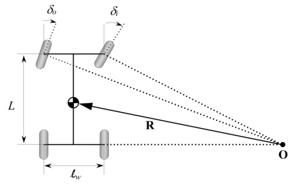
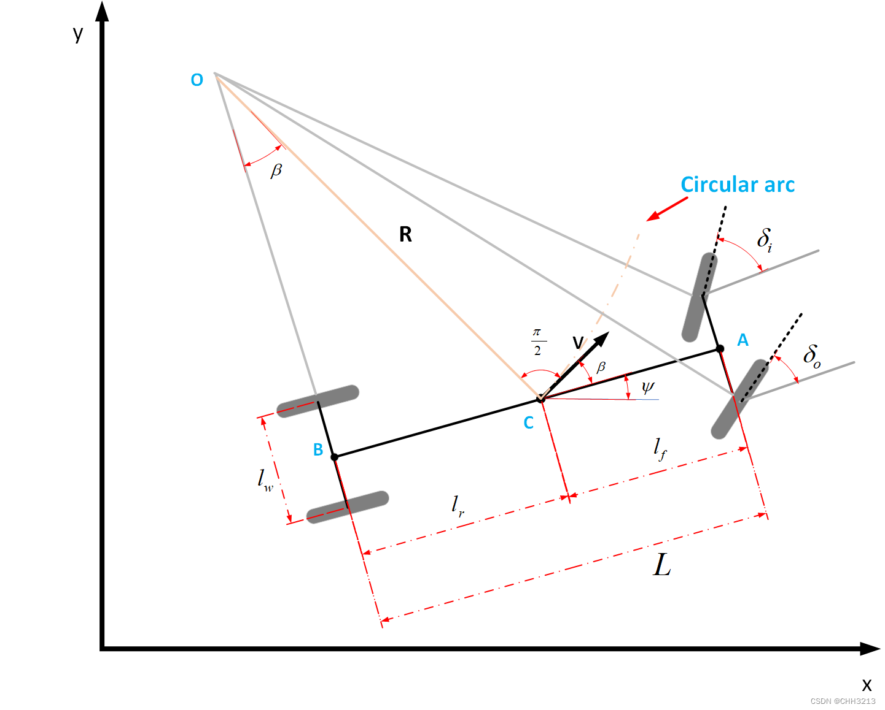
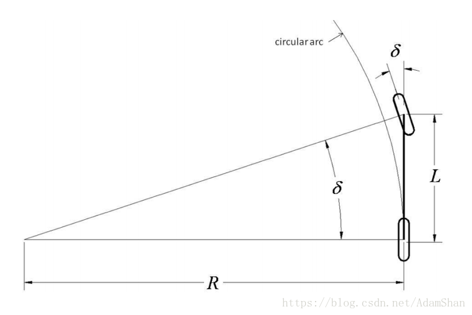
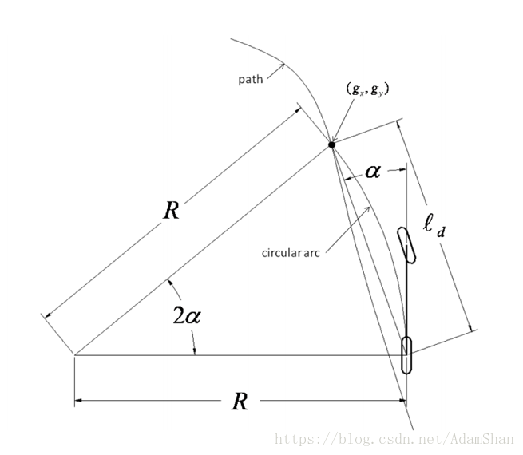
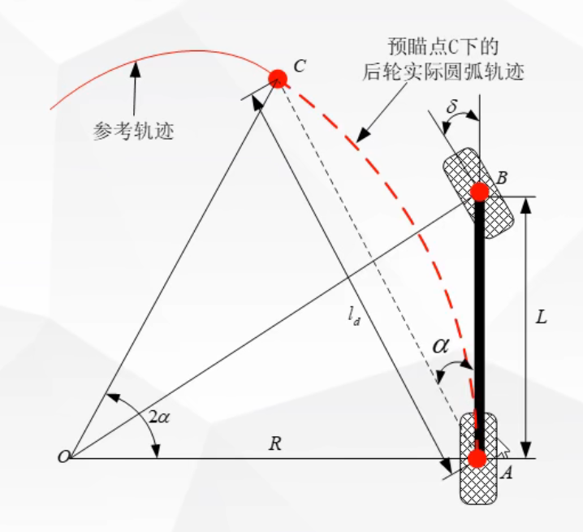
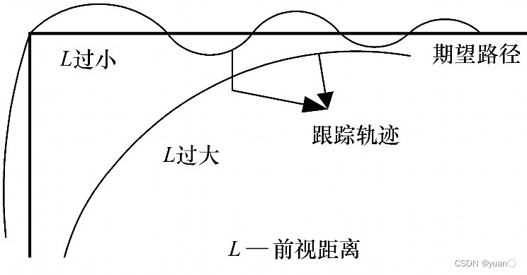
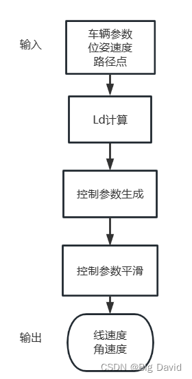

# 纯跟踪算法(Pure Pursuit)

==适用模型==："单车"模型（阿克曼转向），对于差速小车并不适用！

==适用场景==：低速场景（速度过高易产生转弯内切以及超调）

## 阿克曼转向几何模型

一种为了解决交通工具转弯时，内外转向轮路径指向的圆心不同的几何学。

实际上，前轮的左右转向角度并非完全相等，通常情况下，**内侧轮胎转角更大**。如下图所示，$\delta_o$和$\delta_i$分别为外侧前轮和内侧前轮偏角，当车辆右转时，右侧轮胎为内侧轮胎，其转角$\delta_i$较左前轮胎转角$\delta_o$更大。

$l_w$为轮距，$L$为轴距，后轮两个轮胎转角始终为0$\degree$。

当滑移角$\beta$很小时，有公式表述为：$\frac{\dot{\psi}}{v} \approx \frac{1}{R}=\frac{\delta}{L} $ 或者$\delta=\frac{L}{R}$

由于内外侧轮胎的转向半径不同，因此有：$\delta_o=\frac{L}{R+\frac{l_w}{2}}$；$\delta_i=\frac{L}{R-\frac{l_w}{2}}$

**前轮平均转角**为：$\delta=\frac{\delta_o+\delta_i}{2}\cong \frac{L}{R}$（$l_w$远小于$R$）

**内外转角之差**为：$\Delta{\delta}=\delta_i-\delta_o=\frac{L}{R^2}l_w=\delta^2 \frac{l_w}{L}$，因此前两个前轮的转向角的差异$\Delta{\delta}$与平均转向角的平方$\delta^2$成正比，所以当前轮转向角较大时，内外轮的转向角误差也越大。

下图是另一种转向方向的图像化表述

## “单车”模型

精准描述“单车”模型中几何关系的核心公式为：$\delta=\arctan \left(\frac{L}{R}\right)$

其中$\delta$是前轮转角；$L$是轴距；$R$为在给定的转向角下，无人车形成的轨迹圆半径（后轮在圆弧上）

## 算法推导

原理：单车模型通过调整前轮，以合适的前轮转向$\delta$运动，并恰好使车辆后轴中心经过当前规划目标路点的圆弧行驶。该算法会根据车辆当前位置在路径上移动预瞄点，直到路径的终点，可以想象成车辆不断追逐它前面的一个点。

**注意：**此处的$\alpha$并不是$\delta$，而是为预瞄点与车后轴的连线和车辆偏航角（以后轮朝向为基准）的差值

从这张图上更好判断：[路径规划与轨迹跟踪系列算法学习_第10讲_纯跟踪法_哔哩哔哩_bilibili](https://www.bilibili.com/video/BV1Ly4y177dF/?spm_id_from=333.337.search-card.all.click&vd_source=3da170c3416f78cfe40e1a7ba3a4f5f9)

该算法的思想：基于当前车辆**后轮中心**位置，在参考路径上向$l_d$ (自定义)的距离匹配一一个预瞄点，假设车辆后轮中心点可以按照一定的转弯半径$R$行驶抵达该预瞄点，然后**根据预瞄距离$l_d$，转弯半径$R$，车辆坐标系下预瞄点的朝向角$2\alpha$之间的几何关系来确定前轮转角**

-  **关键公式结论**
  - $\Large R=\frac{l_d}{2\sin\alpha}$
  - $\Large \tan\delta=\frac{L}{R}$
  - $\Large  \delta(t)=\arctan \left(\frac{2L\sin(\alpha(t))}{l_d} \right)$
  - 定义横向误差e：车辆当前姿态和预瞄点在横向上的误差 $\Large e_y=l_d\cdot \sin\alpha \approx \frac{l_{d}^2}{2L}\delta(t)$
  - 曲率：$\Large K=\frac{1}{R}=\frac{2e_y}{l_{d}^2}$ 

可知，纯跟踪本质上是一个**P控制器**，跟踪效果由$\large l_d$决定，通常定义$\large l_d$为关于速度的一次多项式：$\Large l_d=k_vv+l_{d0}$，其中$\large k_v$为前视距离系数，$\large v$为当前车速，$\large l_{d0}$为预设预瞄距离的下限值。  

预瞄距离类似驾驶员开车时的视觉跟踪点。直道行驶，驾驶员会选择相对快的速度，视觉跟踪点一般也比较远；弯道行驶时，驾驶员会选择相对慢的速度，视觉跟踪点习惯选择近的位置作为跟踪参考点。

**前视距离是整个Pure Pursuit控制器的重要参数。往前看的距离是车辆从当前位置应沿着路径观察的距离，以此来计算转角控制命令。**

一般来说，预瞄距离越长，控制效果越平滑；预瞄距离越短，控制效果会越精准（同时也会带来一定的震荡） 

#### 

## 计算流程

## 代码

- 输入：车辆当前位置、纵向速度、当前预瞄点
- 输出：车辆前轮转角$\delta_f$

- 模型：以**后轮中心为车辆中心**的“单车“运动学模型，具体公式可参考[【自动驾驶】车辆运动学模型-CSDN博客](https://blog.csdn.net/weixin_42301220/article/details/124747072?spm=1001.2014.3001.5501)

==完整代码见".\代码\pure_pursuit_demo.py"==

结果：