# A*算法

## 与Dijkstra算法对比

- 相同：同为广度优先搜索算法

- 不同：A*是启发式算法，它的算法速度更快，结果更优


## 广度优先搜索(Breadth First)

以广度做为优先级进行搜索：**从起点开始，首先遍历起点周围邻近的点，然后再遍历已经遍历过的点邻近的点，逐步的向外扩散，直到找到终点**

这种算法就像洪水一样向外扩张，算法的过程如下图所示：

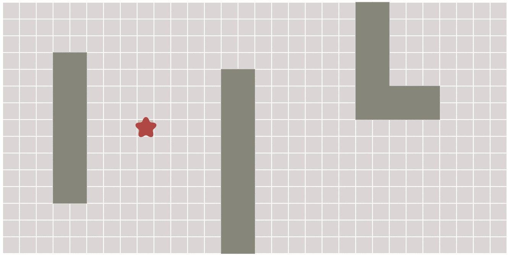

在上面这幅动态图中，算法遍历了图中所有的点，这通常没有必要。对于有明确终点的问题来说，一旦到达终点便可以提前终止算法，下面这幅图对比了这种情况：

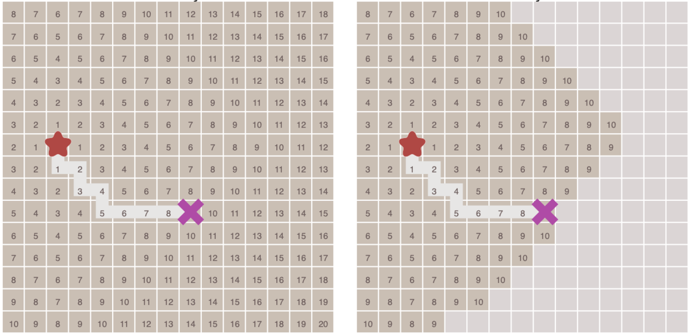


## 最佳优先搜索(Best First)

在一些情况下，如果我们可以预先计算出每个节点到终点的距离，则我们可以利用这个信息更快的到达终点

与Dijkstra算法类似，我们也使用一个优先队列，但此时**以每个节点到达终点的距离作为优先级，每次始终选取到终点移动代价最小（离终点最近）的节点作为下一个遍历的节点**

这样做可以大大加快路径的搜索速度，如下图所示：

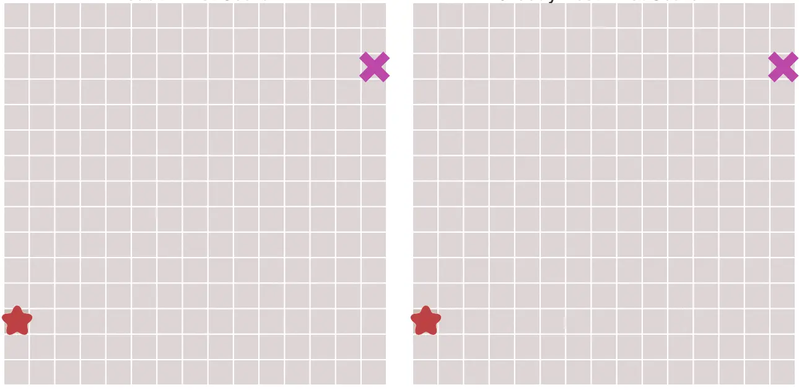

**注意：如果起点和终点之间存在障碍物，则最佳优先算法找到的很可能不是最短路径**


## 算法概述

A*算法综合了上面这些特点于一身，通过下面这个**代价函数**来计算每个节点的优先级：
$$
f(n)=g(n)+h(n)
$$
其中，

- f(n)是节点n的综合优先级，当我们选择下一个要遍历的节点时，我们总会选取综合优先级最高（值最小）的节点
- g(n)是节点n距离起点的代价，即为成本函数
- h(n)是节点n距离终点的预计代价，也被称为**启发函数**

A*算法在运算过程中，每次从优先队列中选取f(n)值最小（优先级最高）的节点作为下一个待遍历的节点

另外，**A*算法使用两个集合来表示待遍历的节点和已经遍历过的节点，这通常称之为`open_set`和`close_set`**，其完整算法描述如下：

```
* 初始化open_set和close_set；
* 将起点加入open_set中，并设置优先级为0（优先级最高）；
* 如果open_set不为空，则从open_set中选取优先级最高的节点n：
    * 如果节点n为终点，则：
        * 从终点开始逐步追踪parent节点，一直达到起点；
        * 返回找到的结果路径，算法结束；
    * 如果节点n不是终点，则：
        * 将节点n从open_set中删除，并加入close_set中；
        * 遍历节点n所有的邻近节点：
            * 如果邻近节点m在close_set中，则：
                * 跳过，选取下一个邻近节点
            * 如果邻近节点m也不在open_set中，则：
                * 设置节点m的parent为节点n
                * 计算节点m的优先级
                * 将节点m加入open_set中
```


## 启发函数h(n)

#### h(n)讨论

1. **当h(n)=0时，自动退化为Dijkstra算法**，所以他俩的区别就在于该启发函数
2. **如果h(n)始终小于节点n到终点的代价，则A*算法保证一定能够找到最短路径**。但是当h(n)的值越小，算法将遍历越多的节点，也就导致算法越慢
3. **如果h(n)完全等于节点n到终点的代价，则A*算法将找到最佳路径，并且速度很快**。可惜的是，并非所有场景下都能做到这一点。因为在没有达到终点之前，我们很难确切算出距离终点还有多远
4. **如果h(n)的值比节点n到终点的代价要大，则A*算法不能保证找到最短路径**，不过此时算法会很快
5. **如果h(n)相较于g(n)大很多，则此时只有h(n)产生效果，这也就变成了最佳优先搜索**，因为此时g(n)不起效果了

总结：由上面这些信息我们可以知道，通过调节启发函数我们可以控制算法的速度和精确度。因为在一些情况，我们可能未必需要最短路径，而是希望能够尽快找到一个路径即可，这也是A*算法比较灵活的地方


#### h(n)设计形式

对于网格形式的图，有以下设计形式

1. 如果图形中只允许朝上下左右四个方向移动，则可以使用**曼哈顿距离**

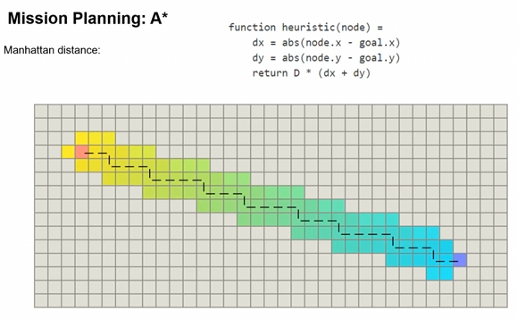

其中，D为两个相邻节点的移动代价，通常为固定常数。


2. 如果图形中允许朝八个方向移动，则可以使用**对角距离**

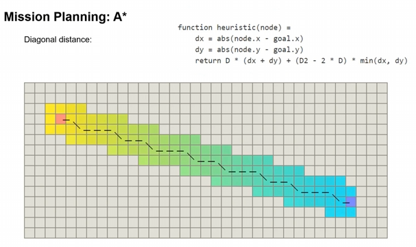

其中，D2为两个相邻节点斜向移动的移动代价。如果所有节点都是正方形，则D2=$\sqrt2$ D。


3. 如果图形中允许朝任何方向移动，则可以使用**欧几里得距离**

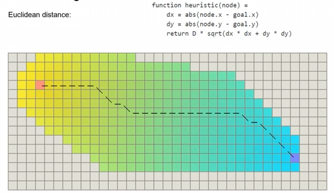

在A*算法中使用该种形式会有些麻烦，因为此时成本函数g(n)和启发函数h(n)可能会不太匹配。虽然相比前两种形式，该形式的路径距离更短，但运算时间更长。


## 算法示例

A* 搜索问题有些时候需要抽象建模，**将具体的路线图，计算成无向图，计算出每个节点之间的权重以及其启发函数值**，这样才能应用 A* 算法搜索

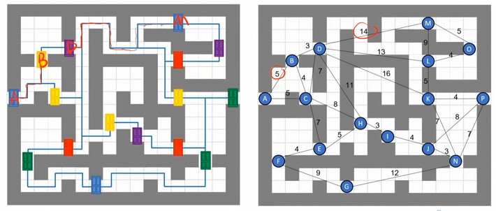

对于节点之间的权重，我们令其等于节点之间的行进步数

对于启发函数，我们使用曼哈顿距离举例


此时，我们希望找寻**从A点到P点的最短路径**，我们可使用如下表示记录结果


### 第一轮

从A点开始，计算与相邻节点B、C的距离作为g(n)，并更新父节点

**将节点A放入Close set中，后续不再考虑**

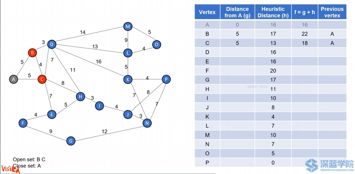


### 第二轮

比较此时B、C两节点的f(n)值，发现C点更小，故选择C节点为下一个节点

从C点开始，计算与相邻节点B、D、E、H的距离作为g(n)，并更新父节点（A点已经访问过，故不再进行计算）

**再将节点C放入Close set中，后续不再考虑**

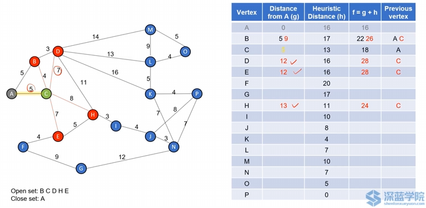

**注意：此时A->C->B的f值大于A->B，故f值与父节点均不进行更新**

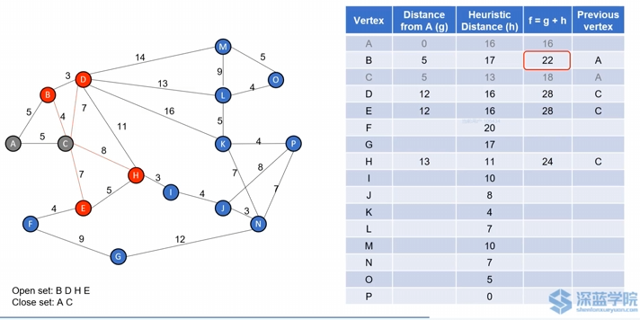


### 第三轮

比较此时B、D、E、H两节点的f(n)值，发现B点更小，故选择B节点为下一个节点

从B点开始，计算与相邻节点D的距离作为g(n)，并更新父节点（A、C点已经访问过，故不再进行计算）

**再将节点B放入Close set中，后续不再考虑**

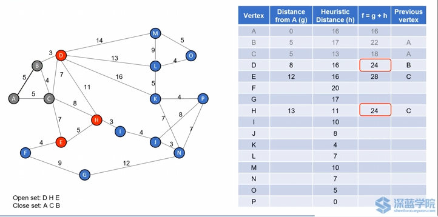


### 第四轮

发现节点D、H的f值相同，此时便可以随机选取其中一个作为下一节点，在这里我们选择节点H

从H点开始，计算与相邻节点D、E、I的距离作为g(n)，并更新父节点（C点已经访问过，故不再进行计算）

**再将节点H放入Close set中，后续不再考虑**

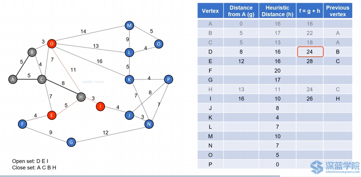


### 第五轮

比较此时D、E、I三节点的f(n)值，发现D点更小，故选择D节点为下一个节点

从D点开始，计算与相邻节点M、L、K的距离作为g(n)，并更新父节点（B、C、H点已经访问过，故不再进行计算）

**再将节点D放入Close set中，后续不再考虑**

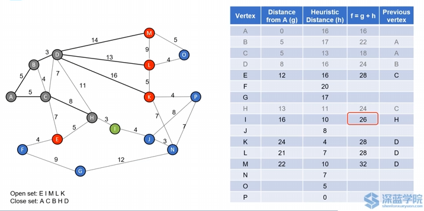


### 第六轮

比较此时E、I、K、L、M五个节点的f(n)值，发现I点更小，故选择I节点为下一个节点

从I点开始，计算与相邻节点J的距离作为g(n)，并更新父节点（ H点已经访问过，故不再进行计算）

**再将节点I放入Close set中，后续不再考虑**

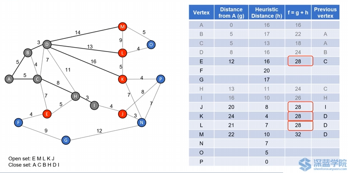


### 第七轮

比较此时E、J、K、L、M五个节点的f(n)值，发现E、J、K、L四点的f值相同，故随机选取其中一个节点作为下一个节点即可，这里我们选择J点

从J点开始，计算与相邻节点P、N的距离作为g(n)，并更新父节点（ I点已经访问过，故不再进行计算）


**此时已经找到终点P，通过反向寻找父节点的方法，可以得知A->P的整体路径为：A->C->H->I->J->P**


## 总结

1. 我们发现，A*方法不需要遍历所有节点便可以寻找到最短距离，当节点越多时，该方法的优越性越显著
2. 通过A*搜索出来的最短距离的路径并不一定是唯一的，比如在第七轮中选择节点K，此时A->B->D->K->P的距离同样也为28
3. 当我们想以运行速度为优先时，我们可以设置更大的h(n)；当我们想以路径的准确性为优先时，我们可以设置更小的h(n)


## 代码实现

可参考[A*算法代码](https://github.com/paulQuei/a-star-algorithm)，我对于其中的地图大小，g(n)等内容参考[A*算法](https://zhuanlan.zhihu.com/p/54510444)评论区做了些修改，结果如下所示：

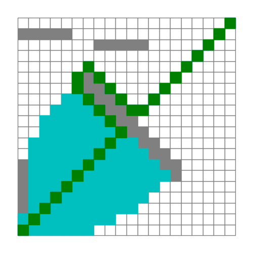
