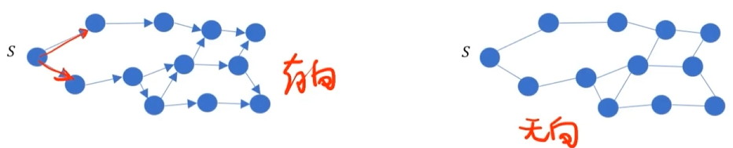
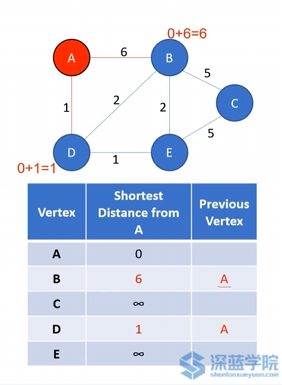
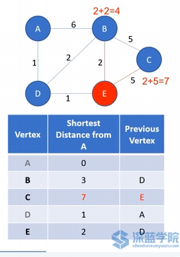
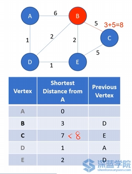
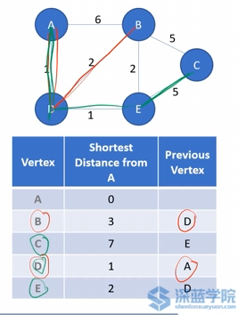
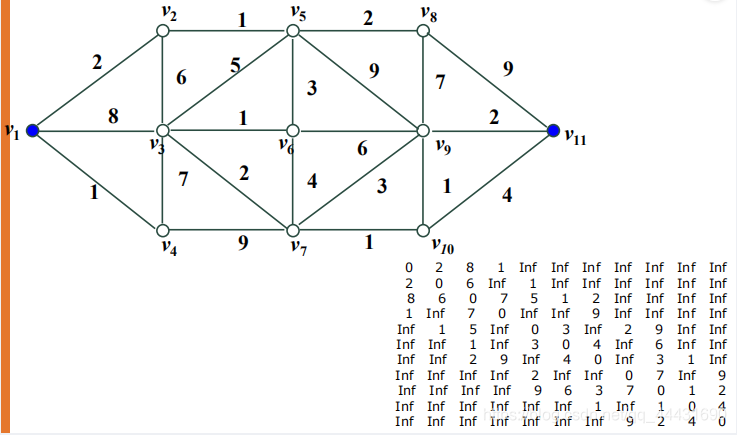
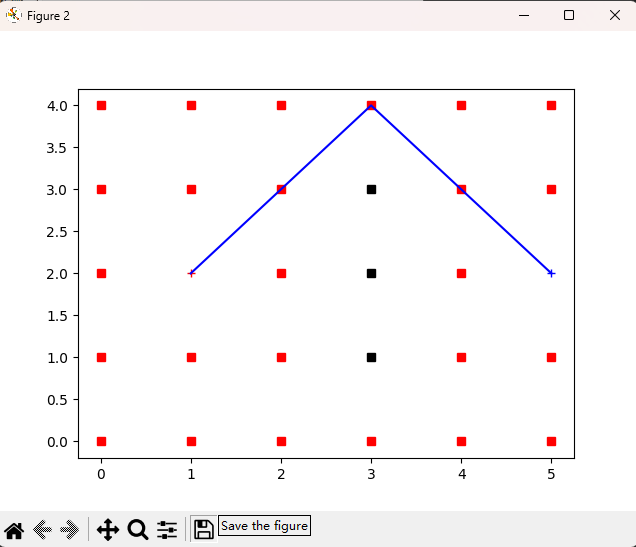

# Dijkstra算法

## 算法特点

使用了**广度优先搜索**，以起始点为中心向外层层扩展，寻找图形中节点之间的最短路径，直到扩展到终点为止，是**图搜索算法**的一种

解决**赋权有向图**或者**无向图**的单源最短路径问题，算法最终得到一个最短路径树

其中有向带权图中，有$G=\left(V,E,W\right)$：$V$为顶点，$E$为边界，$W$​为权重（一般为正数）

## 算法过程

- 声明一个数组d[]，d[v]表示起点到节点v的最短距离；d[s]=0，表示起点到起点的距离为是0；初始化d[v]=$\infty$，为了后续方便被最小值选取
- 声明一个数组u[]，u[v]=false标记是否被遍历
- 寻找下一个节点
  - 考虑节点v的所有有向的边 d[to]=min(d[to],d[v]+len)
    - 其中to为下一个节点，v为当前节点，len为v距离to的长度，计算出到达to所需要的最短距离
    - 每次更新距离的时候，同时更新该节点的父节点，即从父节点过来的那一条路径是最近的
  - 当我们遍历过所有节点后，d[v]表示的就是从起始点 s 到 v 的所有路径中最短的路径长度
- 遍历完所有节点，就可以知道起点到终点的最小距离以及起点到终点的最短路径。

## 算法推导

1. 令A为起始点，更新两个相邻点B、D的距离，并更新它们的父节点

   **此时A就为visited顶点了，后续不再考虑**

2. 相比之下，此时A距离D更近，故从D开始寻找相邻节点B、E的距离（**A已经寻找过，故不再重复寻找**）

   再次计算从A点开始，A->D->B和A->D->E的距离，并更新最短距离，及它们的父节点

   **此时D也为visited顶点了，后续不再考虑**

   

3. 重复上一过程，此时A距离E更近，故从E开始寻找相邻节点B、C的距离（**D已经寻找过，故不再重复寻找**）

   再次计算从E点开始，A->D->E->B和A->D->E->C的距离，并更新最短距离，及它们的父节点	

   **注意：此时A->D->B的距离为3，A->D->E->B的距离为4，故前者距离更短**

   **此时E也为visited顶点了，后续不再考虑**

   

4. 重复上一过程，此时A距离B更近，故从B开始寻找相邻节点C的距离（**E已经寻找过，故不再重复寻找**）

   再次计算从B点开始，A->D->E->B->C的距离，并更新最短距离，及它们的父节点

   **注意：此时A->D->E->C的距离为7，A->D->E->B->C的距离为8，故前者距离更短**

   **此时B也为visited顶点了，后续不再考虑**

   

5. 此时只剩下节点C，发现其没有剩余的相邻节点，故直接令C为visited节点，此时路径寻找结束

**总结：得到这个table，我们通过前向父节点的反向寻找，可以轻松知道从任意A以外的节点到起始点A的最近路径及距离**

## 算法复杂度

每遍历一个顶点，它都有可能有n条边要计算和比较权重，有n个定点，所以这里的复杂度就是$O(n^2)$；m次尝试

1. **稠密地图**：$n^2\approx m$ ，**算法复杂度比较正确**
2. 稀疏地图：应该为$O(n^2+m)$​

**总结：**

1. Dijkstra最短路径算法的执行时间和占用空间与图(或网)中结点数目有关，当结点数目较大时，Dijkstra算法的时间复杂度急剧增加；当图规模较大时，直接应用该算法就会存在速度慢或空间不够的问题。

2. Dijkstra算法作为经典的路径规划算法，在实验地图数据量较小情况下会得到很好的规划结果，但在实验地图数据量较大情况下很难满足路径规划的实时性要求

## 带权邻接矩阵

采用二维数组来表示顶点之间相邻关系的矩阵

## 代码实现

[Dijjstra的python实现](https://github.com/CHH3213/chhRobotics/tree/master/PathPlanning/Dijkstra)

