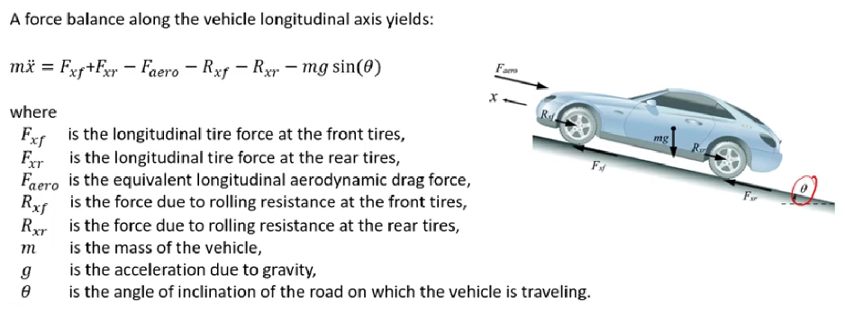
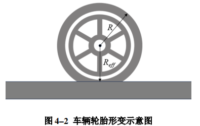
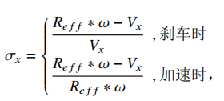
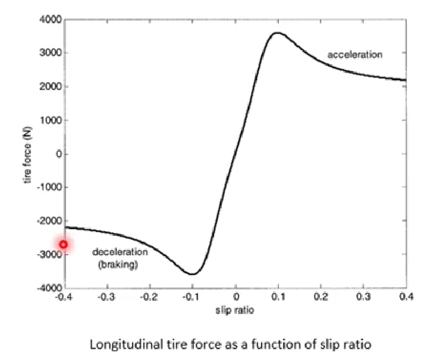
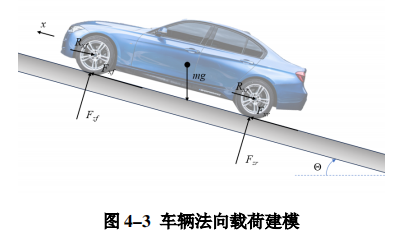
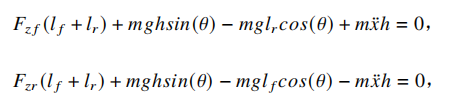
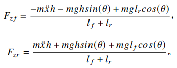
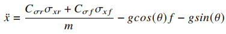

# 车辆纵向控制

## 车辆纵向动力学模型

假定车辆在一个具有θ角度的斜坡上，受到了一定风力的情况下的受力情况如上图所示。图中也给出了车辆的牛顿第二运动定律的动力学平衡方程

- $F_{xf}$ ：车辆前轮纵向力
- $F_{xr}$​ ：车辆后轮纵向力
- $R_{xf}$ ：车辆前轮滚动阻力
- $R_{xr}$ ：车辆后轮滚动阻力

- $mg$ ：车辆重力
- $\theta$ ：车辆所在斜坡角度
- $F_{aero}$ ：车辆空气阻力（在某些情况下可忽略不计）

- 基础公式为：

$$
m\ddot{x}=F_{xf}+F_{xr}-F_{aero}-R_{xf}-R_{xr}-mg\sin{\theta}
$$

## 滑动率

是指车轮接地处的滑动速度与车轮中心运动速度之比，随着制动强度增加，车轮几何中心的运动速度逐渐减少其滚动部分，因滑动而产生的部分越来越多，滑动率的数值说明了车轮运动中滑动成分所占的比例

车辆在行驶的过程中，轮胎会发生形变，所以轮胎的初始半径 $R$ 将略大于真实通过转速转化的线速度的半径 $R_{eff}$​

设车辆的速度为 $v_x$，车轮的转速为 $w$ ，线速度为 $w*R_{eff}$

可得到滑动率公式为

- 当车辆刹车的时候，转速快速减小，此时车辆轮胎速度会大于转动线速度，于是产生了滑移；滑移表示轮胎不转，但是轮胎依旧朝前运动，**滑移率代表了轮胎抱死的程度**
- 当车辆加速的时候，转速快速增大，此时车辆轮胎速度会小于转动线速度，于是产生了滑转；滑转表示轮胎转的很快，但是这个旋转并没有直接作用到地面上使得车辆产生运动，**滑转率代表了轮胎空转的比率**

- 当 $w*R_{eff}=0$ 时，车轮完全抱死，转速为0

## 车辆纵向力

- 当车辆滑动率较小时，$\sigma_x \in [-0.1,0.1]$ 时，滑动率与车辆纵向力大小成正比，称为滑动率系数，公式如下

  -  $F_{xf}=C_{\sigma f} \cdot \sigma{xf}$​

  -  $F_{xr}=C_{\sigma r} \cdot \sigma{xr}$​

  其中，$C_{\sigma f}$ ，$C_{\sigma r}$ 分别表示车辆前、后轮的滑动率系数

- 当车辆的滑动率较大时，此时滑动率和车辆纵向力大小成非线性关系，此时就需要用轮胎的非线性模型，常用的有[魔术公式](https://zhuanlan.zhihu.com/p/266604528)

## 滚动阻力

产生的原因是车辆行驶和轮胎的形变。滚动阻力受地面情况，负载等众多因素的影响，一般情况下，进入轮胎的摩擦力比较大，出轮胎的摩擦力比较小。计算公式如下
$$
R_{xf}+R_{xr}=f\left( F_{zf}+ F_{zr}\right)
$$
其中，$R_{xf}$ 和 $R_{xr}$ 为车辆前后轮的滚动阻力，$f$ 为滚动比例系数（与轮胎材料、路况、载荷有关），$F_{zf}$ 和 $F_{zr}$ 为法向载荷

整车好比一根杠杆，依托杠杆对其进行力矩分析，根据杠杆模型，列出力矩平衡方程

其中 $h$ 为车辆重心到地面的距离；$l_f$ 为车辆前轮中心到车辆重心的距离；$l_r$ 为车辆后轮中心到车辆重心的距离，从而得到车辆法向载荷如下

最后通过计算和简化，可以得到车辆动力学建模下纵向加速度公式

