#  CarSim2019学习笔记

## 下载和安装

- 下载地址

安装包[地址](https://pan.baidu.com/s/1KKGMiEPKgn7dEdXYVXOEVw#list/path=%2F) 

提取码：cn81

- 安装教程

[文本教程](https://blog.csdn.net/Home_Wood/article/details/102890407)

[视频教程](https://www.bilibili.com/video/BV1P54y1274L/?spm_id_from=333.1007.top_right_bar_window_history.content.click&vd_source=3da170c3416f78cfe40e1a7ba3a4f5f9)

## 软件使用基础教程

参考资料如下：

[CarSim仿真快速入门(一) - 知乎 (zhihu.com)](https://zhuanlan.zhihu.com/p/510425634?utm_id=0)

[CarSim快速入门(二) - 知乎 (zhihu.com)](https://zhuanlan.zhihu.com/p/107150026)

## 一些界面概念

如上图所示，软件左上角显示的几个名称的含义分别如下：

- **[QuickStart]** 是文件夹名，**存放所有数据库database的地方**，即打开模型时指定的数据库文件夹，如下：

  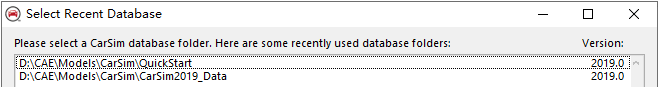

- CarSim Run Control 是 library ，所谓library是一系列的dataset的集合，他们共享同一个当前的界面。CarSim Run Control就是当前界面的的library。常见的Libraries如下图，点击任一个，就跳转到相关的library界面下

  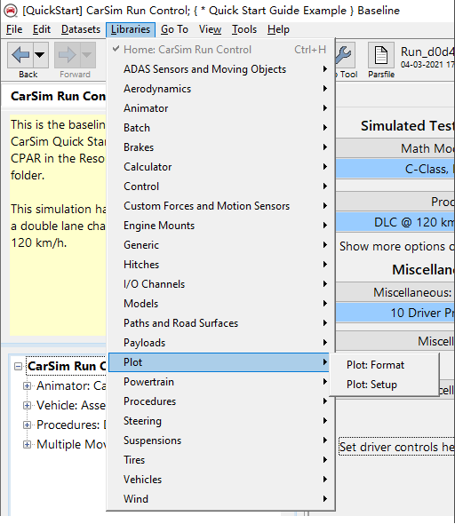

- **{Quick Start Guide Example}** 是category，用于将相关的dataset组织到一个library中，一个category下可能存在多个不同的dataset，他们都属于这一种library

- **Baseline** 是dataset，比如：

  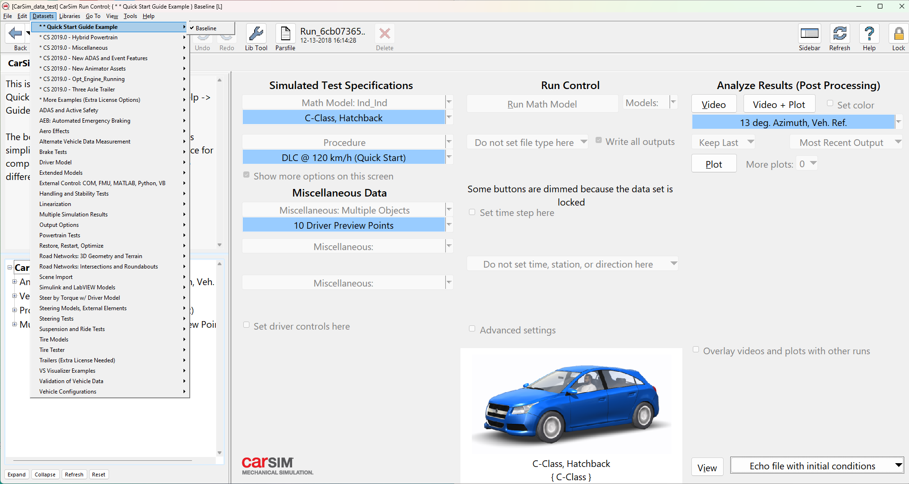

## 数据库创建

Carsim启动时会弹出一个对话框来选择数据库，其默认为如下

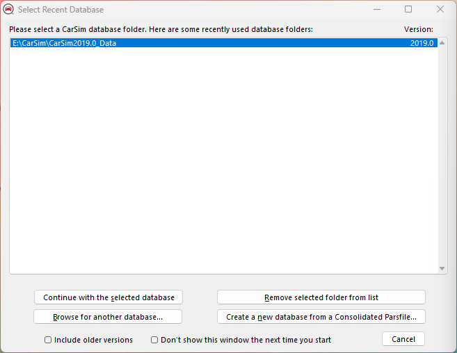

- **现在我们创建一个包含单个车辆和测试条件的新的数据库**

1. 我们选择点击右下角的按钮，此时弹出窗口，描述从统一的parsfile创建新数据库要采取的下一步步骤，单击 Continue

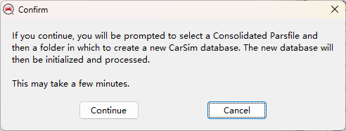

2. 此时出现浏览框，可以找到统一的parsfile**（扩展名CPAR）**，我们以快速入门的指南文件`CarSim_2018.1_Quick_Start.cpar`为例

   路径为：`Resources/Import_Examples/CarSim_2018.1_Quick_Start.cpar`

3. 此时再出现一个浏览框，提示为新的数据库创建一个新的空文件夹

**注意：在此步骤后，我创建新的数据库失败，原因是本人的计算机系统==用户名在创建时为中文==，具体的解决方法可参考该链接[CarSim遇到报错：cannot unpack cpar file](https://blog.csdn.net/qq_41574137/article/details/131970449)**

## 运行控制界面

### 小技巧

- 在View中点击第一行的`Window Size ..`可以自动改变界面至合适大小

  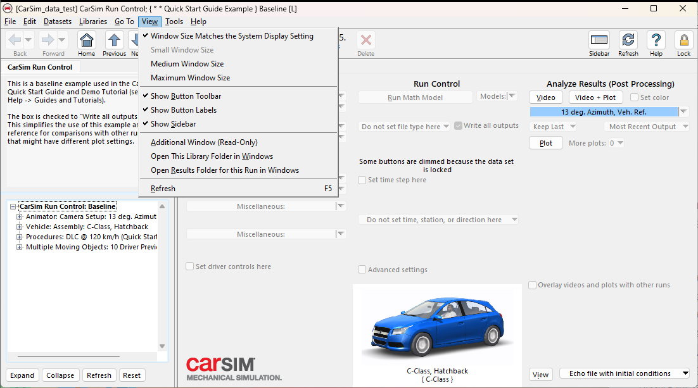

- 右键单击并按住按钮字段和各种控制对象，可以获取工具帮助提示

  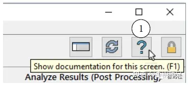

### 运行控制窗口布局

CarSim Run Control界面是访问CarSim中主要工具和数据集的起点

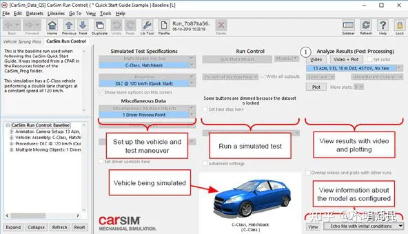

- 界面上的蓝色框是指向更多数据的链接，类似于网页上显示的链接（有时称为超链接）

- 标题为`Simulated Test Specifications`的左列具有蓝色链接，该链接指向要在模拟中使用的车辆数据，至少一个蓝色链接指向定义测试程序的数据集。

- 标题为`Run Control`的中间一栏包含用于运行CarSim数学模型的控件
- 标题为`Analyze Results`的右侧一栏提供对视频和绘图选项的访问，以可视化模拟结果

**注意：可通过键入F1来访问内置的帮助文档**

## 观看已仿真的动画

### Video

通过`Video`按钮可以使用虚拟摄像机来查看仿真的车辆运动，以下为VS Visualizer（CarSim中的动画和绘图工具）将基于虚拟摄像机显示运行的动画

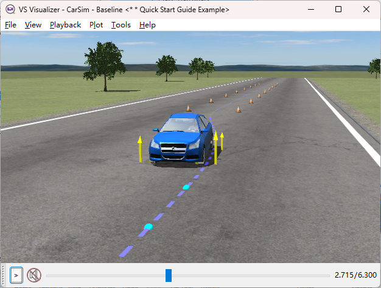

#### 鼠标控件

在动画显示区域中单击并按住鼠标按钮，然后使用简单的鼠标拖动动作来移动仿真摄像机：

- 按住**鼠标右键**扫动（左，右，上，下）以在车辆周围盘旋，即**转换视角**
- 使用**鼠标中键**，以使相机靠近或远离车辆，即**放大或缩小**

- 按下**鼠标右键的同时按下Shift键**，将显示当前轴的视图，并且在查看区域的中心带有一个框，可以拖动观察坐标轴的原点和方向视图

**注意：可以在VS界面下键入F1来查看鼠标操作的提醒**

#### 时间控件

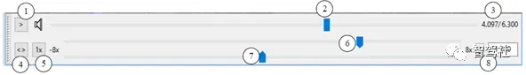

- 注意界面底部的滑块②。动画运行时，滑块从左向右移动。还显示了当前时间（例如4.097 s）③

- 在播放视频时，左右移动时间倍增器滑块⑥以调整时间刻度（显示在字段中⑧）。范围从快进（最右边）到快退（最左边）再到慢动作（刻度的中间）。如果鼠标具有中间的滚轮，则此按钮也将起作用

- 左右移动滚轮/穿梭滑⑦块以临时调整速度。当释放控件时，动画将返回到当前时间比例设置②

- 在`View`下的`Render Mode`中可以更改渲染模式；也可以单击鼠标左键以将其激活，然后反复按Ctrl + W以在几种查看模式之间循环

### Video+Plot

三个面板：虚拟摄像机的视图；显示曲线的窗口；时间控制，包含用户可以控制动画的滑块按钮

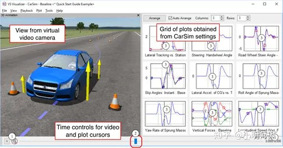

- 可以用鼠标左键左右拖动 “动画”和“绘图网格”之间的垂直分隔线来调整动画和绘图网格的大小

- 每个图中的垂直光标线也会移动，显示每个图中③与仿真时间匹配的；在时间控制面板的右侧④，仿真时间如前所示

- 双击任何一个图将其展开；如图所示，该图应具有明显的黑色轮廓

  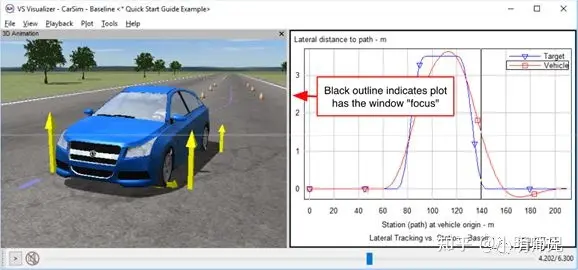

- **左键可以放大图像，双击右键可以还原为原图像；推荐按==Z==键，既可实现最大缩放，又可返回网格**

- **按==V==键在图例区域中的光标所指示的时间中显示图例的值，可显示横、纵坐标值**
- **按==R==键将绘图比例恢复为原始试图**

- **按==鼠标右键==，可以看到该图标变为“拖动”手图标，可以向任何方向拖动图内容**

- **按==T==键将平移==图像==以匹配相机的显示时间**

- **按==Shift+T==键将更改==车辆视图==以匹配相机的显示时间**

- **按==Ctrl+上下键==键跳到模拟中所选图具有最大值或最小值的点**

- **按==Tab==键可以切换图像中的每个关注的曲线**

#### 创建新图

使用采用命令的`Plot> Create new Plot`添加新的绘图窗口，初始状态无内容

滚动Data Manager窗口以查看可用变量。通过**将变量名称从Data Manager窗口拖到Plot窗口来进行绘图**

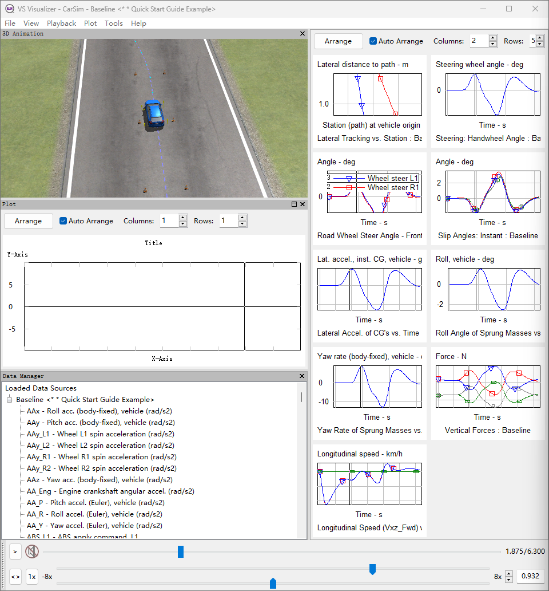

## 观看模型信息

- 在`CarSim Run Control`界面的右下角有一个`View`按钮，可用于访问许多机器生成的文档，这些文档描述了关于CarSim数学模型的技术细节

- 使用旁面的下拉列表，然后选择第一个初始文件，再单击`View`，可以在随CarSim一起安装的文本编辑器中显示文件

  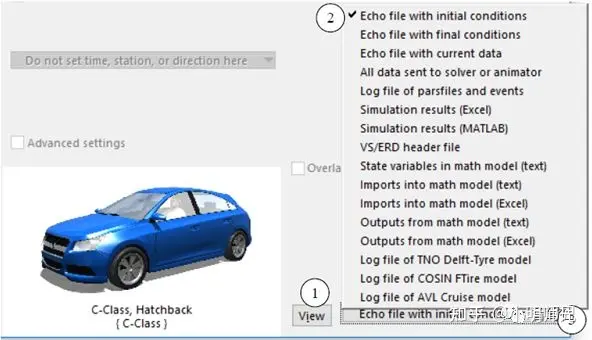

此时会生成一个Echo文件，它是由VS Solver（CarSim执行数学模型计算的部分）生成，以记录在模拟运行中使用的CarSim Math Model的所有属性该文件主要分为几个部分：

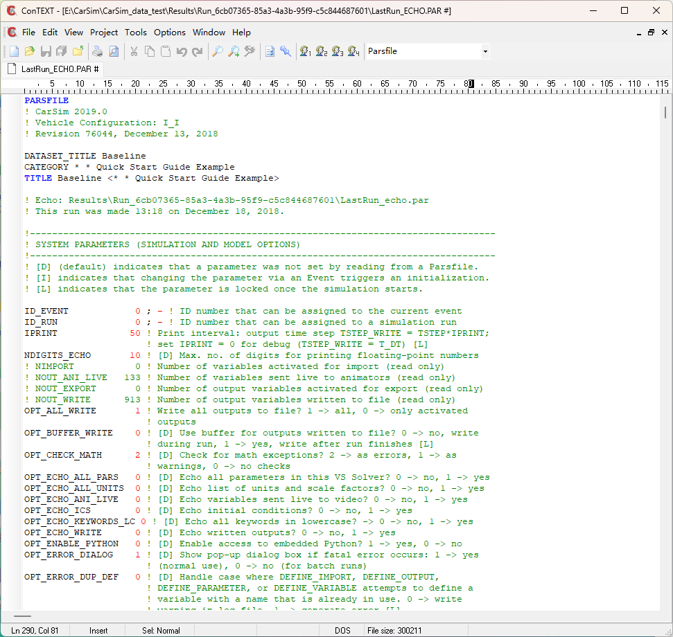

- 该文件的顶部具有系统参数，其中包括时间步长，开始时间，停止时间等
- 列出了模型各部分的参数：总体质量，弹簧质量，悬架，轮胎，道路，驾驶员模型等
- 列出了所有可配置功能（表格）数据，这些数据用于描述车辆的非线性特性，例如悬架和轮胎

- 转到文件的末尾，查看它包含5600多行
- `Alt + F4`退出文本编辑器

## 运行新的仿真（改变车辆速度为150）

在主页面单击`Duplicate`按钮以复制当前的数据集（一般当前状态为`CarSim Run Control`库下，类别为`Quick Start Guide Example`，名称为`Baseline`的 数据集）

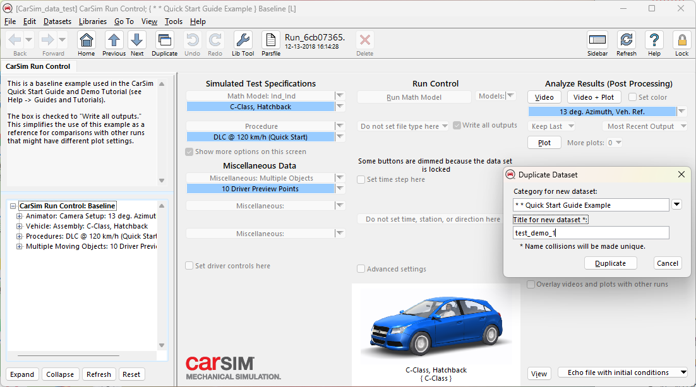

此时，尚未创建新的车辆或测试程序。仅复制了一个现有的运行控制数据集，该数据集将使用与原始数据集相同的载体和过程数据集

新的界面显示与以前的界面显示几乎相同，最初的主要区别是CarSim窗口的标题中有新名称（①），数据集已解锁，并且Plot和Video按钮变暗了

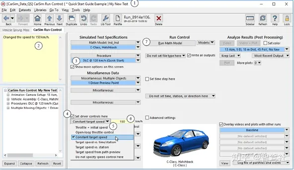

- 选中复选框以覆盖驾驶驱动控制④。 这将显示更多控制方式，包括一个用于车速的控制⑤

- 使用下拉控件选择一种控制车速的方法，然后选择选项恒定目标速度Constant target speed⑤ 。 控件旁边会出现一个黄色字段⑥， 输入值150

  **注意：到Procedure数据集的蓝色链接带有标题，表示测试速度为120 km / h。 因为覆盖控件出现在Procedure蓝色链接之后的Run Control数据集中，所以此速度将覆盖在链接的Procedure数据集中指定的值。Run Control界面的此部分提供了方便的控件来修改测试条件**

  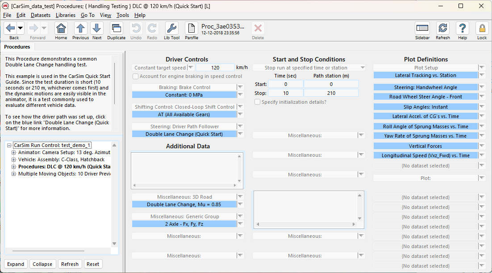

- “Notes”黄色字段②包含来自复制的原始基线Run Control数据集的文本内容。编辑此文本以指示用户进行了更改

- 单击运行`Run Math Model`运行第一个仿真，CarSim数学模型的运行速度明显快于实时运行，因此仅需一秒钟

  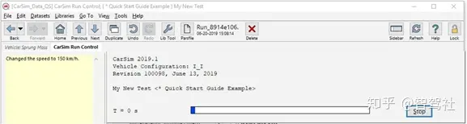

- 运行完成后，进度条消失，“视频”和“绘图”按钮变为活动状态。单击Video + Plot按钮以使用VS Visualizer查看仿真结果。 查看结果后，关闭VS Visualizer

  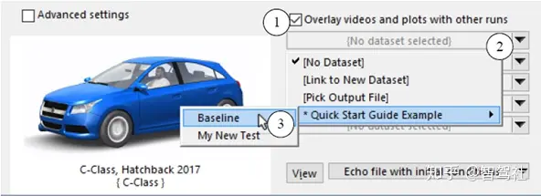

- 在界面的右下角，右键单击“Overlay videos and plots with other runs”复选框①，根据提示，然后选中该复选框。 如果选中，则可以覆盖多次运行的结果。 会出现相应数据集链接，用于选择要一起运行的数据集

  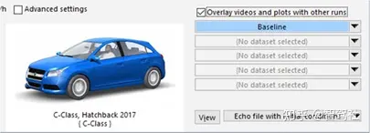

- 在“Video + Plot”按钮旁边，右键单击“Set color”复选框①。 工具提示指示可以在此处设置车辆颜色；选中复选框以显示颜色选择器②

  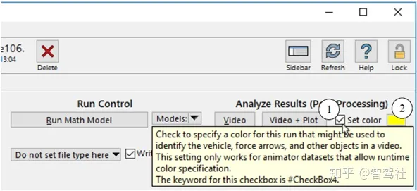

- 新颜色会影响VS Visualizer中的显示，`Run Control`界面上的图像与数据库中其他位置包含的车辆数据集相关的图像匹配，该图像使用3D对象的默认颜色

  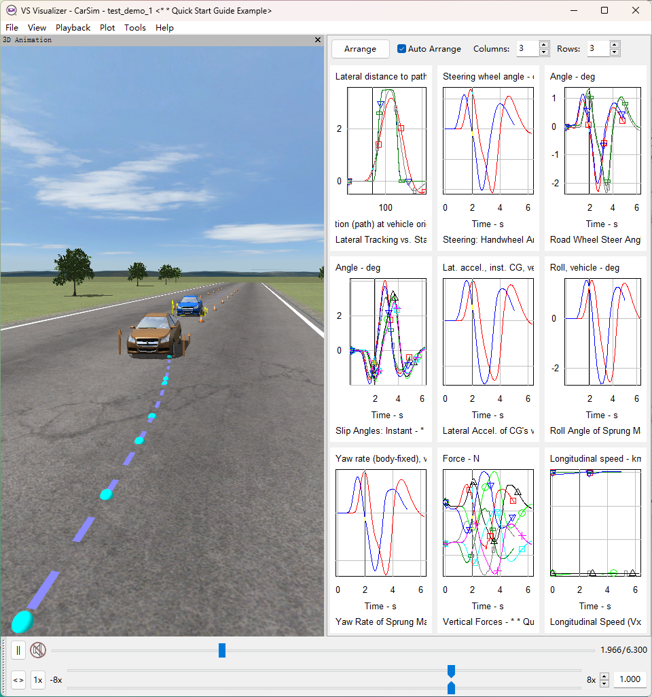

## 创建新的车辆模型

在上一节中，创建了一个新的数据集，车辆以不同的速度行驶。现在正在`Run Control`界面，其中的新数据集设定了更高的车速

- 现在回到基线Baseline运行，查看原始数据集

  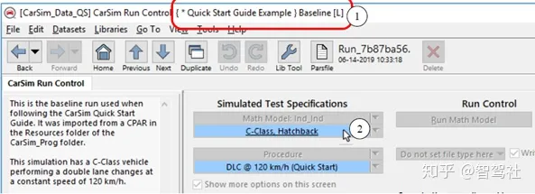

- 单击带下划线的文本，以在CarSim窗口中查看链接的数据集，跳转到页面如下，即为`Vehicle: Assembly`库下，用于示例的基准车辆名为C-Class, Hatchback

  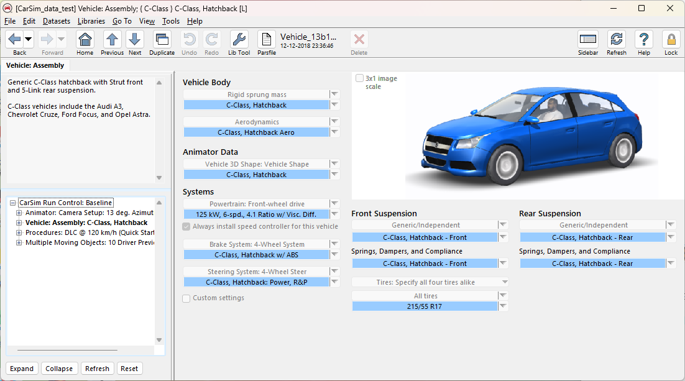

但是，此`Vehicle: Assembly`数据集已经与两个现有的仿真共享。因此，如果修改了车辆并重新运行了现有的仿真，由于车辆属性已更改，因此将获得不同的结果

现在将进行全新的独立车辆模型建模，可以对其进行修改以创建变体模型。仍然可以使用原始车辆描述来进行新的仿真，以便将来与原始基准模型进行比较

- 选择`File`菜单项`New Dataset Plus All Linked Datasets`，系统将提示您为将要创建的新数据集指定类别，为如下所示

  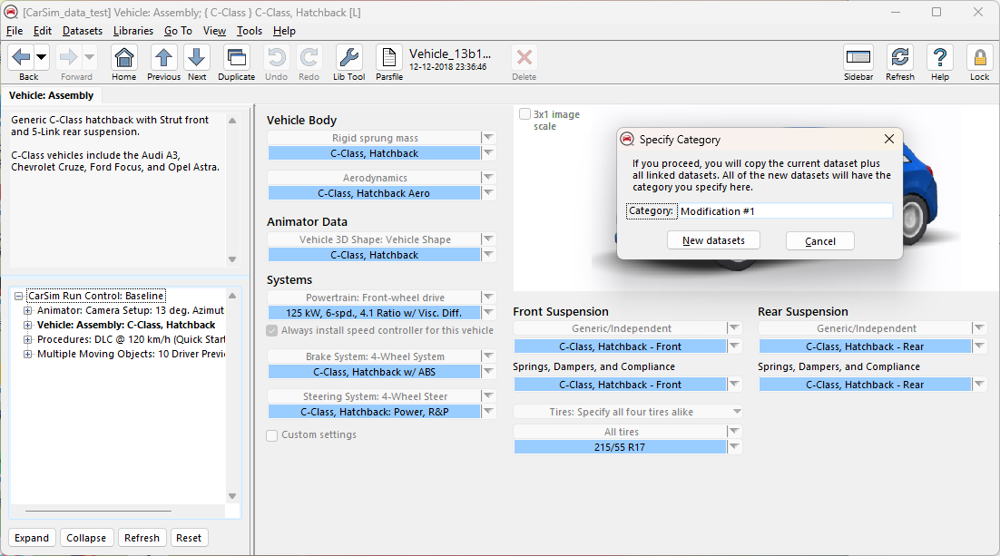

- 复制的“Vehicle: Assembly”界面具有相同的注释和蓝色链接，但外观有所变化

  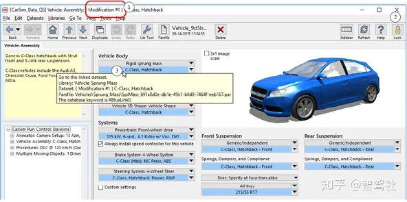

  标题中显示的类别名称现在为Modification＃1①。（原始数据集的类别名称为C-Class）

- 右键单击两个数据字段之一，该数据字段显示后轮中心在簧上质量坐标系的X轴上方的高度，以查看有关该参数的信息⑥。 将两个后轮的轮心高度值更改为100。此更改意味着轮相对于簧上悬挂质量降低。 或者，从车轮的角度来看，簧上质量将在后轴位置提升

  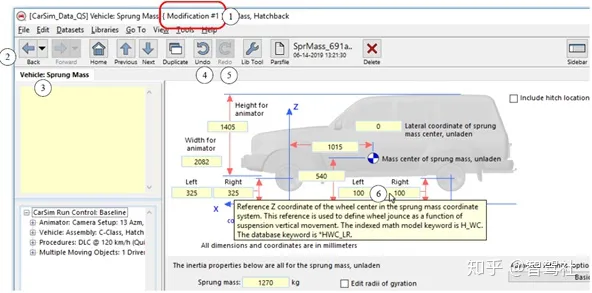

  注意：“Undo”按钮现在处于活动状态④。 那是因为已经修改了新的簧上质量数据集。 单击“Undo”按钮（或键入Windows快捷方式：Ctrl + Z），然后查看更改的还原。 如果没有更多更改要撤消，该按钮将再次变暗。 单击撤消后，“Redo”按钮将变为活动状态⑤。单击Redo以恢复更改（或使用快捷键Ctrl + Y）。 通过重复单击“Redo”按钮恢复所有更改后，该更改将再次变灰，如图所示

# CarSim与Simulink联合仿真

**注意：carsim中自带很多数据集，但是为了方便以后使用，我们每次需要复制一份去修改，而不是直接在初始数据集上进行修改**

可以跟着这个视频进行联合仿真的步骤学习：[从零开始搭建carsim与simulink联合仿真模型](https://www.bilibili.com/video/BV1ev4y1P7JT/?spm_id_from=333.337.top_right_bar_window_history.content.click&vd_source=3da170c3416f78cfe40e1a7ba3a4f5f9)

具体可视化步骤可参考宇翔师兄的仓库笔记`notes/autoware/控制仿真/carsim.md`

**若`CarSim S-Function`里面的`Simfile name`没有，则手动输入`simfile.sim`**

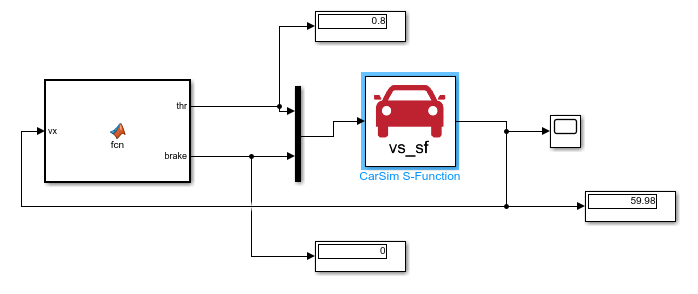

最后结果如下图所示：

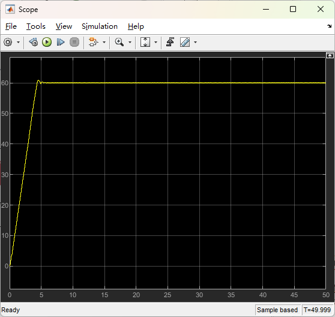

