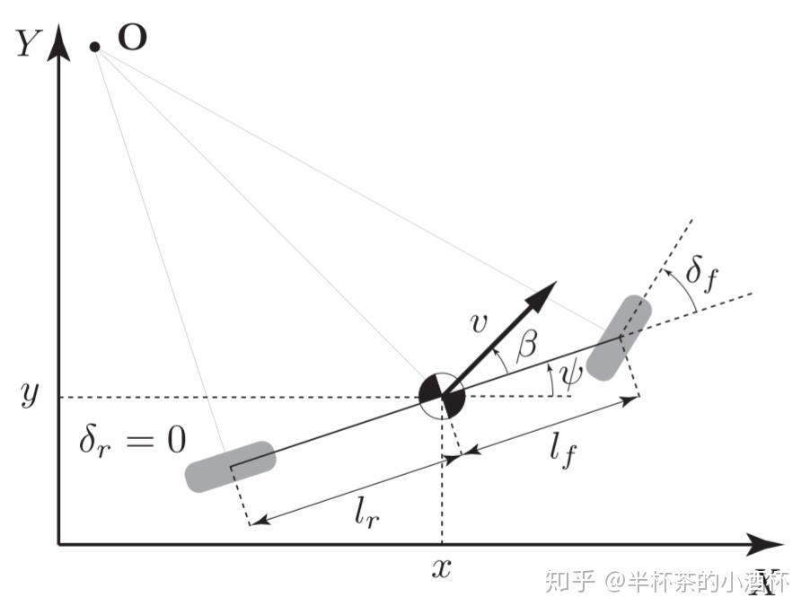
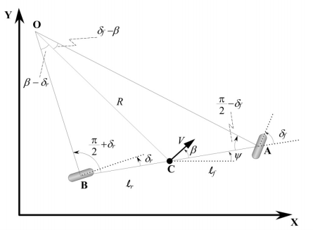
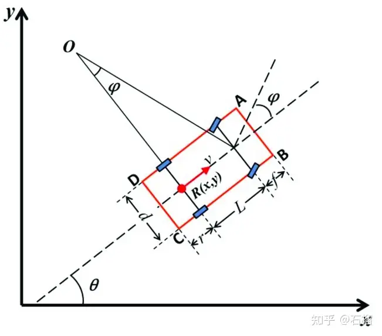
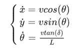
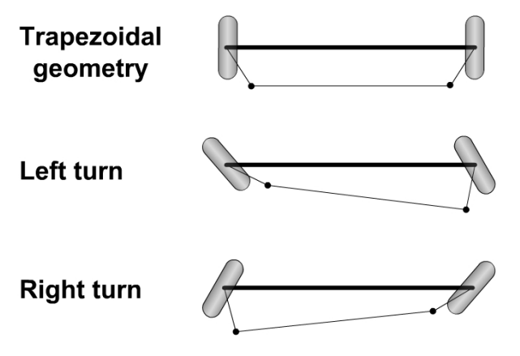

# 车辆横向运动学模型

车辆运动学模型把车辆完全视为刚体，主要考虑车辆的位姿（位置坐标、航向角），速度，前轮转角等关系，且不考虑任何影响运动的力的情况下，提供了车辆运动的数学描述。

- 四个假设：

  - 车辆在垂直方向的运动被忽略掉了，即我们描述的车辆是一个**二维平面上的运动物体**（可以等价与我们是站在天空中的俯视视角）
  - 假设车辆的结构就像自行车一样，即车辆的前两个轮胎拥有相同的的角速度和转速等，同样后面的两个轮胎也是如此，那么**前后的轮胎就可以各用一个轮胎来描述**
  - 假设车辆运动也和自行车一样，即**前轮胎控制车辆转角**
  - 当车速较低时，车辆前后轮的方向与车辆前后轮当前的速度方向相同

## 基于车辆重心的==前轮驱动==运动学模型（$\delta_r=0$）

我们定义模型中的状态量，可以用四个状态量来描述车辆的当前状态：

  - $x$：车辆当前的$x$坐标

  - $y$：车辆当前的$y$坐标

  - $\psi$：车辆当前的偏航角（**Y**$aw$方向的偏角，往往用弧度来描述，逆时针方向为正）

  - $v$：车辆的速度

其中$l_f$和$l_r$为前轮和后轮到车辆重心C的距离，前后车轮与车辆纵向夹角为**滑移角$\delta_f$，$\delta_r$**。AO，BO两条直线分别垂直于两个滚动车轮的方向，点O定义为这两条直线的AO和BO的交点，也是车辆的瞬时滚动中心，该中心与重心C连线的长度**R为车辆路径的半径**。**速度$v$垂直于直线OC**，且相对于车辆纵向夹角为**滑移角$\beta$**（车辆中心速度和车辆朝向的夹角）。

==**各个状态量的更新公式如下：**==

1. $x_{t+1}=x_t+v_{t}\cos(\psi_{t}+\beta)dt$
2. $y_{t+1}=y_{t}+v_{t}\sin(\psi_{t}+\beta)dt$
3. $\psi_{t+1}=\psi_{t}+\frac{v_t}{l_r}\sin(\beta)dt$
4. $v_{t+1}=v_{t}+adt$
5. $\beta=\arctan\left(\frac{l_{r}}{l_f+l_r}\tan(\delta_f)\right)$ 

**注意**：

- 对于公式5：由于绝大多数的汽车后轮都不能够偏转，所以我们的自行车模型就假定后轮的转角控制输入$\delta_r$=0，即方向盘上的控制输入都反映到了前轮的转角上了。

- 对于公式3：$v_t{\sin{\beta}}$为t时刻的方向沿着垂直车辆中轴线的**线速度**，这部分方向的速度可以使其角度$\psi$改变，其中$v_t$是相对于重心而言的速度，故角度的变化仅需要除以$l_r$

## 基于车辆重心的运动学模型

我们假定车速较低，车辆路径半径R变化缓慢，那么车辆的方向变化率（$\dot{\psi}$）肯定等于车辆的角速度，所以车辆的角速度为$\dot{\psi}=\frac{v}{R}$。

在惯性坐标系**XY**下，可得到车辆运动学模型有三个输入：$\delta_f$，$\delta_r$，$V$

1. $\dot{X}=V\cos(\psi+\beta)$
2. $\dot{Y}=V\sin(\psi+\beta)$
3. $\dot{\psi}=\frac{V\cos{\beta}}{l_f+l_r}\left(\tan{\delta_f}-\tan{\delta_r}\right)$
4. $\beta=\arctan\left(\frac{l_{r}\tan(\delta_f)+l_{f}\tan(\delta_r)}{l_f+l_r}\right)$

## 基于后轴中心的运动学模型

## 克曼转向几何模型

一种为了解决交通工具转弯时，内外转向轮路径指向的圆心不同的几何学。

实际上，前轮的左右转向角度并非完全相等，通常情况下，**内侧轮胎转角更大**。如下图所示，$\delta_o$和$\delta_i$分别为外侧前轮和内侧前轮偏角，当车辆右转时，右侧轮胎为内侧轮胎，其转角$\delta_i$较左前轮胎转角$\delta_o$更大。**$l_w$为轮距，$L$为轴距，后轮两个轮胎转角始终为0$\degree$。**

假定是前轮转向，转角很小，则可以得到$\delta_r=0, cos(\beta)=1$

当滑移角$\beta$很小($\approx 0$)时，有公式表述为：$\large \dot{\psi} \approx \frac{V}{R}=V\frac{\delta}{L} $ 或者 $\large \delta=\frac{L}{R}$

由于内外侧轮胎的转向半径不同，因此有：外转角$\large\delta_o=\frac{L}{R+\frac{l_w}{2}}$；内转角$\large\delta_i=\frac{L}{R-\frac{l_w}{2}}$

**前轮平均转角**为：$\large \delta=\frac{\delta_o+\delta_i}{2}\cong \frac{L}{R}$

**内外转角之差**为：$\large \Delta{\delta}=\delta_i-\delta_o \approx \frac{L}{R^2}l_w=\delta^2 \frac{l_w}{L}$，因此前两个前轮的转向角的差异$\Delta{\delta}$与平均转向角的平方$\delta^2$成正比

上图所示，这种差动转向可以通过梯形拉杆装置获得。

依据阿克曼转向几何设计的车辆，沿着弯道转弯时，利用四连杆的相等曲柄使**内侧轮的转向角比外侧轮大约2~4度**，使四个轮子路径的圆心大致上交会于后轴的延长线上瞬时转向中心，让车辆可以顺畅的转弯。 
