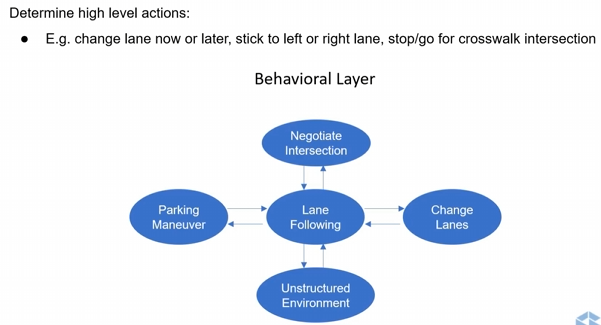
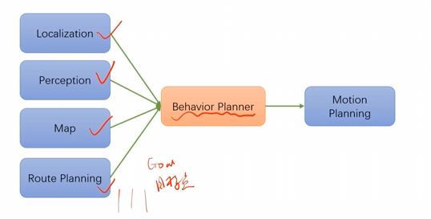

#  决策规划问题引入

作为一个顶层模块，对所获得的信息进行汇总，做出合适的决策，来指导车辆的运动规划和控制 

- 输入：定位、感知、地图、全局路径（静态）

  

- 输出：无人车具体的行为决策，如行车、停车、紧急制动、倒车、减速慢行、变道等。下游是给到动作规划，局部规划 

- 如何实施行为决策

  - 限制规划的搜索空间，例如将搜索空间限制在停车区域内
  - 如果是目标类型的场景，可以设置目标终点，例如变道的时候将终点放到目标车道上
  - 设置轨迹的约束，例如需要停车时，速度设置为0
  - 代价函数的约束
  - 设置虚拟障碍物

- 对规划完备性的影响

  限制了条件以后，那么可以规划的区域相应的会减少，影响了规划器的完备性

- 什么是一个好的决策器
  - 实时性
  - 考虑动作的影响
  - 考虑其他交通参与者的影响
  - 可靠和可重复性

- 行为决策中的挑战
  - 决策密度：需要考虑参与者数量大，计算量很大；需要考虑实时性，频率在10-30HZ左右（每30-100ms计算一次）
  - 不确定性
    - 运动不确定性
    - 遮挡不确定性
    - 运动模型的不确定性

- 不确定性的来源

  - 定位：有可能会偏差或者漂移从而产生误差
  - 控制：跟踪误差
  - 感知：当前世界状态，其他车的位置、大小、速度、类型、交通灯状态
  - 可见性限制：环境状态是否都可见

  

# 常见方法

- 基于规则的方法：有限状态机、行为树等方法

- 基于机器学习的方法：强化学习、深度强化学习、决策树等数据驱动方法

