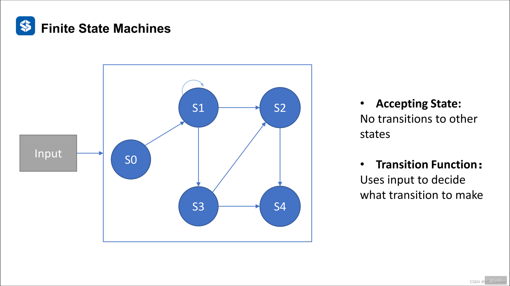
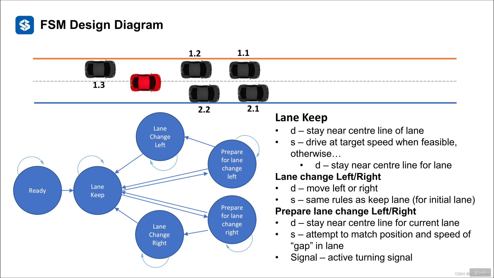
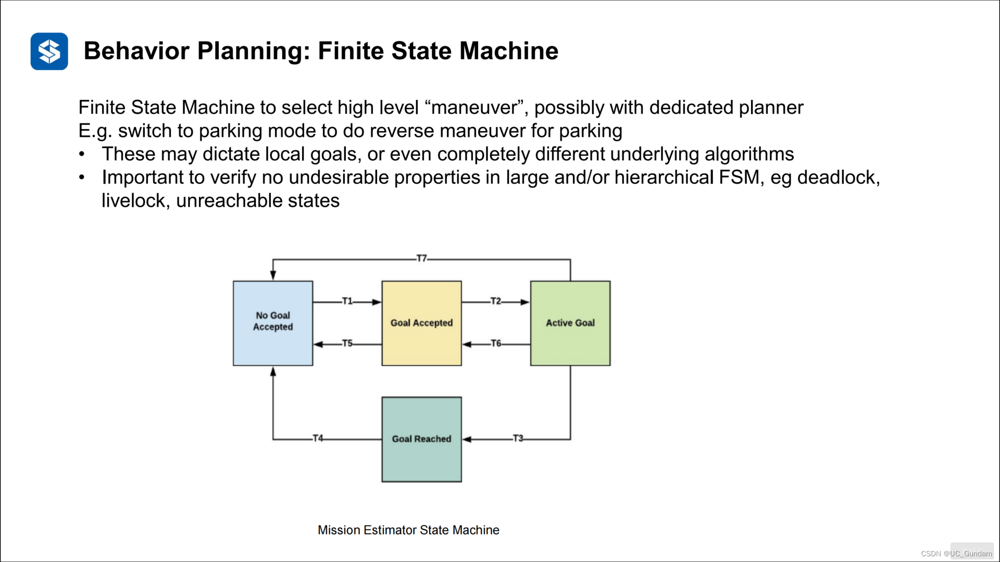
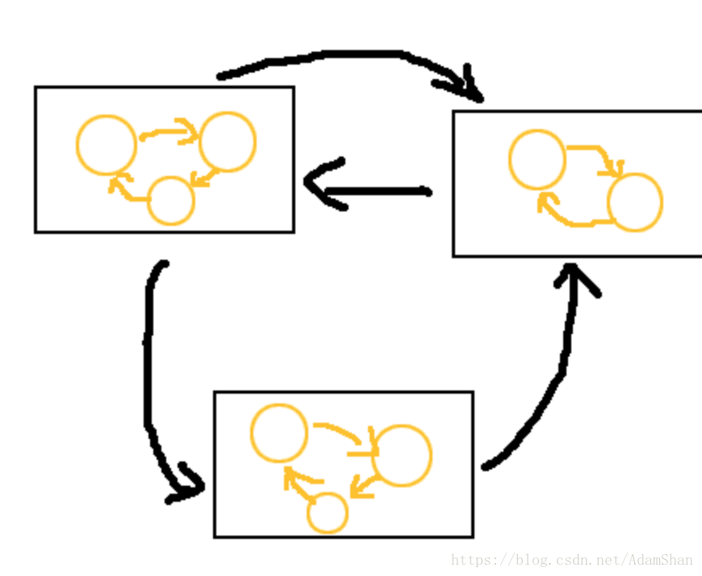
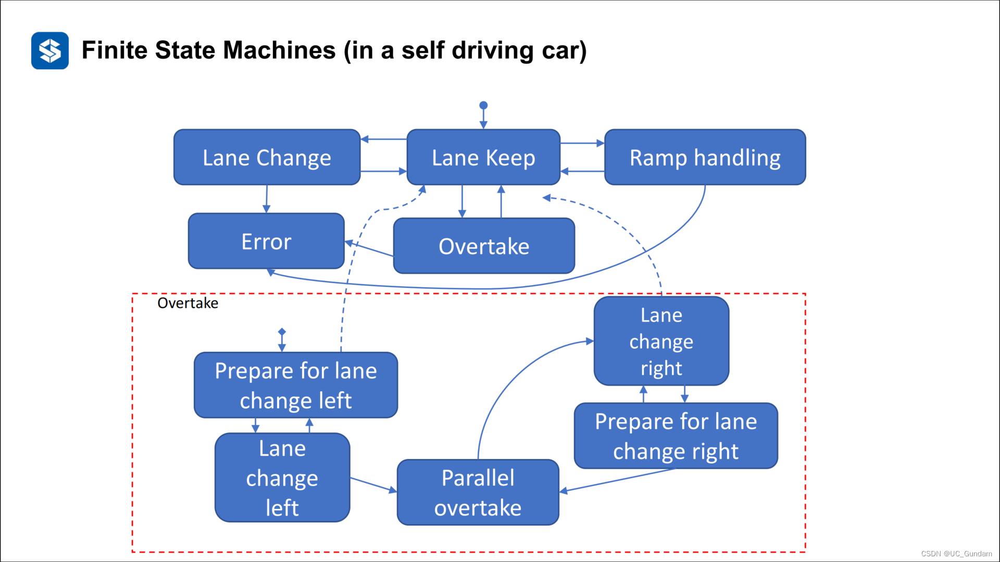

# 有限状态机(FSM)

- 车辆根据当前的环境，选择相应的驾驶行为
- 通过构建有限的有向连通图，来描述驾驶行为和状态之间的转移关系
- 模型简单，是基于离线的状态决策
- 针对特定的外界输入，产生有限数量的输出




- 举例1（车辆变道）



图中红色为车辆当前位置状态，现假设有五种状态，分别是：保持车道；向左/右变道；准备向左/右变道、

通过逻辑串联起各个状态，可理解为如下语句

```
if ...
  ......
else ....
```

 

- 举例2（车辆停车）



从中可以看出，一个有限状态机包括以下几个部分：

1. 输入集合(Active Goal)，通常也叫刺激集合，包含我们考虑到的状态机可能收到的所有输入，可用 $\sum$表示
2. 输出集合，即FSM能够作出的响应的集合，这个集合也是有限的，很多情况下FSM并不一定有输出，即为空集
3. 通常使用有向图来描述FSM内部的状态和转移逻辑
4. 通常有一个固定的初始状态（不需要任何输入，状态机默认处于的状态）
5. 转移逻辑：即状态机从一个状态转移到另一个状态的条件（通常是当前状态和输入的共同作用）
6. 根据是否有输出可以将状态机分为两类：接收器和变换器，其中接收器是指没有输出但是有结束状态，而变换器则有输出集合


- 总结

  当前状态=>是否满足条件1，如果是，则跳转到对应状态

  　　否则=>是否满足条件2，如果是，则跳转到对应状态

  由此可看出，状态机是一种“事件触发型”AI，就是只有事件的触发才会发生引起状态的变化


- 缺点
  1. 忽略了环境的动态性和不确定性，在多场景中的划分和管理十分繁琐
  2. 难以扩展，有向图的可读性差
  3. 可维护性差，新增或者删除的时候会有很大的变动
  4. 复用性差


# 分层有限状态机(HFSM)

将性质同一类的状态机合成一个大的状态机，先从大的状态机来回跳跃，再从大状态机到具体状态



比如下图中的变道子集合



相比于FSM，HFSM新增了一个超级状态（Super-state）：本质上也就是将性质同一类型的一组状态何为一个集合（即上图中的大方框），超级状态之间也有转移逻辑。这也就意味着HFSM不需要为每一个状态和其他所有状态建立转移逻辑，由于状态被归类，类和类之间存在转移逻辑，那么类和类之间的状态转移可以通过继承这个转移逻辑来实现，这里的转换继承就像面向对象编程中通过多态性让子类继承超类一样。
