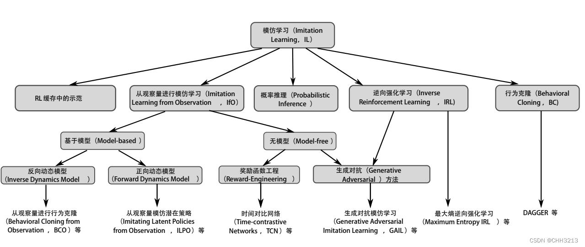
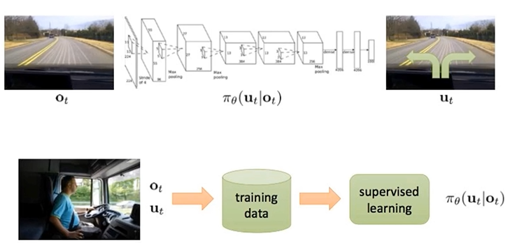
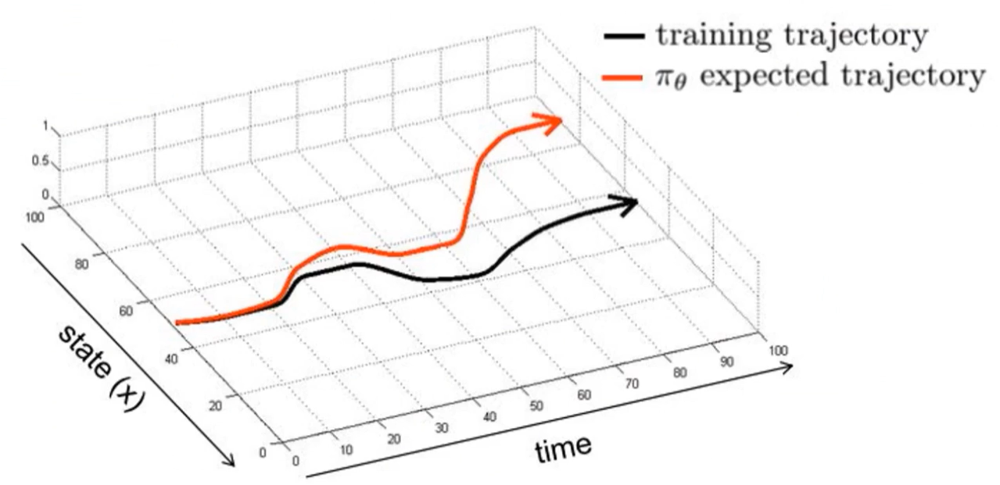
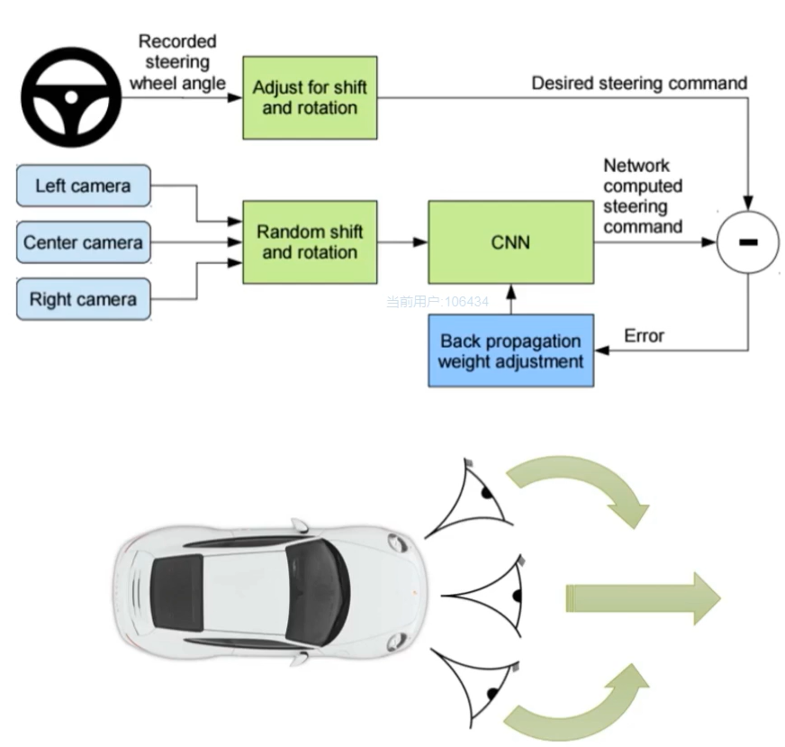

# 模仿学习

## 总述

- 传统强化学习：通过不断计算积累reward来学习最优策略，为一种直接的正向方法，需要很多training data从而获得优异的表现

**但是，在==多部决策==的问题中，学习器不能频繁的得到奖励，且对于积累奖励和学习方法都需要巨大的搜索空间，这就需要模仿学习**

- 模仿学习：从专家模型(expert model)中去提供一种范例进行学习，通常为专家决策数据，包含了状态S和动作序列A，将所有对应的S和A作为一个组，构造新的集合$<S,A>$​

  **将状态S作为特征(feature)，动作A作为标签(label)来进行分类，无论是离散动作还是连续动作均可进行学习，从而获得最优的策略模型**。该模型的训练目标就是使模型生成的状态S和动作A形成的轨迹的分布和输入的轨迹分布相匹配，从某种角度上类似于自动解码器(auto-decoder)

## 自动驾驶中的应用

- 状态S：通常为车辆相机所观测到的画面
- 动作A：包括转向角，油门，刹车等

根据人类提供的状态、动作等进行学习驾驶策略，又可以称为行为克隆(behavior cloning)，即基于监督学习的模仿学习

把环境信息和动作放到专家模型的training data中，作为一个监督学习的对象，从而进行驾驶策略的学习和模仿

在完成训练之后，发现存在一些复合误差(compounding errors)，即$\pi_\theta$和期望轨迹的差距，当到达一定时间后，这些误差会随着时间增加而增加

- 解决办法：数据增广(data augmentation) 

  如下图所示，汽车装配了传感器来获得当前信息。形成决策信息输入到CNN获得转向命令，同时用实际的转向信息对于网络的参数进行调整

**论文：A reduction of imitation learning and structured prediction to No-Regret online learning** 

提出了新的方法，将研究目标从优化policy，减小MSE误差，转移到了增加训练数据上，让样本空间更加接近真实，具体步骤为：

1. 先通过一个数据集训练出一个policy为 $\pi_\theta$​
2. 执行该policy然后获得新的数据集
3. 在该数据集上人工添加label（可以采用某方法自动打标签）
4. 聚合这两个数据集
5. 重复第一步

## 挑战

1. 对于专家模型来说，如果没有自己的feedback，则很难提供合适的action，所以需要对专家模型提供反馈
2. 专家模型反应时间过长，我们需要离线慢放动作并记录
3. 如果还没有学好的策略，是容易发生碰撞的

## 强化模仿学习的两大类方法

- 监督学习：强化state->action，行为克隆

- 间接方法：学习未知的奖励函数，逆强化学习