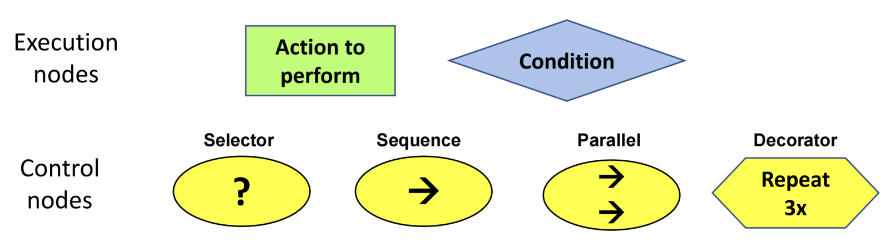
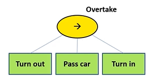
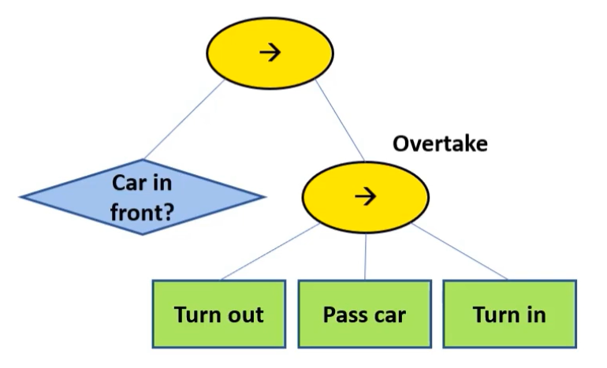
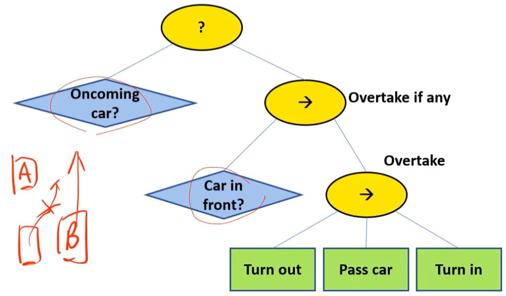
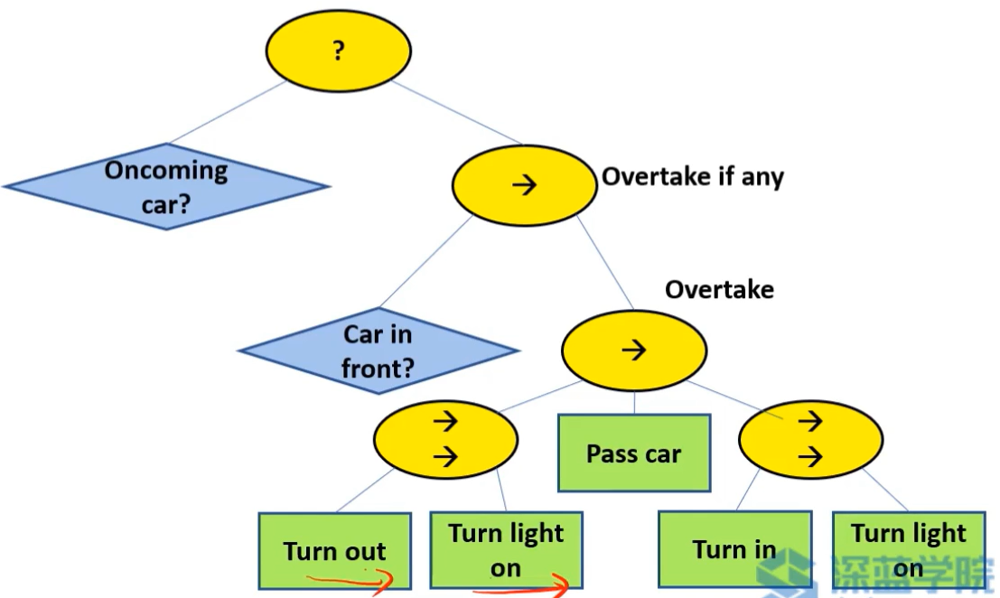
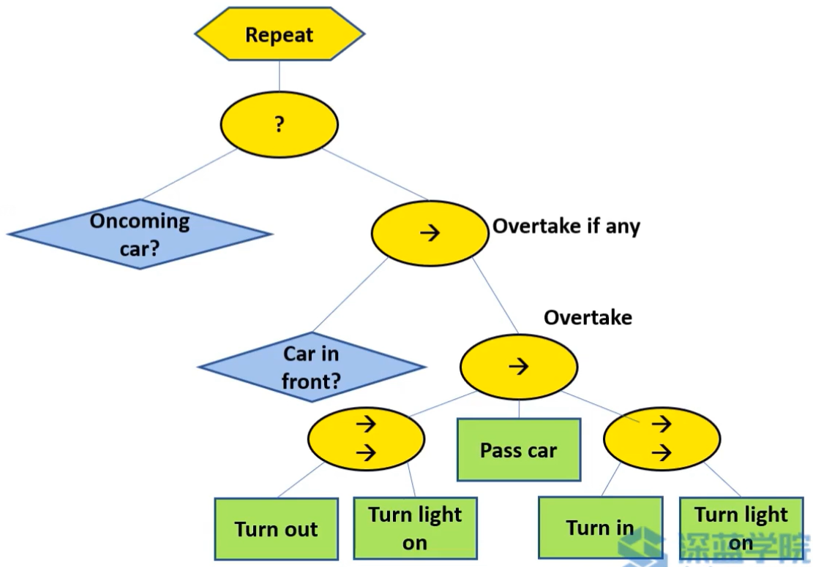
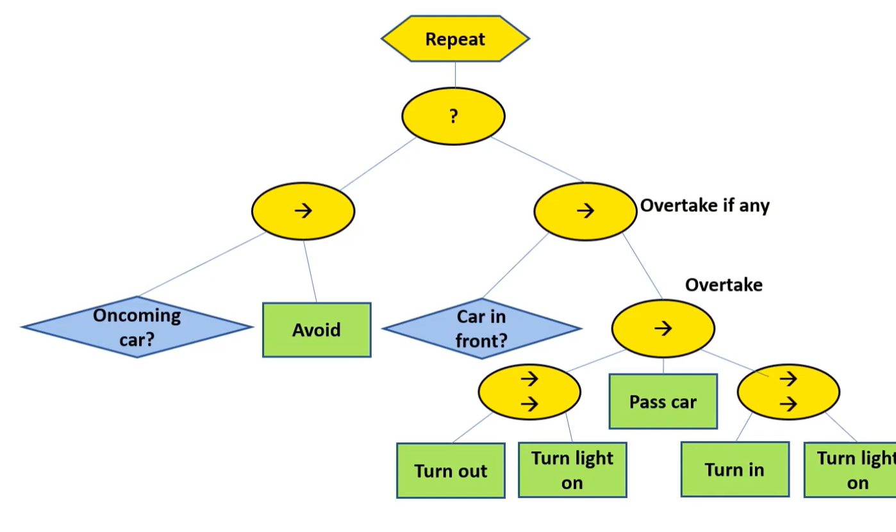
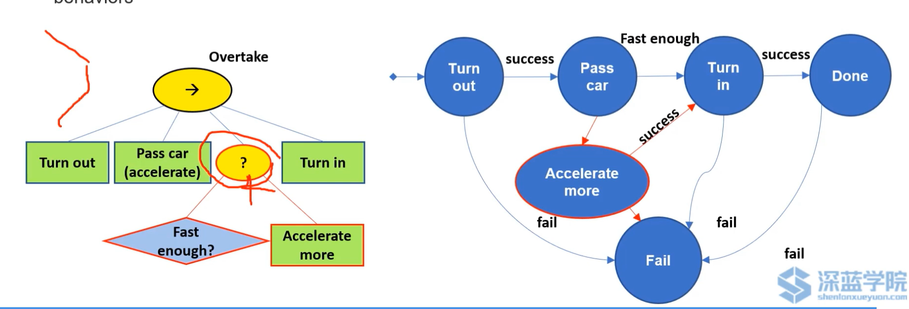
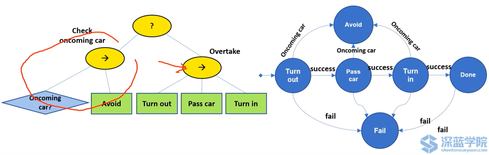

# 行为树(BT)

## 总述

和状态机的方法类似，将场景的**任务模块化**，与决策联系起来，换了一种方式表达，更容易被理解，可视性强

- **行为树是树**：从根节点出发，由一个特定的顺序对树进行遍历直到达到最终状态
- **叶节点是可执行的行为**：每一个叶子都会有相应的处理逻辑，要么是逻辑判断，要么是最终状态

- **节点控制树的遍历**：每一个节点都会进行处理，并应用自己的规则来指定下一个应该扩展哪个节点

## 术语

行为树由各种节点组成，可由以下6种基本图形来表达

- 第一大类：执行节点（action，condition）
- 第二大类：控制节点（selector，sequence，parallel，decorator）

- **行为树每一次离散化的更新称为tick**
- 每次tick之后会返回给父节点运行结果状态：success，failure，running

## 基于超车的例子来建立行为树

- **动作节点**：是行为树的叶子节点。

  如果动作执行成功则返回success，失败则返回failure，正在运行则返回running。例如超车状态的action node有三个动作：turn out，pass car， turn in

- **通过顺序节点连接各个动作**：**按照一定顺序执行子节点**，直到其中任一个节点返回失败的状态，或者全部子节点执行成功时，并向上层返回汇报

  

- **条件节点**：类似于简单的if语句

  如果条件检查为true，则节点返回Success；如果为false，则返回Failure；条件节点永远不会返回Running状态

  判断是否可以超车，例如前方有没有车，前方车速是否低于自车设定车速等等

- **是否具备安全超车条件，需要选择节点**：

  选择器节点将开始按顺序勾选其子节点，如果第一个子节点失败，执行将继续到下一个子节点，并勾选；如果一个子节点成功了，选择器也会返回成功，并且不会继续下一个

  如图有一个oncoming car，如果有，那么说明超车会有潜在风险，则不会超车

- **在某些情况下需要并行动作，则需要并行节点**：

  同时tick所有子节点，允许多个操作节点处于运行状态

  这是有引号的，因为这不是真正的并行；在每次勾选时，每个子节点将按顺序单独勾选。当至少有M个子节点（介于1和N之间）成功时，平行节点会返回成功，而当所有子节点都失败时，则返回失败

  并行节点自身报告访问/失败之前需要多少子节点才能成功的要求可以根据每个实例进行自定义

  turn in/out的时候还需要打转向灯

  

- **装饰器节点**：包装底层子树或子树的功能

  比如，它可以影响基础节点的行为或修改返回状态，常用的有逆变器(Inverter)和重复(Repeat)。其中，逆变器是将结果翻转，例如从成功变为失败；重复则是重复该子节点的所有任务

- **最终示例**：超车场景的节点图

  

## 与状态机(FSM)比较

通常情况下，BTs更容易组成和修改，而FSM在设计反应性方面更具有优势

- 超车场景

可以看出，在BTs方法中加入车辆超车速度检查更为容易

- 无车检查场景

可以看出，在FSM方法中对于检查前方车辆的反应更为敏捷