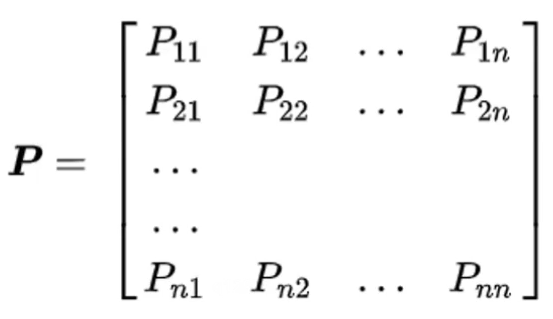
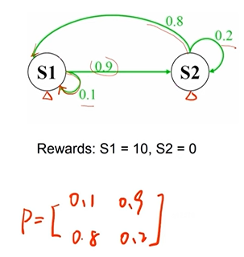
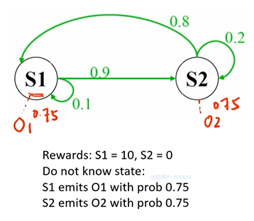
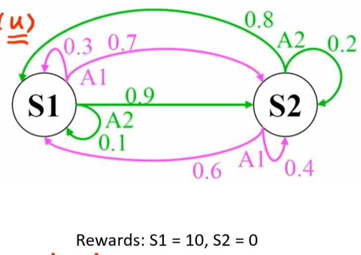
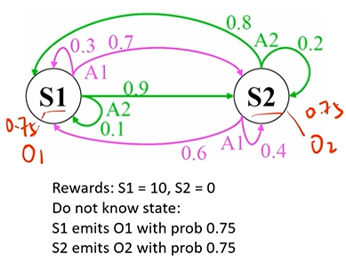
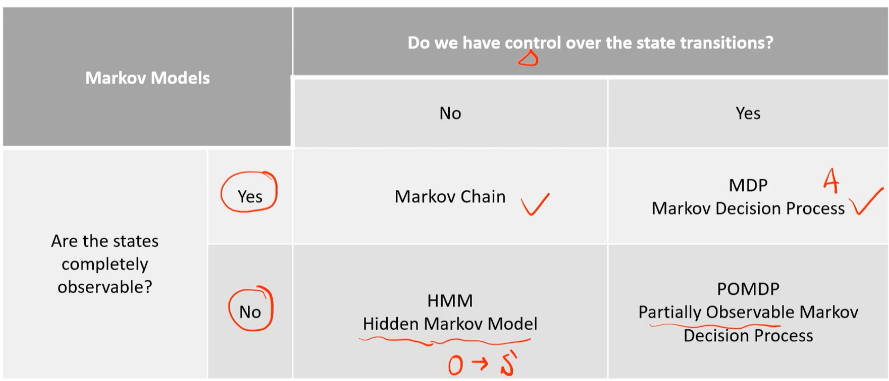
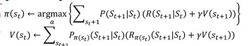

# 部分可观测的马尔可夫决策过程(POMDP)

是MDP的泛化，作为强化学习的数学表达和理论基础

马尔可夫决策过程是对完全可观过程的描述，几乎所有的强化学习都可以构造成马尔可夫决策

## 性质

直观来说，未来只与当前的状态有关系，与过去没有关系

数学表达：在一个序列决策的问题中，下一时刻的状态，仅由当前状态转移得到，与之前的状态无关，公式如下：
$$
P\left(S_{t+1} \mid S_{t}\right)=P\left(S_{t+1} \mid S_{1}, S_{2}, \ldots, S_{t}\right)
$$

- 定义状态转移概率矩阵$P$，其中 $P_{ij}$ 从 $S_i$ （这一状态）转移到 $S_j$（下一状态）的概率大小：

- 举例

  由下图可知，P矩阵的每一行的和均为1

- 马尔可夫链：$<S, P>$ （状态序列）任何一个状态只与前一个状态决定。其中：**S为有限数量的状态集，P为状态转移的概率，且该概率不会随着时间变化而变化**

- 隐性马尔可夫模型(Hidden Markov Model)：$<S, O,P>$同为时序概率模型，描述一种隐藏马尔科夫链下随机生成的不可观测状态的随机序列。其中，**新增的O为每个状态生成的可观的序列**，该观测序列可以描述不可完全见的状态

  - 举例： 

    由于不知道 $S_1$ 和 $S_2$ ，故通过 $O_1$ 和 $O_2$​ 相对应的概率来观测

    

  - 与马尔可夫模型区别：**该模型中的状态不可见，需要一个可观的序列去帮助理解状态**

- 马尔可夫**决策**过程：$<S,P,A,R, \gamma>$ ，增加了一个 A (action) 和奖励 R (reward)，折扣因子$\gamma$ 

  - 与马尔可夫过程区别：**增加了新的变量Action**，可以理解为控制系统中的u(input)，并用一个**奖励函数reward**来体现采用该Action从而得到的奖励。

    **A代表了一个主观能动性的部分，相当于系统的输入；R代表了在t时刻采取的A所获得的回报，相当于系统的输出；$\gamma$ 表示更加关心当前激励，而弱化未来激励的一个折扣因子，收敛时作为结束的信号**

  

- 部分可观的马尔可夫决策过程：与上述的隐性马尔可夫模型类似，对于系统状态不完全可见的情况，采用可观序列帮助描述

  

- 总结

## 解决方法—预测模型法

将状态的迁移的历史知识应用于预测模型或者构建系统的内部状态，同时引入了对内部状态的**置信度b**，描述在A行为处S的状态的概率

将部分可观测的马尔可夫决策过程问题转化为统计学上的马尔可夫决策过程来求解

## 自动驾驶中的应用

- S(State)：车道、环境、世界信息

- A(Action)：无人车行为的决策空间，跟车、换道、超车、停车
- P：转移概率
- R(Reward)：奖励函数，类似于cost function
- $\gamma \in (0,1)$：更加关注当下的奖励

寻找一个最优的策略，使得状态通过一个行为动作A达到目标，即最大化从当前时间点到未来的一个积累奖励，可表示为

其中，$\pi$式的迭代使得奖励最大化的策略；V式的迭代是未来衰减的累计期待奖励

- 挑战
  1. 到达目的地
  2. 安全性
  3. 舒适性