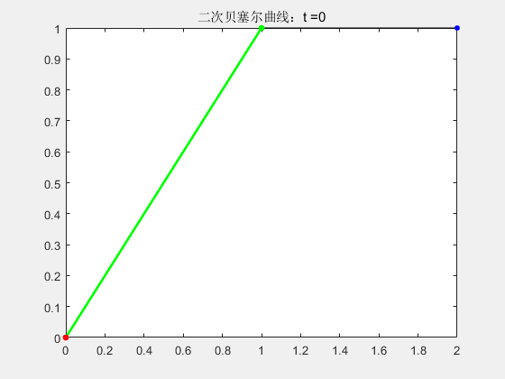
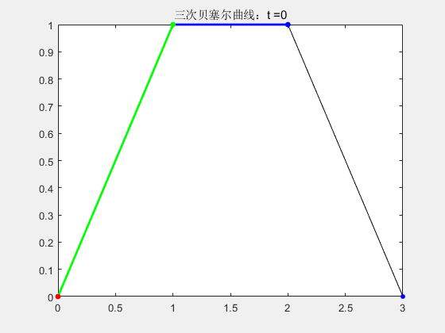

# Bezier曲线法

> 局部路径规划算法——贝塞尔曲线法

## 1. 算法简介

贝塞尔曲线应用于二维图形应用程序的数学曲线，**由一组称为控制点的向量来确定，给定的控制点按顺序连接构成控制多边形，贝塞尔曲线逼近这个多边形，进而通过调整控制点坐标改变曲线的形状。控制点的作用是控制曲线的弯曲程度**

贝塞尔曲线只需要很少的控制点就能够生成较复杂的平滑曲线。该方法能够保证输入的控制点与生成的曲线之间的关系非常简洁、明确

对于车辆系统，规划的轨迹应满足以下准则：**轨迹连续；轨迹曲率连续；轨迹容易被车辆跟随，且容易生成**

贝塞尔曲线是参数化曲线，n次贝塞尔曲线由n+1个控制点决定。它的生成动画过程可以查看这个网址：[贝塞尔曲线动画](https://www.jasondavies.com/animated-bezier/)

## 2. 公式原理及python实现

### 2.1 一阶Bezier曲线

一阶贝塞尔曲线需要2个控制点，假设分别为$P_0$和$P_1$，则贝塞尔曲线上的生成点$p_1(t)$可以表达为：
$$
 p_1(t) = P_0 + t(P_1 - P_0) \rightarrow \ p_1(t) = (1 - t)P_0 + tP_1 
$$
 其中，$t \in [0, 1]$ 一阶曲线很好理解，就是根据 $t$ 来线性插值：

- python实现

一阶Bezier的python实现及结果：[一阶Bezier曲线](代码/Bezier曲线)

### 2.2 二阶Bezier曲线

二阶贝塞尔曲线需要3个控制点，假设分别为$P_0$、$P_1$和$P_2$ 。 $P_0$和$P_1$构成一阶，$P_1$和$P_2$构成一阶，即： 
$$
p_{1,1}(t) = (1 - t)P_0 + tP_1 \\ p_{1,2}(t) = (1 - t)P_1 + tP_2
$$
 在生成的两个一阶点基础上，可以生成二阶贝塞尔点： 
$$
 p_2(t) = (1 - t)p_{1,1}(t) + t p_{1,2}(t) 
$$
 则贝塞尔点与3个控制点的关系为：
$$
 p_2(t) = (1 - t)^2P_0 + 2t(1 - t)P_1 + t^2P_2 
$$

- python实现

二阶Bezier的python实现及结果：[二阶Bezier曲线](代码/Bezier曲线)

### 2.3 三阶Bezier曲线

三阶贝塞尔曲线需要4个控制点，假设分别为$P_0$、$P_1$、$P_2$和$P_3$ 。 $P_0$和$P_1$构成一阶，$P_1$和$P_2$构成一阶，$P_2$和$P_3$构成一阶，即： 
$$
 p_{1,1}(t) = (1 - t)P_0 + tP_1 \\ p_{1,2}(t) = (1 - t)P_1 + tP_2 \\ p_{1,3}(t) = (1 - t)P_2 + tP_3 
$$
在生成的三个一阶点基础上，可以生成两个二阶贝塞尔点： 
$$
 p_{2,1}(t) = (1 - t)p_{1,1}(t) + t p_{1,2}(t) \\ p_{2,2}(t) = (1 - t)p_{1,2}(t) + t p_{1,3}(t) 
$$
 在生成的两个二阶点基础上，可以生成三阶贝塞尔点：
$$
p_3(t) = (1 - t)p_{2,1}(t) + t p_{2,2}(t)
$$
 则贝塞尔点与4个控制点的关系为：
$$
p_3(t) = (1 - t)^3P_0 + 3t(1 - t)^2P_1 + 3t^2(1 - t)P_2 + t^3P_3
$$

- python实现

三阶Bezier的python实现及结果：[三阶Bezier曲线](代码/Bezier曲线)

### 2.4 $n$阶Bezier曲线

通过上面一阶到三阶的贝塞尔曲线，可以发现贝塞尔点的求解满足递归的性质

这里我们直接给出$n$阶贝塞尔曲线的求解公式。 对于$n$阶贝塞尔曲线，需要$n+1$个控制点，假设分别为$P_0$、$P_1$、$P_2$、...、$P_n$。 则贝塞尔点与$n+1$个控制点的关系为： 
$$
p_n(t) = \sum_{i=0}^{n}C_n^i(1-t)^{n-i}t^iP_i = \sum_{i=0}^{n}B_{i,n}(t)P_i
$$
 其中，$C_n^i$为组合数，$B_{i,n}(t)$为Bernstein (伯恩斯坦) 基函数。伯恩斯坦基函数的一阶导数为：
$$
 B_{i,n}(t)^{'} = n[B_{i-1,n-1}(t) - B_{i,n-1}(t)] 
$$
推导步骤在此省略，具体可以参考[局部路径规划算法———贝塞尔曲线法（含python实现 | c++实现）](https://blog.csdn.net/weixin_42301220/article/details/125167672) 式中$i \geq 1$. 当$i=0$时，$B_{0,n}(t) = (1-t)^n$，$B_{0,n}(t)^{'} = -n(1-t)^{n-1} = -nB_{0,n-1}(t)$。进一步，贝塞尔点求导为： $$ p_n(t)^{'} = n\sum_{i=0}^{n}B_{i-1,n-1}(t) \cdot (P_i - P_{i-1}) $$

- 普通方式实现 $n$阶贝塞尔曲线：[n阶Bezier曲线](代码/Bezier曲线)
- 递归方式实现 $n$阶贝塞尔曲线：[n阶Bezier曲线](代码/Bezier曲线)

### 2.5 Bezier曲线的特殊性质

贝塞尔曲线具有许多性质，这里就列举几个在自动驾驶运动规划中的常见性质

- $P_0$ 和 $P_n$ 分别位于贝塞尔曲线的起点和终点；
- 几何特性不随坐标系的变换而变化；
- 起点和终点处的切线方向与和特征多边形的第一条边及最后一条边分别相切，换句话说，可根据曲线的起始点和终止点的切线方向确定车辆起始点姿态和目标点姿态；
- 若要求两端弧线拼接在一起依然是曲率连续的，必须要求两段弧线在连接处的曲率是相等的；
- 至少需要三阶贝塞尔曲线（四个控制点）才能生成曲率连续的路径。
  - 曲率连续需要二阶导数连续，三阶贝塞尔曲线求两次导还有变量$t$，是关于$t$连续的

### 3. python代码实现

python实现代码及结果：[Bezier曲线](代码/Bezier曲线)

