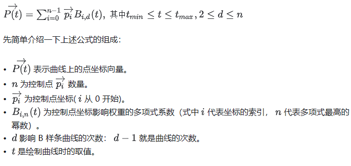
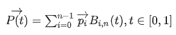
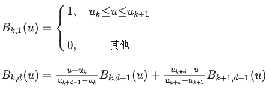
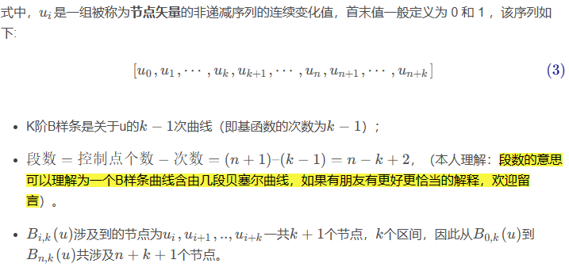
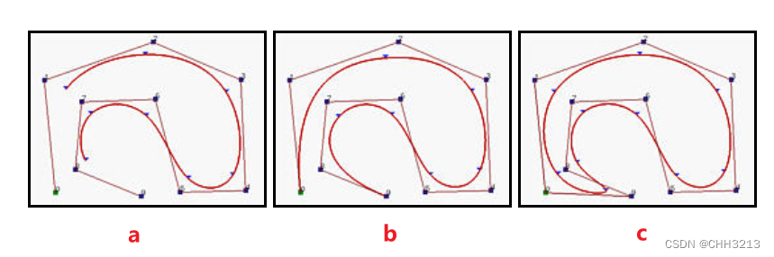

# B样条(B-spline)曲线法

- 参考资料：

  [【路径规划】局部路径规划算法——B样条曲线法（含python实现 | c++实现）-CSDN博客](https://blog.csdn.net/weixin_42301220/article/details/125173884)

  [深入理解B样条曲线（上） - 知乎 (zhihu.com)](https://zhuanlan.zhihu.com/p/144042470)


## 1. 算法介绍

样条是通过一组指定点集而生成平滑曲线的柔性带

B 样条曲线就是通过控制点局部控制形状的曲线

B样条曲线是B-样条基函数（给定区间上的所有样条函数组成一个线性空间）的线性组合


## 1.1 Bezier曲线的缺点

- 确定了多边形的顶点数（n+1个），也就决定了所定义的Bezier曲线的阶次（n次），这样很不灵活
- 当顶点数（ n+1 ） 较大时， 曲线的次数较高，曲线的导数次数也会较高，因此曲线会出现较多的峰谷值
- 贝塞尔曲线无法进行局部修改

B样条曲线除了保持Bezier曲线所具有的优点外，还弥补了上述所有的缺陷： **可以指定阶次； 移动控制点仅仅改变曲线的部分形状，而不是整体**

**B样条曲线是贝塞尔曲线的一般化，贝塞尔曲线可以认为是B样条曲线的特例**


## 2. 公式原理

### 2.1 B样条曲线方程

设有 $P_0$ … $P_n$ 一共 n+1 个控制点，这些控制点用于定义样条曲线的走向、界限范围，则具有 n+1 个控制点的k阶B样条曲线的定义为



对比Bezier曲线公式：

- 相同点
  1. 都是求和公式
  2. 都有一个 $B_{i,x}(t)$ 的多项式系数（式中贝塞尔曲线 x=n，B 样条曲线 x=d）

- 不同点
  1. 贝塞尔曲线的多项式幂数与控制点数量一致，而 B 样条曲线的多项式幂数更自由
  2. 贝塞尔曲线 t 的取值为固定的 [0,1]，而 B 样条曲线是在最大和最小节点值之间


### 2.2 计算多项式

公式中其他值其实都比较清晰，问题的关键是需要搞清楚那个多项式$B_{i,n}(t)$是什么！

计算这个多项式，我们使用到了**Cox-deBoor递归公式**，公式内容如下：（需要注意一点，如果遇到分母为 0的情况时，需要特殊处理为整体值为 0）



如果遇到分母为 0的情况：如果此时分子也为0，约定这一项整体为0；如果此时分子不为0，则约定分母为1 



从这个公式可以看出，递归公式的差异主要体现在 $u_{k}$ 和 $u_{k+1}$ 的取值上。需要注意的是**节点的数量**是由参数 d 和 n 决定的，数量等于 n+d 。根据这些节点$u$​的取值，可以划分为一下三种类型：

- 均匀周期性(uniform)
- 开放均匀性(open uniform)
- 非均匀性(non-uniform)


## 3. B样条分类

> 注意:下面的分类中关于重复度的问题有些文章不太一样，只是因为定义的$k$含义不同（本文是把$k$定义为样条的阶数，其它文章是定义成曲线的次数，而曲线的次数=样条的阶数-1），但计算其实都是一致的。

根据节点$u$​的取值，可以划分为以下几种类型：


### 3.1 均匀B样条曲线

当节点沿参数轴均匀等距分布，为均匀 B 样条曲线，如$u = {0, \frac{1}{7}, \frac{2}{7}, \frac{3}{7}, \frac{4}{7}, \frac{5}{7}, \frac{6}{7}, 1}$。当 n 和 k 一定时，均匀 B 样条的基函数呈周期性，所有基函数有相同形状，**每个后续基函数仅仅是前面基函数在新位置上的重复**。

定义很简单，如下：

```
NodeVector = np.array([np.linspace(0, 1, n + k + 1)])  # 均匀B样条节点向量，首末值定义为 0 和 1
```


### 3.2 准均匀B样条曲线

其节点矢量中两端节点具有重复度$k$（即样条的阶数），即$u_0=u_1=\cdots=u_k$，$u_{n+1}=u_{n+2}=\cdots=u_{n+k+1}$。所有的内节点均匀分布，具有重复度1，如 $u={0,0,0,1,2,3,4,5,5,5}$​。

准均匀 B 样条曲线保留了贝塞尔曲线在两个端点处的性质：样条曲线在端点处的切线即为倒数两个端点的连线。

- 一般来说，次数越高，则曲线的导数次数也会较高，那么将会有很多零点存在，较多的导数零点就导致原曲线存在较多的极值，使曲线出现较多的峰谷值；次数越低，样条曲线逼近控制点效果越好。
- 另一方面，**三次 B 样条曲线能够实现二阶导数连续，故最终选择准均匀三次 B 样条曲线作为轨迹规划的曲线比较合适**。

- python实现

  ```python
  def U_quasi_uniform(n = None,k = None): 
      """准均匀B样条的节点向量计算
      首末值定义为 0 和 1
      Args:
          n (_type_, optional): n表示控制点个数-1，控制点共n+1个. Defaults to None.
          k (_type_, optional): B样条阶数k， k阶B样条，k-1次曲线. Defaults to None.
  
      Returns:
          _type_: _description_
      """
      # 准均匀B样条的节点向量计算，共n+1个控制顶点，k-1次B样条，k阶
      NodeVector = np.zeros((1,n + k + 1))
      piecewise = n - k + 2  # B样条曲线的段数:控制点个数-次数
      
      if piecewise == 1:  # 只有一段曲线时，n = k-1
          NodeVector[0,n+1:n+k+1] = 1
      else:
          for i in range(n-k+1):  # 中间段内节点均匀分布：两端共2k个节点，中间还剩(n+k+1-2k=n-k+1）个节点
              NodeVector[0, k+i] = NodeVector[0, k+i-1]+1/piecewise
  
          NodeVector[0,n + 1:n + k + 1] = 1  # 末尾重复度k
      
      return NodeVector
  ```


### 3.3 分段B样条曲线

其节点矢量中两端节点的重复度与准均匀 B 样条曲线相同，为 $k$。不同的是内节点（即除去两端节点后的剩余中间节点）重复度为 k-1. 该类型有限制条件，控制顶点数减1必须等于次数的正整数倍，即 $\frac{n}{k-1} \in Z^+$。

- python实现

  ```
  def U_piecewise_B_Spline(n = None,k = None): 
  """分段B样条的节点向量计算
  首末值定义为 0 和 1
  # 分段Bezier曲线的节点向量计算，共n+1个控制顶点，k阶B样条，k-1次曲线
  # 分段Bezier端节点重复度为k，内间节点重复度为k-1,且满足n/(k-1)为正整数
  Args:
      n (_type_, optional): 控制点个数-1，控制点共n+1个. Defaults to None.
      k (_type_, optional): B样条阶数k， k阶B样条，k-1次曲线. Defaults to None.
  
  Returns:
      _type_: _description_
  """
  
  
  NodeVector = np.zeros((1,n + k + 1)) 
  if n%(k-1)==0 and k-1 > 0:  # 满足n是k-1的整数倍且k-1为正整数
      NodeVector[0,n + 1:] = 1 # 末尾n+1到n+k+1的数重复
      piecewise = n / (k-1)  # 设定内节点的值
      if piecewise > 1:
          for i in range(1,int(piecewise)):
              # for j in range(0,k-1):# 内节点重复度k-1
              #     NodeVector[0, (k-1)*i+1+j] = i / piecewise  
              NodeVector[0, (k-1)*i+1:(k-1)*i+k] = i / piecewise  # 内节点重复度k-1
  else:
      print('error!需要满足n是k-1的整数倍且k-1为正整数')
  print("node:",NodeVector)
  
  return NodeVector
  ```


### 3.4 一般非均匀B样条曲线

对任意分布的节点矢量$u=[u_0,u_1,\cdots,u_{n+k}]$，只要在数学上成立都可选取


### 3.5 说明

值得注意的是，许多论文中的分类是`open` 、`clamped`、`closed`

- 如果节点向量没有任何特别的结构，那么产生的曲线不会与控制曲线的第一边和最后一边接触，曲线也不会分别与第一个控制点和最后一个控制点的第一边和最后一边相切。如下面图 a 所示。这种类型的 B 样条曲线称为开 (open) B 样条曲线。对于开 (open) B-样条曲线，$u$的定义域是$[u_{k_1},u_{n+2}]$。这个定义域的问题可以参考这篇[文章](https://blog.csdn.net/tuqu/article/details/5377019)

- **clamped B-样条曲线**即准均匀B样条曲线，如下图b

- 通过重复某些节点和控制点，产生的曲线会是 **闭（closed）曲线**。 这种情况，产生的曲线的开始和结尾连接在一起形成了一个闭环如下边图c所示

  

