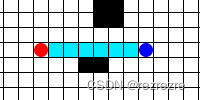
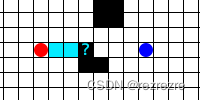
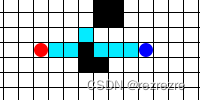

# D*算法(Dynamic  A *)

## 问题引入

- Dijkstra算法：无启发地寻找途中两节点地最短连接路径的算法

- A*算法：在Dijkstra算法的基础上加入了启发函数h(n)

这两者都可应用于机器人的离线路径规划问题，即已知环境地图，起点，终点，要求寻找一条路径使机器人能从起点运动到终点

**但是，上述两个算法在实际应用中会出现问题：机器人所拥有的地图不一定是最新的地图，或者说，机器人拥有的地图上明明是可以行走的地方，但是实际运行时却可能不能走，因为有可能出现有人突然在地上放了个东西，或者桌子被挪动了，或者单纯的有一个行人在机人运行时路过或挡在机器人的面前**

比如机器人沿着预定路径走到A点时，发现在预先规划的路径上，下一个应该走的点被障碍物挡住了，这种情况时，最简单的想法就是让机器人停下来，然后重新更新这个障碍物信息，并重新运行一次Dijkstra算法/ A*算法，这样就能重新找到一条路

但是这样子做会带来一个问题：**重复计算**。假如如下图所示新的障碍物仅仅只是挡住了一点点，机器人完全可以小绕一下绕开这个障碍物，然后后面的路径仍然按照之前规划的走。可是重复运行Dijkstra算法 / A*算法时却把后面完全一样的路径重新又计算了一遍

**D*算法的存在就是为了解决这个重复计算的问题，在最开始求出目标路径后，把搜索过程的所有信息保存下来，等后面碰到了先验未知的障碍物时就可以利用一开始保存下来的信息快速的规划出新的路径。**

**A* 是正向搜索，D* 是反向搜索**

## 算法原理

D*不是由起始点开始搜索，而是**以目标点为起始，通过将目标点置于Openlist中来开始搜索，直到机器人当前位置节点由队列中出队为止**（当然如果中间某节点状态有动态改变，需要重新寻路，所以才是一个动态寻路算法）

以下图为例，给定起点（绿色），目标点（蓝色），障碍（红色）来进行路径规划

规定：

1. 上下左右代价为10，斜向代价为14
2. h值代表当前节点到终点的代价，当第一次搜索到起点时，所有点的h值会被更新；k值为该节点最小的h值，代表了本节点在全图中到终点的最小代价

### 首次搜索

- 从终点A开始，搜索周围邻节点B、C、D、E、F，并把终点A放入close list里面（不再遍历）

- 找出代价最小的节点作为新节点，同时更新父节点

- 在搜索过程中，如果某节点已经有代价，但是以新的点作为父节点时代价更小，则更新其代价值和父节点

- 搜索结束条件就是起点从openlist中进入了closelist

- 总结：第一次搜索完成后，每个节点的h和k是相等的。可以看出，每个节点的指向（即节点的父节点）都是周围八个节点中k最小的那个，并且每个节点到终点的最短路径也标识出来了

### 遇到障碍

如果机器人在按照原来规划路径行进的时候遇到了障碍（不在规划路径上的障碍忽略不计），例如下图所示

**修改这个节点的h(n)值为无穷大(inf)，并且令障碍的所有子节点的h(n)值也为无穷大(inf)**

图中浅绿色节点是路径上障碍点的子节点**X**，**其h(n)值变为inf，并将节点X从closelist中弹出，放入openlist列表中**

#### 进行改变扩散

- 取出该障碍点的openlist中k值最小的节点，此时为浅绿色节点**X**(k=50,h=inf)

- 找出**X**的周围邻接点**Y**，如果能够让**X**的h值变小，让**Y**成为**X**的父节点，此时如下图所示

  

- 此时**X**点的h值变为58，其子节点的h值也相应做出改变

- 扩散结束的条件为：**X**点的h值$\leq$**X**的openlist中节点最小的k值

## 算法总结

由目标位置开始向起始位置进行路径搜索，当物体由起始位置向目标位置运行过程中，

发现路径中**存在新的障碍**时，**对于目标位置到新障碍之间的范围内的路径节点，新的障碍是不会影响到其到目标的路径的。新障碍只会影响的是物体所在位置到障碍之间范围的节点的路径**。

这时，通过**将新的障碍周围的节点加入到Openlist中进行处理然后向物体所在位置进行传播**，能最小程度的减少重复计算
