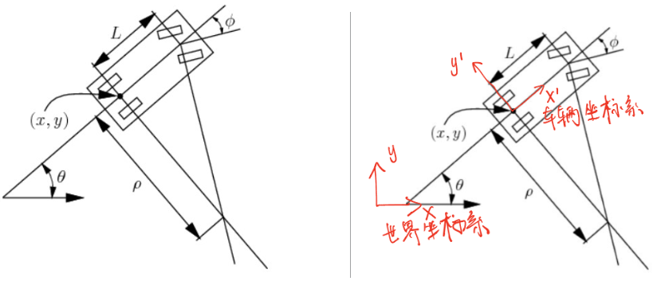
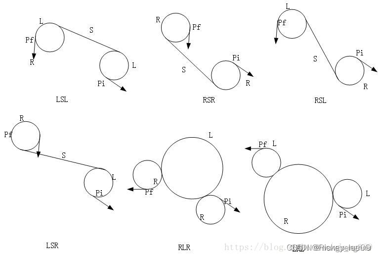
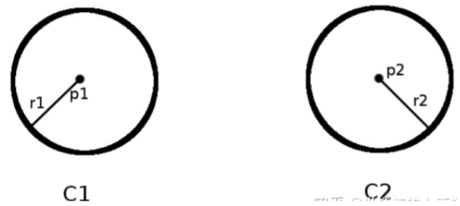
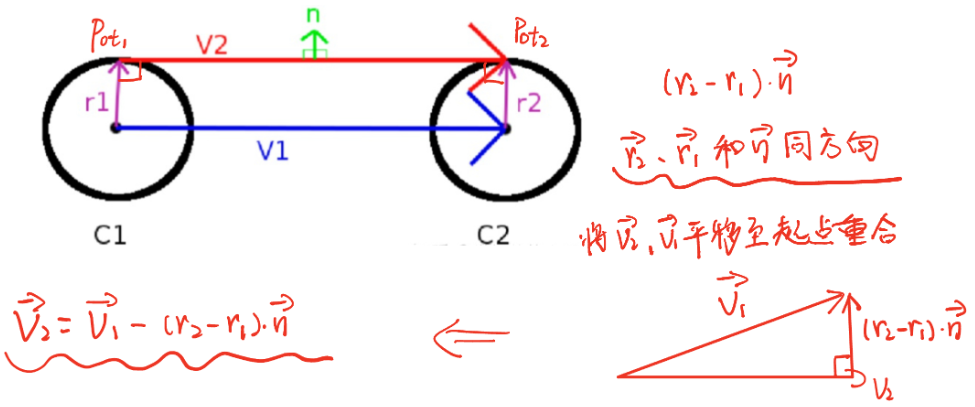

# Dubins&Reeds Shepp曲线

> 作为Hybrid A*的前备知识

## 1.simple car模型

如下图所示，Simple Car模型是一个表达车辆运动的简易模型

- Simple Car模型将车辆看做平面上的刚体运动，**刚体（车辆坐标系）的原点位于车辆后轮的中心**。此模型为两轮驱动，后两个为驱动轮，前两个为从动轮；
- x轴沿着车辆主轴方向，与车辆运动方向相同；
- 车辆在任意一个时刻的姿态可以表述为$(x, y, θ)$。
- **车辆的运动速度为 $v$**；
- 方向盘的转角为$ \phi$，它与前轮的转角相同；前轮和后轮中心的距离为$L$；
- **如果方向角的转角固定，车辆会在原地转圈，转圈的半径为$ρ$。**

在一个很短的时间$Δt$内，可以认为车辆沿着后轮指向的方向前进，当$Δt$趋于0时，有
$$
\tan \theta=d y / d x 
$$
 根据数学定义： 
$$
d y / d x=\dot{y} / \dot{x}
$$

$$
\tan\theta=\sin\theta / \cos\theta
$$

将两式带入第一式后可得到
$$
-\dot{x} \sin \theta+\dot{y} \cos \theta=0
$$
显然，$\dot{x}=\cos \theta$ 和 $\dot{y}=\sin \theta$，两侧同时乘以速度 $v$ ，等式仍然满足。因此有 $\dot{x}=v \cos \theta$ , $\dot{y}=v \sin \theta$

当 $ \phi$ 固定了，车辆行驶的弧长（距离）就是 $\omega$ ，则有： $$ d \omega=\rho d \theta \tag{8} $$ 根据三角几何，有： 
$$
 \rho=L / \tan \phi \tag{9} 
$$
 **将（9）式代入（8）式，得到：**
$$
d \theta=\frac{\tan \phi}{L} d \omega \tag{10}
$$
**（8）式两侧同除以 $dt$， 并根据 $\dot{\omega}=v$，得到：** 
$$
\dot{\theta}=\frac{v}{L} \tan \phi \tag{11}
$$
至此，得到了车辆的运动模型（Motion Model） 
$$
\begin{aligned} &\dot{x}=v \cos \theta \\ &\dot{y}=v \sin \theta \\ &\dot{\theta}=\frac{v}{L} \tan \phi \end{aligned}
$$

- 我们能控制的变量是速度 $v$ 和车辆转向 $\phi$，其中 $v$ 根据实际车来定；

  而转向 $\phi$ 在$\left(-\phi_{\max }, \phi_{\max }\right)$之间，且 $\phi_{\max }<\pi / 2$，最小转弯半径为： $\rho_{\min }=\mathrm{L} / \tan \phi_{\max }$

- 有时候会引入一个Action变量，即用 $u_s$ 去替代 $v$ 
  $$
  \begin{aligned} &\dot{x}=u_s \cos \theta \\ &\dot{y}=u_s \sin \theta \\ &\dot{\theta}=\frac{u_s}{L} \tan \phi \end{aligned}
  $$

## 2.Dubins曲线

**Dubins曲线限制车辆==只能向前行驶==，它是在满足曲率约束和规定的始端和末端的切线方向的条件下，连接两点的最短路径**

规划出的曲线由三段直线或圆弧组成，能够满足车辆的最小转弯半径、起点航向角、终点航向角和车辆动力学约束，但规划出的曲线在两段**交点处曲率不连续**

令S为车辆直行的Motion Primitive，L和R分别为车辆左转和右转的Motion Primitive，**可以证明，任意起点到终点的Dubins最短路径可以由不超过三个Motion Primitives构成。由三个Motion Primitives构成的序列称为一个Word**

由于两个连续的、相同的Motion Primitive可以合并为一个Motion Primitive，因此所有可能的Word有12种组合，**Dubins证明最优的Word组合只能是如下6个组合之一：**
$$
L_\alpha R_\beta L_\gamma, R_\alpha L_\beta R_\gamma, L_\alpha S_d L_\gamma, L_\alpha S_d R_\gamma, R_\alpha S_d L_\gamma, R_\alpha S_d R_\gamma
$$

其中，$α,γ∈[0,2π)，β∈(π,2π)$，这里注意，$β$大于$π$。如果小于$π$，一定有其它的序列优于该序列。

- 注意：
  1.  为什么该处两点间最短不是直线，一定要加入圆弧？这是**因为起点、终点是带着航向角的要求的**
  2. 最短路径是在无障碍的情况下取最小半径时取到的
  3. **对于RLR和LRL两种情况，那个大圆的半径是与两个小圆的半径相等的，否则采用其他4种情况更优**

### Dubins计算推导过程

> Dubins曲线 是由直线和弧长组成，所以先介绍**直线**和**弧长**怎么求

#### 基于向量的切点计算（直线）

假设两个最小转弯半径构成的圆为 $C1$ 和 $C2$ ，半径分别为 $r1$ 和 $r2$ ，圆心分别为$p1=(x_1, y_1)$ 和 $p2=(x_2,y_2)$

- 首先构造$C1$和$C2$的圆心$p1$到$p2$的向量$V_1=(x_2 − x_1,y_2 − y_1)$
  $$
  D=\sqrt{\left(x_2-x_1\right)^2+\left(y_2-y_1\right)^2}
  $$

- 构造$C1$和$C2$的**外切线切点**构成的向量$V_2=p_{o t 2}-p_{o t 1}$​

  

- 构造垂直于$V_2$的单位法向量$n$，根据向量四边形：
  $$
  \vec{V_2} = \vec{V_1}-\left(||r_2||-||r_1||\right) \cdot \vec{n}
  $$
  根据法向量的定义：$V_2 \cdot n=0$，得到： 
  $$
  \vec{n} \cdot\left( \vec{V_1}-\left(||r_2||-||r_1||\right) \cdot \vec{n}\right)=0
  $$
   根据单位向量的定义，$n \cdot n=1$，代入上式得到： 
  $$
  \vec{n} \cdot \vec{V_1}=||r_2||-||r_1||
  $$
   等式两边同时除以$D$，$D$是$V_1$的长度： 
  $$
  \frac{\vec{V_1}}{D} \cdot\vec{n}=\frac{r_2-r_1}{D} \tag{1}
  $$

  - **注意，这里$\large \frac{V_1}{D}$实际是将向量$V_1$​单位化，且只有$n$是未知数**

  根据向量点乘的数学定义：$\vec{A} \cdot \vec{B}=|A||B| \cos (\theta)$，得到： 
  $$
  \frac{\vec{V_1}}{|V_1|} \cdot \frac{\vec{n}}{|n|}=\frac{r_2-r_1}{D}\ |n| = 1
  $$
   **$\large \frac{r_2-r_1}{D}$等于向量$V_1$与法向量$n$的夹角的余弦**

  - **为了方便书写，定义一个常量：$\large C = \frac{r_2-r_1}{D}$**​​

- 将向量$V_1$旋转角度$C$就得到向量$n$。假设$n=(n_x,n_y)$，根据向量旋转的数学定义： 
  $$
  \begin{aligned} &n_x=V_{1 x} * C-V_{1 y} * \sqrt{1-C^2} \\ &n_y=V_{1 x} * \sqrt{1-C^2}+V_{1 y} * C \end{aligned} \tag{2}
  $$

  - 向量旋转公式：（或者一个坐标系的旋转，求原来坐标系的一个点在新坐标系下的位置）

    将向量$(x,y)$绕原点逆时针旋转角度$\theta$，得到新向量：
    $$
     \left[x * \cos{\theta}-y * \sin{\theta}，x * \sin{\theta}+y * \cos{\theta}\right] 
    $$

- 根据公式（2），计算出 $n$ 之后，就可以很方便的计算出外切线的切点 $p_{ot1}$ 和 $p_{ot2}$

  例如，从$C1$的圆心出发，沿着向量$n$的方向，距离为$r1$的位置即为切点$p_{ot1}$，$p_{ot2}$亦然

