# Dubins&Reeds Shepp曲线

> 作为Hybrid A*的前备知识

## 1.simple car模型

如下图所示，Simple Car模型是一个表达车辆运动的简易模型


- Simple Car模型将车辆看做平面上的刚体运动，**刚体（车辆坐标系）的原点位于车辆后轮的中心**。此模型为两轮驱动，后两个为驱动轮，前两个为从动轮；
- x轴沿着车辆主轴方向，与车辆运动方向相同；
- 车辆在任意一个时刻的姿态可以表述为$(x, y, θ)$。
- **车辆的运动速度为 $v$**；
- 方向盘的转角为$ \phi$，它与前轮的转角相同；前轮和后轮中心的距离为$L$；
- **如果方向角的转角固定，车辆会在原地转圈，转圈的半径为$ρ$。**

在一个很短的时间$Δt$内，可以认为车辆沿着后轮指向的方向前进，当$Δt$趋于0时，有
$$
\tan \theta=d y / d x 
$$
 根据数学定义： 
$$
d y / d x=\dot{y} / \dot{x}
$$

$$
\tan\theta=\sin\theta / \cos\theta
$$

将两式带入第一式后可得到
$$
-\dot{x} \sin \theta+\dot{y} \cos \theta=0
$$
显然，$\dot{x}=\cos \theta$ 和 $\dot{y}=\sin \theta$，两侧同时乘以速度 $v$ ，等式仍然满足。因此有 $\dot{x}=v \cos \theta$ , $\dot{y}=v \sin \theta$

当 $ \phi$ 固定了，车辆行驶的弧长（距离）就是 $\omega$ ，则有： $$ d \omega=\rho d \theta \tag{8} $$ 根据三角几何，有： 
$$
 \rho=L / \tan \phi \tag{9} 
$$
 **将（9）式代入（8）式，得到：**
$$
d \theta=\frac{\tan \phi}{L} d \omega \tag{10}
$$
**（8）式两侧同除以 $dt$， 并根据 $\dot{\omega}=v$，得到：** 
$$
\dot{\theta}=\frac{v}{L} \tan \phi \tag{11}
$$
至此，得到了车辆的运动模型（Motion Model） 
$$
\begin{aligned} &\dot{x}=v \cos \theta \\ &\dot{y}=v \sin \theta \\ &\dot{\theta}=\frac{v}{L} \tan \phi \end{aligned}
$$

- 我们能控制的变量是速度 $v$ 和车辆转向 $\phi$，其中 $v$ 根据实际车来定；

  而转向 $\phi$ 在$\left(-\phi_{\max }, \phi_{\max }\right)$之间，且 $\phi_{\max }<\pi / 2$，最小转弯半径为： $\rho_{\min }=\mathrm{L} / \tan \phi_{\max }$

- 有时候会引入一个Action变量，即用 $u_s$ 去替代 $v$ 
  $$
  \begin{aligned} &\dot{x}=u_s \cos \theta \\ &\dot{y}=u_s \sin \theta \\ &\dot{\theta}=\frac{u_s}{L} \tan \phi \end{aligned}
  $$


## 2.Dubins曲线

**Dubins曲线限制车辆==只能向前行驶==，它是在满足曲率约束和规定的始端和末端的切线方向的条件下，连接两点的最短路径**

规划出的曲线由三段直线或圆弧组成，能够满足车辆的最小转弯半径、起点航向角、终点航向角和车辆动力学约束，但规划出的曲线在两段**交点处曲率不连续**

令S为车辆直行的Motion Primitive，L和R分别为车辆左转和右转的Motion Primitive，**可以证明，任意起点到终点的Dubins最短路径可以由不超过三个Motion Primitives构成。由三个Motion Primitives构成的序列称为一个Word**

由于两个连续的、相同的Motion Primitive可以合并为一个Motion Primitive，因此所有可能的Word有12种组合，**Dubins证明最优的Word组合只能是如下6个组合之一：**
$$
L_\alpha R_\beta L_\gamma, R_\alpha L_\beta R_\gamma, L_\alpha S_d L_\gamma, L_\alpha S_d R_\gamma, R_\alpha S_d L_\gamma, R_\alpha S_d R_\gamma
$$


其中，$α,γ∈[0,2π)，β∈(π,2π)$，这里注意，$β$大于$π$。如果小于$π$，一定有其它的序列优于该序列。

- 注意：
  1.  为什么该处两点间最短不是直线，一定要加入圆弧？这是**因为起点、终点是带着航向角的要求的**
  2. 最短路径是在无障碍的情况下取最小半径时取到的
  3. **对于RLR和LRL两种情况，那个大圆的半径是与两个小圆的半径相等的，否则采用其他4种情况更优**


### Dubins计算推导过程

> Dubins曲线 是由直线和弧长组成，所以先介绍**直线**和**弧长**怎么求

#### 基于向量的切点计算（直线）

假设两个最小转弯半径构成的圆为 $C1$ 和 $C2$ ，半径分别为 $r1$ 和 $r2$ ，圆心分别为$p1=(x_1, y_1)$ 和 $p2=(x_2,y_2)$


- 首先构造$C1$和$C2$的圆心$p1$到$p2$的向量 $V_1=(x_2 − x_1,y_2 − y_1)$
  $$
  D=\sqrt{\left(x_2-x_1\right)^2+\left(y_2-y_1\right)^2}
  $$

- 构造$C1$和$C2$的**外切线切点**构成的向量 $V_2=p_{o t 2}-p_{o t 1}$​

  

- 构造垂直于$V_2$的单位法向量$n$，根据向量四边形：
  $$
  \vec{V_2} = \vec{V_1}-\left(||r_2||-||r_1||\right) \cdot \vec{n}
  $$
  根据法向量的定义：$V_2 \cdot n=0$，得到： 
  $$
  \vec{n} \cdot\left( \vec{V_1}-\left(||r_2||-||r_1||\right) \cdot \vec{n}\right)=0
  $$
   根据单位向量的定义，$n \cdot n=1$，代入上式得到： 
  $$
  \vec{n} \cdot \vec{V_1}=||r_2||-||r_1||
  $$
   等式两边同时除以$D$，$D$是$V_1$的长度： 
  $$
  \frac{\vec{V_1}}{D} \cdot\vec{n}=\frac{r_2-r_1}{D} \tag{1}
  $$

  - **注意，这里$\large \frac{V_1}{D}$实际是将向量$V_1$​单位化，且只有$n$是未知数**

  根据向量点乘的数学定义：$\vec{A} \cdot \vec{B}=|A||B| \cos (\theta)$，得到： 
  $$
  \frac{\vec{V_1}}{|V_1|} \cdot \frac{\vec{n}}{|n|}=\frac{r_2-r_1}{D}\ |n| = 1
  $$
   **$\large \frac{r_2-r_1}{D}$等于向量$V_1$与法向量$n$的夹角的余弦**

  - **为了方便书写，定义一个常量：$\large C = \frac{r_2-r_1}{D}$**​​

- 将向量$V_1$旋转角度$C$就得到向量$n$。假设$n=(n_x,n_y)$，根据向量旋转的数学定义： 
  $$
  \begin{aligned} &n_x=V_{1 x} * C-V_{1 y} * \sqrt{1-C^2} \\ &n_y=V_{1 x} * \sqrt{1-C^2}+V_{1 y} * C \end{aligned} \tag{2}
  $$

  - 向量旋转公式：（或者一个坐标系的旋转，求原来坐标系的一个点在新坐标系下的位置）

    将向量$(x,y)$绕原点逆时针旋转角度$\theta$，得到新向量：
    $$
    \left[x * \cos{\theta}-y * \sin{\theta}, * \sin{\theta}+y * \cos{\theta}\right]
    $$

- 根据公式（2），计算出 $n$ 之后，就可以很方便的计算出外切线的切点 $p_{ot1}$ 和 $p_{ot2}$

  例如，从$C1$的圆心出发，沿着向量$n$的方向，距离为$r1$的位置即为切点 $p_{ot1}$，$p_{ot2}$ 亦然


#### 弧长计算

弧长通过 $L=Rθ$ 计算，也就是$θ$计算，**此处不能简单的使用余弦定理计算，因为轨迹中需要的可能是长弧**，可通过 $atan2(v2)- atan2(v1)$ 计算，因其计算结果带正负，再结合轨迹的方向判断是否要加上或减去2π，来得到真实的角度θ，从而得到弧长

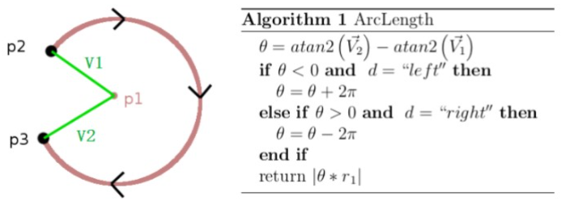

- 注意：`atan2(y, x)`函数，求的是$y/x$的反正切，即求$(x, y)$点和原点间的连线相当于x轴的转角。**相当于求$\vec{(x, y)}$​向量和x轴正方向的夹角**

  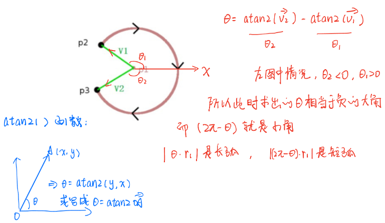

**Dubins曲线的所有情况都是：弧长 （+ 切点间距离）**

- 下面两种情况中，重点都是都是求出切点或交点，然后再按照上面的两小节内容求弧长或切点间距离


#### 计算CSC类型的形式曲线

> **RSR、LSL、RSL、LSR是CSC类型的行驶曲线**

该类型曲线首先计算两个圆的切点，然后车辆沿着最小转弯半径构成的圆周行驶到第一个圆的切点，然后直行到第二个圆的切点，再沿着最小转弯半径构成的圆周行驶到目的地

**下面我们以 $RSR$ 轨迹为例看看如何计算行驶曲线：**

假设起点 $s=(x1,y1,θ1)$ 和终点 $g=(x2,y2,θ2)$，最小转弯半径为 $r_{min}$​。然后我们计算起点和终点的圆心

- 起点的圆心为： 

$$
p_{c 1}=\left(x_1+r_{\min } * \cos \left(\theta_1-\pi / 2\right), y_1+r_{\min } * \sin \left(\theta_1-\pi / 2\right)\right)
$$

-  终点的圆心为：

$$
p_{c 2}=\left(x_2+r_{\min } * \cos \left(\theta_2-\pi / 2\right), y_2+r_{\min } * \sin \left(\theta_2-\pi / 2\right)\right)
$$

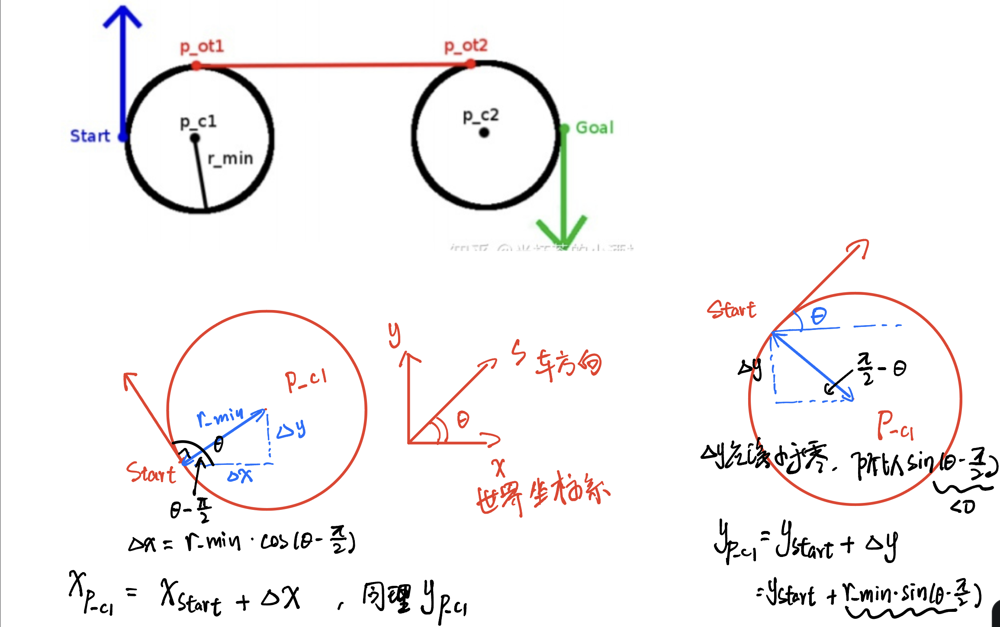

- 得到起点和终点的圆心之后，可以利用上一小节的**基于向量的切点计算方法**，得到切点$p_{ot1}$和$p_{ot2}$。然后就可以得到车辆的行驶轨迹，该轨迹分为三段：$ Start$到 $p_{ot1}$ 的圆周弧；$p_{ot1}$和$p_{ot2}$的直线距离；$p_{ot2}$到$Goa$l的圆周弧；至此我们得到了RSR的行驶曲线


#### 计算CCC类型的形式曲线

> **RLR、LRL是CCC类型的行驶曲线**

如下图所示，$C1$和$C2$的圆心为$p1$和$p2$，$C3$是与$C1$和$C2$相切的圆，圆心为$p3$

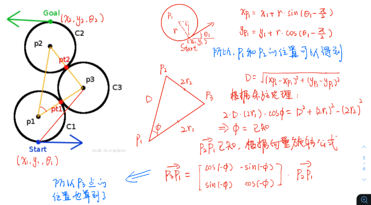

和CSC情况一样，初始已知$s=(x1,y1,θ1)$和终点$g=(x2,y2,θ2)$，最小转弯半径为$r_{min}$

**根据上图中的数学推导，可以先求得$p1, p2$点的坐标，然后再求得$p3$点的坐标**

**然后计算$p_{t1}$和计算$p_{t2}$就变得很容易**：定义向量$V_2=p3−p1$，将向量缩放到$r_{min}$。 $$ V_2=\frac{V_2}{\left|V_2\right|} * r_{\min } $$ 最后可以得到交点$p_{t1}=p1+V_2$。按照同样的过程可以计算得到$pt2$

然后就可以得到$Start$到$p_{ot1}$的圆周弧；$p_{ot1}$ 和 $p_{ot2}$的圆周弧；$p{ot2}$到$Goal$的圆周弧的三段轨迹组成的行驶曲线

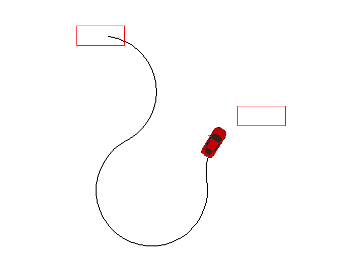


## 3.Reeds Shepp曲线

- 参考资料[自动驾驶运动规划-Reeds Shepp曲线 - 知乎 (zhihu.com)](https://zhuanlan.zhihu.com/p/122544884?utm_id=0)

相比于Dubins Car只允许车辆前向运动，Reeds Shepp Car**既允许车辆向前运动，也允许车辆前后运动**

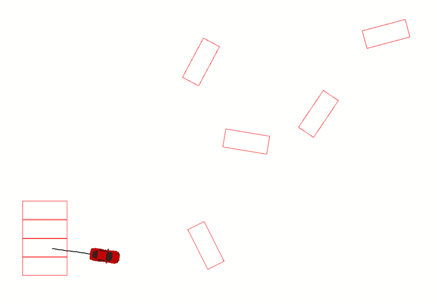

车辆运动模型仍然采用Simple Car Model，但增加对车辆运动方向的描述，运动方程如下： 
$$
 \begin{aligned} &\dot{x}=u_1 \cos \theta \\ &\dot{y}=u_1 \sin \theta \\ &\dot{\theta}=u_1 u_2 \end{aligned} 
$$
其中，$u_1 \in[-1,1]$，$u_2 \in\left[-\tan \phi_{\max }, \tan \phi_{\max }\right]$。

- 注意：当$u_1=1$时，表示车辆向前运动；$u_1=−1$时，表示车辆向后运动。

J Reeds和L Shepp证明Reeds Shepp Car从起点$q_I$到终点$q_G$的最短路径一定是下面的word的其中之一。word中的"|"表示车辆运动朝向由正向转为反向或者由反向转为正向： 

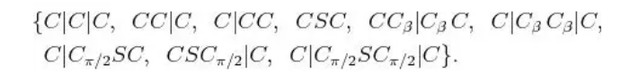

每个word都由$L^+，L^−，R^+，R^−，S^+，S^−$这六种primitives组成，其中$L^+$表示车辆左转前进；$L^−$表示车辆左转后退；$R^+$表示车辆右转前进；$R^−$表示车辆右转后退；$S^+$表示车辆直行前进；$S^−$表示车辆直行后退。

Reeds and Shepp曲线的word所有组合不超过48种，所有的组合一一枚举如下：

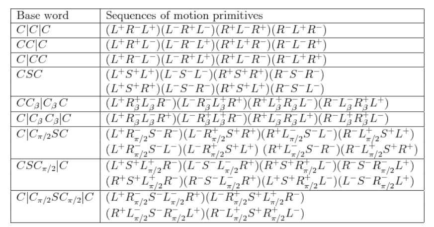


### Reeds-shepp计算优化

#### 位置姿态统一化

车辆的起点和终点的位置姿态是难以穷举的，所以一般在计算之前，会将车辆的姿态归一化：

- 起始姿态：$q_I=(0,0,0)$
- 目标姿态：$q_G=(x,y,ϕ)$；其中，$ϕ=θ2−θ1$
- 车辆的转弯半径：$ r=1$

假设车辆的初始姿态为$q_I=(x1,y1,θ1)$，目标姿态$q_G=(x2,y2,θ2)$，车辆的转向半径为$r = ρ$，如何实现姿态的归一化呢，**实际上归一化的过程就是向量的平移和旋转过程**

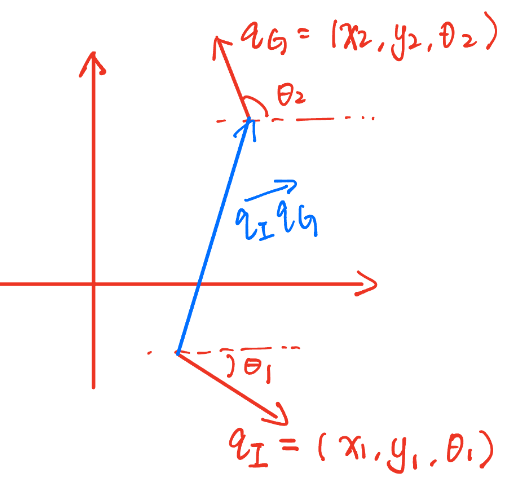

首先将向量$\vec{q_I q_G}$平移到坐标原点$(0,0)$。平移$q_I$到$O(0, 0)$，平移向量为$(−x1,−y1)$；对$q_G$应用同样的平移向量:$q_G=[x2−x1,y2−y1]$，**最后得到平移后的向量：** 
$$
\vec{q_I q_G}=\left[\begin{array}{l} x_2-x_1 \\ y_2-y_1 \end{array}\right]=\left[\begin{array}{l} d_x \\ d_y \end{array}\right]
$$
 **应用旋转矩阵，将车辆的起点朝向转到x轴正向：** 
$$
\left[\begin{array}{cc} \cos \theta_1 & \sin \theta_1 \\ -\sin \theta_1 & \cos \theta_1 \end{array}\right]\left[\begin{array}{l} d_x \\ d_y \end{array}\right]=\left[\begin{array}{c} d_x \cos \theta_1+d_y \sin \theta_1 \\ -d_x \sin \theta_1+d_y \cos \theta_1 \end{array}\right]
$$
 旋转之后，目标位置朝向更新为$ϕ=θ2−θ1$。

将车辆转向半径缩放到1，于是最终得到车辆运动的起始姿态：
$$
 I=\left[\begin{array}{l} 0 \\ 0 \\ 0 \end{array}\right] 
$$
 目标姿态： 
$$
G=\left[\begin{array}{c} x \\ y \\ \phi \end{array}\right]=\left[\begin{array}{c} \left(d_x \cos \theta_1+d_y \sin \theta_1\right) / \rho \\ \left(-d_x \sin \theta_1+d_y \cos \theta_1\right] / \rho \\ \theta 2-\theta_1 \end{array} \right]
$$

- 代码实现

  ```c++
  double x1 = s1->getX(), y1 = s1->getY(), th1 = s1->getYaw();
  double x2 = s2->getX(), y2 = s2->getY(), th2 = s2->getYaw();
  double dx = x2 - x1, dy = y2 - y1, c = cos(th1), s = sin(th1);
  double x = c * dx + s * dy, y = -s * dx + c * dy, phi = th2 - th1;
  
  return ::reedsShepp(x / rho_, y / rho_, phi)
  ```


#### 利用对称关系降低求解复杂度

Reeds Shepp曲线有48种组合，编程时一一编码计算比较麻烦，因此可以利用其对称性降低求解工作量

以转向不同的$CSC$类型为例：

它包含4种曲线类型：$L^+S^+R^+、L^−S^−R^−、R^+S^+L^+、R^−S^−R^−$

我们只需要编码推导得到$L^+S^+R^+$的计算过程，**其它几种直接可以通过对称性关系得到车辆运动路径。 **

给定车辆起始姿态$q_I=(160,160,0)$，目标姿态$q_G=(190,180,30)$，可以得到$L^+S^+R^+$的运动路径如下：

```
{ Steering: left	    Gear: forward	distance: 0.63 }
{ Steering: straight	Gear: forward	distance: 4.02 }
{ Steering: right	    Gear: forward	distance: 0.11 }
```

对应的效果如下：

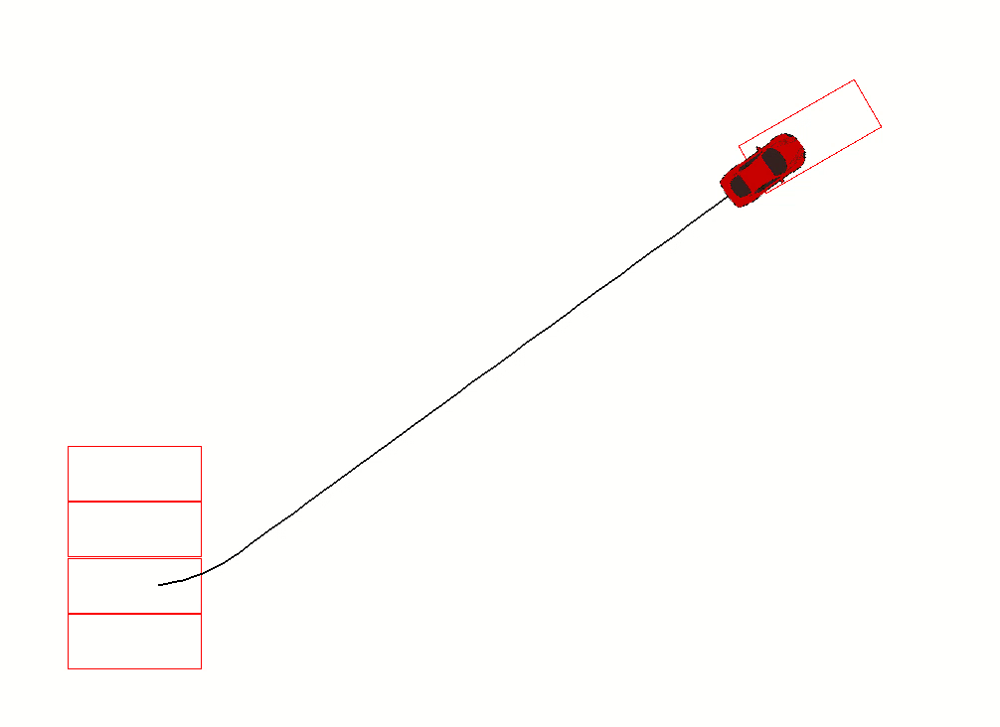

下面在$L^+S^+R^+$的基础上，利用对称性求解$CSC$类型中其它几种路径的方法：


##### timeflip对称性

假设我们推导出从起始姿态$q_I(x1,y1,θ1)$达到目标姿态$(x2,y2,θ2)$的路径计算方法：

`path = calc_path(x1, y1, θ1, x2, y2, θ2)`

利用对称性，将目标Pose修改为$(−x2,y2,−θ2)$，代入同样的Path计算函数：

`path = calc_path(x1, y1, θ1, -x2, y2, -θ2)`

就得到从$(x1,y1,θ1)$到$(x2,y2,θ2)$的$L^−S^−R^−$类型的运动路径。

计算出的$L^−S^−R^−$的车辆运动路径如下：

```
{ Steering: left	    Gear: backward	distance: -2.85 }
{ Steering: straight	Gear: backward	distance: 4.02 }
{ Steering: right	    Gear: backward	distance: -2.32 }
```

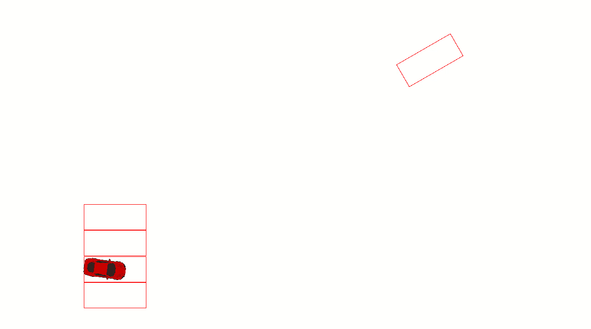


##### reflect对称性

将目标姿态修改为$(x2,−y2,−θ2)$，代入同样的Path计算函数：

`path = calc_path(x1, y1, θ1, x2, -y2, -θ2)`

就得到从$(x1,y1,θ1)$到$(x2,y2,θ2)$的$R^+S^+L^+$类型的运动路径。

计算出的$R^+S^+L^+$的车辆运动路径如下：

```
{ Steering: right	    Gear: forward	distance: -0.56 }
{ Steering: straight	Gear: forward	distance: 5.28 }
{ Steering: left	    Gear: forward	distance: -0.03 }
```

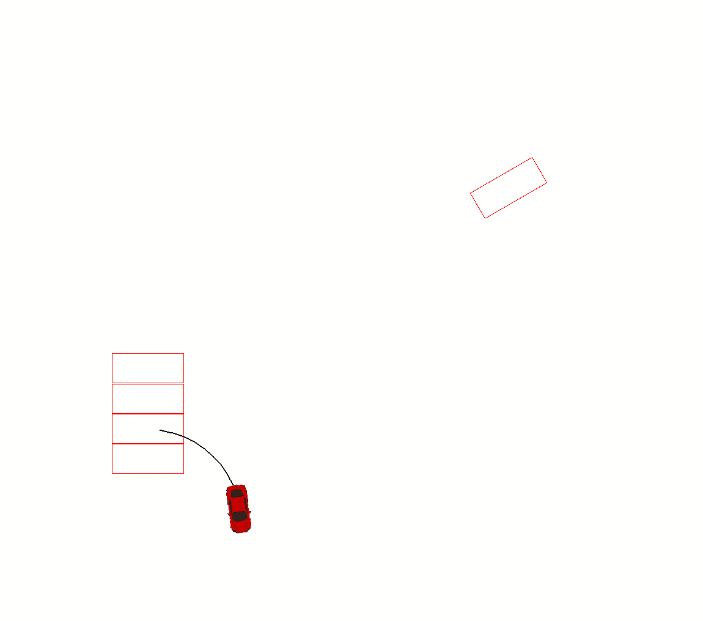


##### timeflip+reflect

结合timeflip对称性和reflect对称性，将目标姿态修改为$(−x2,−y2,θ2)$，代入同样的Path计算函数：

`path = calc_path(x1, y1, θ1, -x2, -y2, θ2)`

就得到从$(x1,y1,θ1)$到$(x2,y2,θ2)$的$R^−S^−L^−$类型的运动路径。

计算出的$R^−S^−L^−$​的车辆运动路径如下：

```
{ Steering: right	Gear: backward	distance: -1.86 }
{ Steering: straight	Gear: backward	distance: 5.28 }
{ Steering: left	Gear: backward	distance: -2.38 }
```

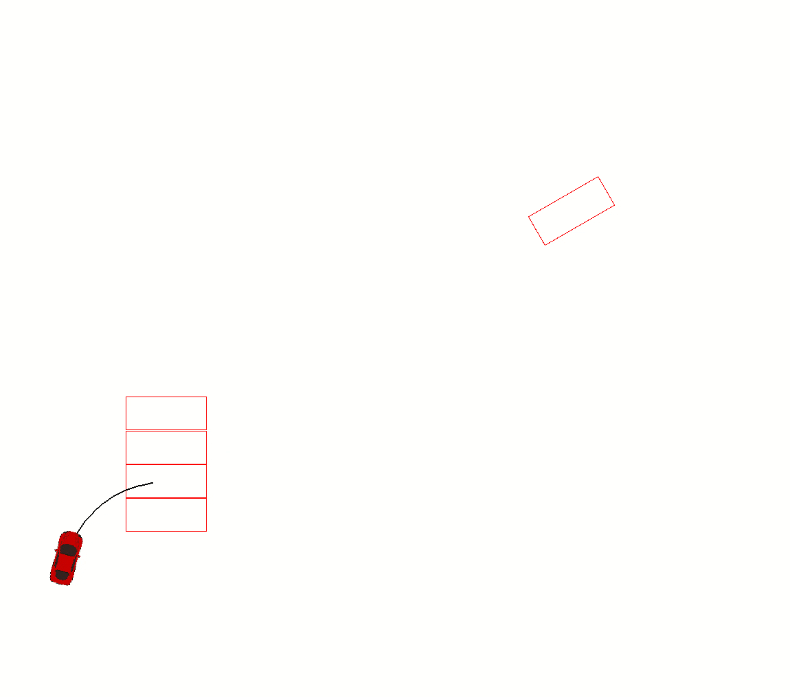

通过对称性，48种不同的Reeds Shepp曲线通过不超过12个函数就可以得到全部运动路径。


