# Hybrid A*

> 前备知识 [Dubins&Reeds-Shepp曲线](Dubins&Reeds-Shepp曲线.md)

- 参考论文：

  1. [Path Planning in Unstructured Environments A Real-time Hybrid A Implementation for Fast and Deterministic Path Generation for the KTH Research Concept Vehicle_Karl_Kurzer_2016](../../../书籍论文/混合Astar.pdf)

     这是一篇毕业论文，内容较多 

  2. [Practical Search Techniques in Path Planning for Autonomous Driving](../../../书籍论文/混合Astar2.pdf) 

     这是一篇期刊论文，内容相对简洁

- 参考资料：

  1. [混合A*算法研究_混合a星算法-CSDN博客](https://blog.csdn.net/robinvista/article/details/106279968)
  2. [【论文研读】路径规划中的Hybrid A*算法 - 知乎 (zhihu.com)](https://zhuanlan.zhihu.com/p/161660932)
  
- **论文解决内容**

  基于二维障碍地图的输入，实时地找到一种解决方案，使非结构化环境中的非完整车辆碰撞从给定的开始`pose`转换为期望的目标`pose`，或报告不存在这样的解决方案

  该路径将车辆从起步状态 $x_s$ 安全过渡到目标状态 $x_g$ 同时坚持车辆的最小转弯半径 $r$​ 并避开障碍物

  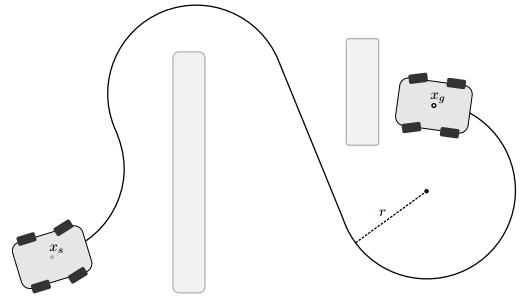


## 碰撞检测

### 1.边界空间和层次结构

出于性能的考虑，用边界空间包装对象通常是有益的。边界空间是r3的简单体积或r2的区域，它们封装了更复杂的对象。这些允许更快的重叠测试，根据需要的精度，只检查碰撞的边界空间就足够了

- 例如open-planner中的长方体框

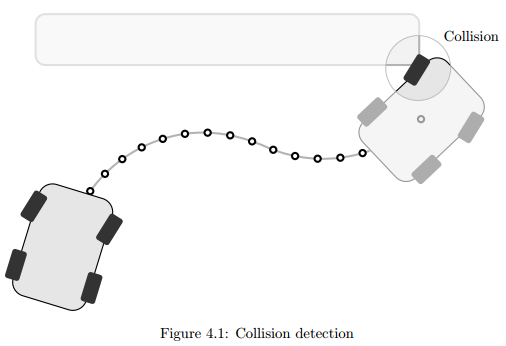

如果需要更高的精度，可以采用分层方法，将较大的复杂凸体分解成树。树表示发送的边界空间，其中包含越来越小的原始对象子集，如下图所示。

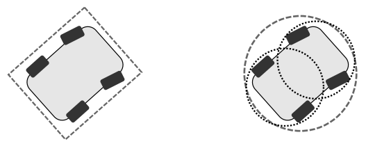

在左边，使用矩形形状进行近似，而在右边，使用圆形将形状分解为具有两个级别的层次结构进行近似。对于后者，使用圆形边界区域与障碍物进行简单的相交测试，包括计算中心的相对距离并计算距离是否大于两个区域的组合半径。


### 2.空间占用枚举

空间占用枚举方法用网格覆盖空间，将障碍物的信息提前存储在每个格子中。有点类似Graph Search（如A*）等算法采用的办法，如图所示：

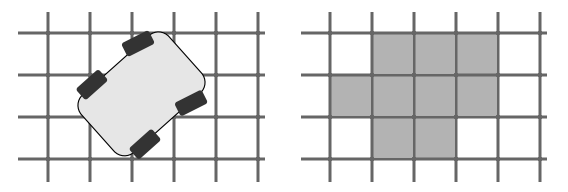

**如果选择栅格枚举这种离散的方法，那么相应的机器人也要进行离散。可以将机器人的外形（例如长方形）分成一个个小栅格，每个栅格依次判断是否与占据栅格相交叉，如果有一个交叉在那就意味着发生了碰撞**

- 缺点：是需要对给定路径的每个点重新计算各自的空间占用率，通过将方向值离散化可以避免这个问题，从而将占用率枚举存储在查找表中

  因为机器人平移时，只需要对机器人所有的栅格加上或者减去一定偏移即可这样的计算很快，所以真正需要计算的是机器人在转动时。因此，作者对机器人的转动角度进行了离散化，提前计算出所有角度下对应的栅格，并存储在查找表中

由于其简单，统一网格一直是空间细分的流行选择，**但选择正确的单元大小是重要的**。重要的是，单元大小要与环境中物体的大小以及传感器信息的保真度相适应。

- 如果网格太细，碰撞检测将花费太长时间，因为需要检查更多的网格单元，每个单元的传感器信息量将更低
- 如果网格太粗，那么空余空间将被低估，使碰撞检查保守，并冒着路径规划算法无法找到一个解决方案的风险，即使一个解决方案存在
- 固定的单元格大小是一个问题，分层网格可能是一个解决方案


## Hybrid A* Search

- 混合A *算法与 A *算法的关键区别在于：**状态转换发生在连续空间而不是离散空间**

  混合A *算法可以看作是探索树方法和A *方法的混血

**对于非完整机器人，先前的路径规划方法最大的缺点之一是所得到的路径是离散的，因此往往不能执行，因为方向的改变是突然的而不是平滑的**

混合A*使用了改进的启发项，并进行了路径平滑，产生的解处于全局最优的邻域

- Hybrid A*包含三部分：车辆约束条件；启发式搜索信息丰富，允许快速收敛；以及利用梯度下降改进已找到解的路径平滑


### A *，Field D *，Hybrid A *对比

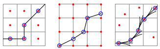

- 左图：A*轨迹，cost为于每个网格的中心点并且算法只访问这些中心点

- 中图：Field D*轨迹，允许路径的落脚点在方格的四周
- 右图：Hybrid A*轨迹，允许路径选择的落脚点在状态方格里面，而且其中的连线用某种曲线代替


### 路径节点扩张

论文中称节点扩张的过程为**Analytic Expansions**

状态表示为：$X=(x,y,\theta)$ ，其中 $(x,y)$ 是节点的位置，$\theta$ 是节点的朝向。在前文所述的搜索过程中，使用到的是离散的控制动作，因此之前每个网格中的连续状态点是不可达的。 

为了进一步改进搜索速度和提高准确度，从而**利用Reeds Shepp曲线**。

A* 的搜索过程都是用直线相连接，而Hybrid A* 则是在与网格精度一致的前提下（对应某一小段时间）使用**三种控制动作：最大左转，最大右转，不转向** 来生成路径。**因此该路径是一些受车辆转弯半径约束的圆弧和直线。**

假设不考虑环境，算法会通过计算从起点到终点的最优Reeds-Shepp曲线的方式，再生成一个额外的子节点；之后算法基于现有的障碍物地图对该路径进行碰撞检测，无碰撞路径对应的点会加到扩张树中。

所以论文中作者使用简单的selection rule，在每N个节点中选取一个计算Reed-Shepp曲线（这里的N随启发函数递减而减少，即越发靠近终点时，N越小）。下面这两张图也很好的解释了扩张过程。

- **混合A*对一个节点的扩张，生成6个候选点：三个向前，三个向后**

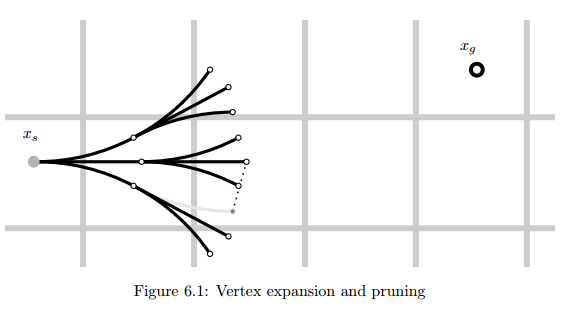

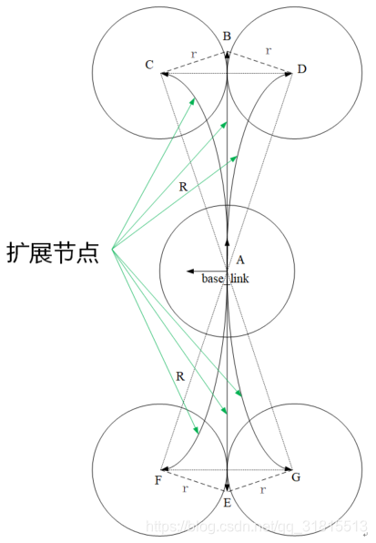

- 节点的短增量展开的搜索树分支显示在黄绿色的范围内，Reeds-Shepp路径是通向目标的紫色部分

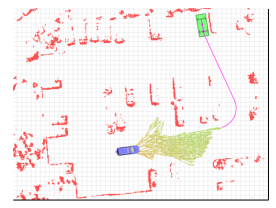


### 两种启发函数

#### 1.无障碍物的非完整性约束启发（约束启发项）

着重考虑了车辆的约束，而忽略了环境因素，即使用Dubins或者Reeds-Shepp曲线去完成规划

该启发函数必须**获得车辆的最小转弯半径作为输入**，且主要通过离散周围的栅格地图，获得不同方向坐标点并使用最优曲线计算路径长度

- 举例：

  - 在起始点 $(x_i,y_i,\theta_i)$ 使用Dubins曲线或Reeds-Shepp曲线连接目标点 $(x_g,y_g,\theta_g)$​​，得到最优曲线的路径长度
- 计算最优曲线的距离，并作为启发函数的代价值 $h_1(n)$ 

因为这项代价忽略了环境中障碍物的影响，所以可以通过离线的形式采样枚举所有的Reeds-Shepp曲线，提前将所有的可能情况保存，在线调用的时候只需要索引、插值即可。

这项代价函数的主要目的是为修剪A*搜索树的分支，避免了到达目标点时，所规划路径方向与目标方向不一致的问题。


##### 补充：车辆的非完整性约束

大多数情况下，这些微分约束是机器人自身的运动学和动力学所固有的。这些约束条件需要在某个时刻考虑进去，理想情况下，在实际的路径规划过程中确保路径匹配机器人的约束条件

不允许车辆横向移动，只允许车辆沿行驶方向移动的约束，可以表示为与车辆行驶方向正交的速度始终为0。这个速度用$v_{\perp}$表示，则有： 
$$
\begin{aligned} &v_{\perp}=\frac{\dot{x}}{\cos (\theta-\pi / 2)} \\ &v_{\perp}=\frac{-\dot{y}}{\sin (\theta-\pi / 2)} \end{aligned}
$$
因为正交方向的速度始终为0，说明上面两个式子的值要抵消掉： 
$$
\frac{\dot{x}}{\cos (\theta-\pi / 2)}=\frac{-\dot{y}}{\sin (\theta-\pi / 2)}
$$
 继续化简：
$$
\dot{x} \sin (\theta-\pi / 2)+\dot{y} \cos (\theta-\pi / 2)=0
$$
 最后可以得到模型需要遵守的约束条件： 
$$
 \dot{x} \cos (\theta)-\dot{y} \sin (\theta)=0 
$$
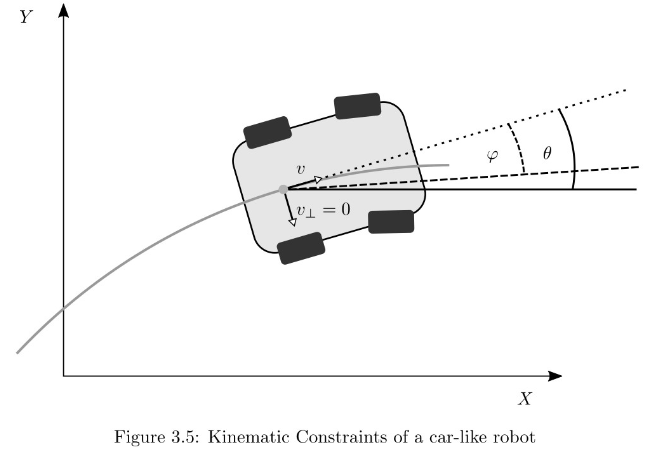


#### 2.有障碍物的完整性约束启发（无约束启发项）

着重考虑了环境中的障碍物信息，但忽略了车辆的最小转弯半径对其的影响（车辆特性）

随后使用2D动态规划的方法（其实就是传统的2D A* 算法）计算每个节点到达目标点的最近距离作为其代价函数的代价值 $h_2(n)$ 

- 注意：此时**以混合A*的终点为起点**，不设置终点，全图范围内搜索，所以封闭列表存储了终点到所有位置的最短距离 g(x)，因此可以用作查找表，而不是在Hybrid A*进行时启动新的搜索


#### 3.总结

**最终的启发项 $h(n)=\max \left(h_1(n),h_2(n)\right)$​ ，即取两个启发代价中的较大值**

下图中：图a、c是第一种启发函数下生成的路径，可以看出是连续的；图b、d是第二种启发函数下生成的离散路径（与传统A*算法得到的结果是类似的）

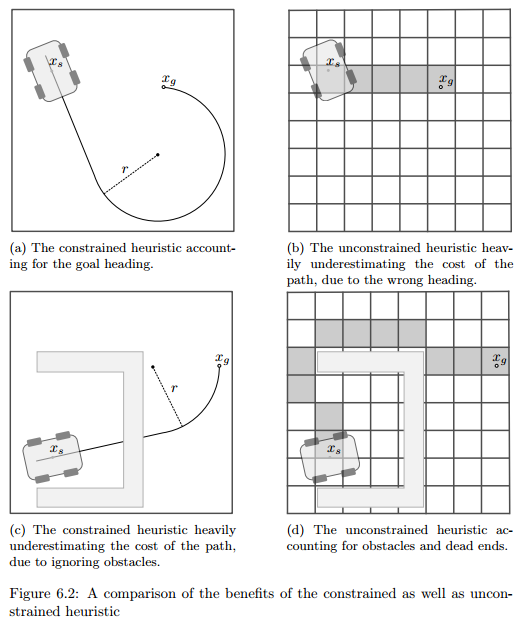

- **无障碍物的非完整性约束启发项保证了能和终点的姿态相匹配（特别是朝向）**

- **有障碍物的完整性约束启发更多的是使得小车快速的走出死胡同和避开U型障碍**

- 作者提到了这里的启发项遵循一个原则：**离起点近、终点远的时候，更多的使用非约束启发项；当越靠近终点时，更多地选择使用约束启发项**

  **因为在接近目标或障碍物非常稀少的环境中去使用Reeds-Shepp曲线更合理，因为碰撞的可能性很低**

最终每个点总的代价仍然是：$f(x) = g(x) + h(x)$


### 路径平滑

由于混合A*算法生成的路径往往由不必要的转向动作组成，因此有必要用平滑的方式对结果进行后处理

为此，可以使用一个梯度下降的平滑器，其**最小化的目标函数是由以下四项组成的关于路径的$P$**。

$$
P=P_{o b s}+P_{c u r}+P_{s m o}+P_{v o r}
$$


#### 1.障碍物项（Obstacle Term） — $P_{obs}$

这一项是对碰撞障碍物的惩罚：
$$
P_{o b s}=w_{o b s} \sum_{i=1}^N \sigma_{o b s}\left(\left|\mathbf{x}_i-\mathbf{o}_i\right|-d_{o b s}^{\vee}\right)
$$
 其中，$x_i$是路径点$(x, y)$的位置，$o_i$是距离$x_i$最近的障碍物的位置。$d_{o b s}^{\bigvee}$作为阈值表示允许和障碍物的最大距离；为了在接近障碍物时惩罚更重，$\sigma_{o b s}$是一个二次惩罚函数；$w_{o b s}$​是这一项的权重。


#### 2.曲率项（Curvature Term） — $P_{cur}$

为了保证行驶性能，必须对每个点的曲率做一个限制：
$$
P_{c u r}=w_{c u r} \sum_{i=1}^{N-1} \sigma_{c u r}\left(\frac{\Delta \phi_i}{\left|\Delta \mathbf{x}_i\right|}-\kappa_{\max }\right)
$$
其中，在点$x_i$处的位移向量被定义为$\Delta \mathbf{x}_i=\mathbf{x}_i-\mathbf{x}_{i-1}$。点$x_i$处切向角的变化可表示为
$$
\Delta \phi_i=\cos ^{-1} \frac{\mathbf{x}i \cdot \mathbf{x}_{i+1}}{\left|\mathbf{x}_{i+1}\right|\left|\mathbf{x}_{i+1}\right|}
$$
最大允许曲率用$κ_{max}$表示，偏离最大允许曲率的偏差用二次惩罚函数$σ_{cur}$来惩罚，曲率项权值$w_{cur}$控制着对路径变化的影响。


#### 3.平滑项（Smoothness Term） — $P_{smo}$

平滑项计算顶点之间的位移向量，它会惩罚间隔不均匀且改变方向的顶点。 
$$
P_{s m o}=w_{s m o} \sum_{i=1}^{N-1}\left(\Delta \mathbf{x}_{i+1}-\Delta \mathbf{x}_i\right)^2
$$


#### 4. 维诺图（Voronoi Term） — $P_{vor}$

$$
 P_{v o r}=w_{v o r} \sum_{i=1}^N\left(\frac{\alpha}{\alpha+d_{o b s}(x, y)}\right)\left(\frac{d_{\text {edg }}(x, y)}{d_{o b s}+d_{\text {edg }}(x, y)}\right)\left(\frac{\left(d_{o b s}(x, y)-d_{\text {vor }}^{\vee}\right)^2}{\left(d_{v o r}^{\vee}\right)^2}\right) 
$$

 其中，到最近障碍物的正距离用$d_{obs}$表示，$d_{edg}$是到维诺图中Cell的最近边缘的正距离。$d_{\text {vor }}^{\vee}$表示障碍影响Voronoi电位的最大距离；$α > 0$控制场的衰减率；$w_{vor}$​是这一项的权值。


##### 补充知识：维诺图

路径规划常用地图：

- **栅格地图**是地图分成一个个边长相等的栅格来表示环境信息

- **距离地图**是在规划算法进行搜索过程中提供扩展节点到障碍物的最近距离。其中，最近距离是通过欧式距离所计算得到。

- **维诺图**，又称泰森多边形，是一种对距离地图的扩展。通过距离地图和广义泰森多边形(generalized Voronoi diagram，GVD)相结合所形成

维诺势场，主要为了解决传统势场（传统人工势场法中）在狭窄通道处有很高的势能，从而影响通行的问题


**它是由连接两邻点直线的垂直平分线组成的连续多边形组成**：三角形两边垂直平分线的交点就是外接圆的圆心，所以说找到所有三角形的外接圆圆心相连，也就相当于“连接两邻点直线的垂直平分线组成的连续多边形”，示意图如下：

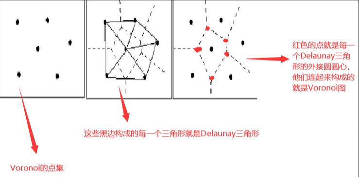

维诺图中的每个Cell包含的都是距离当前Cell距离最近的所有点，因此**Cell的边界**就是距离Cell中红点最远的点的集合。因此我们可以把障碍物的边界当作红点，那生成的维诺图中，一条条Cell的边界就是远离障碍物的可通行区域。（其实，在每个Cell的任意位置都可以找到距离障碍物最远的位置）

在路较宽的时候没有必要采取这种方式，所以可以构建一个势场，让车辆趋于Cell的边界去运动，势场函数如下： 
$$
\begin{aligned} \rho_V(x, y)=&\left(\frac{\alpha}{\alpha+d_{\mathcal{O}}(x, y)}\right)\left(\frac{d_{\mathcal{V}}(x, y)}{d_{\mathcal{O}}(x, y)+d_{\mathcal{V}}(x, y)}\right)\left(\frac{\left(d_{\mathcal{O}}-d_{\mathcal{O}}^{\max }\right)^2}{\left(d_{\mathcal{O}}^{\max }\right)^2}\right) \end{aligned}
$$
其中，$d_o$与$d_v$分别是：$(x, y)$距离最近障碍物 与 距离维诺图中Cell边界的距离；$\alpha$是控制场的衰减与场的最大有效范围的常数

当$(x, y)$在障碍物上时，$\rho_V(x, y) = 1$；当$(x, y)$在Cell的边界上时，$\rho_V(x, y) = 0$

**维诺势场使得即使存在狭窄的口子，也能显示可通过**

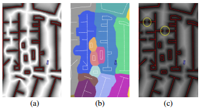

- 图a：voronoi场；图b：voronoi图；图c：其它势场（标准电势场）

可以看出，其他势场中，狭窄隘口有很高的势，不利于通行


#### 总结

总结目标函数中的四项：

- 第一项：惩罚与障碍物的碰撞
- 第二项：限制了轨迹的瞬时曲率
- 第三项：保证路径的平滑度
- 第四项：惩罚图中的高势能点

最后，使用梯度下降法去优化目标函数

- 梯度下降法是一种利用函数的梯度求局部最小值的优化算法。梯度下降逐步进行，其步长与函数的负梯度成正比，∆x =−∇f(x)。虽然通常的实现使用梯度的绝对值作为停止标准，但论文中选择固定数量的迭代（1000次）以确保运行时一致性。


### 共占栅格问题

在Hybrid A*算法中，扩展子节点的时候可能带来一个问题，就是如果移动的距离比栅格的范围小，那就有可能与自身的父节点位于同一个栅格，即为下图所示：

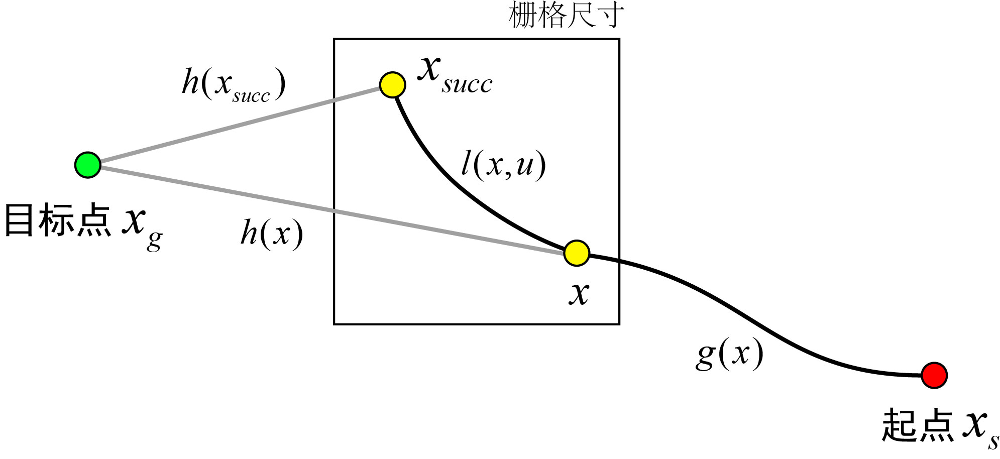

在这种情况下，子节点 $x_{succ}$ 的代价值永远大于父节点 $x$ 的代价值，**由于Hybrid A*算法总是优先挑选代价值小的节点，所以后果就是子节点$\large x_{succ}$永远不会被选中**

- 具体解释

  假设父节点 $x$ 的起点代价是$g(x)$，它的启发代价是$h(x)$。子节点 $x_{succ}$ 扩展的代价是$l(x,u)$，子节点 $x_{succ}$ 的启发代价是 $h(x_{succ})$，启发函数总是具有consistent的性质（原文中有讲到，但我没能理解），因此满足三角形不等式（从图中也可以大致看出）：三角形任意两边长之和大于第三边长，所以有
  $$
  \mathrm{l}(\mathrm{x}, \mathrm{u})+\mathrm{h}\left(\mathrm{x}_{\text {succ }}\right)>\mathrm{h}(\mathrm{x})
  $$
  虽然扩展的边$l(x,u)$不是直线，但必然不会短于直线，所以不等式成立：
  $$
  \mathrm{g}(\mathrm{x})+\mathrm{l}(\mathrm{x}, \mathrm{u})+\mathrm{h}\left(\mathrm{x}_{\text {succ }}\right)>\mathrm{g}(\mathrm{x})+\mathrm{h}(\mathrm{x})
  $$
  **即父节点的总代价必然小于子节点的！**

为了解决这个问题，作者**提出了放大父节点代价的思想**，具体就是给父节点的代价增加一个常数，这个常数记为**`tieBreaker`**，这是一个正数，如果 $\mathrm{f}\left(\mathrm{x}_{\mathrm{succ}}\right)<\mathrm{f}(\mathrm{x})+\text {tieBreaker }$，就会选择子节点扩展，否则就不要这个子节点

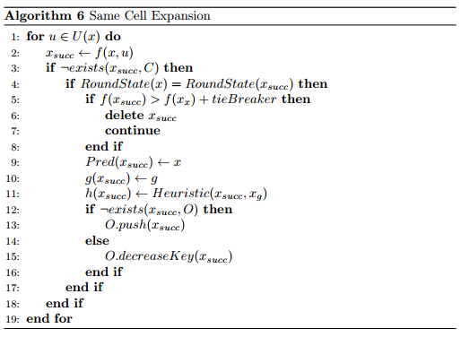

- 在百度Apollo的混合A*代码中，**直接将扩展的距离设置成了栅格的对角线**，如下所示

```
double arc = std::sqrt(2) * xy_grid_resolution_;
```

因为对角线是一个栅格能容纳的最大距离（仅对直线来说），这样便可以保证子节点与父节点不会占据一个栅格。也因为采用了这样的设计，百度没有考虑这种共占的情况，所以也没有进行判断。


### 算法实现流程

算法的输入为事先定义好的障碍物地图，经过Hybrid A*搜索和路径平滑之后显示路径

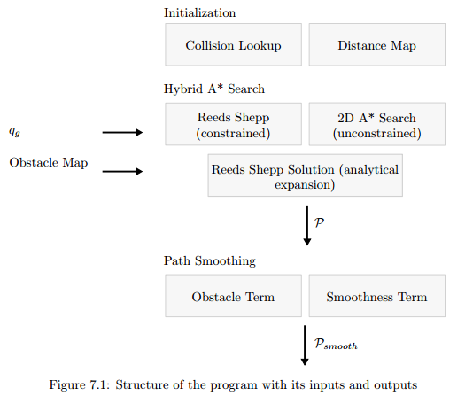


## 总结

- Hybrid A*的应用场景

  理想的场景是在非结构化环境中缓慢行驶，并且是针对有运动约束的机器人或无人车。在无人驾驶上具体可以用于停车场的自动泊车的路径规划或低速无人驾驶

  这里的关键词是”约束”，如果你看到有人把Hybrid A *用在差速机器人或者全向机器人上，那你就可以得出判断：使用者不懂Hybrid A *。因为，如果机器人没有运动约束，那么完全没有必要用Hybrid A *

- Hybrid A*的缺点

  Hybrid A *一个比较大的问题是，它输出的路径质量一般比较差，这里差的意思是指路径包含一些不必要的拐弯或者倒车动作，**这就是为什么一般在Hybrid A *之后再优化一下，或者把Hybrid A *当成一个给优化算法提供初始路径的子模块，而不是单独使用**


