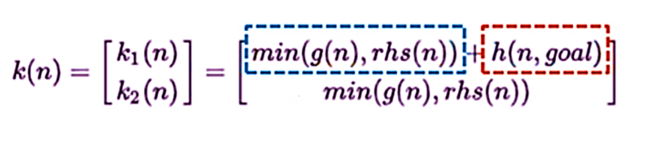
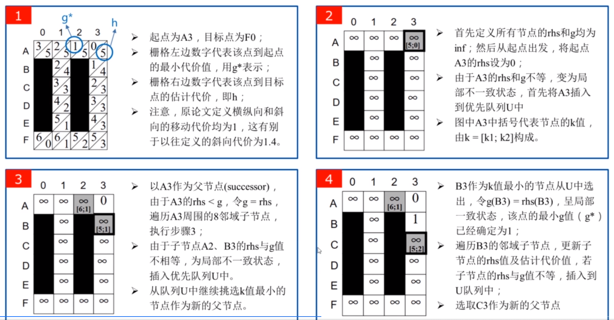
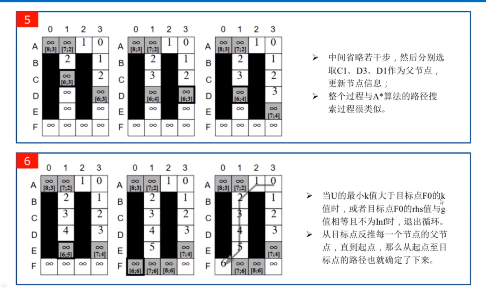
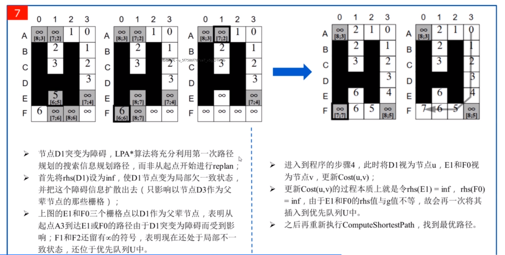

# Life Planning A*

- 参考资料[LPA-star算法（Lifelong Planning）及相关思考_lpa*算法-CSDN博客](https://blog.csdn.net/qq_44339029/article/details/126789410)

## 总述

是一种基于A*的**增量启发式搜索算法**，它被用来处理动态环境下从给定起始点到给定目标点的最短路径问题（**起始点和终点是固定的**）

与A_star一样，LPA*使用启发式算法，该启发性来源于从给定节点到目标路径代价的更低边界。如果保证是非负的（零可以接受）并且从不大于到目标的最低路径的代价，则允许该启发式

- 启发式搜索和增量式搜索的区别
  - 启发式搜索是利用启发函数来对搜索进行指导，它是一种“智能”搜索，典型的算法例如A_star算法、遗传算法等
  - 增量搜索是对以前的搜索结果信息进行再利用来实现高效搜索，大大减少搜索范围和时间，典型的例如LPA_star、D_star(Lite)算法等

## 节点的代价和状态

与D *类似，LPA *用g(s)和rhs(s)两个值描述节点的代价

- **g(s)为所有计算中，从起始点到当前节点的最小代价值（与A *中的g(n)，D *中的K(x)作用类似）**
- **rhs(s)是本次计算中，对于s的所有邻接节点，求它们到s的距离加上邻接节点自身的g值，其中最小的那个值作为s的 rhs 值。也就是储存节点s当前的最小代价值**

### 局部连续（Locally Consistent）

**g(s)=rhs(s)**

当所有节点均为局部连续状态时，g(s)的值等于当前点到起始点的最短距离（注意，反向不成立）

### **局部过连续**（Locally Overconsistent）

**g(s)>rhs(s)**

当优先队列U中取出的节点为局部过连续状态时，意味着g(s)可以通过父辈节点使自己到起点的路径更短，此时将更新g(s)=rhs(s)，节点状态变为局部连续状态

### 局部欠连续(Locally Underconsistent)

**g(s)<rhs(s)**

这种情况通常出现在父辈的某一节点突然变为障碍的情况下，造成父辈节点到起点的路径变大，从而需要修改g(s)的值，如果节点处于这种状态，则当它由优先队列中取出时，将其g值设置为无穷大，即将该节点状态变为局部过连续，而局部过连续的点将会被再次添加到优先队列中，这样就可以在它下次被取出时将其作为局部过连续状态处理，最终达到局部连续状态（如果这一节点与我们要搜索的最短路径相关的话）

当一个节点n在局部变得不一致时，它将被放在一个优先队列U（类似A * 算法或 D * 算法中的openList )中进行重新评估。U队列按照节点n的k值（先k1后k2）进行排序，k值定义如下：

上式中的k1类似于A * 算法中的f（n），k2类似于A * 算法中的g（n)，即在选取拓展点时，优先拓展k1值最小的点，当存在多个k1相等的最小点时，再从中选取k2值最小的点进行拓展

## 算法演示

论文中以二维平面网格地图作为演示对象，每一个网格与周围八个网格相连（相互之间可以直接到达），黑色网格为障碍。

